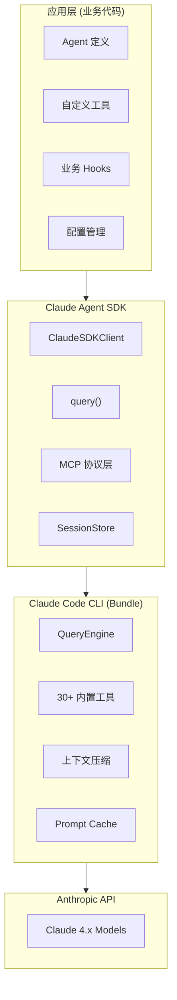
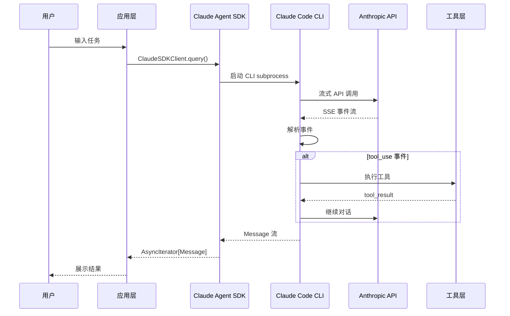
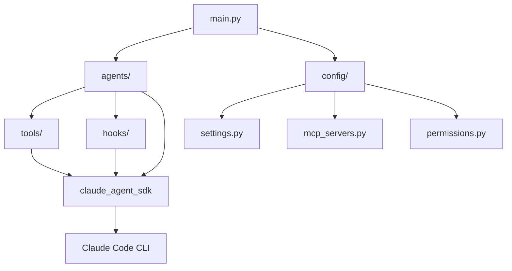

# Agent 项目设计文档

> 基于 Claude Agent SDK Python 构建 Agent 应用框架
>
> 文档版本：v1.0
> 日期：2026-05-10

---

## 目录

1. [项目概述](#1-项目概述)
2. [技术选型](#2-技术选型)
3. [架构设计](#3-架构设计)
4. [模块设计](#4-模块设计)
5. [工具系统设计](#5-工具系统设计)
6. [Agent 类型设计](#6-agent-类型设计)
7. [项目目录结构](#7-项目目录结构)
8. [实施计划](#8-实施计划)

---

## 1. 项目概述

### 1.1 项目目标

构建一个基于 Claude Agent SDK Python 的 Agent 应用框架，实现：

- 多种业务场景的智能 Agent
- 自定义业务工具集成
- 多 Agent 协作能力
- 安全可控的执行环境

### 1.2 核心能力

| 能力 | 描述 |
|------|------|
| 智能对话 | 支持多轮对话、上下文记忆 |
| 工具调用 | 30+ 内置工具 + 自定义业务工具 |
| 多 Agent | 子 Agent 分工协作 |
| 权限控制 | 多种权限模式、自定义 Hooks |
| 会话持久化 | 支持会话恢复、跨会话记忆 |

### 1.3 技术栈

| 技术 | 版本 | 说明 |
|------|------|------|
| Python | 3.10+ | 运行环境 |
| Claude Agent SDK | 0.1.80+ | 核心 SDK |
| Anthropic API | Claude 4.x | 模型 API |
| MCP Protocol | 1.19+ | 工具协议 |

---

## 2. 技术选型

### 2.1 为什么选择 Claude Agent SDK

**对比分析：**

| 方案 | 开发周期 | 维护成本 | 功能完整度 | 推荐度 |
|------|----------|----------|------------|--------|
| 纯自研框架 | 9+ 周 | 高 | 需逐步补全 | 不推荐 |
| LangChain | 4-5 周 | 中 | 通用性强但 Claude 特性缺失 | 可选 |
| Claude Agent SDK | 1-2 周 | 低 | 完全匹配 Claude 能力 | **推荐** |

**SDK 核心优势：**

1. **Bundle Claude Code CLI** - 复用完整能力（30+ 工具）
2. **SDK MCP Server** - in-process 工具，无 IPC 开销
3. **官方维护** - 与 Claude 模型更新同步
4. **Hooks 系统** - 程序化控制，灵活扩展
5. **Subagents** - 多 Agent 协作原生支持

### 2.2 SDK 内置能力清单

```
SDK 内置能力（无需开发）：
├── 查询引擎 (QueryEngine)
│   ├── query() - 单次查询
│   └── ClaudeSDKClient - 多轮对话
│
├── 内置工具 (30+ Tools)
│   ├── BashTool - Shell 执行
│   ├── Read/Write/Edit - 文件操作
│   ├── WebSearch/WebFetch - 网络操作
│   ├── Glob/Grep - 搜索工具
│   ├── AgentTool - 子 Agent
│   └── TaskCreate/TaskUpdate - 任务管理
│
├── MCP 协议
│   ├── 外部 MCP Server 接入
│   └── SDK MCP Server (in-process)
│
├── Hooks 系统
│   ├── PreToolUse / PostToolUse
│   ├── Stop / Notification
│   └── 权限决策 (allow/deny/defer)
│
├── 权限模式
│   ├── default - 交互式确认
│   ├── acceptEdits - 自动接受编辑
│   ├── plan - 只规划不执行
│   ├── bypassPermissions - 全允许
│   └── dontAsk/auto - 智能模式
│
├── 会话管理
│   ├── SessionStore API
│   ├── 会话恢复
│   └── 跨会话记忆
│
└── 其他
    ├── 上下文压缩 (Auto Compact)
    ├── Prompt Cache
    ├── 成本追踪
    └── 多模型切换
```

---

## 3. 架构设计

### 3.1 整体架构图



### 3.2 数据流向



### 3.3 核心组件职责

| 组件 | 职责 | 开发方 |
|------|------|--------|
| 应用层 | Agent 定义、业务工具、Hooks、配置 | **自研** |
| Claude Agent SDK | Python API 封装、消息处理、会话管理 | Anthropic |
| Claude Code CLI | QueryEngine、工具执行、压缩、缓存 | Anthropic |
| Anthropic API | Claude 模型推理 | Anthropic |

---

## 4. 模块设计

### 4.1 模块划分

基于 SDK，我们只需要开发以下模块：

```
需要自研的模块：
├── agents/           # Agent 定义与配置
│   ├── base.py       # Agent 基类
│   ├── research.py   # 研究型 Agent
│   ├── code.py       # 编码型 Agent
│   └── coordinator.py# 协调型 Agent
│
├── tools/            # 自定义业务工具
│   ├── database.py   # 数据库工具
│   ├── notification.py# 通知工具
│   ├── api_client.py # API 调用工具
│   └── file_processor.py# 文件处理工具
│
├── hooks/            # 业务 Hooks
│   ├── security.py   # 安全检查
│   ├── audit.py      # 审计日志
│   └── policy.py     # 公司策略
│
├── config/           # 配置管理
│   ├── settings.py   # 全局配置
│   ├── mcp_servers.py# MCP 配置
│   └── permissions.py# 权限配置
│
├── utils/            # 辅助工具
│   ├── logger.py     # 日志
│   ├── error_handler.py# 错误处理
│   └── cost_tracker.py# 成本追踪（可选）
│
└── main.py           # 入口
```

### 4.2 模块依赖关系



---

## 5. 工具系统设计

### 5.1 内置工具（SDK 提供）

| 工具 | 功能 | 使用场景 |
|------|------|----------|
| Bash | 执行 Shell 命令 | 构建、测试、git 操作 |
| Read | 读取文件/目录 | 代码阅读、配置解析 |
| Write | 写入文件 | 创建新文件 |
| Edit | 编辑文件 | 修改代码、配置 |
| WebSearch | 网络搜索 | 资料检索、竞品分析 |
| WebFetch | 获取网页内容 | 文档获取、API 文档 |
| Glob | 文件模式匹配 | 项目文件搜索 |
| Grep | 内容搜索 | 代码搜索、日志分析 |
| Agent | 启动子 Agent | 任务分解、并行执行 |
| TaskCreate | 创建任务 | 任务追踪 |

### 5.2 自定义工具设计

**工具定义模板：**

```python
# tools/base.py
from claude_agent_sdk import tool
from typing import Any

def define_tool(
    name: str,
    description: str,
    parameters: dict[str, type],
    handler: callable
):
    """工具定义装饰器封装"""
    return tool(name, description, parameters, handler)
```

**示例 - 数据库查询工具：**

```python
# tools/database.py
from claude_agent_sdk import tool
from typing import Literal

@tool(
    "query_database",
    "查询公司数据库，支持多表关联查询",
    {
        "table": str,
        "columns": list[str],
        "filter": dict,
        "limit": int
    }
)
async def query_database(args: dict):
    """
    参数说明：
    - table: 表名 (users, orders, products 等)
    - columns: 要查询的列
    - filter: 过滤条件 {"status": "active"}
    - limit: 结果数量限制
    """
    from my_app.db import DatabaseClient

    db = DatabaseClient()
    results = await db.query(
        table=args["table"],
        columns=args.get("columns", ["*"]),
        filter=args.get("filter", {}),
        limit=args.get("limit", 100)
    )

    return {
        "content": [
            {"type": "text", "text": f"查询结果 ({len(results)} 条):\n{results}"}
        ]
    }
```

**示例 - 通知工具：**

```python
# tools/notification.py
from claude_agent_sdk import tool
from typing import Literal

@tool(
    "send_notification",
    "发送通知到指定渠道",
    {
        "channel": Literal["slack", "email", "dingtalk"],
        "recipient": str,
        "message": str,
        "priority": Literal["low", "normal", "high"]
    }
)
async def send_notification(args: dict):
    """发送通知"""
    from my_app.notify import NotificationService

    service = NotificationService()
    await service.send(
        channel=args["channel"],
        recipient=args["recipient"],
        message=args["message"],
        priority=args.get("priority", "normal")
    )

    return {
        "content": [
            {"type": "text", "text": f"通知已发送到 {args['channel']}: {args['recipient']}"}
        ]
    }
```

### 5.3 SDK MCP Server 注册

```python
# tools/registry.py
from claude_agent_sdk import create_sdk_mcp_server

from .database import query_database
from .notification import send_notification
from .api_client import call_internal_api
from .file_processor import process_file

# 创建 MCP Server
company_tools = create_sdk_mcp_server(
    name="company_tools",
    version="1.0.0",
    tools=[
        query_database,
        send_notification,
        call_internal_api,
        process_file
    ]
)
```

---

## 6. Agent 类型设计

### 6.1 Agent 分类

| Agent 类型 | 主要能力 | 工具配置 | 模型建议 |
|------------|----------|----------|----------|
| Research | 信息检索、分析、报告 | WebSearch, WebFetch, Read | claude-sonnet-4-5 |
| Code | 代码开发、调试、测试 | Bash, Read, Write, Edit, Grep | claude-sonnet-4-5 |
| Data | 数据分析、可视化 | Read, Bash, database 工具 | claude-sonnet-4-5 |
| Coordinator | 任务分解、分配、监控 | Agent, TaskCreate, TaskUpdate | claude-opus-4-6 |
| Assistant | 通用助手 | 全部工具 | claude-sonnet-4-5 |

### 6.2 Agent 定义模板

```python
# agents/base.py
from claude_agent_sdk import AgentDefinition, ClaudeAgentOptions
from typing import Optional

class BaseAgent:
    """Agent 基类"""

    name: str = "base"
    system_prompt: str = ""
    allowed_tools: list[str] = []
    disallowed_tools: list[str] = []
    model: str = "claude-sonnet-4-5"
    permission_mode: str = "default"

    def get_definition(self) -> AgentDefinition:
        return AgentDefinition(
            name=self.name,
            system_prompt=self.system_prompt,
            allowed_tools=self.allowed_tools,
            disallowed_tools=self.disallowed_tools,
            model=self.model
        )

    def get_options(self) -> ClaudeAgentOptions:
        return ClaudeAgentOptions(
            system_prompt=self.system_prompt,
            allowed_tools=self.allowed_tools,
            disallowed_tools=self.disallowed_tools,
            model=self.model,
            permission_mode=self.permission_mode
        )
```

### 6.3 具体 Agent 定义

**研究型 Agent：**

```python
# agents/research.py
from .base import BaseAgent

class ResearchAgent(BaseAgent):
    """研究型 Agent - 信息检索与分析"""

    name = "researcher"
    model = "claude-sonnet-4-5"
    permission_mode = "default"

    system_prompt = """你是专业的研究分析专家。

    工作流程：
    1. 使用 WebSearch 搜索相关信息
    2. 使用 WebFetch 获取详细内容
    3. 整理信息，生成结构化报告

    输出规范：
    - 报告标题
    - 关键发现（3-5 条）
    - 详细分析
    - 数据来源链接
    - 后续建议

    注意事项：
    - 验证信息来源的可靠性
    - 区分事实与观点
    - 标注信息时效性
    """

    allowed_tools = [
        "WebSearch",
        "WebFetch",
        "Read",
        "TaskCreate"
    ]
```

**编码型 Agent：**

```python
# agents/code.py
from .base import BaseAgent

class CodeAgent(BaseAgent):
    """编码型 Agent - 代码开发与调试"""

    name = "coder"
    model = "claude-sonnet-4-5"
    permission_mode = "acceptEdits"  # 自动接受文件编辑

    system_prompt = """你是专业的软件工程师。

    工作流程：
    1. 先读取相关文件了解上下文
    2. 分析需求，设计实现方案
    3. 编写代码，遵循项目规范
    4. 编写或运行测试验证
    5. 提交清晰的变更说明

    代码规范：
    - 遵循项目现有风格
    - 添加必要注释（复杂逻辑）
    - 处理异常情况
    - 保持代码简洁

    测试要求：
    - 单元测试覆盖核心逻辑
    - 输出测试结果确认
    """

    allowed_tools = [
        "Bash",
        "Read",
        "Write",
        "Edit",
        "Glob",
        "Grep",
        "TaskCreate"
    ]

    disallowed_tools = [
        "WebSearch",  # 编码不需要网络搜索
    ]
```

**协调型 Agent：**

```python
# agents/coordinator.py
from .base import BaseAgent

class CoordinatorAgent(BaseAgent):
    """协调型 Agent - 多 Agent 任务分配"""

    name = "coordinator"
    model = "claude-opus-4-6"  # 使用更强模型
    permission_mode = "default"

    system_prompt = """你是任务协调专家，负责分配和监督多个子 Agent 的工作。

    协调策略：
    1. 分析复杂任务，分解为子任务
    2. 根据子任务类型分配给合适的 Agent
    3. 监控子 Agent 执行进度
    4. 汇总结果，生成最终报告

    可用子 Agent：
    - researcher: 信息检索与分析
    - coder: 代码开发与调试
    - data_analyst: 数据处理与分析

    分配原则：
    - 研究任务 → researcher
    - 编码任务 → coder
    - 数据任务 → data_analyst
    - 简单任务 → 直接执行

    注意事项：
    - 子 Agent 可并行执行
    - 设置合理的超时时间
    - 处理子 Agent 失败情况
    """

    allowed_tools = [
        "Agent",      # 启动子 Agent
        "TaskCreate",
        "TaskUpdate",
        "TaskList",
        "Read"
    ]
```

### 6.4 Agent 注册

```python
# agents/registry.py
from .research import ResearchAgent
from .code import CodeAgent
from .coordinator import CoordinatorAgent
from .data import DataAnalystAgent

def get_all_agents():
    return {
        "researcher": ResearchAgent().get_definition(),
        "coder": CodeAgent().get_definition(),
        "coordinator": CoordinatorAgent().get_definition(),
        "data_analyst": DataAnalystAgent().get_definition()
    }
```

---

## 7. 项目目录结构

### 7.1 最终项目结构

```
agent_project/
├── pyproject.toml           # 项目配置
├── requirements.txt         # 依赖
├── README.md                # 项目说明
│
├── config/
│   ├── settings.py          # 全局配置
│   ├── mcp_servers.py       # MCP Server 配置
│   ├── permissions.py       # 权限规则配置
│   └── hooks_config.py      # Hooks 配置
│
├── agents/
│   ├── __init__.py
│   ├── base.py              # Agent 基类
│   ├── research.py          # 研究型 Agent
│   ├── code.py              # 编码型 Agent
│   ├── coordinator.py       # 协调型 Agent
│   ├── data.py              # 数据分析 Agent
│   ├── assistant.py         # 通用助手 Agent
│   └── registry.py          # Agent 注册
│
├── tools/
│   ├── __init__.py
│   ├── registry.py          # MCP Server 注册
│   ├── database.py          # 数据库工具
│   ├── notification.py      # 通知工具
│   ├── api_client.py        # API 调用工具
│   ├── file_processor.py    # 文件处理工具
│   └── knowledge_base.py    # 知识库检索工具
│
├── hooks/
│   ├── __init__.py
│   ├── security.py          # 安全检查 Hook
│   ├── audit.py             # 审计日志 Hook
│   ├── policy.py            # 公司策略 Hook
│   └── rate_limit.py        # 限流 Hook
│
├── utils/
│   ├── __init__.py
│   ├── logger.py            # 日志工具
│   ├── error_handler.py     # 错误处理
│   └── session_store.py     # 自定义 Session 存储（可选）
│
├── tests/
│   ├── test_agents.py       # Agent 测试
│   ├── test_tools.py        # 工具测试
│   └── test_hooks.py        # Hooks 测试
│
├── examples/
│   ├── simple_query.py      # 单次查询示例
│   ├── multi_turn.py        # 多轮对话示例
│   ├── multi_agent.py       # 多 Agent 协作示例
│   └── custom_tools.py      # 自定义工具示例
│
└── main.py                  # 入口
```

### 7.2 配置文件设计

**pyproject.toml：**

```toml
[project]
name = "agent-project"
version = "1.0.0"
description = "Agent application based on Claude Agent SDK"
requires-python = ">=3.10"

dependencies = [
    "claude-agent-sdk>=0.1.80",
    "anyio>=4.0.0",
    "pydantic>=2.0.0",
]

[project.optional-dependencies]
dev = [
    "pytest>=7.0.0",
    "pytest-asyncio>=0.21.0",
    "mypy>=1.0.0",
    "ruff>=0.1.0",
]
```

---

## 8. 实施计划

### 8.1 开发阶段

| 阶段 | 时间 | 任务 | 产出 |
|------|------|------|------|
| Phase 1 | 1 周 | 环境搭建 + 基础框架 | 可运行的基础 Agent |
| Phase 2 | 1 周 | 自定义工具开发 | 3-5 个业务工具 |
| Phase 3 | 1 周 | Agent 定义 + Hooks | 多种 Agent 类型 |
| Phase 4 | 1 周 | 测试 + 文档 | 完整文档 + 测试覆盖 |

### 8.2 详细任务分解

**Phase 1: 环境搭建（第 1 周）**

```
Day 1-2: 环境准备
├── 安装 Python 3.10+
├── 安装 claude-agent-sdk
├── 配置 Anthropic API Key
├── 创建项目结构
└── 编写 pyproject.toml

Day 3-4: 基础框架
├── 实现 config/settings.py
├── 实现 main.py 入口
├── 实现 BaseAgent 类
├── 测试基础对话功能

Day 5: 验证
├── 运行简单查询示例
├── 运行多轮对话示例
├── 记录问题与解决方案
```

**Phase 2: 工具开发（第 2 周）**

```
Day 1-2: 数据库工具
├── 实现 query_database 工具
├── 实现 insert_record 工具（可选）
├── 单元测试

Day 3: 通知工具
├── 实现 send_notification 工具
├── 支持 Slack/Email/DingTalk
├── 单元测试

Day 4: API 工具
├── 实现 call_internal_api 工具
├── 支持认证与错误处理
├── 单元测试

Day 5: 整合
├── 创建 MCP Server 注册
├── 配置 allowed_tools
├── 集成测试
```

**Phase 3: Agent 与 Hooks（第 3 周）**

```
Day 1-2: Agent 定义
├── 实现 ResearchAgent
├── 实现 CodeAgent
├── 实现 CoordinatorAgent
├── 实现 DataAnalystAgent

Day 3: Hooks 开发
├── 实现 security_hook（安全检查）
├── 实现 audit_hook（审计日志）
├── 实现 policy_hook（公司策略）

Day 4: 多 Agent 协作
├── 测试 Coordinator 分配任务
├── 测试子 Agent 并行执行
├── 测试结果汇总

Day 5: 集成测试
├── 完整流程测试
├── 性能测试
├── 问题修复
```

**Phase 4: 测试与文档（第 4 周）**

```
Day 1-2: 测试完善
├── 补充单元测试
├── 补充集成测试
├── 边界情况测试

Day 3-4: 文档编写
├── API 使用文档
├── Agent 配置指南
├── 工具开发指南
├── 最佳实践文档

Day 5: 发布准备
├── 代码审查
├── 性能优化
├── 最终验证
```

### 8.3 验收标准

| 标准 | 要求 |
|------|------|
| 功能完整 | 4 种 Agent 类型可用 |
| 工具可用 | 3+ 自定义业务工具 |
| 安全可控 | Hooks 生效，权限模式正常 |
| 文档完整 | 使用文档 + 开发文档 |
| 测试覆盖 | 单元测试 + 集成测试 |

---

## 附录 A: 快速开始示例

```python
# examples/simple_query.py
import asyncio
from claude_agent_sdk import query, ClaudeAgentOptions

async def main():
    # 简单查询
    async for msg in query("解释什么是 Agent"):
        print(msg)

asyncio.run(main())

# examples/multi_turn.py
import asyncio
from claude_agent_sdk import ClaudeSDKClient, ClaudeAgentOptions

async def main():
    options = ClaudeAgentOptions(
        system_prompt="你是 Python 专家",
        permission_mode="acceptEdits"
    )

    async with ClaudeSDKClient(options=options) as client:
        # 第一轮
        await client.query("创建一个简单的 HTTP 服务器")
        async for msg in client.receive_response():
            print(msg)

        # 第二轮
        await client.query("添加日志记录功能")
        async for msg in client.receive_response():
            print(msg)

asyncio.run(main())

# examples/multi_agent.py
import asyncio
from claude_agent_sdk import ClaudeSDKClient, ClaudeAgentOptions, AgentDefinition
from agents.registry import get_all_agents

async def main():
    options = ClaudeAgentOptions(
        system_prompt="你是协调者，分配任务给子 Agent",
        agents=get_all_agents()
    )

    async with ClaudeSDKClient(options=options) as client:
        await client.query(
            "研究 React 19 的新特性，然后写一个示例项目"
        )
        async for msg in client.receive_response():
            print(msg)

asyncio.run(main())
```

---

## 附录 B: 参考资料

1. [Claude Agent SDK Python](https://github.com/anthropics/claude-agent-sdk-python)
2. [Claude Agent SDK Demos](https://github.com/anthropics/claude-agent-sdk-demos)
3. [Agent SDK Workshop](https://github.com/anthropics/agent-sdk-workshop)
4. [官方文档](https://platform.claude.com/docs/en/agent-sdk/python)
5. Claude Code 源码调研文档：`/data/caidanfeng/project/doc/md-doc/agent/claude-code-research/0_code_flow.md`