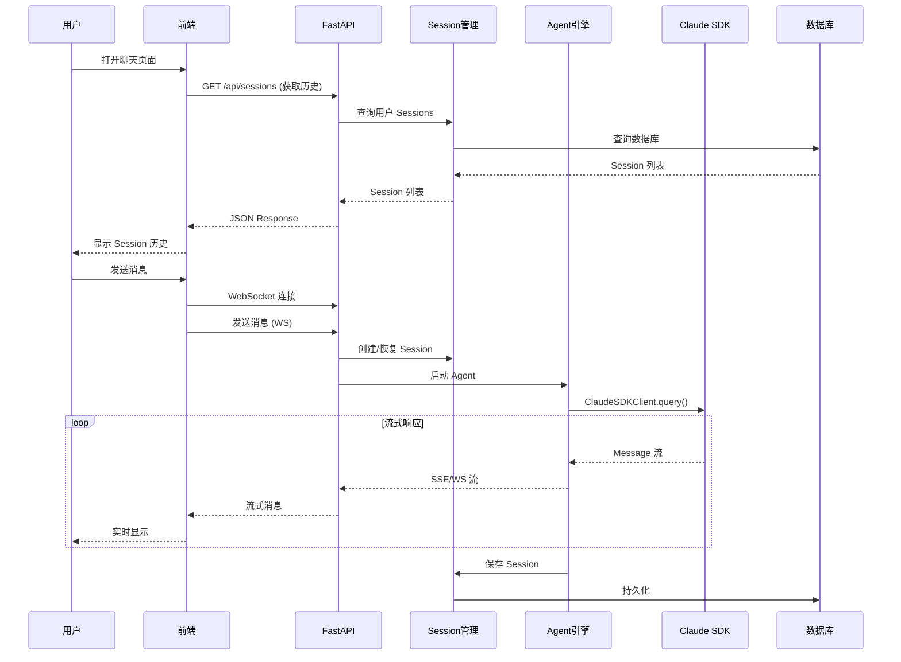
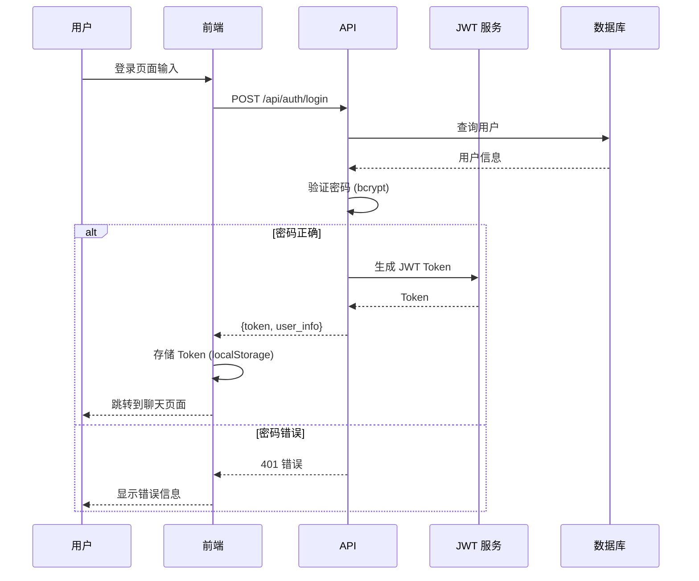
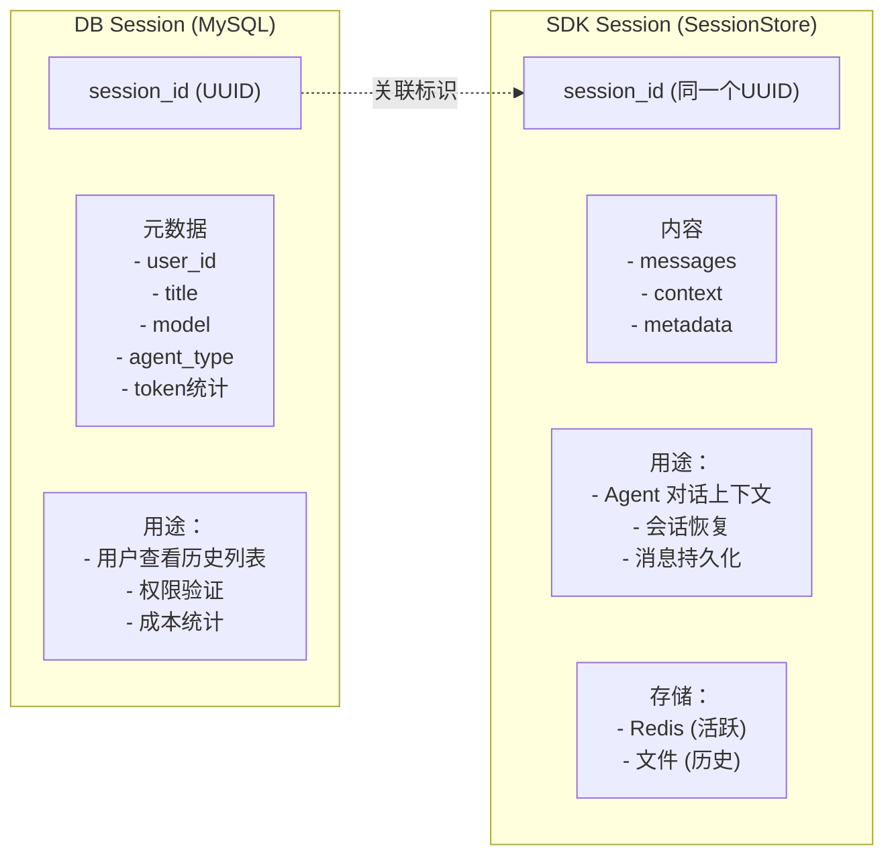
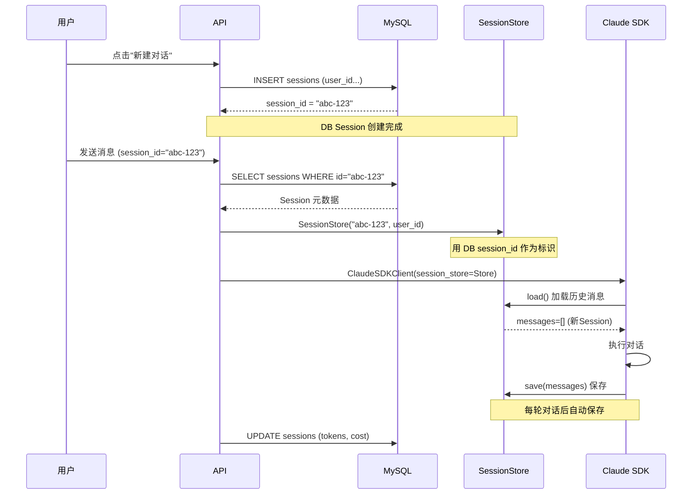
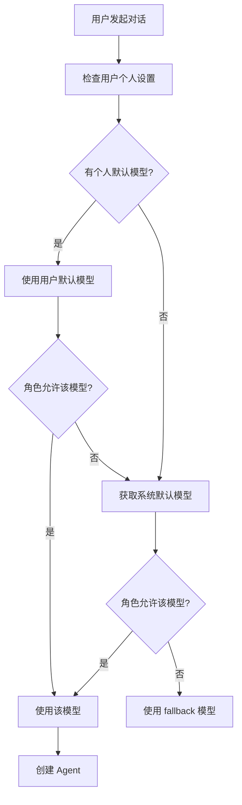
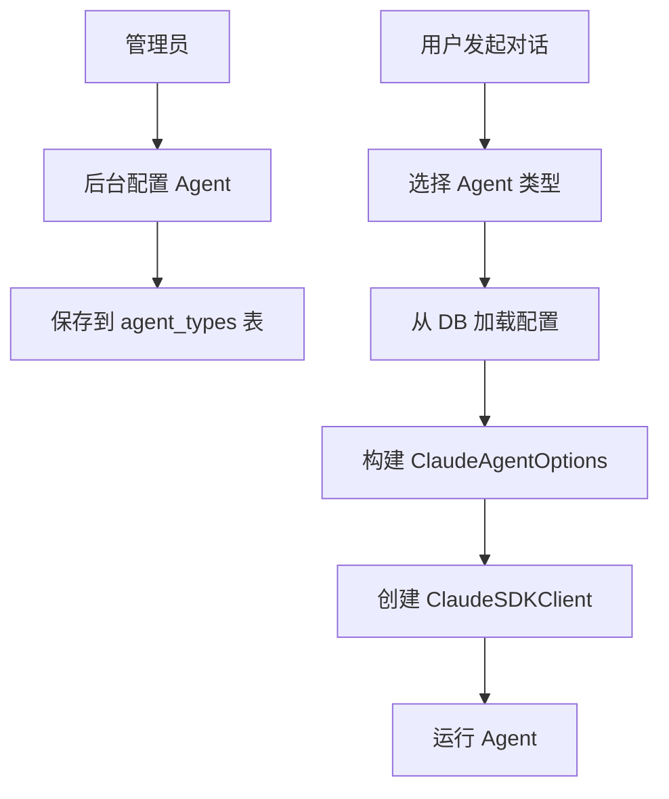
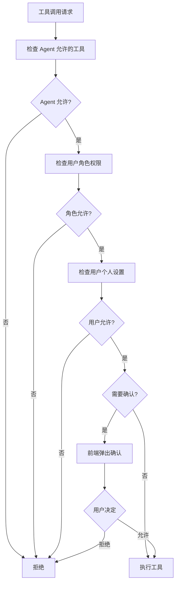

# Agent 项目设计文档

> 基于 Claude Agent SDK Python 构建多用户 Agent 应用平台
>
> 文档版本：v2.1
> 日期：2026-05-12

---

## 目录

1. [项目概述](#1-项目概述)
2. [技术选型](#2-技术选型)
3. [整体架构设计](#3-整体架构设计)
4. [用户系统设计](#4-用户系统设计)
5. [Session 管理设计](#5-session-管理设计)
6. [前端页面设计](#6-前端页面设计)
7. [后端 API 设计](#7-后端-api设计)
8. [模型配置设计](#8-模型配置设计)
9. [Agent 模块设计](#9-agent-模块设计)
10. [工具系统设计](#10-工具系统设计)
11. [项目目录结构](#11-项目目录结构)
12. [数据库设计](#12-数据库设计)
13. [实施计划](#13-实施计划)

---

## 1. 项目概述

### 1.1 项目目标

构建一个多用户 Agent 应用平台，包含：

- **用户聊天页面**：多轮对话、历史 Session 查看
- **后台设置页面**：模型配置、权限管理、工具配置
- **多用户系统**：用户隔离、独立配置、Session 管理
- **Agent 能力**：智能对话、工具调用、多 Agent 协作

### 1.2 核心功能模块


### 1.3 用户角色

| 角色 | 权限 | 功能 |
|------|------|------|
| 普通用户 | 聊天、查看自己的 Session | 聊天页面 |
| 管理员 | 所有配置 + 用户管理 | 后台设置页面 |
| 超级管理员 | 系统级配置 | 全部功能 |

### 1.4 技术栈

| 层级 | 技术 | 版本 | 说明 |
|------|------|------|------|
| **前端** | React | 18+ | 用户界面 |
| | Ant Design | 5+ | UI 组件库 |
| | TypeScript | 5+ | 类型安全 |
| **后端** | Python | 3.10+ | 运行环境 |
| | FastAPI | 0.100+ | API 框架 |
| | Claude Agent SDK | 0.1.80+ | Agent 核心 |
| **数据层** | MySQL | 8.0+ | Session/用户/配置 元数据 |
| | Redis | 7+ | Session 内容缓存 |
| **部署** | Docker | - | 容器化 |

---

## 2. 技术选型

### 2.1 前端选型

| 技术 | 选择理由 |
|------|----------|
| React | 社区成熟、组件丰富、适合聊天 UI |
| Ant Design | 企业级 UI、完整组件库、后台页面友好 |
| WebSocket | 实时通信、流式消息展示 |
| Zustand | 轻量状态管理 |

### 2.2 后端选型

| 技术 | 选择理由 |
|------|----------|
| FastAPI | 高性能、原生 async、自动 API 文档 |
| Claude Agent SDK | 官方 SDK、完整 Agent 能力 |
| MySQL | 关系型数据、用户/配置存储 |
| Redis | Session 缓存、实时状态 |

### 2.3 Claude Agent SDK 内置能力

**使用 SDK 后无需开发的能力：**

| 能力 | 说明 |
|------|------|
| 查询引擎 | `query()` 单次查询 + `ClaudeSDKClient` 多轮对话 |
| 内置工具 | 30+ 工具（Bash, Read, Write, Edit, WebSearch, WebFetch...） |
| MCP 协议 | 外部 MCP Server 接入 + SDK MCP Server（in-process） |
| Hooks 系统 | PreToolUse, PostToolUse, Stop, Notification 等 |
| 权限模式 | default, acceptEdits, plan, bypassPermissions, auto |
| 会话管理 | SessionStore API、会话恢复 |
| 上下文压缩 | Auto Compact 自动压缩 |
| Prompt Cache | 自动缓存优化 |
| 多模型支持 | 动态切换模型 |

---

## 3. 整体架构设计

### 3.1 系统架构图


### 3.2 核心数据流



### 3.3 核心组件职责

| 组件 | 职责 | 开发方 |
|------|------|--------|
| 前端应用 | 用户界面、WebSocket 通信 | 自研 |
| API 服务 | RESTful API、WebSocket 服务 | 自研 |
| 用户管理 | 用户 CRUD、认证、权限 | 自研 |
| Session 管理 | Session 元数据、内容存储 | 自研 |
| Agent 管理 | Agent 创建、配置、生命周期 | 自研 |
| 配置管理 | 模型、Agent、工具配置 | 自研 |
| Claude Agent SDK | Agent 核心、工具执行 | Anthropic |
| Claude Code CLI | QueryEngine、压缩、缓存 | Anthropic |

---

## 4. 用户系统设计

### 4.1 用户数据模型

| 字段 | 类型 | 说明 |
|------|------|------|
| id | UUID | 用户唯一标识 |
| username | VARCHAR(50) | 用户名 |
| email | VARCHAR(100) | 邮箱 |
| password_hash | VARCHAR(255) | 密码（bcrypt加密） |
| role | VARCHAR(20) | 角色：user, admin, super_admin |
| settings | JSON | 用户个人设置 |
| created_at | TIMESTAMP | 创建时间 |
| updated_at | TIMESTAMP | 更新时间 |

**用户个人设置（settings 字段）：**

| 设置项 | 说明 |
|------|------|
| default_model | 用户默认模型 |
| permission_mode | 权限模式 |
| allowed_tools | 用户可用工具列表 |
| max_sessions | 最大 Session 数量 |
| max_tokens_per_session | 单 Session 最大 tokens |

### 4.2 认证流程



### 4.3 认证 API 设计

| API | 方法 | 说明 |
|------|------|------|
| `/api/auth/login` | POST | 用户登录，返回 JWT Token |
| `/api/auth/register` | POST | 用户注册 |
| `/api/auth/logout` | POST | 用户登出 |
| `/api/auth/me` | GET | 获取当前用户信息 |
| `/api/auth/refresh` | POST | 刷新 Token |

---

## 5. Session 管理设计

### 5.1 DB Session 与 SDK Session 关联机制

**两种 Session 的区别与关联：**



**关联流程：**



### 5.2 Session 数据模型

**MySQL Session 表（元数据）：**

| 字段 | 类型 | 说明 |
|------|------|------|
| id | UUID | Session ID，关联 SDK SessionStore |
| user_id | UUID | 所属用户 |
| title | VARCHAR(200) | Session 标题 |
| model | VARCHAR(50) | 使用的模型 |
| agent_type | VARCHAR(50) | Agent 类型 |
| status | VARCHAR(20) | 状态：active, archived, deleted |
| total_input_tokens | INT | 输入 token 统计 |
| total_output_tokens | INT | 输出 token 统计 |
| total_cost | DECIMAL | 成本统计 |
| created_at | TIMESTAMP | 创建时间 |
| updated_at | TIMESTAMP | 更新时间 |

**SessionStore 存储内容：**

| 内容 | 说明 |
|------|------|
| session_id | 与 MySQL sessions.id 相同 |
| messages | 对话消息列表 |
| context | 对话上下文信息 |
| metadata | token 统计、成本等 |

### 5.3 Session 存储策略

| 数据类型 | 存储位置 | 原因 |
|----------|----------|------|
| Session 元数据 | MySQL | 查询、过滤、统计、用户列表展示 |
| Session 内容（活跃） | Redis | 快速访问、流式写入 |
| Session 内容（历史） | 文件系统 | 大数据、持久化、低成本 |
| Session 统计 | MySQL | 成本追踪、分析 |

### 5.4 Session API 设计

| API | 方法 | 说明 |
|------|------|------|
| `/api/sessions` | GET | 获取用户 Session 列表 |
| `/api/sessions` | POST | 创建新 Session |
| `/api/sessions/{id}` | GET | 获取 Session 详情（含消息） |
| `/api/sessions/{id}` | DELETE | 删除 Session |
| `/api/sessions/{id}/title` | PATCH | 更新标题 |
| `/api/sessions/{id}/archive` | PATCH | 归档 Session |

---

## 6. 前端页面设计

### 6.1 页面结构

```
前端页面：
├── 登录/注册页面
│
├── 聊天页面（主页面）
│   ├── Header：用户信息、设置入口
│   ├── Sidebar：Session 历史列表
│   ├── ChatArea：消息区域
│   │   ├── 消息列表（用户/助手消息）
│   │   ├── 工具调用展示
│   │   └── 流式输出动画
│   └── InputArea：输入框、发送按钮、Agent 选择
│
└── 后台设置页面（管理员）
    ├── 用户管理
    ├── 模型配置
    ├── Agent 配置
    ├── 工具配置
    └── 系统设置
```

### 6.2 聊天页面布局

```
+--------------------------------------------------+
|  Header: Logo | 用户名 | 设置按钮 |               |
+--------------------------------------------------+
|          |                                       |
| Sidebar  |         Chat Area                     |
|          |                                       |
| Session  |  +-------------------------------+   |
| 历史列表 |  | 用户消息                      |   |
|          |  +-------------------------------+   |
| [新建]   |                                       |
|          |  +-------------------------------+   |
| Session1 |  | Agent 回复（流式）            |   |
| Session2 |  | - 文本内容                    |   |
| Session3 |  | - 工具调用 [展开]             |   |
| ...      |  +-------------------------------+   |
|          |                                       |
|          |  +-------------------------------+   |
|          |  | 输入框 | Agent选择 | 发送     |   |
|          |  +-------------------------------+   |
+--------------------------------------------------+
```

### 6.3 消息类型渲染

| 消息类型 | 渲染方式 |
|----------|----------|
| 用户消息 | 简单文本，右侧显示 |
| 助手文本 | Markdown 渲染，左侧显示，流式动画 |
| Tool Use | 可折叠卡片，显示工具名、参数 |
| Tool Result | 可折叠卡片，显示执行结果 |
| Thinking | 隐藏或可展开的思考过程 |
| Error | 红色高亮错误信息 |

### 6.4 后台设置页面

**页面结构：**

| 页面 | 功能 |
|------|------|
| 用户管理 | 用户列表、添加/编辑用户、权限分配 |
| 模型配置 | 可用模型列表、默认模型、模型参数 |
| Agent 配置 | Agent 类型管理、System Prompt、工具绑定 |
| 工具配置 | 工具列表、MCP Server、权限规则 |
| 系统设置 | API Key、成本监控、日志查看 |

---

## 7. 后端 API 设计

### 7.1 API 模块划分

| 模块 | 路径前缀 | 功能 |
|------|----------|------|
| 认证 | `/api/auth` | 登录、注册、Token 验证 |
| 用户 | `/api/users` | 用户 CRUD、权限管理 |
| Session | `/api/sessions` | Session 管理、历史查询 |
| 聊天 | `/api/chat` | WebSocket、消息发送 |
| 配置 | `/api/config` | 模型、Agent、工具配置 |

### 7.2 API 详细列表

**认证 API：**

| API | 方法 | 说明 |
|------|------|------|
| `/api/auth/login` | POST | 登录 |
| `/api/auth/register` | POST | 注册 |
| `/api/auth/logout` | POST | 登出 |
| `/api/auth/me` | GET | 获取当前用户 |
| `/api/auth/refresh` | POST | 刷新 Token |

**用户 API（管理员）：**

| API | 方法 | 说明 |
|------|------|------|
| `/api/users` | GET | 用户列表 |
| `/api/users` | POST | 创建用户 |
| `/api/users/{id}` | GET | 用户详情 |
| `/api/users/{id}` | PUT | 更新用户 |
| `/api/users/{id}` | DELETE | 删除用户 |
| `/api/users/{id}/role` | PUT | 更改角色 |

**Session API：**

| API | 方法 | 说明 |
|------|------|------|
| `/api/sessions` | GET | Session 列表（当前用户） |
| `/api/sessions` | POST | 创建 Session |
| `/api/sessions/{id}` | GET | Session 详情（含消息） |
| `/api/sessions/{id}` | DELETE | 删除 Session |
| `/api/sessions/{id}/title` | PATCH | 更新标题 |
| `/api/sessions/{id}/archive` | PATCH | 归档 |

**聊天 API：**

| API | 方法 | 说明 |
|------|------|------|
| `/api/ws/{session_id}` | WebSocket | WebSocket 连接 |
| `/api/chat/{session_id}/message` | POST | 发送消息（HTTP 备用） |
| `/api/chat/{session_id}/stream` | GET | SSE 流（备用） |

**配置 API：**

| API | 方法 | 说明 |
|------|------|------|
| `/api/config/models` | GET | 获取可用模型列表 |
| `/api/config/models` | PUT | 更新模型配置 |
| `/api/config/default-model` | GET/PUT | 默认模型 |
| `/api/config/agents` | GET/POST | Agent 类型管理 |
| `/api/config/agents/{id}` | PUT/DELETE | 更新/删除 Agent |
| `/api/config/tools` | GET | 工具列表 |
| `/api/config/tools/permissions` | PUT | 工具权限 |
| `/api/config/mcp-servers` | GET/POST | MCP Server 配置 |

---

## 8. 模型配置设计

### 8.1 模型配置数据模型

| 字段 | 类型 | 说明 |
|------|------|------|
| id | UUID | 配置 ID |
| name | VARCHAR(50) | 模型名称（claude-opus-4-6） |
| display_name | VARCHAR(100) | 显示名称（Claude Opus 4） |
| is_enabled | BOOLEAN | 是否启用 |
| default_temperature | DECIMAL | 默认温度 |
| max_output_tokens | INT | 最大输出 tokens |
| input_cost_per_1k | DECIMAL | 输入成本 |
| output_cost_per_1k | DECIMAL | 输出成本 |
| allowed_roles | JSON | 允许的角色列表 |

### 8.2 模型配置功能

| 功能 | 说明 |
|------|------|
| 模型列表 | 管理员配置可用模型 |
| 默认模型 | 系统默认 + 用户个人默认 |
| 权限控制 | 不同角色可用不同模型 |
| 成本显示 | 显示各模型成本信息 |

### 8.3 模型选择流程



---

## 9. Agent 模块设计

### 9.1 Agent 类型

| Agent 类型 | 主要能力 | 建议模型 |
|------------|----------|----------|
| Assistant | 通用助手 | claude-sonnet-4-5 |
| Researcher | 信息检索、分析、报告 | claude-sonnet-4-5 |
| Coder | 代码开发、调试、测试 | claude-sonnet-4-5 |
| Coordinator | 任务分解、分配、监控 | claude-opus-4-6 |

### 9.2 Agent 配置数据模型

| 字段 | 类型 | 说明 |
|------|------|------|
| id | UUID | 配置 ID |
| name | VARCHAR(50) | Agent 名称（researcher） |
| display_name | VARCHAR(100) | 显示名称（研究员） |
| description | TEXT | 描述 |
| system_prompt | TEXT | System Prompt |
| allowed_tools | JSON | 允许的工具列表 |
| disallowed_tools | JSON | 禁用的工具列表 |
| default_model | VARCHAR(50) | 默认模型 |
| allowed_roles | JSON | 允许的角色 |
| is_enabled | BOOLEAN | 是否启用 |

### 9.3 Agent 配置流程



---

## 10. 工具系统设计

### 10.1 工具来源

| 来源 | 说明 |
|------|------|
| SDK 内置 | 30+ 工具（Bash, Read, Write, Edit, WebSearch...） |
| 自定义工具 | SDK MCP Server（in-process） |
| 外部 MCP Server | 配置的外部 MCP 服务 |

### 10.2 工具配置数据模型

| 字段 | 类型 | 说明 |
|------|------|------|
| id | UUID | 配置 ID |
| name | VARCHAR(50) | 工具名称 |
| description | TEXT | 描述 |
| is_builtin | BOOLEAN | 是否内置工具 |
| is_enabled | BOOLEAN | 是否启用 |
| allowed_roles | JSON | 允许的角色 |
| requires_confirmation | BOOLEAN | 是否需要确认 |
| mcp_server | VARCHAR(50) | 来源 MCP Server |

### 10.3 工具权限控制流程



---

## 11. 项目目录结构

```
agent_platform/
├── frontend/                    # 前端应用
│   ├── src/
│   │   ├── pages/               # 页面组件
│   │   ├── components/          # 公共组件
│   │   ├── hooks/               # React Hooks
│   │   ├── stores/              # 状态管理
│   │   ├── services/            # API 服务
│   │   ├── types/               # TypeScript 类型
│   │   ├── App.tsx
│   │   └── main.tsx
│   ├── package.json
│   └── vite.config.ts
│
├── backend/                     # 后端服务
│   ├── api/                     # API 路由
│   ├── models/                  # 数据模型
│   ├── services/                # 业务服务
│   ├── core/                    # 核心模块
│   ├── tools/                   # 自定义工具
│   ├── hooks/                   # 业务 Hooks
│   ├── migrations/              # 数据库迁移
│   ├── main.py                  # 入口
│   └── requirements.txt
│
├── docker/                      # Docker 配置
│   ├── docker-compose.yml
│   ├── frontend.Dockerfile
│   ├── backend.Dockerfile
│   └── nginx.conf
│
├── docs/                        # 文档
│   ├── api.md
│   ├── frontend.md
│   └── deployment.md
│
├── scripts/                     # 脚本
│   ├── init_db.py
│   └── seed_data.py
│
└── README.md
```

---

## 12. 数据库设计（MySQL）

### 12.1 数据表概览

| 表名 | 说明 |
|------|------|
| users | 用户表 |
| sessions | Session 元数据表 |
| agent_types | Agent 类型配置表 |
| model_configs | 模型配置表 |
| tool_configs | 工具配置表 |
| mcp_servers | MCP Server 配置表 |
| system_config | 系统配置表 |

### 12.2 Session 存储架构

```
┌─────────────────────────────────────────────────────────────────┐
│                    Session 存储架构                              │
├─────────────────────────────────────────────────────────────────┤
│                                                                 │
│  数据类型           存储位置           用途                      │
│  ─────────────────────────────────────────────────────────────  │
│                                                                 │
│  Session 元数据      MySQL              用户历史列表              │
│  - id, title       sessions表         权限验证                  │
│  - model, type                        成本统计                  │
│  - token统计                                                   │
│                                                                 │
│  Session 消息内容    Redis + 文件       Agent 对话上下文          │
│  - messages        (SessionStore)      会话恢复                  │
│  - context                            消息持久化                │
│                                                                 │
│  关联方式:                                                       │
│  MySQL sessions.id = SessionStore.session_id                    │
│                                                                 │
└─────────────────────────────────────────────────────────────────┘
```

### 12.3 数据表字段设计

**用户表：**

| 字段 | 类型 | 说明 |
|------|------|------|
| id | VARCHAR(36) | UUID |
| username | VARCHAR(50) | 用户名 |
| email | VARCHAR(100) | 邮箱 |
| password_hash | VARCHAR(255) | 密码哈希 |
| role | VARCHAR(20) | 角色 |
| settings | JSON | 个人设置 |
| created_at | TIMESTAMP | 创建时间 |
| updated_at | TIMESTAMP | 更新时间 |

**Session 表 (sessions)：**

| 字段 | 类型 | 说明 |
|------|------|------|
| id | VARCHAR(36) | Session ID（关联 SDK） |
| user_id | VARCHAR(36) | 用户 ID |
| title | VARCHAR(200) | 标题 |
| model | VARCHAR(50) | 模型 |
| agent_type | VARCHAR(50) | Agent 类型 |
| status | VARCHAR(20) | 状态 |
| total_input_tokens | INT | 输入 tokens |
| total_output_tokens | INT | 输出 tokens |
| total_cost | DECIMAL(10,4) | 成本 |
| created_at | TIMESTAMP | 创建时间 |
| updated_at | TIMESTAMP | 更新时间 |

**Agent 类型表 (agent_types)：**

| 字段 | 类型 | 说明 |
|------|------|------|
| id | VARCHAR(36) | UUID |
| name | VARCHAR(50) | Agent 名称 |
| display_name | VARCHAR(100) | 显示名称 |
| description | TEXT | 描述 |
| system_prompt | TEXT | System Prompt |
| allowed_tools | JSON | 允许工具 |
| disallowed_tools | JSON | 禁用工具 |
| default_model | VARCHAR(50) | 默认模型 |
| allowed_roles | JSON | 允许角色 |
| is_enabled | BOOLEAN | 是否启用 |

**模型配置表 (model_configs)：**

| 字段 | 类型 | 说明 |
|------|------|------|
| id | VARCHAR(36) | UUID |
| name | VARCHAR(50) | 模型名 |
| display_name | VARCHAR(100) | 显示名 |
| is_enabled | BOOLEAN | 是否启用 |
| default_temperature | DECIMAL(3,2) | 温度 |
| max_output_tokens | INT | 最大 tokens |
| input_cost_per_1k | DECIMAL(10,4) | 输入成本 |
| output_cost_per_1k | DECIMAL(10,4) | 输出成本 |
| allowed_roles | JSON | 允许角色 |

**工具配置表 (tool_configs)：**

| 字段 | 类型 | 说明 |
|------|------|------|
| id | VARCHAR(36) | UUID |
| name | VARCHAR(50) | 工具名 |
| description | TEXT | 描述 |
| is_builtin | BOOLEAN | 是否内置 |
| is_enabled | BOOLEAN | 是否启用 |
| allowed_roles | JSON | 允许角色 |
| requires_confirmation | BOOLEAN | 需确认 |
| mcp_server | VARCHAR(50) | MCP 来源 |

**MCP Server 配置表 (mcp_servers)：**

| 字段 | 类型 | 说明 |
|------|------|------|
| id | VARCHAR(36) | UUID |
| name | VARCHAR(50) | Server 名 |
| command | TEXT | 启动命令 |
| args | JSON | 参数 |
| env | JSON | 环境变量 |
| is_enabled | BOOLEAN | 是否启用 |

---

## 13. 实施计划

### 13.1 开发阶段（总计 6 周）

| 阶段 | 时间 | 任务 | 产出 |
|------|------|------|------|
| Phase 1 | 第 1 周 | 后端基础 + 用户系统 | 用户认证 API、数据库 |
| Phase 2 | 第 2 周 | Session 管理 + Agent 核心 | Session API、Agent 引擎 |
| Phase 3 | 第 3 周 | 前端聊天页面 | 聊天 UI、WebSocket |
| Phase 4 | 第 4 周 | 前端后台设置页面 | 模型/Agent 配置 UI |
| Phase 5 | 第 5 周 | 自定义工具 + Hooks | 业务工具集成 |
| Phase 6 | 第 6 周 | 测试 + 部署 | 完整系统上线 |

### 13.2 验收标准

| 标准 | 要求 |
|------|------|
| 多用户支持 | 用户注册/登录、角色权限、配置隔离 |
| 聊天功能 | 多轮对话、流式输出、Session 历史 |
| 后台配置 | 模型配置、Agent 配置、工具配置、用户管理 |
| 数据持久化 | Session 存储、配置存储、用户数据 |
| 安全认证 | JWT 认证、权限控制、数据隔离 |
| 性能 | WebSocket 流式响应 < 100ms |

---

## 附录：参考资料

1. [Claude Agent SDK Python](https://github.com/anthropics/claude-agent-sdk-python)
2. [Claude Agent SDK Demos](https://github.com/anthropics/claude-agent-sdk-demos)
3. [Agent SDK Workshop](https://github.com/anthropics/agent-sdk-workshop)
4. [FastAPI 文档](https://fastapi.tiangolo.com/)
5. [React 文档](https://react.dev/)
6. [Ant Design 文档](https://ant.design/)
7. Claude Code 源码调研：`/data/caidanfeng/project/doc/md-doc/agent/claude-code-research/0_code_flow.md`