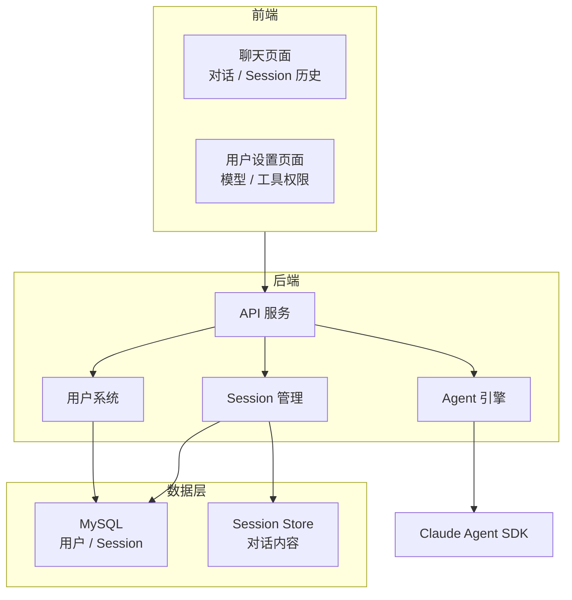
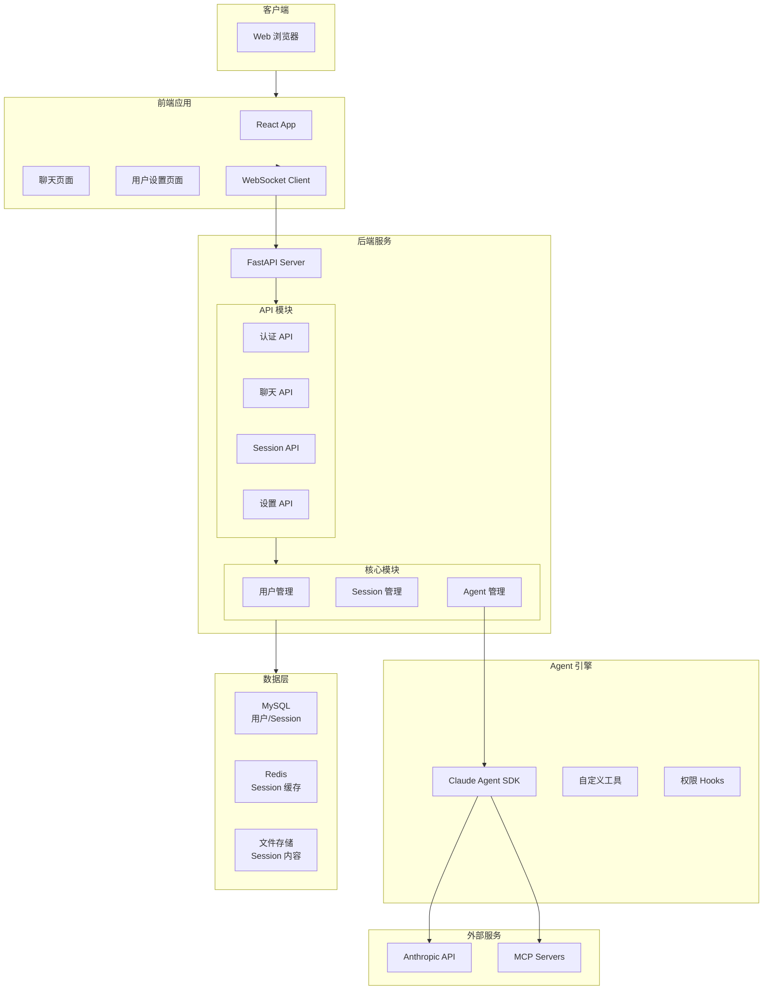
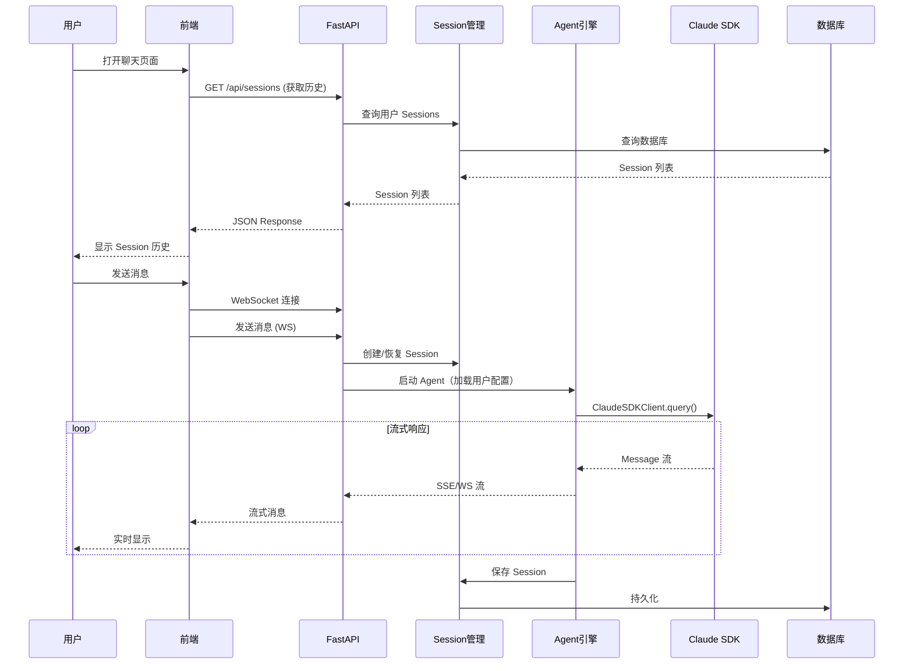
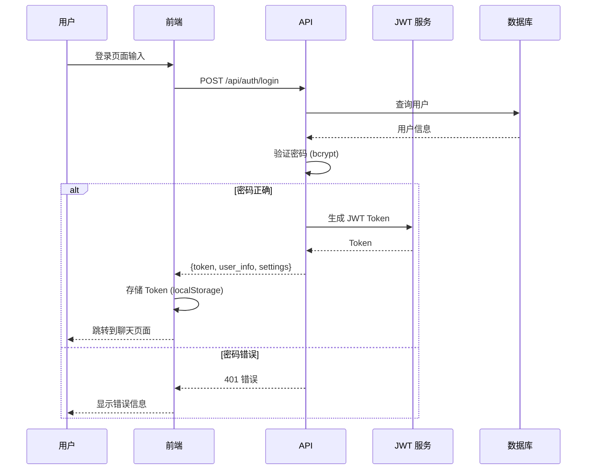
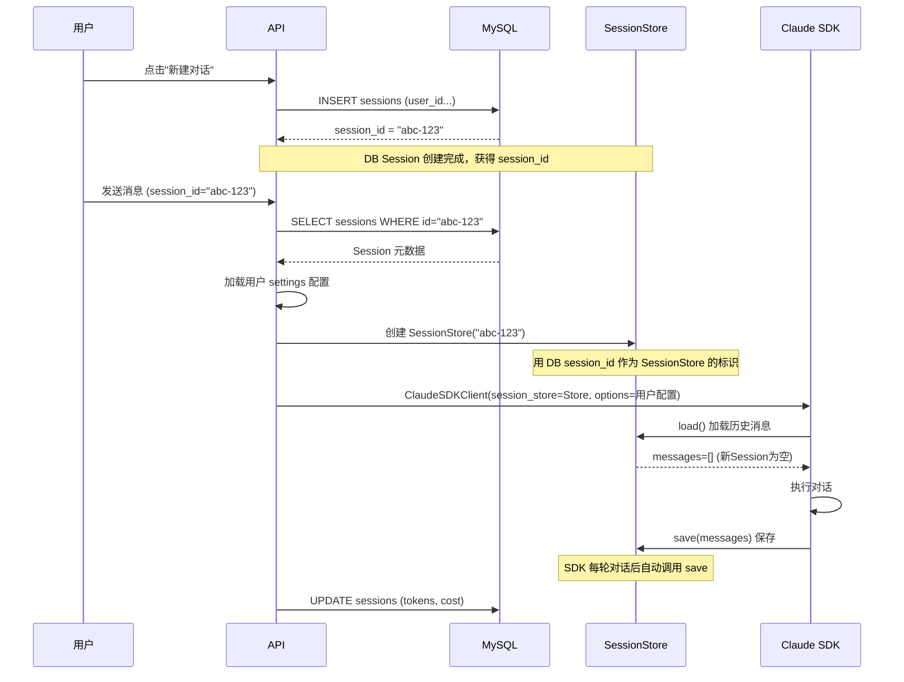
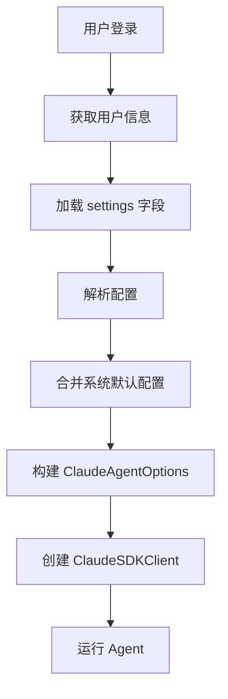
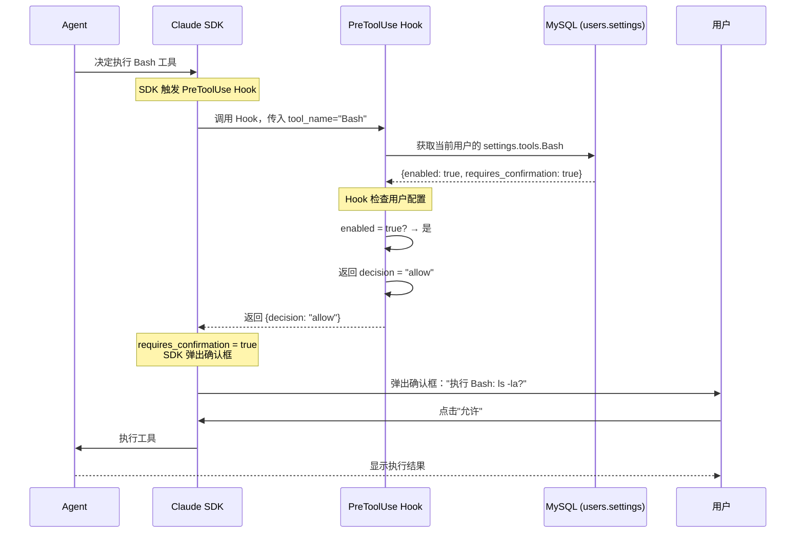
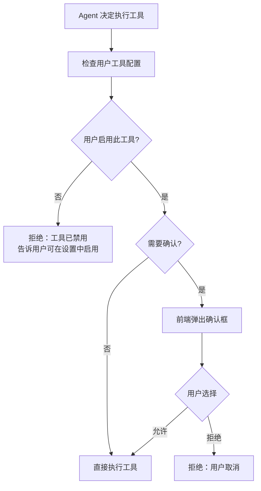

# Agent 项目设计文档

> 基于 Claude Agent SDK Python 构建多用户 Agent 应用平台
>
> 文档版本：v3.0
> 日期：2026-05-13

---

## 目录

1. [项目概述](#1-项目概述)
2. [技术选型](#2-技术选型)
3. [整体架构设计](#3-整体架构设计)
4. [用户系统设计](#4-用户系统设计)
5. [Session 管理设计](#5-session-管理设计)
6. [前端页面设计](#6-前端页面设计)
7. [后端 API 设计](#7-后端-api设计)
8. [用户配置设计](#8-用户配置设计)
9. [工具权限设计](#9-工具权限设计)
10. [项目目录结构](#10-项目目录结构)
11. [数据库设计](#11-数据库设计)
12. [实施计划](#12-实施计划)

---

## 1. 项目概述

### 1.1 项目目标

构建一个多用户 Agent 应用平台，包含：

- **用户聊天页面**：多轮对话、历史 Session 查看
- **用户设置页面**：个人配置模型、工具权限
- **多用户系统**：用户隔离、独立配置、Session 管理
- **Agent 能力**：智能对话、工具调用

### 1.2 核心设计理念

```
┌─────────────────────────────────────────────────────────────────────────┐
│                       核心设计理念                                        │
├─────────────────────────────────────────────────────────────────────────┤
│                                                                         │
│  无角色概念                                                               │
│  ─────────────────────────────────────────────────────────────────────  │
│  - 不区分普通用户和管理员                                                  │
│  - 所有用户权限相同                                                       │
│  - 每个用户独立配置自己的设置                                              │
│                                                                         │
│  用户自治                                                                 │
│  ─────────────────────────────────────────────────────────────────────  │
│  - 用户自己设置默认模型                                                   │
│  - 用户自己设置工具权限                                                   │
│  - 用户自己配置 MCP Server                                                │
│                                                                         │
│  数据隔离                                                                 │
│  ─────────────────────────────────────────────────────────────────────  │
│  - 用户只能看到自己的 Session                                              │
│  - 用户配置只影响自己                                                     │
│                                                                         │
└─────────────────────────────────────────────────────────────────────────┘
```

### 1.3 核心功能模块



### 1.4 技术栈

| 层级 | 技术 | 版本 | 说明 |
|------|------|------|------|
| **前端** | React | 18+ | 用户界面 |
| | Ant Design | 5+ | UI 组件库 |
| | TypeScript | 5+ | 类型安全 |
| **后端** | Python | 3.10+ | 运行环境 |
| | FastAPI | 0.100+ | API 框架 |
| | Claude Agent SDK | 0.1.80+ | Agent 核心 |
| **数据层** | MySQL | 8.0+ | 用户/Session 元数据 |
| | Redis | 7+ | Session 内容缓存 |
| **部署** | Docker | - | 容器化 |

---

## 2. 技术选型

### 2.1 前端选型

| 技术 | 选择理由 |
|------|----------|
| React | 社区成熟、组件丰富、适合聊天 UI |
| Ant Design | 企业级 UI、完整组件库 |
| WebSocket | 实时通信、流式消息展示 |
| Zustand | 轻量状态管理 |

### 2.2 后端选型

| 技术 | 选择理由 |
|------|----------|
| FastAPI | 高性能、原生 async、自动 API 文档 |
| Claude Agent SDK | 官方 SDK、完整 Agent 能力 |
| MySQL | 关系型数据、用户/Session 存储 |
| Redis | Session 缓存、实时状态 |

### 2.3 Claude Agent SDK 内置能力

**使用 SDK 后无需开发的能力：**

| 能力 | 说明 |
|------|------|
| 查询引擎 | `query()` 单次查询 + `ClaudeSDKClient` 多轮对话 |
| 内置工具 | 30+ 工具（Bash, Read, Write, Edit, WebSearch, WebFetch...） |
| MCP 协议 | 外部 MCP Server 接入 + SDK MCP Server（in-process） |
| Hooks 系统 | PreToolUse, PostToolUse, Stop, Notification 等 |
| 权限模式 | default, acceptEdits, plan, bypassPermissions |
| 会话管理 | SessionStore API、会话恢复 |
| 上下文压缩 | Auto Compact 自动压缩 |
| Prompt Cache | 自动缓存优化 |
| 多模型支持 | 动态切换模型 |

---

## 3. 整体架构设计

### 3.1 系统架构图



### 3.2 核心数据流



### 3.3 核心组件职责

| 组件 | 职责 | 开发方 |
|------|------|--------|
| 前端应用 | 用户界面、WebSocket 通信 | 自研 |
| API 服务 | RESTful API、WebSocket 服务 | 自研 |
| 用户管理 | 用户 CRUD、认证 | 自研 |
| Session 管理 | Session 元数据、内容存储 | 自研 |
| Agent 管理 | Agent 创建、加载用户配置 | 自研 |
| Claude Agent SDK | Agent 核心、工具执行 | Anthropic |
| Claude Code CLI | QueryEngine、压缩、缓存 | Anthropic |

---

## 4. 用户系统设计

### 4.1 用户数据模型

| 字段 | 类型 | 说明 |
|------|------|------|
| id | VARCHAR(36) | 用户唯一标识 |
| username | VARCHAR(50) | 用户名 |
| email | VARCHAR(100) | 邮箱 |
| password_hash | VARCHAR(255) | 密码（bcrypt加密） |
| settings | JSON | 用户个人配置 |
| created_at | TIMESTAMP | 创建时间 |
| updated_at | TIMESTAMP | 更新时间 |

### 4.2 用户个人配置（settings 字段）

```
用户 settings 结构：

{
  "default_model": "claude-sonnet-4-5",
  
  "tools": {
    "Bash": {
      "enabled": true,
      "requires_confirmation": true
    },
    "Read": {
      "enabled": true,
      "requires_confirmation": false
    },
    "Write": {
      "enabled": true,
      "requires_confirmation": true
    },
    "WebSearch": {
      "enabled": true,
      "requires_confirmation": false
    }
  },
  
  "mcp_servers": {
    "my_server": {
      "command": "python",
      "args": ["mcp_server.py"],
      "enabled": true
    }
  },
  
  "agent_options": {
    "system_prompt": "你是一个有帮助的助手",
    "permission_mode": "acceptEdits"
  }
}
```

**配置项说明：**

| 配置项 | 说明 |
|------|------|
| default_model | 用户默认使用的模型 |
| tools | 工具权限配置（每个工具的启用状态、是否需要确认） |
| mcp_servers | 用户自定义的 MCP Server |
| agent_options | Agent 运行选项 |

### 4.3 认证流程



### 4.4 认证 API 设计

| API | 方法 | 说明 |
|------|------|------|
| `/api/auth/login` | POST | 用户登录，返回 JWT Token + 用户配置 |
| `/api/auth/register` | POST | 用户注册 |
| `/api/auth/logout` | POST | 用户登出 |
| `/api/auth/me` | GET | 获取当前用户信息 + 配置 |
| `/api/auth/refresh` | POST | 刷新 Token |

---

## 5. Session 管理设计

### 5.1 核心概念：两种 Session

**用"书"的比喻来理解：**

```
┌─────────────────────────────────────────────────────────────────────────┐
│                     "聊天对话" 的两层信息                                  │
├─────────────────────────────────────────────────────────────────────────┤
│                                                                         │
│  类比：一本书                                                            │
│                                                                         │
│  ┌─────────────────────┐        ┌─────────────────────────────┐        │
│  │  书的封面/目录       │        │  书的内容（正文）            │        │
│  │  (DB Session)       │        │  (SDK Session)              │        │
│  │                     │        │                             │        │
│  │  - 书名 → 对话标题   │        │  - 第1章 → 第1条消息        │        │
│  │  - 作者 → 用户      │        │  - 第2章 → 第2条消息        │        │
│  │  - 页数 → token数   │        │  - 第3章 → 第3条消息        │        │
│  │                     │        │  ...                        │        │
│  │                     │        │                             │        │
│  │  存在：MySQL         │        │  存在：SessionStore         │        │
│  │                     │        │  (Redis/MySQL/文件)         │        │
│  │                     │        │                             │        │
│  │  用途：              │        │  用途：                      │        │
│  │  - 快速找书          │        │  - 阅读内容                 │        │
│  │  - 统计有多少书      │        │  - 继续阅读（恢复对话）     │        │
│  │  - 不打开就能看      │        │  - Agent 需要内容才能回答  │        │
│  │    基本信息          │        │                             │        │
│  └─────────────────────┘        └─────────────────────────────┘        │
│                                                                         │
│  关联方式：书的 ID = 内容的 ID（同一个标识）                               │
│                                                                         │
└─────────────────────────────────────────────────────────────────────────┘
```

### 5.2 SessionStore 的位置与实现

**SessionStore 与 SDK 的关系：**

```
┌─────────────────────────────────────────────────────────────────────────┐
│                        SessionStore 的关系                               │
├─────────────────────────────────────────────────────────────────────────┤
│                                                                         │
│   Claude Agent SDK                                                      │
│   ┌─────────────────────────────────────────────────────┐              │
│   │                                                     │              │
│   │   SDK 提供：                                        │              │
│   │   - SessionStore 接口定义（规定要实现哪些方法）      │              │
│   │   - 调用 SessionStore 的时机                        │              │
│   │                                                     │              │
│   │   接口方法：                                        │              │
│   │   ┌─────────────────────────────────────┐          │              │
│   │   │  save(messages, metadata)           │          │              │
│   │   │  load() → messages, metadata        │          │              │
│   │   └─────────────────────────────────────┘          │              │
│   │              ↑                                    │              │
│   │              │ 我们自己实现                        │              │
│   │              │                                    │              │
│   │   我们实现：                                       │              │
│   │   ┌─────────────────────────────────────┐          │              │
│   │   │  MySQLSessionStore                  │          │              │
│   │   │  - save(): 存到我们选择的位置       │          │              │
│   │   │  - load(): 从我们选择的位置读       │          │              │
│   │   └─────────────────────────────────────┘          │              │
│   │                                                     │              │
│   │   SDK 运行时自动调用：                              │              │
│   │   - 每轮对话结束 → 调用 save()                     │              │
│   │   - 启动 Agent → 调用 load()                      │              │
│   │                                                     │              │
│   └─────────────────────────────────────────────────────┘              │
│                                                                         │
│   我们传给 SDK：                                                         │
│   ClaudeSDKClient(session_store=我们实现的SessionStore)                 │
│                                                                         │
└─────────────────────────────────────────────────────────────────────────┘
```

### 5.3 SessionStore 存储位置选择

| 存储位置 | 适合场景 | 性能 | 成本 |
|----------|----------|------|------|
| Redis | 活跃对话（正在进行） | 最快 | 高 |
| MySQL | 持久化存储 | 中 | 低 |
| 文件 | 大量历史对话 | 慢 | 最低 |

**推荐：Redis（活跃） + MySQL/文件（历史）**

### 5.4 Session 关联流程



### 5.5 Session 数据模型

**MySQL Session 表（元数据）：**

| 字段 | 类型 | 说明 |
|------|------|------|
| id | VARCHAR(36) | Session ID，关联 SessionStore |
| user_id | VARCHAR(36) | 所属用户 |
| title | VARCHAR(200) | Session 标题 |
| model | VARCHAR(50) | 使用的模型 |
| status | VARCHAR(20) | 状态：active, archived, deleted |
| total_input_tokens | INT | 输入 token 统计 |
| total_output_tokens | INT | 输出 token 统计 |
| total_cost | DECIMAL | 成本统计 |
| created_at | TIMESTAMP | 创建时间 |
| updated_at | TIMESTAMP | 更新时间 |

**SessionStore 存储内容：**

| 内容 | 说明 |
|------|------|
| session_id | 与 MySQL sessions.id 相同（关联标识） |
| messages | 对话消息列表（每条消息的完整内容） |
| context | 对话上下文信息 |
| metadata | token 统计、成本等 |

### 5.6 实际使用场景

**场景1：用户查看历史列表**

```
用户打开聊天页面
    ↓
系统查询 MySQL sessions 表
    ↓
返回对话列表（只返回元数据，不加载内容）
    ↓
用户看到：
    1. 研究React - 昨天 - 2000 tokens
    2. 写HTTP服务 - 3天前 - 1500 tokens
    ...
    
（这一步不需要 SessionStore，只查 MySQL）
```

**场景2：用户进入某个对话**

```
用户点击"研究React"
    ↓
系统用 session_id="abc-123" 创建 SessionStore
    ↓
SessionStore.load() 加载消息内容
    ↓
用户看到完整对话记录（10轮对话）
    
（这一步需要 SessionStore 加载内容）
```

**场景3：用户继续对话**

```
用户发送新消息："再写一个示例"
    ↓
Agent 用 SessionStore.load() 获取历史上下文
    ↓
Agent 看到之前的 React 讨论，理解上下文
    ↓
Agent 回复："好的，基于刚才讨论的特性..."
    ↓
SessionStore.save() 保存新消息
    ↓
MySQL 更新 token 统计
```

### 5.7 Session API 设计

| API | 方法 | 说明 |
|------|------|------|
| `/api/sessions` | GET | 获取用户 Session 列表（只返回元数据） |
| `/api/sessions` | POST | 创建新 Session |
| `/api/sessions/{id}` | GET | 获取 Session 详情（含消息内容） |
| `/api/sessions/{id}` | DELETE | 删除 Session |
| `/api/sessions/{id}/title` | PATCH | 更新标题 |
| `/api/sessions/{id}/archive` | PATCH | 归档 Session |

---

## 6. 前端页面设计

### 6.1 页面结构

```
前端页面：
├── 登录/注册页面
│
├── 聊天页面（主页面）
│   ├── Header：用户信息、设置入口
│   ├── Sidebar：Session 历史列表
│   ├── ChatArea：消息区域
│   │   ├── 消息列表（用户/助手消息）
│   │   ├── 工具调用展示
│   │   └── 流式输出动画
│   └── InputArea：输入框、发送按钮
│
└── 用户设置页面
    ├── 模型设置
    ├── 工具权限设置
    ├── MCP Server 配置
    └── Agent 选项设置
```

### 6.2 聊天页面布局

```
+--------------------------------------------------+
|  Header: Logo | 用户名 | [设置]                   |
+--------------------------------------------------+
|          |                                       |
| Sidebar  |         Chat Area                     |
|          |                                       |
| Session  |  +-------------------------------+   |
| 历史列表 |  | 用户消息                      |   |
|          |  +-------------------------------+   |
| [新建]   |                                       |
|          |  +-------------------------------+   |
| Session1 |  | Agent 回复（流式）            |   |
| Session2 |  | - 文本内容                    |   |
| Session3 |  | - 工具调用 [展开]             |   |
| ...      |  +-------------------------------+   |
|          |                                       |
|          |  +-------------------------------+   |
|          |  | 输入框 | 发送                  |   |
|          |  +-------------------------------+   |
+--------------------------------------------------+
```

### 6.3 消息类型渲染

| 消息类型 | 渲染方式 |
|----------|----------|
| 用户消息 | 简单文本，右侧显示 |
| 助手文本 | Markdown 渲染，左侧显示，流式动画 |
| Tool Use | 可折叠卡片，显示工具名、参数 |
| Tool Result | 可折叠卡片，显示执行结果 |
| Thinking | 隐藏或可展开的思考过程 |
| Error | 红色高亮错误信息 |

### 6.4 用户设置页面

**模型设置：**

```
+--------------------------------------------------+
|  模型设置                                         |
+--------------------------------------------------+
|                                                  |
|  默认模型：                                       |
|  ┌────────────────────────────────────────────┐  |
|  │ ▸ claude-sonnet-4-5                        │  |
|  │   claude-opus-4-6                          │  |
|  │   claude-haiku-4-5                         │  |
|  └────────────────────────────────────────────┐  |
|                                                  |
|  [保存设置]                                       |
+--------------------------------------------------+
```

**工具权限设置：**

```
+--------------------------------------------------+
|  工具权限设置                                     |
+--------------------------------------------------+
|                                                  |
|  工具列表：                                       |
|  +--------------------------------------------+  |
|  | 工具名称 | 启用 | 需确认 |                  |  |
|  +--------------------------------------------+  |
|  | Bash    | [✓] | [✓]    | [编辑详细设置] |  |
|  | Read    | [✓] | [ ]    | [编辑详细设置] |  |
|  | Write   | [✓] | [✓]    | [编辑详细设置] |  |
|  | Edit    | [✓] | [✓]    | [编辑详细设置] |  |
|  | WebSearch| [✓] | [ ]    | [编辑详细设置] |  |
|  | WebFetch | [✓] | [ ]    | [编辑详细设置] |  |
|  +--------------------------------------------+  |
|                                                  |
|  [保存设置]                                       |
+--------------------------------------------------+
```

---

## 7. 后端 API 设计

### 7.1 API 模块划分

| 模块 | 路径前缀 | 功能 |
|------|----------|------|
| 认证 | `/api/auth` | 登录、注册、Token 验证 |
| Session | `/api/sessions` | Session 管理、历史查询 |
| 聊天 | `/api/chat` | WebSocket、消息发送 |
| 设置 | `/api/settings` | 用户个人设置 |

### 7.2 API 详细列表

**认证 API：**

| API | 方法 | 说明 |
|------|------|------|
| `/api/auth/login` | POST | 登录 |
| `/api/auth/register` | POST | 注册 |
| `/api/auth/logout` | POST | 登出 |
| `/api/auth/me` | GET | 获取当前用户 + 配置 |
| `/api/auth/refresh` | POST | 刷新 Token |

**Session API：**

| API | 方法 | 说明 |
|------|------|------|
| `/api/sessions` | GET | Session 列表（当前用户） |
| `/api/sessions` | POST | 创建 Session |
| `/api/sessions/{id}` | GET | Session 详情（含消息） |
| `/api/sessions/{id}` | DELETE | 删除 Session |
| `/api/sessions/{id}/title` | PATCH | 更新标题 |
| `/api/sessions/{id}/archive` | PATCH | 归档 |

**聊天 API：**

| API | 方法 | 说明 |
|------|------|------|
| `/api/ws/{session_id}` | WebSocket | WebSocket 连接 |
| `/api/chat/{session_id}/message` | POST | 发送消息（HTTP 备用） |
| `/api/chat/{session_id}/stream` | GET | SSE 流（备用） |

**用户设置 API：**

| API | 方法 | 说明 |
|------|------|------|
| `/api/settings` | GET | 获取用户全部设置 |
| `/api/settings` | PUT | 更新用户全部设置 |
| `/api/settings/model` | GET/PUT | 默认模型设置 |
| `/api/settings/tools` | GET/PUT | 工具权限设置 |
| `/api/settings/tools/{name}` | GET/PUT | 单个工具设置 |
| `/api/settings/mcp-servers` | GET/POST/DELETE | MCP Server 配置 |
| `/api/settings/agent-options` | GET/PUT | Agent 选项设置 |

---

## 8. 用户配置设计

### 8.1 配置加载流程



### 8.2 配置优先级

```
┌─────────────────────────────────────────────────────────────────────────┐
│                        配置优先级                                         │
├─────────────────────────────────────────────────────────────────────────┤
│                                                                         │
│  优先级从高到低：                                                         │
│                                                                         │
│  1. 用户个人设置（users.settings）                                        │
│     - 用户自己配置的模型、工具权限等                                       │
│                                                                         │
│  2. 系统默认配置（system_config 表）                                      │
│     - 用户没有设置时使用的默认值                                           │
│                                                                         │
│  合并逻辑：                                                               │
│  - 用户设置了 → 用用户设置                                                │
│  - 用户没设置 → 用系统默认                                                │
│                                                                         │
└─────────────────────────────────────────────────────────────────────────┘
```

### 8.3 系统默认配置

**system_config 表（系统级默认值）：**

| 配置项 | 默认值 | 说明 |
|------|------|------|
| default_model | claude-sonnet-4-5 | 系统默认模型 |
| available_models | ["claude-sonnet-4-5", "claude-opus-4-6", "claude-haiku-4-5"] | 可用模型列表 |
| default_tools_config | {...} | 工具默认配置 |

---

## 9. 工具权限设计

### 9.1 权限配置位置

```
┌─────────────────────────────────────────────────────────────────────────┐
│                    工具权限存储位置                                        │
├─────────────────────────────────────────────────────────────────────────┤
│                                                                         │
│  用户个人配置（users.settings 字段）：                                     │
│                                                                         │
│  {                                                                      │
│    "tools": {                                                           │
│      "Bash": {                                                          │
│        "enabled": true,          ← 是否启用此工具                        │
│        "requires_confirmation": true  ← 执行前是否需要确认               │
│      },                                                                 │
│      "Read": {                                                          │
│        "enabled": true,                                                 │
│        "requires_confirmation": false                                   │
│      },                                                                 │
│      ...                                                                │
│    }                                                                    │
│  }                                                                      │
│                                                                         │
│  每个用户独立配置，互不影响                                                │
│                                                                         │
└─────────────────────────────────────────────────────────────────────────┘
```

### 9.2 权限与 SDK 的关联机制

**SDK 提供的权限能力：**

```
┌─────────────────────────────────────────────────────────────────────────┐
│                    Claude Agent SDK 的权限机制                            │
├─────────────────────────────────────────────────────────────────────────┤
│                                                                         │
│  SDK 提供的权限模式（permission_mode）：                                  │
│  ─────────────────────────────────────────────────────────────────────  │
│                                                                         │
│  permission_mode: "default"                                             │
│  - SDK 内置的交互式权限确认                                              │
│  - 每次工具执行时询问用户是否允许                                         │
│                                                                         │
│  permission_mode: "bypassPermissions"                                    │
│  - 绕过所有权限检查，全部自动执行                                         │
│  - 我们使用这个模式，通过 Hook 实现自己的权限系统                         │
│                                                                         │
│  ─────────────────────────────────────────────────────────────────────  │
│                                                                         │
│  SDK 提供的 Hooks 系统：                                                  │
│  ─────────────────────────────────────────────────────────────────────  │
│                                                                         │
│  PreToolUse Hook                                                        │
│  - 在工具执行前触发                                                      │
│  - 可以返回 decision: "allow" / "deny"                                  │
│  - 这是接入自定义权限系统的关键入口                                       │
│                                                                         │
└─────────────────────────────────────────────────────────────────────────┘
```

**接入流程：**



### 9.3 工具权限检查流程



### 9.4 实际场景示例

**场景1：用户启用 Read 且不需要确认**

```
用户配置：tools.Read = {enabled: true, requires_confirmation: false}

流程：
Agent 决定执行 Read
    ↓
Hook 检查用户配置
    ↓
enabled = true? → 是
    ↓
requires_confirmation = false? → 是
    ↓
Hook 返回 allow
    ↓
直接执行

结果：成功执行，无需确认
```

**场景2：用户禁用 Bash**

```
用户配置：tools.Bash = {enabled: false, requires_confirmation: true}

流程：
Agent 决定执行 Bash
    ↓
Hook 检查用户配置
    ↓
enabled = false? → 是
    ↓
Hook 返回 deny

结果：拒绝执行，Agent 告知用户 "此工具已禁用，可在设置中启用"
```

**场景3：用户启用 Bash 且需要确认**

```
用户配置：tools.Bash = {enabled: true, requires_confirmation: true}

流程：
Agent 决定执行 Bash
    ↓
Hook 检查用户配置
    ↓
enabled = true? → 是
    ↓
Hook 返回 allow
    ↓
SDK 弹出确认框："执行命令: ls -la?"
    ↓
用户点击"允许"
    ↓
执行工具

结果：成功执行
```

### 9.5 前端确认框设计

```
+--------------------------------------------------+
|  ⚠️ 工具执行确认                                   |
+--------------------------------------------------+
|                                                  |
|  Agent 想要执行以下工具：                          |
|                                                  |
|  工具：Bash                                       |
|  内容：rm -rf /tmp/test                          |
|                                                  |
|  +--------------------------------------------+  |
|  |  [✓] 记住此选择，本次对话不再询问            |  |
|  +--------------------------------------------+  |
|                                                  |
|  [允许执行]  [拒绝]                               |
+--------------------------------------------------+
```

**确认框显示内容：**

| 工具 | 显示内容 |
|------|----------|
| Bash | 显示要执行的命令 |
| Read | 显示要读取的文件路径 |
| Write | 显示要写入的文件路径 |
| Edit | 显示 old_string 和 new_string 的摘要 |
| WebFetch | 显示 URL |

---

## 10. 项目目录结构

```
agent_platform/
├── frontend/                    # 前端应用
│   ├── src/
│   │   ├── pages/               # 页面组件
│   │   │   ├── Login.tsx
│   │   │   ├── Chat.tsx
│   │   │   └── Settings.tsx
│   │   ├── components/          # 公共组件
│   │   ├── hooks/               # React Hooks
│   │   ├── stores/              # 状态管理
│   │   ├── services/            # API 服务
│   │   ├── types/               # TypeScript 类型
│   │   ├── App.tsx
│   │   └── main.tsx
│   ├── package.json
│   └── vite.config.ts
│
├── backend/                     # 后端服务
│   ├── api/                     # API 路由
│   ├── models/                  # 数据模型
│   ├── services/                # 业务服务
│   ├── core/                    # 核心模块
│   ├── tools/                   # 自定义工具
│   ├── hooks/                   # 权限 Hooks
│   ├── migrations/              # 数据库迁移
│   ├── main.py                  # 入口
│   └── requirements.txt
│
├── docker/                      # Docker 配置
│   ├── docker-compose.yml
│   ├── frontend.Dockerfile
│   ├── backend.Dockerfile
│   └── nginx.conf
│
├── docs/                        # 文档
│   ├── api.md
│   ├── frontend.md
│   └── deployment.md
│
├── scripts/                     # 脚本
│   ├── init_db.py
│   └── seed_data.py
│
└── README.md
```

---

## 11. 数据库设计（MySQL）

### 11.1 数据表概览

| 表名 | 说明 |
|------|------|
| users | 用户表（含 settings） |
| sessions | Session 元数据表 |
| system_config | 系统默认配置表 |

### 11.2 Session 存储架构

```
┌─────────────────────────────────────────────────────────────────┐
│                    Session 存储架构                              │
├─────────────────────────────────────────────────────────────────┤
│                                                                 │
│  数据类型           存储位置           用途                      │
│  ─────────────────────────────────────────────────────────────  │
│                                                                 │
│  Session 元数据      MySQL              用户历史列表              │
│  - id, title       sessions表         快速查询                  │
│  - model                              成本统计                  │
│  - token统计                                                   │
│                                                                 │
│  Session 消息内容    Redis + 文件       Agent 对话上下文          │
│  - messages        (SessionStore)      会话恢复                  │
│  - context                            消息持久化                │
│                                                                 │
│  关联方式:                                                       │
│  MySQL sessions.id = SessionStore.session_id                    │
│                                                                 │
└─────────────────────────────────────────────────────────────────┘
```

### 11.3 数据表字段设计

**用户表：**

| 字段 | 类型 | 说明 |
|------|------|------|
| id | VARCHAR(36) | UUID |
| username | VARCHAR(50) | 用户名 |
| email | VARCHAR(100) | 邮箱 |
| password_hash | VARCHAR(255) | 密码哈希 |
| settings | JSON | 用户个人配置 |
| created_at | TIMESTAMP | 创建时间 |
| updated_at | TIMESTAMP | 更新时间 |

**Session 表 (sessions)：**

| 字段 | 类型 | 说明 |
|------|------|------|
| id | VARCHAR(36) | Session ID（关联 SDK） |
| user_id | VARCHAR(36) | 用户 ID |
| title | VARCHAR(200) | 标题 |
| model | VARCHAR(50) | 模型 |
| status | VARCHAR(20) | 状态 |
| total_input_tokens | INT | 输入 tokens |
| total_output_tokens | INT | 输出 tokens |
| total_cost | DECIMAL(10,4) | 成本 |
| created_at | TIMESTAMP | 创建时间 |
| updated_at | TIMESTAMP | 更新时间 |

**系统配置表 (system_config)：**

| 字段 | 类型 | 说明 |
|------|------|------|
| key | VARCHAR(50) | 配置项名称 |
| value | JSON | 配置值 |
| updated_at | TIMESTAMP | 更新时间 |

---

## 12. 实施计划

### 12.1 开发阶段（总计 5 周）

| 阶段 | 时间 | 任务 | 产出 |
|------|------|------|------|
| Phase 1 | 第 1 周 | 后端基础 + 用户系统 | 用户认证 API、数据库 |
| Phase 2 | 第 2 周 | Session 管理 + Agent 核心 | Session API、Agent 引擎 |
| Phase 3 | 第 3 周 | 前端聊天页面 | 聊天 UI、WebSocket |
| Phase 4 | 第 4 周 | 前端用户设置页面 | 模型/工具配置 UI |
| Phase 5 | 第 5 周 | 测试 + 部署 | 完整系统上线 |

### 12.2 验收标准

| 标准 | 要求 |
|------|------|
| 多用户支持 | 用户注册/登录、数据隔离 |
| 聊天功能 | 多轮对话、流式输出、Session 历史 |
| 用户配置 | 用户可设置模型、工具权限 |
| 数据持久化 | Session 存储、配置存储 |
| 安全认证 | JWT 认证、数据隔离 |
| 性能 | WebSocket 流式响应 < 100ms |

---

## 附录：参考资料

1. [Claude Agent SDK Python](https://github.com/anthropics/claude-agent-sdk-python)
2. [Claude Agent SDK Demos](https://github.com/anthropics/claude-agent-sdk-demos)
3. [Agent SDK Workshop](https://github.com/anthropics/agent-sdk-workshop)
4. [FastAPI 文档](https://fastapi.tiangolo.com/)
5. [React 文档](https://react.dev/)
6. [Ant Design 文档](https://ant.design/)