# Agent 项目设计文档

> 基于 Claude Agent SDK Python 构建多用户 Agent 应用平台
>
> 文档版本：v5.0
> 日期：2026-05-14

---

## 目录

1. [项目概述](#1-项目概述)
2. [技术选型](#2-技术选型)
3. [整体架构设计](#3-整体架构设计)
4. [用户系统设计](#4-用户系统设计)
5. [Session 管理设计](#5-session-管理设计)
6. [前端页面设计](#6-前端页面设计)
7. [后端 API 设计](#7-后端-api设计)
8. [用户配置设计](#8-用户配置设计)
9. [工具权限设计](#9-工具权限设计)
10. [技能包设计](#10-技能包设计)
11. [项目目录结构](#11-项目目录结构)
12. [数据库设计](#12-数据库设计)
13. [实施计划](#13-实施计划)

---

## 1. 项目概述

### 1.1 项目目标

构建一个多用户 Agent 应用平台，包含：

- **用户聊天页面**：多轮对话、历史 Session 查看、技能包调用
- **用户设置页面**：个人配置模型、工具权限、技能包管理
- **多用户系统**：用户隔离、独立配置、Session 管理
- **Agent 能力**：智能对话、工具调用、技能包执行

### 1.2 核心设计理念

```
┌─────────────────────────────────────────────────────────────────────────┐
│                       核心设计理念                                        │
├─────────────────────────────────────────────────────────────────────────┤
│                                                                         │
│  无角色概念                                                               │
│  ─────────────────────────────────────────────────────────────────────  │
│  - 不区分普通用户和管理员                                                  │
│  - 所有用户权限相同                                                       │
│  - 每个用户独立配置自己的设置                                              │
│                                                                         │
│  用户自治                                                                 │
│  ─────────────────────────────────────────────────────────────────────  │
│  - 用户自己设置默认模型                                                   │
│  - 用户自己设置工具权限                                                   │
│  - 用户自己配置 MCP Server                                                │
│  - 用户自己创建和管理技能包                                               │
│                                                                         │
│  数据隔离                                                                 │
│  ─────────────────────────────────────────────────────────────────────  │
│  - 用户只能看到自己的 Session                                              │
│  - 用户配置只影响自己                                                     │
│                                                                         │
└─────────────────────────────────────────────────────────────────────────┘
```

### 1.3 核心功能模块

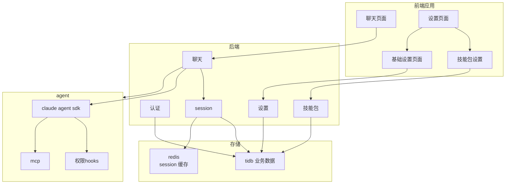

### 1.4 技术栈

| 层级 | 技术 | 版本 | 说明 |
|------|------|------|------|
| **前端** | React | 18+ | 用户界面 |
| | Ant Design | 5+ | UI 组件库 |
| | TypeScript | 5+ | 类型安全 |
| **后端** | Python | 3.10+ | 运行环境 |
| | FastAPI | 0.100+ | API 框架 |
| | Claude Agent SDK | 0.1.80+ | Agent 核心 |
| **数据层** | TiDB | 8.0+ | 用户/Session 元数据 |
| | Redis | 7+ | Session 内容缓存 |
| **部署** | Docker | - | 容器化 |

---

## 2. 技术选型

### 2.1 前端选型

| 技术 | 选择理由 |
|------|----------|
| React | 社区成熟、组件丰富、适合聊天 UI |
| Ant Design | 企业级 UI、完整组件库 |
| WebSocket | 实时通信、流式消息展示 |
| Zustand | 轻量状态管理 |

### 2.2 后端选型

| 技术 | 选择理由 |
|------|----------|
| FastAPI | 高性能、原生 async、自动 API 文档 |
| Claude Agent SDK | 官方 SDK、完整 Agent 能力 |
| TiDB | 关系型数据、用户/Session 存储 |
| Redis | Session 缓存、实时状态 |

### 2.3 Claude Agent SDK 内置能力

**使用 SDK 后无需开发的能力：**

| 能力 | 说明 |
|------|------|
| 查询引擎 | `query()` 单次查询 + `ClaudeSDKClient` 多轮对话 |
| 内置工具 | 30+ 工具（Bash, Read, Write, Edit, WebSearch, WebFetch...） |
| MCP 协议 | 外部 MCP Server 接入 + SDK MCP Server（in-process） |
| Hooks 系统 | PreToolUse, PostToolUse, Stop, Notification 等 |
| 权限模式 | default, acceptEdits, plan, bypassPermissions |
| 会话管理 | SessionStore API、会话恢复 |
| 上下文压缩 | Auto Compact 自动压缩 |
| Prompt Cache | 自动缓存优化 |
| 多模型支持 | 动态切换模型 |

---

## 3. 整体架构设计

### 3.1 系统架构图

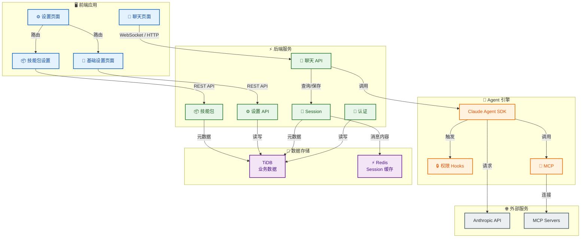

### 3.2 核心数据流

**数据流一：普通聊天流程**

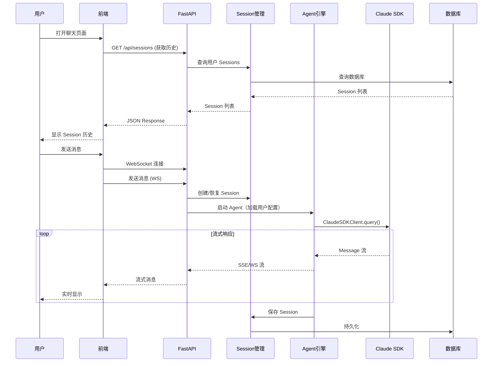

**数据流二：技能包创建流程（对话生成）**

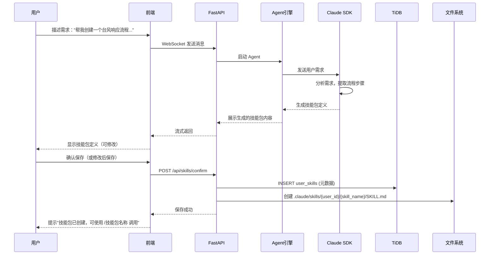

**数据流三：技能包执行流程**

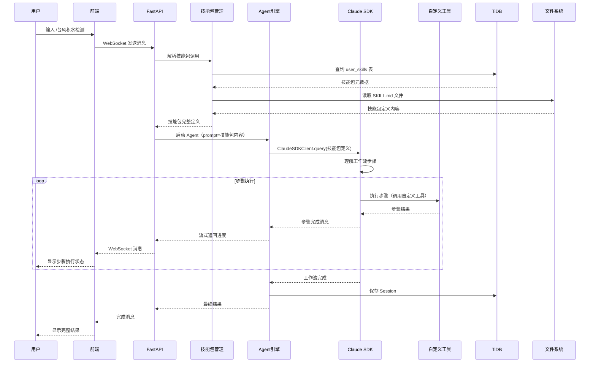

### 3.3 核心组件职责

| 组件 | 职责 | 开发方 |
|------|------|--------|
| 前端应用 | 用户界面、WebSocket 通信 | 自研 |
| API 服务 | RESTful API、WebSocket 服务 | 自研 |
| 用户管理 | 用户 CRUD、认证 | 自研 |
| Session 管理 | Session 元数据、内容存储 | 自研 |
| Agent 管理 | Agent 创建、加载用户配置 | 自研 |
| 技能包管理 | 技能包创建、解析、执行调度 | 自研 |
| Claude Agent SDK | Agent 核心、工具执行 | Anthropic |
| Claude Code CLI | QueryEngine、压缩、缓存 | Anthropic |

---

## 4. 用户系统设计

### 4.1 用户数据模型

| 字段 | 类型 | 说明 |
|------|------|------|
| id | VARCHAR(36) | 用户唯一标识 |
| username | VARCHAR(50) | 用户名 |
| email | VARCHAR(100) | 邮箱 |
| password_hash | VARCHAR(255) | 密码（bcrypt加密） |
| default_model | VARCHAR(50) | 默认模型 |
| user_directory | VARCHAR(255) | 用户工作目录（限制文件操作范围） |
| mcp_servers | JSON | MCP Server 配置 |
| agent_options | JSON | Agent 运行选项 |
| created_at | TIMESTAMP | 创建时间 |
| updated_at | TIMESTAMP | 更新时间 |

### 4.2 用户配置存储架构

```mermaid
graph TB
    subgraph USERS["users 表"]
        U1["用户基本配置<br/>───────────<br/>default_model<br/>user_directory<br/>mcp_servers (JSON)<br/>agent_options (JSON)"]
    end
    
    subgraph TOOLS["user_tool_permissions 表"]
        T1["工具权限配置<br/>───────────<br/>user_id<br/>tool_name<br/>enabled<br/>requires_confirmation<br/>───────────<br/>每用户每工具一条记录"]
    end
    
    subgraph SYSTEM["system_config 表"]
        S1["系统默认配置<br/>───────────<br/>default_model<br/>available_models<br/>default_tools_config<br/>default_user_directory_base"]
    end
    
    USERS -->|"用户设置"| U1
    TOOLS -->|"工具权限"| T1
    SYSTEM -->|"默认值"| S1
    
    S1 -.->|"用户未设置时"| USERS
    S1 -.->|"初始化时"| TOOLS
```

### 4.3 用户注册流程

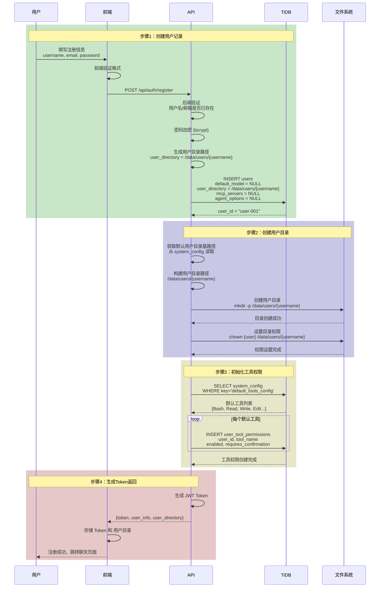

### 4.4 用户登录流程

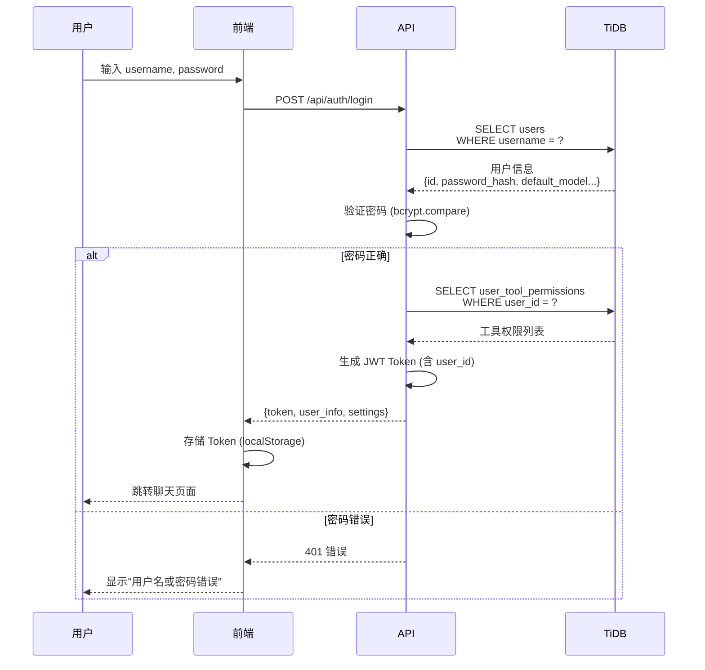

### 4.5 认证 API 设计

| API | 方法 | 说明 |
|------|------|------|
| `/api/auth/login` | POST | 用户登录，返回 JWT Token + 用户配置 + 工具权限 |
| `/api/auth/register` | POST | 用户注册，自动初始化工具权限 |
| `/api/auth/logout` | POST | 用户登出（前端清除 Token） |
| `/api/auth/me` | GET | 获取当前用户信息 + 全部配置 |
| `/api/auth/refresh` | POST | 刷新 Token（延长有效期） |

---

## 5. Session 管理设计

### 5.1 核心概念：两种 Session

**用"书"的比喻来理解：**

```mermaid
graph TB
    subgraph BOOK["一本书的两层信息"]
        COVER["书的封面/目录<br/>TiDB Session<br/>───────────<br/>书名 → 对话标题<br/>作者 → 用户<br/>页数 → token数"]
        CONTENT["书的内容<br/>Redis Session<br/>───────────<br/>第1章 → 第1条消息<br/>第2章 → 第2条消息<br/>..."]
    end
    
    COVER ---|"同一本书ID"|--- CONTENT
    
    subgraph USE1["封面用途"]
        U1["快速找书"]
        U2["统计有多少书"]
        U3["不打开就能看基本信息"]
    end
    
    subgraph USE2["内容用途"]
        U4["阅读内容"]
        U5["继续阅读（恢复对话）"]
        U6["Agent需要内容才能回答"]
    end
    
    COVER --> USE1
    CONTENT --> USE2
```

**两种 Session 的关系：**

| 类型 | 存储位置 | 存储内容 | 用途 |
|------|----------|----------|------|
| TiDB Session | TiDB sessions 表 | id, title, tokens, cost 等元数据 | 列表展示、统计、管理 |
| Redis Session | Redis | messages（消息数组）+ metadata | Agent 对话上下文、会话恢复 |

**关联方式：同一个 session_id**

### 5.2 Session 存储架构

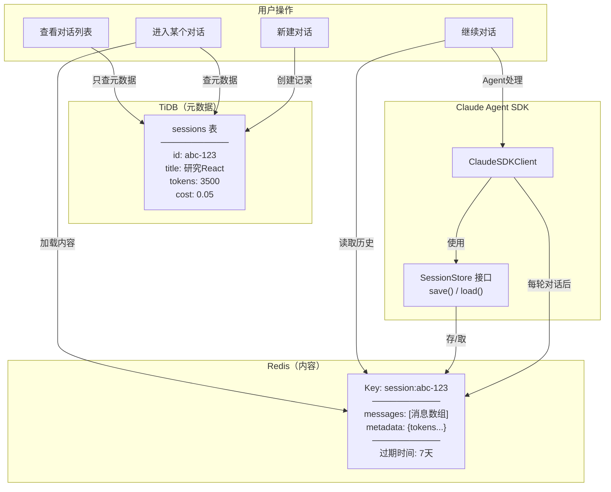

### 5.3 SessionStore 与 SDK 的关系

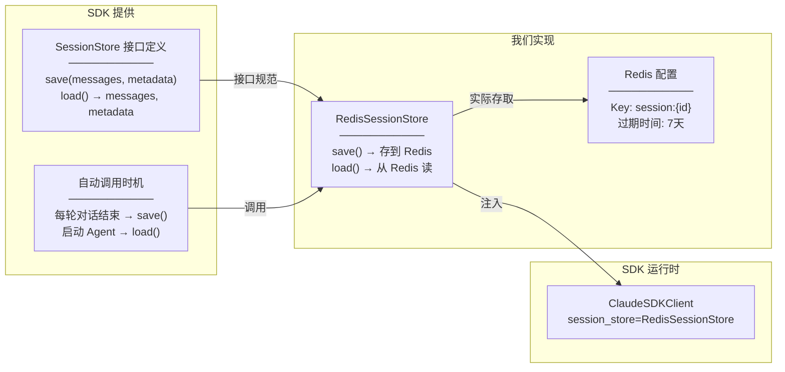

### 5.4 Session 完整生命周期

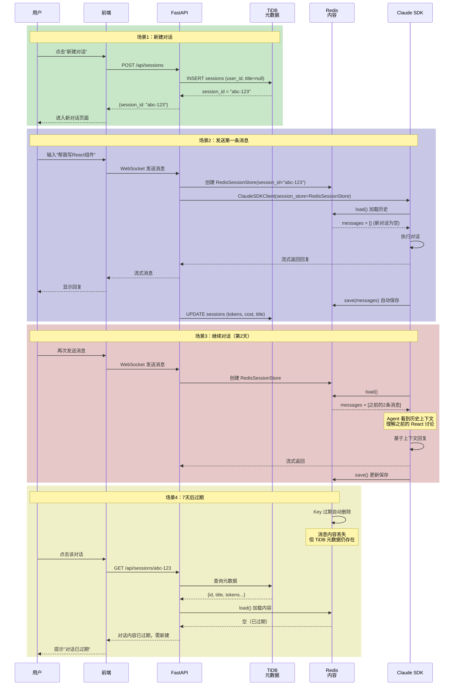

### 5.5 查看历史列表流程

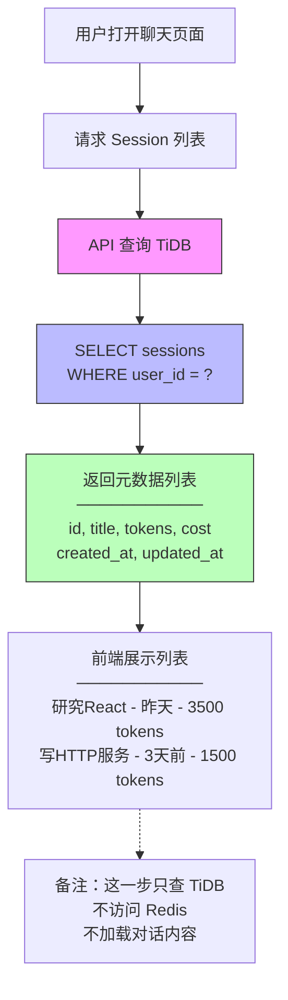

### 5.6 进入对话并继续聊天流程

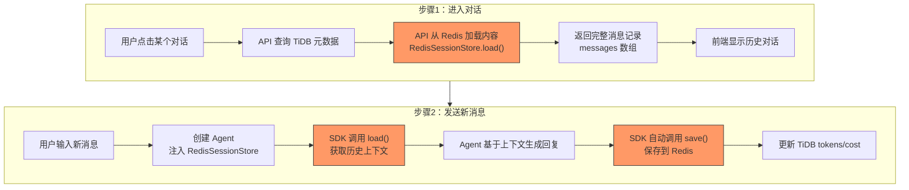

### 5.7 Session 数据模型

**TiDB sessions 表（元数据）：**

| 字段 | 类型 | 说明 |
|------|------|------|
| id | VARCHAR(36) | Session ID，关联 Redis Key |
| user_id | VARCHAR(36) | 所属用户 |
| title | VARCHAR(200) | Session 标题（首条消息自动生成） |
| model | VARCHAR(50) | 使用的模型 |
| status | VARCHAR(20) | 状态：active, deleted |
| total_input_tokens | INT | 输入 token 统计 |
| total_output_tokens | INT | 输出 token 统计 |
| total_cost | DECIMAL | 成本统计 |
| created_at | TIMESTAMP | 创建时间 |
| updated_at | TIMESTAMP | 更新时间 |

**Redis 存储结构：**

```
Key: session:{session_id}
Value: JSON
{
    "session_id": "abc-123",
    "messages": [
        {"role": "user", "content": "帮我写React组件"},
        {"role": "assistant", "content": "好的..."}
    ],
    "metadata": {
        "input_tokens": 500,
        "output_tokens": 300
    }
}
过期时间: 7 天（可配置）
```

### 5.8 Session 过期策略

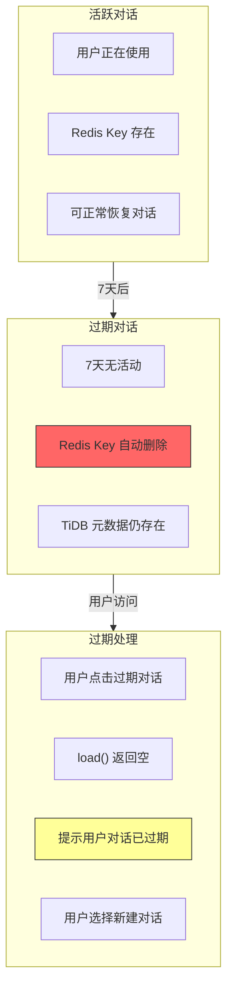

**过期策略说明：**

| 状态 | Redis | TiDB | 用户看到 |
|------|-------|------|----------|
| 活跃（7天内） | 存在 | 存在 | 正常对话 |
| 过期（7天后） | 已删除 | 存在 | 提示过期，需新建 |
| 用户删除 | 删除 | 删除 | 从列表移除 |

### 5.9 Session API 设计

| API | 方法 | 说明 |
|------|------|------|
| `/api/sessions` | GET | 获取用户 Session 列表（只返回 TiDB 元数据） |
| `/api/sessions` | POST | 创建新 Session（写入 TiDB，Redis 自动创建） |
| `/api/sessions/{id}` | GET | 获取 Session 详情（TiDB 元数据 + Redis 内容） |
| `/api/sessions/{id}` | DELETE | 删除 Session（同时删除 TiDB 和 Redis） |
| `/api/sessions/{id}/title` | PATCH | 更新标题（只更新 TiDB） |

### 5.10 存储方案对比

| 对比项 | 本方案<br/>TiDB + Redis | 全 TiDB 方案 | 全 Redis 方案 |
|--------|-------------------------|---------------|---------------|
| 元数据存储 | TiDB（持久） | TiDB | Redis |
| 内容存储 | Redis（快） | TiDB | Redis |
| 列表查询速度 | 快（只查 TiDB） | 中 | 快 |
| 对话恢复速度 | 快（Redis） | 中 | 快 |
| 长期保存 | 元数据可保存 | 可保存 | 不可靠 |
| 成本 | 中 | 低 | 高（内存） |
| 复杂度 | 中 | 低 | 低 |

**本方案优势：元数据持久化 + 对话内容快速读写，过期后内容自动清理，节省内存。**

---

## 6. 前端页面设计

### 6.1 页面结构

```
前端页面：
├── 登录/注册页面
│
├── 聊天页面（主页面）
│   ├── Header：用户信息、设置入口
│   ├── Sidebar：Session 历史列表
│   ├── ChatArea：消息区域
│   │   ├── 消息列表（用户/助手消息）
│   │   ├── 工具调用展示
│   │   ├── 技能包执行进度展示
│   │   └── 流式输出动画
│   └── InputArea：输入框、发送按钮、技能包快捷入口
│
└── 设置页面
    ├── 基础设置页面
    │   ├── 模型设置
    │   ├── 工具权限设置
    │   ├── MCP Server 配置
    │   └── Agent 选项设置
    └── 技能包设置
        ├── 技能包列表
        ├── 创建/编辑技能包
        └── 技能包详情（SKILL.md 编辑器）
```

### 6.2 聊天页面布局

```
+--------------------------------------------------+
|  Header: Logo | 用户名 | [设置]                   |
+--------------------------------------------------+
|          |                                       |
| Sidebar  |         Chat Area                     |
|          |                                       |
| Session  |  +-------------------------------+   |
| 历史列表 |  | 用户消息                      |   |
|          |  +-------------------------------+   |
| [新建]   |                                       |
|          |  +-------------------------------+   |
| Session1 |  | Agent 回复（流式）            |   |
| Session2 |  | - 文本内容                    |   |
| Session3 |  | - 工具调用 [展开]             |   |
| ...      |  +-------------------------------+   |
|          |                                       |
|          |  +-------------------------------+   |
|          |  | 输入框 | 发送                  |   |
|          |  +-------------------------------+   |
+--------------------------------------------------+
```

### 6.3 消息类型渲染

| 消息类型 | 渲染方式 |
|----------|----------|
| 用户消息 | 简单文本，右侧显示 |
| 助手文本 | Markdown 渲染，左侧显示，流式动画 |
| Tool Use | 可折叠卡片，显示工具名、参数 |
| Tool Result | 可折叠卡片，显示执行结果 |
| Thinking | 隐藏或可展开的思考过程 |
| Error | 红色高亮错误信息 |

### 6.4 基础设置页面

**模型设置：**

```
+--------------------------------------------------+
|  模型设置                                         |
+--------------------------------------------------+
|                                                  |
|  默认模型：                                       |
|  ┌────────────────────────────────────────────┐  |
|  │ ▸ claude-sonnet-4-5                        │  |
|  │   claude-opus-4-6                          │  |
|  │   claude-haiku-4-5                         │  |
|  └────────────────────────────────────────────┐  |
|                                                  |
|  [保存设置]                                       |
+--------------------------------------------------+
```

**工具权限设置：**

```
+--------------------------------------------------+
|  工具权限设置                                     |
+--------------------------------------------------+
|                                                  |
|  工具列表（从 user_tool_permissions 表加载）：    |
|  +--------------------------------------------+  |
|  | 工具名称 | 启用 | 需确认 |                  |  |
|  +--------------------------------------------+  |
|  | Bash    | [✓] | [✓]    | [编辑详细设置] |  |
|  | Read    | [✓] | [ ]    | [编辑详细设置] |  |
|  | Write   | [✓] | [✓]    | [编辑详细设置] |  |
|  | Edit    | [✓] | [✓]    | [编辑详细设置] |  |
|  | WebSearch| [✓] | [ ]    | [编辑详细设置] |  |
|  | WebFetch | [✓] | [ ]    | [编辑详细设置] |  |
|  +--------------------------------------------+  |
|                                                  |
|  [保存设置]                                       |
+--------------------------------------------------+
```

**保存逻辑：**

- 模型设置 → 更新 users.default_model 字段
- 工具权限 → 批量更新 user_tool_permissions 表
- MCP Server → 更新 users.mcp_servers JSON 字段

---

## 7. 后端 API 设计

### 7.1 API 模块划分

| 模块 | 路径前缀 | 功能 |
|------|----------|------|
| 认证 | `/api/auth` | 登录、注册、Token 验证 |
| Session | `/api/sessions` | Session 管理、历史查询 |
| 聊天 | `/api/chat` | WebSocket、消息发送 |
| 设置 | `/api/settings` | 用户个人设置 |
| 技能包 | `/api/skills` | 技能包管理、创建、编辑 |

### 7.2 API 详细列表

**认证 API：**

| API | 方法 | 说明 |
|------|------|------|
| `/api/auth/login` | POST | 登录 |
| `/api/auth/register` | POST | 注册 |
| `/api/auth/logout` | POST | 登出 |
| `/api/auth/me` | GET | 获取当前用户 + 配置 |
| `/api/auth/refresh` | POST | 刷新 Token |

**Session API：**

| API | 方法 | 说明 |
|------|------|------|
| `/api/sessions` | GET | Session 列表（当前用户） |
| `/api/sessions` | POST | 创建 Session |
| `/api/sessions/{id}` | GET | Session 详情（含消息） |
| `/api/sessions/{id}` | DELETE | 删除 Session |
| `/api/sessions/{id}/title` | PATCH | 更新标题 |
| `/api/sessions/{id}/archive` | PATCH | 归档 |

**聊天 API：**

| API | 方法 | 说明 |
|------|------|------|
| `/api/ws/{session_id}` | WebSocket | WebSocket 连接 |
| `/api/chat/{session_id}/message` | POST | 发送消息（HTTP 备用） |
| `/api/chat/{session_id}/stream` | GET | SSE 流（备用） |

**用户设置 API：**

| API | 方法 | 说明 |
|------|------|------|
| `/api/settings` | GET | 获取用户全部设置（含工具权限） |
| `/api/settings/model` | GET/PUT | 默认模型设置 |
| `/api/settings/mcp-servers` | GET/PUT | MCP Server 配置 |
| `/api/settings/agent-options` | GET/PUT | Agent 选项设置 |
| `/api/settings/tools` | GET | 获取用户所有工具权限 |
| `/api/settings/tools` | PUT | 批量更新工具权限 |
| `/api/settings/tools/{name}` | GET/PUT | 单个工具权限设置 |

**技能包 API：**

| API | 方法 | 说明 |
|------|------|------|
| `/api/skills` | GET | 获取用户所有技能包 |
| `/api/skills` | POST | 创建新技能包（对话生成后确认保存） |
| `/api/skills/{name}` | GET | 获取技能包详情（步骤列表） |
| `/api/skills/{name}` | PUT | 更新技能包（对话修改后确认保存） |
| `/api/skills/{name}` | DELETE | 删除技能包 |
| `/api/skills/{name}/execute` | POST | 执行技能包（在指定 Session 中） |

**技能包创建/修改流程：**
- 用户在聊天中描述需求 → Agent 生成技能包定义 → 用户确认 → 调用 API 保存
- 无需手动编写 SKILL.md，系统自动生成

---

## 8. 用户配置设计

### 8.1 配置加载流程

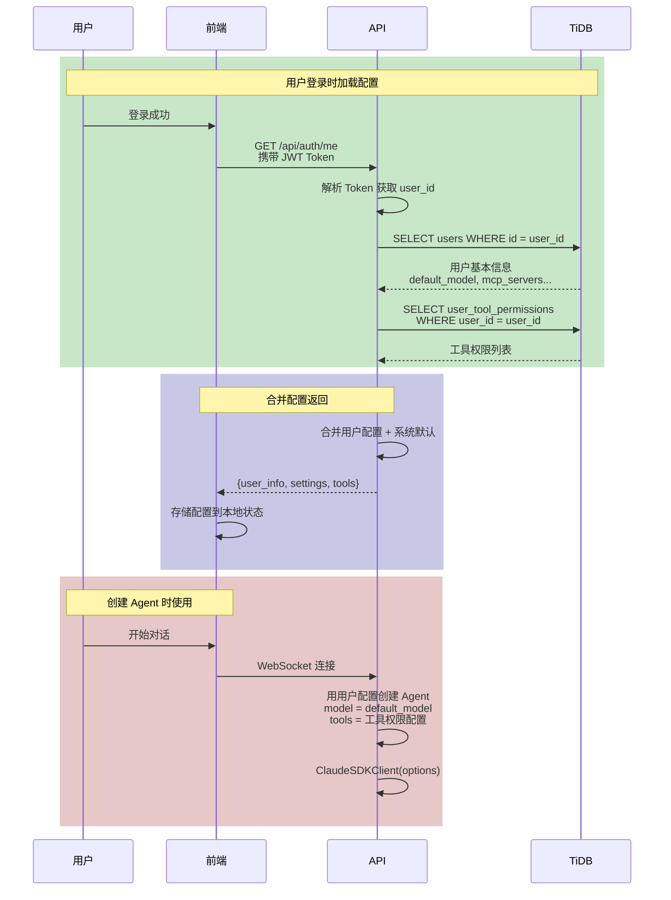

### 8.2 配置存储架构

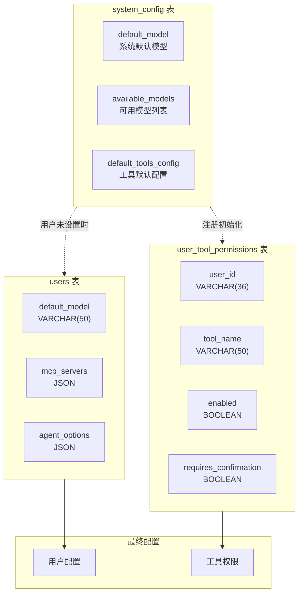

### 8.3 配置优先级规则

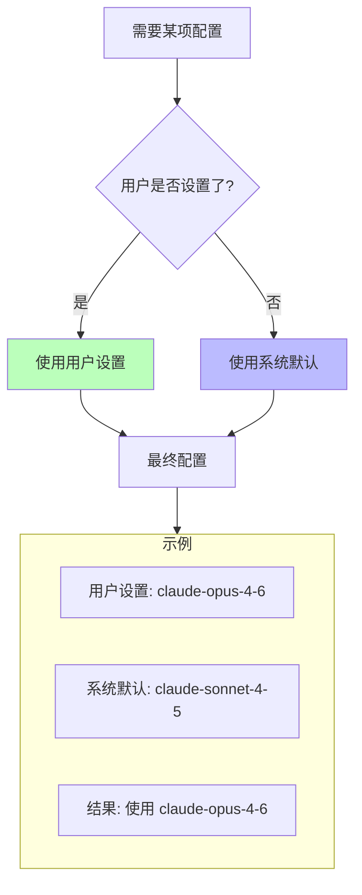

**具体规则：**

| 配置项 | 用户设置位置 | 系统默认位置 | 优先级 |
|------|-------------|--------------|--------|
| 默认模型 | users.default_model | system_config.default_model | 用户设置 > 系统默认 |
| MCP Server | users.mcp_servers | 无 | 用户设置 |
| Agent 选项 | users.agent_options | 无 | 用户设置 |
| 工具权限 | user_tool_permissions 表 | system_config.default_tools_config | 用户设置 > 系统默认 |

### 8.4 用户设置修改流程

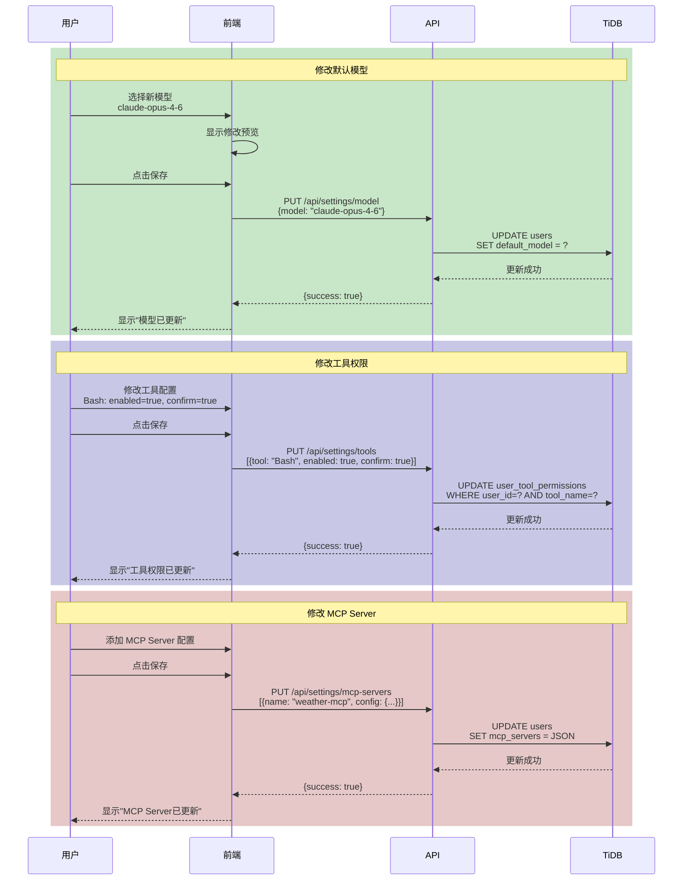

### 8.5 设置修改生效时机

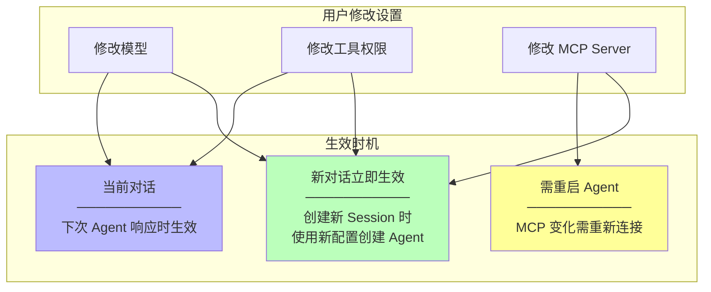

**生效规则说明：**

| 设置类型 | 当前对话 | 新对话 | 特殊说明 |
|----------|----------|--------|----------|
| 默认模型 | 下次响应生效 | 立即生效 | 当前 Agent 会继续用旧模型直到对话结束 |
| 工具权限 | 下次响应生效 | 立即生效 | PreToolUse Hook 实时读取最新配置 |
| MCP Server | 需重启 Agent | 立即生效 | MCP 连接变化需重新初始化 |
| Agent 选项 | 需重启 Agent | 立即生效 | 部分选项需要重启 Agent |

### 8.6 新用户初始化

```mermaid
sequenceDiagram
    participant User as 用户
    participant API as API
    participant DB as TiDB
    
    rect rgb(200, 230, 200)
        Note over User, DB: 步骤1：创建用户记录
        User->>API: POST /api/auth/register
        API->>DB: INSERT users<br/>default_model = NULL<br/>mcp_servers = NULL<br/>agent_options = NULL
        DB-->>API: user_id = "user-001"
    end
    
    rect rgb(200, 200, 230)
        Note over API, DB: 步骤2：初始化工具权限
        API->>DB: SELECT system_config<br/>WHERE key='default_tools_config'
        DB-->>API: 默认工具配置
        
        loop 每个默认工具
            API->>DB: INSERT user_tool_permissions<br/>user_id, tool_name<br/>enabled, requires_confirmation
        end
    end
    
    rect rgb(230, 200, 200)
        Note over API, User: 步骤3：返回注册成功
        API-->>User: 注册成功<br/>用户首次对话时<br/>使用系统默认模型
    end
```

### 8.7 系统默认配置

```mermaid
graph TB
    subgraph SYSTEM["system_config 表"]
        S1["default_model<br/>───────────<br/>claude-sonnet-4-5"]
        S2["available_models<br/>───────────<br/>claude-sonnet-4-5<br/>claude-opus-4-6<br/>claude-haiku-4-5"]
        S3["default_tools_config<br/>───────────<br/>Bash: enabled, confirm<br/>Read: enabled, no-confirm<br/>Write: enabled, confirm<br/>Edit: enabled, confirm"]
    end
    
    subgraph USE["使用场景"]
        U1["用户未设置模型时<br/>使用 default_model"]
        U2["前端展示模型列表<br/>使用 available_models"]
        U3["新用户注册时<br/>初始化 default_tools_config"]
    end
    
    S1 --> U1
    S2 --> U2
    S3 --> U3
```

---

## 9. 工具权限设计

### 9.1 工具权限整体架构

```mermaid
graph TB
    subgraph LAYER1["第一层：数据存储"]
        DB1["TiDB<br/>user_tool_permissions 表<br/>───────────<br/>user_id<br/>tool_name<br/>enabled<br/>requires_confirmation"]
        DB2["TiDB<br/>users.user_directory<br/>───────────<br/>用户工作目录<br/>文件操作范围限制"]
    end
    
    subgraph LAYER2["第二层：权限控制"]
        HOOK["PreToolUse Hook<br/>───────────<br/>读取用户配置<br/>检查工具权限<br/>检查目录范围<br/>返回 decision"]
    end
    
    subgraph LAYER3["第三层：SDK执行"]
        SDK["Claude Agent SDK<br/>───────────<br/>permission_mode: bypassPermissions<br/>通过 Hook 控制权限"]
    end
    
    subgraph LAYER4["第四层：用户交互"]
        FRONTEND["前端确认框<br/>───────────<br/>requires_confirmation=true<br/>弹出确认框"]
    end
    
    DB1 --> HOOK
    DB2 --> HOOK
    HOOK --> SDK
    SDK -->|"需要确认时"| FRONTEND
    FRONTEND -->|"用户选择"| SDK
```

**架构说明：**

| 层级 | 组件 | 职责 |
|------|------|------|
| 数据层 | TiDB user_tool_permissions 表 | 存储用户对每个工具的权限配置（启用/禁用、是否需确认） |
| 数据层 | TiDB users.user_directory | 存储用户工作目录，限制文件操作范围 |
| 控制层 | PreToolUse Hook | 读取配置、检查工具权限、检查目录范围、返回决定 |
| 执行层 | Claude Agent SDK | 调用 Hook，根据结果执行或拒绝 |
| 交互层 | 前端确认框 | 用户手动确认高风险操作 |

### 9.2 SDK 权限机制与自定义系统

```mermaid
flowchart LR
    subgraph SDK_MODE["SDK 内置权限模式"]
        M1["permission_mode: default<br/>───────────<br/>SDK 内置交互确认<br/>每次询问用户"]
        M2["permission_mode: bypassPermissions<br/>───────────<br/>绕过所有检查<br/>全部自动执行"]
    end
    
    subgraph OUR_SYSTEM["我们的自定义系统"]
        S1["使用 bypassPermissions 模式<br/>───────────<br/>绕过 SDK 内置权限"]
        S2["通过 PreToolUse Hook<br/>───────────<br/>实现自定义权限控制"]
        S3["读取 user_tool_permissions 表<br/>───────────<br/>判断用户配置"]
    end
    
    M2 --> S1
    S1 --> S2
    S2 --> S3
    
    style M2 fill:#bfb
    style S2 fill:#bbf
```

**为什么选择 bypassPermissions + Hook？**

| 方案 | 优点 | 缺点 |
|------|------|------|
| SDK default 模式 | 简单，无需开发 | 无法存储用户偏好，每次都需确认 |
| bypassPermissions + Hook | 可存储用户配置、支持细粒度控制 | 需要开发 Hook 逻辑 |

**我们的选择：bypassPermissions + PreToolUse Hook**

- Hook 在工具执行前被调用
- Hook 从数据库读取用户配置
- Hook 返回 allow/deny 决定是否执行

### 9.3 PreToolUse Hook 工作流程

```mermaid
sequenceDiagram
    participant Agent as Agent引擎
    participant SDK as Claude SDK
    participant Hook as PreToolUse Hook
    participant DB as TiDB
    participant Frontend as 前端
    participant User as 用户
    
    rect rgb(200, 230, 200)
        Note over Agent, Hook: 步骤1：Agent决定执行工具
        Agent->>SDK: 决定执行 Bash 工具
        Note over SDK: 工具执行前，触发 PreToolUse Hook
    end
    
    rect rgb(200, 200, 230)
        Note over SDK, DB: 步骤2：Hook检查用户配置
        SDK->>Hook: 调用 Hook(tool_name="Bash", tool_input="ls -la")
        Hook->>Hook: 获取当前用户 user_id
        Hook->>DB: SELECT FROM user_tool_permissions<br/>WHERE user_id=? AND tool_name="Bash"
        DB-->>Hook: {enabled: true, requires_confirmation: true}
    end
    
    rect rgb(230, 200, 200)
        Note over Hook, SDK: 步骤3：Hook返回决定
        Hook->>Hook: enabled = true? → 是，允许执行
        Hook-->>SDK: {decision: "allow", requires_confirmation: true}
    end
    
    rect rgb(240, 240, 200)
        Note over SDK, User: 步骤4：根据确认配置处理
        alt requires_confirmation = true
            SDK->>Frontend: 发送确认请求<br/>{tool: "Bash", input: "ls -la"}
            Frontend->>User: 弹出确认框
            User->>Frontend: 点击"允许"
            Frontend-->>SDK: 用户允许
            SDK->>Agent: 执行工具
        else requires_confirmation = false
            SDK->>Agent: 直接执行工具
        end
    end
    
    rect rgb(200, 230, 230)
        Note over Agent, User: 步骤5：返回结果
        Agent-->>SDK: 工具执行结果
        SDK-->>Frontend: 流式返回结果
        Frontend-->>User: 显示执行结果
    end
```

### 9.4 权限检查流程图

```mermaid
flowchart TD
    START["Agent 决定执行工具"] --> LOAD["Hook 加载用户配置<br/>从 TiDB 读取"]
    
    LOAD --> CHECK_ENABLE{"enabled = true?"}
    
    CHECK_ENABLE -->|"否"| DENY_DISABLED["拒绝执行<br/>───────────<br/>decision = deny<br/>告知用户：此工具已禁用<br/>可在设置中启用"]
    
    CHECK_ENABLE -->|"是"| CHECK_FILE_TOOL{"是否为文件操作工具?<br/>Read/Write/Edit"}
    
    CHECK_FILE_TOOL -->|"是"| CHECK_DIRECTORY{"目标路径在用户目录内?"}
    
    CHECK_FILE_TOOL -->|"否"| CHECK_CONFIRM
    
    CHECK_DIRECTORY -->|"否"| DENY_DIRECTORY["拒绝执行<br/>───────────<br/>decision = deny<br/>告知用户：路径超出范围<br/>只能在 user_directory 内操作"]
    
    CHECK_DIRECTORY -->|"是"| CHECK_CONFIRM{"requires_confirmation = true?"}
    
    CHECK_CONFIRM -->|"否"| ALLOW_AUTO["自动允许执行<br/>───────────<br/>decision = allow<br/>无需用户确认"]
    
    CHECK_CONFIRM -->|"是"| ALLOW_CONFIRM["允许执行但需确认<br/>───────────<br/>decision = allow<br/>弹出确认框"]
    
    ALLOW_CONFIRM --> SHOW_DIALOG["前端弹出确认框<br/>显示工具名称和参数"]
    
    SHOW_DIALOG --> USER_CHOICE{"用户选择"}
    
    USER_CHOICE -->|"允许"| EXECUTE["执行工具"]
    
    USER_CHOICE -->|"拒绝"| DENY_USER["拒绝执行<br/>───────────<br/>用户取消操作"]
    
    USER_CHOICE -->|"记住选择"| SAVE_CHOICE["保存用户选择<br/>───────────<br/>更新 requires_confirmation=false"]
    
    SAVE_CHOICE --> EXECUTE
    
    ALLOW_AUTO --> EXECUTE
    
    EXECUTE --> RESULT["返回执行结果"]
    
    DENY_DISABLED --> END["结束"]
    DENY_USER --> END
    DENY_DIRECTORY --> END
    
    style DENY_DISABLED fill:#f66
    style DENY_USER fill:#f66
    style DENY_DIRECTORY fill:#f66
    style ALLOW_AUTO fill:#bfb
    style EXECUTE fill:#bbf
```

### 9.5 用户目录范围检查

```mermaid
flowchart TB
    subgraph CHECK_FLOW["目录范围检查流程"]
        C1["获取工具参数中的文件路径"]
        C2["读取用户 user_directory<br/>例如: /data/users/zhangsan"]
        C3["路径规范化<br/>解析相对路径、符号链接"]
        C4["检查路径是否以 user_directory 开头"]
        C5{"路径是否在范围内?"}
        C6["允许操作"]
        C7["拒绝操作<br/>告知用户路径超出范围"]
    end
    
    C1 --> C2 --> C3 --> C4 --> C5
    C5 -->|"是"| C6
    C5 -->|"否"| C7
    
    style C7 fill:#f66
    style C6 fill:#bfb
```

**受目录限制的工具：**

| 工具 | 检查内容 | 示例 |
|------|----------|------|
| Read | 检查读取的文件路径 | `/data/users/zhangsan/project/file.txt` ✓ |
| Write | 检查写入的文件路径 | `/etc/config.json` ✗ (超出范围) |
| Edit | 检查编辑的文件路径 | `/home/user/data` ✗ (超出范围) |
| Bash | 检查命令中的文件路径 | `rm /data/users/zhangsan/tmp/*` ✓ |

**不受目录限制的工具：**

| 工具 | 原因 |
|------|------|
| WebSearch | 不涉及文件操作 |
| WebFetch | 不涉及文件操作 |
| Agent | 不直接涉及文件操作 |

**目录范围检查示例：**

```mermaid
graph TB
    subgraph USER_DIR["用户目录: /data/users/zhangsan"]
        D1["✅ /data/users/zhangsan"]
        D2["✅ /data/users/zhangsan/project"]
        D3["✅ /data/users/zhangsan/project/src/file.py"]
        D4["✅ /data/users/zhangsan/../zhangsan<br/>规范化后仍在范围内"]
    end
    
    subgraph OUT_OF_DIR["超出范围"]
        O1["❌ /data/users/lisi<br/>其他用户目录"]
        O2["❌ /etc/config.json<br/>系统目录"]
        O3["❌ /root<br/>root用户目录"]
        O4["❌ /data/users/zhangsan/../lisi<br/>规范化后指向其他用户"]
    end
    
    style D1 fill:#bfb
    style D2 fill:#bfb
    style D3 fill:#bfb
    style D4 fill:#bfb
    style O1 fill:#f66
    style O2 fill:#f66
    style O3 fill:#f66
    style O4 fill:#f66
```

### 9.6 不同场景下的权限处理

```mermaid
flowchart TB
    subgraph SCENE1["场景1：Read工具，enabled=true, confirm=false"]
        S1A["Agent 决定执行 Read"] --> S1B["Hook 查询配置"]
        S1B --> S1C["enabled=true"]
        S1C --> S1D["confirm=false"]
        S1D --> S1E["直接执行，无需确认"]
        S1E --> S1F["✅ 成功执行"]
    end
    
    subgraph SCENE2["场景2：Bash工具，enabled=false"]
        S2A["Agent 决定执行 Bash"] --> S2B["Hook 查询配置"]
        S2B --> S2C["enabled=false"]
        S2C --> S2D["decision=deny"]
        S2D --> S2E["❌ 拒绝执行<br/>告知用户已禁用"]
    end
    
    subgraph SCENE3["场景3：Write工具，enabled=true, confirm=true"]
        S3A["Agent 决定执行 Write"] --> S3B["Hook 查询配置"]
        S3B --> S3C["enabled=true"]
        S3C --> S3D["confirm=true"]
        S3D --> S3E["弹出确认框"]
        S3E --> S3F{"用户选择"}
        S3F -->|"允许"| S3G["✅ 执行成功"]
        S3F -->|"拒绝"| S3H["❌ 用户取消"]
    end
    
    style S1F fill:#bfb
    style S2E fill:#f66
    style S3G fill:#bfb
    style S3H fill:#f66
```

### 9.7 工具分类与默认权限建议

```mermaid
graph TB
    subgraph SAFE["低风险工具（建议：enabled=true, confirm=false）"]
        T1["Read<br/>───────────<br/>只读文件<br/>无破坏性"]
        T2["WebSearch<br/>───────────<br/>搜索网页<br/>无破坏性"]
        T3["WebFetch<br/>───────────<br/>获取网页<br/>无破坏性"]
    end
    
    subgraph RISK["高风险工具（建议：enabled=true, confirm=true）"]
        T4["Bash<br/>───────────<br/>执行命令<br/>可能删除/修改"]
        T5["Write<br/>───────────<br/>写入文件<br/>可能覆盖"]
        T6["Edit<br/>───────────<br/>编辑文件<br/>可能修改内容"]
    end
    
    subgraph OPTIONAL["可选工具（用户自行决定）"]
        T7["Agent<br/>───────────<br/>启动子Agent<br/>消耗资源"]
        T8["NotebookEdit<br/>───────────<br/>编辑Notebook<br/>可能修改数据"]
    end
    
    SAFE -->|"自动执行"| AUTO
    RISK -->|"需要确认"| CONFIRM
    OPTIONAL -->|"用户配置"| USER_CHOICE
```

**系统默认工具配置：**

| 工具名称 | enabled | requires_confirmation | 说明 |
|----------|---------|----------------------|------|
| Read | true | false | 只读操作，默认无需确认 |
| Bash | true | true | 命令执行有风险，需确认 |
| Write | true | true | 写入文件可能覆盖，需确认 |
| Edit | true | true | 编辑文件可能修改，需确认 |
| WebSearch | true | false | 网络搜索无风险，无需确认 |
| WebFetch | true | false | 获取网页无风险，无需确认 |

### 9.8 前端确认框设计

```mermaid
graph TB
    subgraph DIALOG["确认框流程"]
        D1["接收 SDK 确认请求<br/>───────────<br/>{tool_name, tool_input}"]
        D2["生成确认框内容<br/>───────────<br/>根据工具类型显示不同信息"]
        D3["弹出确认框<br/>───────────<br/>显示工具名称和参数"]
        D4["等待用户选择"]
        D5["返回用户决定<br/>───────────<br/>allow / deny"]
    end
    
    D1 --> D2 --> D3 --> D4 --> D5
```

**各工具确认框显示内容：**

| 工具 | 显示标题 | 显示内容 | 示例 |
|------|----------|----------|------|
| Bash | 执行命令确认 | 完整命令内容 | `ls -la /home/user` |
| Read | 读取文件确认 | 文件路径 | `/data/config.json` |
| Write | 写入文件确认 | 文件路径 + 内容摘要 | `/data/output.txt` (500字符) |
| Edit | 编辑文件确认 | 文件路径 + 修改摘要 | 将 `old` 改为 `new` |
| WebFetch | 获取网页确认 | URL 地址 | `https://example.com/api` |

**确认框 UI 结构：**

```mermaid
graph TB
    subgraph UI["确认框UI"]
        HEADER["标题：工具执行确认"]
        TOOL_INFO["工具信息：<br/>───────────<br/>工具名称：Bash<br/>执行内容：ls -la /tmp"]
        CHECKBOX["选项：<br/>───────────<br/>[✓] 记住此选择，本次对话不再询问"]
        BUTTONS["按钮：<br/>───────────<br/>[允许执行] [拒绝]"]
    end
    
    HEADER --> TOOL_INFO --> CHECKBOX --> BUTTONS
```

### 9.9 权限配置修改流程

```mermaid
sequenceDiagram
    participant User as 用户
    participant Frontend as 前端
    participant API as API
    participant DB as TiDB
    
    rect rgb(200, 230, 200)
        Note over User, Frontend: 步骤1：用户打开设置页面
        User->>Frontend: 点击"工具权限设置"
        Frontend->>API: GET /api/settings/tools
        API->>DB: SELECT FROM user_tool_permissions<br/>WHERE user_id=?
        DB-->>API: 工具权限列表
        API-->>Frontend: 返回工具配置列表
        Frontend-->>User: 显示当前配置<br/>每个工具的启用/确认状态
    end
    
    rect rgb(200, 200, 230)
        Note over User, DB: 步骤2：用户修改配置
        User->>Frontend: 修改 Bash 配置<br/>enabled: true, confirm: true
        User->>Frontend: 点击"保存"
        Frontend->>Frontend: 收集所有修改
        Frontend->>API: PUT /api/settings/tools<br/>[{tool: "Bash", enabled: true, confirm: true}]
        API->>DB: UPDATE user_tool_permissions<br/>WHERE user_id=? AND tool_name=?
        DB-->>API: 更新成功
        API-->>Frontend: {success: true}
        Frontend-->>User: 显示"设置已保存"
    end
    
    rect rgb(230, 200, 200)
        Note over User, Frontend: 步骤3：新配置生效
        Note over Frontend: 下次 Agent 执行工具时<br/>Hook 会读取最新配置
        Note over Frontend: 新对话立即生效<br/>当前对话下次响应生效
    end
```

### 9.10 权限配置生效时机

```mermaid
flowchart TD
    subgraph MODIFY["修改权限配置"]
        M1["用户修改工具权限"]
        M2["保存到 TiDB"]
    end
    
    subgraph EFFECT["生效时机"]
        E1["新对话<br/>───────────<br/>创建新 Session 时<br/>Agent 使用最新配置"]
        E2["当前对话<br/>───────────<br/>下次工具执行时<br/>Hook 实时读取最新配置"]
    end
    
    MODIFY --> M2
    M2 --> E1
    M2 --> E2
    
    style E1 fill:#bfb
    style E2 fill:#bbf
```

**生效规则：**

| 配置修改 | 生效时机 | 说明 |
|----------|----------|------|
| enabled 变化 | 下次工具执行 | Hook 每次执行都重新读取配置 |
| requires_confirmation 变化 | 下次工具执行 | 实时生效 |
| 新对话创建 | 立即生效 | Agent 初始化时使用最新配置 |

---

## 10. 技能包设计

### 10.1 技能包概念

```
┌─────────────────────────────────────────────────────────────────────────┐
│                        技能包（Skills）概念                                │
├─────────────────────────────────────────────────────────────────────────┤
│                                                                         │
│  什么是技能包？                                                           │
│  ─────────────────────────────────────────────────────────────────────  │
│  - 预定义的工作流模板                                                     │
│  - 包含多个步骤的业务流程                                                 │
│  - 用户通过 /skill_name 在聊天中调用                                      │
│  - Agent 按技能包定义的流程执行                                           │
│                                                                         │
│  使用场景：                                                               │
│  ─────────────────────────────────────────────────────────────────────  │
│  - 台风天气响应流程：查台风→匹配设备→检测算法→下发任务                      │
│  - 数据分析流程：获取数据→清洗→分析→生成报告                               │
│  - 报警处理流程：接收报警→查询设备→判断级别→派发工单                        │
│                                                                         │
│  技能包 vs 普通对话：                                                     │
│  ─────────────────────────────────────────────────────────────────────  │
│  - 普通对话：用户提问 → Agent 单次回答                                    │
│  - 技能包：用户调用 → Agent 执行完整工作流（多步骤、有依赖）               │
│                                                                         │
└─────────────────────────────────────────────────────────────────────────┘
```

### 10.2 技能包创建方式：对话生成

```
┌─────────────────────────────────────────────────────────────────────────┐
│                    对话生成技能包（推荐方式）                               │
├─────────────────────────────────────────────────────────────────────────┤
│                                                                         │
│  创建流程：                                                               │
│  ─────────────────────────────────────────────────────────────────────  │
│                                                                         │
│  1. 用户在聊天页面描述需求                                                 │
│     "帮我创建一个台风天气响应流程：查台风路径→匹配设备→下发积水任务"         │
│                                                                         │
│  2. Agent 理解需求，生成技能包定义                                        │
│     Agent 分析用户描述，提取：                                            │
│     - 技能包名称                                                         │
│     - 工作流步骤                                                         │
│     - 需要调用的工具                                                     │
│                                                                         │
│  3. Agent 展示生成的技能包内容                                            │
│     用户确认或修改                                                        │
│                                                                         │
│  4. 用户确认后，系统保存技能包                                            │
│     自动创建 SKILL.md 文件                                               │
│     写入数据库元数据                                                     │
│                                                                         │
│  优势：                                                                   │
│  ─────────────────────────────────────────────────────────────────────  │
│  - 用户无需学习 SKILL.md 格式                                            │
│  - 自然语言描述，门槛低                                                   │
│  - Agent 智能理解，生成规范定义                                          │
│                                                                         │
└─────────────────────────────────────────────────────────────────────────┘
```

**对话生成示例：**

```
用户：帮我创建一个台风天气响应的技能包，流程是：
1. 查询今天的台风路径
2. 找出台风经过区域内的摄像头
3. 检查积水检测算法是否可用
4. 如果可用，给这些摄像头下发积水检测任务

Agent：好的，我为你生成以下技能包：

【技能包名称】typhoon-weather-workflow
【描述】台风天气响应工作流 - 检测台风影响区域并下发积水检测任务

【工作流步骤】
步骤1: 获取台风路径坐标
  - 工具: typhoon_china_today_path()
  - 输入: yyyymm 格式的日期
  
步骤2: 匹配受影响的设备
  - 工具: device_serial_match()
  - 输入: 步骤1返回的台风坐标
  
步骤3: 掷取可用算法列表
  - 工具: applet_list()
  
步骤4: 检查积水算法并下发任务
  - 判断: 积水算法是否在步骤3的列表中
  - 工具: dispatch_applet_task()

请确认是否保存这个技能包？如有修改请告诉我。

用户：确认保存，名称改为"台风积水检测"

Agent：已保存技能包 "台风积水检测"。你可以在聊天中输入 /台风积水检测 来使用它。
```

### 10.3 技能包文件格式（SKILL.md）

基于 Claude Agent SDK 的 Skills 标准，技能包使用 Markdown 文件定义（用户无需手动编写，由系统根据对话自动生成）：

**文件结构：**

```markdown
---
name: typhoon-weather-workflow
description: Use when handling typhoon weather scenarios - match affected areas by coordinates, retrieve algorithm list, and dispatch waterlogging tasks
---

# 台风天气工作流

## 概述

该技能自动化完整的台风天气响应工作流...

## 何时使用

**症状和使用场景：**
- 处理台风天气警报
- 需要基于坐标匹配设备
- ...

**不适用于：**
- 独立的算法管理
- ...

## 核心工作流

完整的台风响应遵循以下序列：

1. 获取台风路径坐标
2. 根据坐标匹配受影响的设备
3. 从系统检索可用算法列表
4. 检查积水算法是否存在
5. 向受影响的设备下发积水任务

## 实现模式

### 步骤 1：获取台风路径
[具体的实现代码或调用方式]

### 步骤 2：匹配受影响的设备
[具体的实现代码或调用方式]

...

## API 参考

[技能包依赖的 API 或工具说明]

## 关键决策点

[流程中的关键判断点]
```

**Frontmatter 元数据：**

| 字段 | 类型 | 说明 |
|------|------|------|
| name | string | 技能包名称（唯一标识） |
| description | string | 技能包描述（用于 Agent 判断何时使用） |

### 10.4 技能包存储架构

```
┌─────────────────────────────────────────────────────────────────────────┐
│                     技能包存储架构                                         │
├─────────────────────────────────────────────────────────────────────────┤
│                                                                         │
│  存储位置：                                                               │
│  ─────────────────────────────────────────────────────────────────────  │
│                                                                         │
│  TiDB（技能包元数据）：                                                   │
│  ┌───────────────────────────────────────────────────────────────────┐ │
│  │  user_skills 表                                                    │ │
│  │  - user_id       用户ID                                            │ │
│  │  - skill_name    技能包名称                                         │ │
│  │  - description   描述                                              │ │
│  │  - file_path     SKILL.md 文件路径                                  │ │
│  │  - created_at    创建时间                                          │ │
│  │  - updated_at    更新时间                                          │ │
│  └───────────────────────────────────────────────────────────────────┘ │
│                                                                         │
│  文件系统（SKILL.md 内容）：                                               │
│  ┌───────────────────────────────────────────────────────────────────┐ │
│  │  .claude/skills/{user_id}/{skill_name}/SKILL.md                   │ │
│  │                                                                   │ │
│  │  目录结构：                                                        │ │
│  │  .claude/skills/                                                  │ │
│  │  ├── user-001/                                                    │ │
│  │  │   ├── typhoon-weather-workflow/                                │ │
│  │  │   │   └── SKILL.md                                             │ │
│  │  │   └── data-analysis-flow/                                      │ │
│  │  │       └── SKILL.md                                             │ │
│  │  └── user-002/                                                    │ │
│  │      └── alarm-handler/                                           │ │
│  │          └── SKILL.md                                             │ │
│  └───────────────────────────────────────────────────────────────────┘ │
│                                                                         │
│  为什么用两种存储？                                                       │
│  ─────────────────────────────────────────────────────────────────────  │
│  - TiDB：快速查询、列表展示、元数据管理                                   │
│  - 文件：SDK 直接读取、内容编辑、版本管理                                  │
│                                                                         │
└─────────────────────────────────────────────────────────────────────────┘
```

### 10.5 技能包调用流程

```mermaid
sequenceDiagram
    participant User as 用户
    participant Frontend as 前端
    participant API as API
    participant SDK as Claude SDK
    participant SkillFile as SKILL.md
    participant Tools as 自定义工具

    User->>Frontend: 输入 /typhoon-weather-workflow
    Frontend->>API: WebSocket 发送消息
    
    API->>API: 解析技能包调用
    
    API->>SkillFile: 加载 SKILL.md 内容
    SkillFile-->>API: 技能包定义
    
    API->>SDK: ClaudeSDKClient.query(prompt=技能包内容)
    
    Note over SDK: SDK 读取技能包定义
    
    SDK->>SDK: 理解工作流步骤
    
    loop 步骤执行
        SDK->>Tools: 执行步骤1：获取台风路径
        Tools-->>SDK: 台风坐标数据
        
        SDK->>Tools: 执行步骤2：匹配设备
        Tools-->>SDK: 设备列表
        
        SDK->>Tools: 执行步骤3：获取算法
        Tools-->>SDK: 算法列表
        
        SDK->>Tools: 执行步骤4：下发任务
        Tools-->>SDK: 下发结果
    end
    
    SDK-->>API: 流式返回执行过程
    API-->>Frontend: WebSocket 流式消息
    Frontend-->>User: 显示工作流执行进度和结果
```

### 10.6 技能包与自定义工具的关系

```
┌─────────────────────────────────────────────────────────────────────────┐
│                 技能包与自定义工具的关系                                    │
├─────────────────────────────────────────────────────────────────────────┤
│                                                                         │
│  技能包定义工作流步骤                                                     │
│  ─────────────────────────────────────────────────────────────────────  │
│  SKILL.md 描述：                                                         │
│  - 步骤1：调用 typhoon_china_today_path() 获取台风路径                    │
│  - 步骤2：调用 device_serial_match() 匹配设备                            │
│  - 步骤3：调用 applet_list() 获取算法                                    │
│  - 步骤4：调用 dispatch_applet_task() 下发任务                           │
│                                                                         │
│  自定义工具实现具体功能                                                   │
│  ─────────────────────────────────────────────────────────────────────  │
│  backend/tools/ 目录：                                                   │
│  - typhoon_tools.py     → typhoon_china_today_path()                    │
│  - device_tools.py      → device_serial_match()                         │
│  - applet_tools.py      → applet_list(), dispatch_applet_task()         │
│                                                                         │
│  关系：                                                                   │
│  ─────────────────────────────────────────────────────────────────────  │
│  - 技能包是"流程编排者"                                                   │
│  - 自定义工具是"具体执行者"                                               │
│  - Agent 读取技能包，按步骤调用对应工具                                    │
│                                                                         │
└─────────────────────────────────────────────────────────────────────────┘
```

### 10.6 技能包管理流程

**创建技能包（对话生成方式）：**

```mermaid
sequenceDiagram
    participant User as 用户
    participant Frontend as 前端
    participant API as API
    participant Agent as Agent引擎
    participant SDK as Claude SDK
    participant DB as TiDB
    participant FS as 文件系统

    User->>Frontend: 描述需求："帮我创建一个台风响应流程..."
    Frontend->>API: WebSocket 发送消息
    API->>Agent: 启动 Agent
    Agent->>SDK: 发送用户需求
    
    SDK->>SDK: 分析需求，提取流程步骤
    SDK-->>Agent: 生成技能包定义（名称、描述、步骤）
    
    Agent-->>API: 流式返回技能包定义
    API-->>Frontend: WebSocket 消息
    Frontend-->>User: 显示生成的技能包内容
    
    User->>Frontend: 确认保存（或修改名称/步骤后确认）
    Frontend->>API: POST /api/skills/confirm {skill_name, steps}
    
    API->>API: 根据 steps 自动生成 SKILL.md 内容
    API->>DB: INSERT user_skills (元数据)
    API->>FS: 创建 .claude/skills/{user_id}/{skill_name}/SKILL.md
    
    API-->>Frontend: 保存成功
    Frontend-->>User: 提示"技能包已创建，可使用 /{skill_name} 调用"
```

**修改技能包：**

```
用户：修改"台风积水检测"技能包，把步骤3改成先检查算法再检查设备

Agent：好的，我帮你修改步骤顺序：

原步骤：
1. 获取台风路径
2. 匹配设备
3. 获取算法
4. 下发任务

修改后：
1. 获取台风路径
2. 获取可用算法
3. 检查积水算法是否存在
4. 匹配受影响的设备
5. 下发积水任务

请确认是否保存修改？

用户：确认

Agent：已更新技能包 "台风积水检测"。
```

**执行技能包：**

```
用户在聊天页面输入：/台风积水检测

系统处理：
1. 解析输入，识别技能包调用
2. 加载用户技能包列表，验证技能包存在
3. 读取 SKILL.md 文件内容
4. 将技能包内容作为 prompt 发送给 Agent
5. Agent 按技能包定义的流程执行
6. 每个步骤的执行结果流式返回给用户
```

### 10.7 前端技能包设置页面

**技能包列表页面：**

```
+--------------------------------------------------+
|  技能包管理                                       |
+--------------------------------------------------+
|                                                  |
|  提示：在聊天页面输入需求即可创建技能包             |
|  例如："帮我创建一个台风响应流程..."               |
|                                                  |
|  我的技能包：                                     |
|  +--------------------------------------------+  |
|  | 名称 | 描述 | 创建时间 | 操作             |  |
|  +--------------------------------------------+  |
|  | 台风积水检测 | 台风响应流程... | 2025-05-13 | [查看] [删除] |  |
|  | 数据分析流程 | 数据分析... | 2025-05-10 | [查看] [删除] |  |
|  +--------------------------------------------+  |
|                                                  |
+--------------------------------------------------+
```

**技能包详情页面（查看生成的 SKILL.md）：**

```
+--------------------------------------------------+
|  技能包详情：台风积水检测                          |
+--------------------------------------------------+
|                                                  |
|  基本信息：                                       |
|  名称：台风积水检测                               |
|  描述：台风天气响应工作流 - 检测台风影响区域并下发任务 |
|  创建时间：2025-05-13                             |
|                                                  |
|  工作流步骤：                                     |
|  +--------------------------------------------+  |
|  | 步骤1: 获取台风路径坐标                     |  |
|  |   工具: typhoon_china_today_path()         |  |
|  |                                            |  |
|  | 步骤2: 获取可用算法列表                     |  |
|  |   工具: applet_list()                      |  |
|  |                                            |  |
|  | 步骤3: 检查积水算法是否存在                 |  |
|  |   判断: "积水" 是否在步骤2结果中            |  |
|  |                                            |  |
|  | 步骤4: 匹配台风区域内的设备                 |  |
|  |   工具: device_serial_match()              |  |
|  |                                            |  |
|  | 步骤5: 下发积水检测任务                     |  |
|  |   工具: dispatch_applet_task()             |  |
|  +--------------------------------------------+  |
|                                                  |
|  使用方式：在聊天中输入 /台风积水检测              |
|                                                  |
|  提示：如需修改，在聊天中描述修改需求即可           |
|  例如："修改台风积水检测，把步骤3改成..."           |
|                                                  |
|  [关闭]                                           |
+--------------------------------------------------+
```

**聊天页面技能包快捷入口：**

```
+--------------------------------------------------+
|  聊天输入框                                       |
+--------------------------------------------------+
|                                                  |
|  [/] 技能包快捷入口                               |
|  ┌────────────────────────────────────────────┐  |
|  │ 台风积水检测                                │  |
|  │ 数据分析流程                                │  |
|  │ [创建新技能包...]                           │  |
|  └────────────────────────────────────────────┘  |
|                                                  |
|  输入框: [请输入消息或输入 / 调用技能包     ] [发送] |
+--------------------------------------------------+
```

### 10.8 技能包执行状态展示

```
+--------------------------------------------------+
|  执行技能包：台风天气工作流                        |
+--------------------------------------------------+
|                                                  |
|  执行进度：                                       |
|                                                  |
|  ✓ 步骤1：获取台风路径                            |
|    └ 结果：获取 5 个台风路径点                    |
|                                                  |
|  ✓ 步骤2：匹配受影响的设备                        |
|    └ 结果：匹配 3 个设备                         |
|                                                  |
|  ● 步骤3：获取可用算法列表                        |
|    └ 执行中...                                   |
|                                                  |
|  ○ 步骤4：检查积水算法                            |
|                                                  |
|  ○ 步骤5：下发积水任务                            |
|                                                  |
+--------------------------------------------------+
```

---

## 11. 项目目录结构

```
agent_platform/
├── frontend/                    # 前端应用
│   ├── src/
│   │   ├── pages/               # 页面组件
│   │   │   ├── Login.tsx
│   │   │   ├── Chat.tsx
│   │   │   └── Settings.tsx
│   │   │   └── SkillsManage.tsx  # 技能包管理页面
│   │   ├── components/          # 公共组件
│   │   │   ├── SkillEditor.tsx  # 技能包编辑器
│   │   │   ├── SkillProgress.tsx # 技能包执行进度
│   │   ├── hooks/               # React Hooks
│   │   ├── stores/              # 状态管理
│   │   ├── services/            # API 服务
│   │   ├── types/               # TypeScript 类型
│   │   ├── App.tsx
│   │   └── main.tsx
│   ├── package.json
│   └── vite.config.ts
│
├── backend/                     # 后端服务
│   ├── api/                     # API 路由
│   │   ├── auth.py
│   │   ├── sessions.py
│   │   ├── chat.py
│   │   ├── settings.py
│   │   └── skills.py            # 技能包 API
│   ├── models/                  # 数据模型
│   │   ├── user.py
│   │   ├── session.py
│   │   ├── tool_permission.py
│   │   └── skill.py             # 技能包模型
│   ├── services/                # 业务服务
│   │   ├── skill_service.py     # 技能包服务
│   ├── core/                    # 核心模块
│   ├── tools/                   # 自定义工具
│   │   ├── typhoon_tools.py     # 台风相关工具
│   │   ├── device_tools.py      # 设备相关工具
│   │   └── applet_tools.py      # 算法/小程序工具
│   ├── hooks/                   # 权限 Hooks
│   ├── migrations/              # 数据库迁移
│   ├── main.py                  # 入口
│   └── requirements.txt
│
├── .claude/                     # Claude SDK 配置
│   ├── skills/                  # 技能包文件存储
│   │   ├── {user_id}/           # 用户目录
│   │   │   ├── {skill_name}/    # 技能包目录
│   │   │   │   └── SKILL.md     # 技能包定义文件
│   ├── settings.json            # SDK 全局设置
│   └── settings.local.json      # SDK 本地设置
│
├── docker/                      # Docker 配置
│   ├── docker-compose.yml
│   ├── frontend.Dockerfile
│   ├── backend.Dockerfile
│   └── nginx.conf
│
├── docs/                        # 文档
│   ├── api.md
│   ├── frontend.md
│   └── deployment.md
│
├── scripts/                     # 脚本
│   ├── init_db.py
│   └── seed_data.py
│
└── README.md
```

---

## 12. 数据库设计（TiDB）

### 12.1 存储概览

**TiDB 数据表：**

| 表名 | 说明 | 主要用途 |
|------|------|----------|
| users | 用户表 | 用户基本信息、个人配置 |
| sessions | Session 元数据表 | 对话历史列表、统计 |
| user_tool_permissions | 用户工具权限表 | 工具启用/禁用、确认配置 |
| user_skills | 用户技能包元数据表 | 技能包管理 |
| system_config | 系统默认配置表 | 系统级默认值 |

**Redis 存储：**

| Key 格式 | 说明 | 过期时间 |
|----------|------|----------|
| session:{session_id} | Session 消息内容（messages数组） | 7 天 |

### 12.2 数据库 ER 图

```mermaid
erDiagram
    USERS["users"] {
        VARCHAR(36) id PK "用户唯一标识"
        VARCHAR(50) username UK "用户名（唯一）"
        VARCHAR(100) email UK "邮箱（唯一）"
        VARCHAR(255) password_hash "密码哈希"
        VARCHAR(50) default_model "默认模型"
        VARCHAR(255) user_directory "用户工作目录"
        JSON mcp_servers "MCP Server配置"
        JSON agent_options "Agent选项"
        TIMESTAMP created_at "创建时间"
        TIMESTAMP updated_at "更新时间"
    }
    
    SESSIONS["sessions"] {
        VARCHAR(36) id PK "Session ID"
        VARCHAR(36) user_id FK "所属用户"
        VARCHAR(200) title "对话标题"
        VARCHAR(50) model "使用模型"
        VARCHAR(20) status "状态"
        INT total_input_tokens "输入tokens"
        INT total_output_tokens "输出tokens"
        DECIMAL total_cost "成本"
        TIMESTAMP created_at "创建时间"
        TIMESTAMP updated_at "更新时间"
    }
    
    USER_TOOL_PERMISSIONS["user_tool_permissions"] {
        INT id PK "主键"
        VARCHAR(36) user_id FK "用户ID"
        VARCHAR(50) tool_name "工具名称"
        BOOLEAN enabled "是否启用"
        BOOLEAN requires_confirmation "是否需确认"
        TIMESTAMP created_at "创建时间"
        TIMESTAMP updated_at "更新时间"
    }
    
    USER_SKILLS["user_skills"] {
        INT id PK "主键"
        VARCHAR(36) user_id FK "用户ID"
        VARCHAR(100) skill_name UK "技能包名称"
        VARCHAR(500) description "描述"
        VARCHAR(255) file_path "文件路径"
        TIMESTAMP created_at "创建时间"
        TIMESTAMP updated_at "更新时间"
    }
    
    SYSTEM_CONFIG["system_config"] {
        VARCHAR(50) key PK "配置项名称"
        JSON value "配置值"
        TIMESTAMP updated_at "更新时间"
    }
    
    USERS ||--o{ SESSIONS : "拥有多个Session"
    USERS ||--o{ USER_TOOL_PERMISSIONS : "拥有多个工具权限"
    USERS ||--o{ USER_SKILLS : "拥有多个技能包"
```

### 12.3 Session 存储架构

```mermaid
graph TB
    subgraph TIDB["TiDB（持久化）"]
        M1["sessions 表<br/>───────────<br/>Session 元数据<br/>id, title, tokens, cost<br/>created_at, updated_at"]
    end
    
    subgraph REDIS["Redis（缓存）"]
        R1["Key: session:{id}<br/>───────────<br/>Session 内容<br/>messages 数组<br/>metadata<br/>───────────<br/>过期时间: 7天"]
    end
    
    subgraph USE1["元数据用途"]
        U1["用户历史列表"]
        U2["快速查询"]
        U3["成本统计"]
    end
    
    subgraph USE2["内容用途"]
        U4["Agent 对话上下文"]
        U5["会话恢复"]
        U6["实时读写"]
    end
    
    M1 -->|"session_id 关联"| R1
    M1 --> USE1
    R1 --> USE2
    
    style R1 fill:#f96,stroke:#333
    style M1 fill:#bbf,stroke:#333
```

### 12.4 表结构详细设计

---

#### 12.4.1 users 表（用户表）

**用途：存储用户基本信息和个人配置**

```mermaid
graph TB
    subgraph USERS_TB["users 表结构"]
        F1["id<br/>VARCHAR(36)<br/>PK<br/>───────────<br/>用户唯一标识<br/>UUID格式"]
        F2["username<br/>VARCHAR(50)<br/>UK<br/>───────────<br/>用户名<br/>唯一，不允许重复"]
        F3["email<br/>VARCHAR(100)<br/>UK<br/>───────────<br/>邮箱<br/>唯一，用于找回密码"]
        F4["password_hash<br/>VARCHAR(255)<br/>───────────<br/>密码哈希<br/>bcrypt加密存储"]
        F5["default_model<br/>VARCHAR(50)<br/>───────────<br/>默认模型<br/>可为空，使用系统默认"]
        F6["user_directory<br/>VARCHAR(255)<br/>───────────<br/>用户工作目录<br/>文件操作范围限制"]
        F7["mcp_servers<br/>JSON<br/>───────────<br/>MCP Server配置<br/>JSON数组格式"]
        F8["agent_options<br/>JSON<br/>───────────<br/>Agent运行选项<br/>JSON对象格式"]
        F9["created_at<br/>TIMESTAMP<br/>───────────<br/>创建时间<br/>注册时间"]
        F10["updated_at<br/>TIMESTAMP<br/>───────────<br/>更新时间<br/>每次修改设置时更新"]
    end
```

**字段定义：**

| 字段 | 类型 | 约束 | 默认值 | 说明 |
|------|------|------|--------|------|
| id | VARCHAR(36) | PRIMARY KEY | - | UUID，用户唯一标识 |
| username | VARCHAR(50) | UNIQUE, NOT NULL | - | 用户名，登录凭证 |
| email | VARCHAR(100) | UNIQUE, NOT NULL | - | 邮箱，可用于找回密码 |
| password_hash | VARCHAR(255) | NOT NULL | - | bcrypt加密后的密码 |
| default_model | VARCHAR(50) | - | NULL | 默认模型，为空则用系统默认 |
| user_directory | VARCHAR(255) | NOT NULL | - | 用户工作目录，限制文件操作范围 |
| mcp_servers | JSON | - | NULL | MCP Server配置数组 |
| agent_options | JSON | - | NULL | Agent运行选项对象 |
| created_at | TIMESTAMP | NOT NULL | CURRENT_TIMESTAMP | 创建时间 |
| updated_at | TIMESTAMP | NOT NULL | CURRENT_TIMESTAMP ON UPDATE | 更新时间 |

**索引：**

| 索引名 | 索引类型 | 字段 | 说明 |
|--------|----------|------|------|
| PRIMARY | 主键 | id | 主键索引 |
| uk_username | 唯一索引 | username | 用户名唯一 |
| uk_email | 唯一索引 | email | 邓箱唯一 |

**示例数据：**

```json
{
    "id": "user-abc-123",
    "username": "zhangsan",
    "email": "zhangsan@example.com",
    "password_hash": "$2b$12$...",
    "default_model": "claude-sonnet-4-5",
    "user_directory": "/data/users/zhangsan",
    "mcp_servers": [
        {
            "name": "weather-mcp",
            "command": "node",
            "args": ["weather-server.js"],
            "env": {}
        }
    ],
    "agent_options": {
        "permission_mode": "bypassPermissions",
        "max_tokens": 4096
    },
    "created_at": "2025-05-10 10:30:00",
    "updated_at": "2025-05-14 15:20:00"
}
```

**user_directory 字段说明：**

| 项目 | 说明 |
|------|------|
| 用途 | 限制用户文件操作范围，只能在此目录及其子目录内操作 |
| 格式 | 绝对路径，如 `/data/users/zhangsan` |
| 初始化 | 用户注册时系统自动创建对应目录 |
| 安全性 | 防止用户访问/修改系统目录或其他用户的目录 |
| 影响工具 | Read、Write、Edit 等文件操作工具 |

---

#### 12.4.2 sessions 表（Session 元数据表）

**用途：存储对话元数据，用于历史列表和统计**

```mermaid
graph TB
    subgraph SESSIONS_TB["sessions 表结构"]
        F1["id<br/>VARCHAR(36)<br/>PK<br/>───────────<br/>Session唯一标识<br/>关联Redis key"]
        F2["user_id<br/>VARCHAR(36)<br/>FK<br/>───────────<br/>所属用户<br/>关联users.id"]
        F3["title<br/>VARCHAR(200)<br/>───────────<br/>对话标题<br/>首条消息自动生成"]
        F4["model<br/>VARCHAR(50)<br/>───────────<br/>使用的模型<br/>该对话使用的模型"]
        F5["status<br/>VARCHAR(20)<br/>───────────<br/>状态<br/>active / deleted"]
        F6["total_input_tokens<br/>INT<br/>───────────<br/>输入tokens统计<br/>累计值"]
        F7["total_output_tokens<br/>INT<br/>───────────<br/>输出tokens统计<br/>累计值"]
        F8["total_cost<br/>DECIMAL(10,4)<br/>───────────<br/>成本统计<br/>美元"]
        F9["created_at<br/>TIMESTAMP<br/>───────────<br/>创建时间"]
        F10["updated_at<br/>TIMESTAMP<br/>───────────<br/>最后活跃时间"]
    end
```

**字段定义：**

| 字段 | 类型 | 约束 | 默认值 | 说明 |
|------|------|------|--------|------|
| id | VARCHAR(36) | PRIMARY KEY | - | Session ID，关联 Redis session:{id} |
| user_id | VARCHAR(36) | NOT NULL, FOREIGN KEY | - | 所属用户，关联 users.id |
| title | VARCHAR(200) | - | NULL | 对话标题，首条消息后自动生成 |
| model | VARCHAR(50) | NOT NULL | - | 该对话使用的模型 |
| status | VARCHAR(20) | NOT NULL | 'active' | 状态：active / deleted |
| total_input_tokens | INT | - | 0 | 输入 tokens 累计 |
| total_output_tokens | INT | - | 0 | 输出 tokens 累计 |
| total_cost | DECIMAL(10,4) | - | 0.0000 | 成本累计（美元） |
| created_at | TIMESTAMP | NOT NULL | CURRENT_TIMESTAMP | 创建时间 |
| updated_at | TIMESTAMP | NOT NULL | CURRENT_TIMESTAMP ON UPDATE | 最后活跃时间 |

**索引：**

| 索引名 | 索引类型 | 字段 | 说明 |
|--------|----------|------|------|
| PRIMARY | 主键 | id | 主键索引 |
| idx_user_id | 普通索引 | user_id | 查询用户的Session列表 |
| idx_user_created | 复合索引 | user_id, created_at | 按时间排序查询用户历史 |
| idx_status | 普通索引 | status | 状态过滤 |

**示例数据：**

```json
{
    "id": "session-def-456",
    "user_id": "user-abc-123",
    "title": "研究React组件设计",
    "model": "claude-sonnet-4-5",
    "status": "active",
    "total_input_tokens": 2500,
    "total_output_tokens": 1800,
    "total_cost": 0.0850,
    "created_at": "2025-05-12 09:00:00",
    "updated_at": "2025-05-14 16:30:00"
}
```

---

#### 12.4.3 user_tool_permissions 表（用户工具权限表）

**用途：存储用户对各工具的权限配置**

```mermaid
graph TB
    subgraph TOOL_TB["user_tool_permissions 表结构"]
        F1["id<br/>INT<br/>PK AUTO_INCREMENT<br/>───────────<br/>主键<br/>自增"]
        F2["user_id<br/>VARCHAR(36)<br/>FK<br/>───────────<br/>用户ID<br/>关联users.id"]
        F3["tool_name<br/>VARCHAR(50)<br/>───────────<br/>工具名称<br/>Bash/Read/Write..."]
        F4["enabled<br/>BOOLEAN<br/>───────────<br/>是否启用<br/>true/false"]
        F5["requires_confirmation<br/>BOOLEAN<br/>───────────<br/>是否需要确认<br/>true/false"]
        F6["created_at<br/>TIMESTAMP<br/>───────────<br/>创建时间<br/>注册时初始化"]
        F7["updated_at<br/>TIMESTAMP<br/>───────────<br/>更新时间<br/>修改权限时更新"]
    end
    
    subgraph UK["唯一约束"]
        UK1["UNIQUE(user_id, tool_name)<br/>───────────<br/>每用户每工具<br/>只有一条记录"]
    end
```

**字段定义：**

| 字段 | 类型 | 约束 | 默认值 | 说明 |
|------|------|------|--------|------|
| id | INT | PRIMARY KEY AUTO_INCREMENT | - | 主键，自增 |
| user_id | VARCHAR(36) | NOT NULL, FOREIGN KEY | - | 用户ID，关联 users.id |
| tool_name | VARCHAR(50) | NOT NULL | - | 工具名称，如 Bash、Read、Write |
| enabled | BOOLEAN | NOT NULL | true | 是否启用此工具 |
| requires_confirmation | BOOLEAN | NOT NULL | false | 执行前是否需要用户确认 |
| created_at | TIMESTAMP | NOT NULL | CURRENT_TIMESTAMP | 创建时间 |
| updated_at | TIMESTAMP | NOT NULL | CURRENT_TIMESTAMP ON UPDATE | 更新时间 |

**索引：**

| 索引名 | 索引类型 | 字段 | 说明 |
|--------|----------|------|------|
| PRIMARY | 主键 | id | 主键索引 |
| uk_user_tool | 唯一索引 | user_id, tool_name | 每用户每工具唯一 |
| idx_user_id | 普通索引 | user_id | 查询用户所有权限 |

**示例数据：**

| id | user_id | tool_name | enabled | requires_confirmation |
|----|---------|-----------|---------|----------------------|
| 1 | user-abc-123 | Bash | true | true |
| 2 | user-abc-123 | Read | true | false |
| 3 | user-abc-123 | Write | true | true |
| 4 | user-abc-123 | Edit | true | true |
| 5 | user-abc-123 | WebSearch | true | false |
| 6 | user-abc-123 | WebFetch | true | false |
| 7 | user-xyz-789 | Bash | false | false |
| 8 | user-xyz-789 | Read | true | false |

---

#### 12.4.4 user_skills 表（用户技能包元数据表）

**用途：存储用户技能包的元数据**

```mermaid
graph TB
    subgraph SKILLS_TB["user_skills 表结构"]
        F1["id<br/>INT<br/>PK AUTO_INCREMENT<br/>───────────<br/>主键<br/>自增"]
        F2["user_id<br/>VARCHAR(36)<br/>FK<br/>───────────<br/>用户ID<br/>关联users.id"]
        F3["skill_name<br/>VARCHAR(100)<br/>───────────<br/>技能包名称<br/>用户自定义"]
        F4["description<br/>VARCHAR(500)<br/>───────────<br/>技能包描述<br/>用途说明"]
        F5["file_path<br/>VARCHAR(255)<br/>───────────<br/>SKILL.md路径<br/>.claude/skills/{user}/{name}/"]
        F6["created_at<br/>TIMESTAMP<br/>───────────<br/>创建时间"]
        F7["updated_at<br/>TIMESTAMP<br/>───────────<br/>更新时间"]
    end
    
    subgraph UK_SKILL["唯一约束"]
        UK2["UNIQUE(user_id, skill_name)<br/>───────────<br/>每用户每技能包<br/>名称唯一"]
    end
```

**字段定义：**

| 字段 | 类型 | 约束 | 默认值 | 说明 |
|------|------|------|--------|------|
| id | INT | PRIMARY KEY AUTO_INCREMENT | - | 主键，自增 |
| user_id | VARCHAR(36) | NOT NULL, FOREIGN KEY | - | 用户ID，关联 users.id |
| skill_name | VARCHAR(100) | NOT NULL | - | 技能包名称，用户自定义 |
| description | VARCHAR(500) | - | NULL | 技能包描述 |
| file_path | VARCHAR(255) | NOT NULL | - | SKILL.md 文件路径 |
| created_at | TIMESTAMP | NOT NULL | CURRENT_TIMESTAMP | 创建时间 |
| updated_at | TIMESTAMP | NOT NULL | CURRENT_TIMESTAMP ON UPDATE | 更新时间 |

**索引：**

| 索引名 | 索引类型 | 字段 | 说明 |
|--------|----------|------|------|
| PRIMARY | 主键 | id | 主键索引 |
| uk_user_skill | 唯一索引 | user_id, skill_name | 每用户每技能包名称唯一 |
| idx_user_id | 普通索引 | user_id | 查询用户所有技能包 |

**示例数据：**

| id | user_id | skill_name | description | file_path |
|----|---------|------------|-------------|-----------|
| 1 | user-abc-123 | 台风积水检测 | 台风天气响应工作流 | .claude/skills/user-abc-123/台风积水检测/SKILL.md |
| 2 | user-abc-123 | 数据分析流程 | 数据分析自动化流程 | .claude/skills/user-abc-123/数据分析流程/SKILL.md |
| 3 | user-xyz-789 | 报警处理 | 报警自动处理流程 | .claude/skills/user-xyz-789/报警处理/SKILL.md |

---

#### 12.4.5 system_config 表（系统配置表）

**用途：存储系统级默认配置**

```mermaid
graph TB
    subgraph CONFIG_TB["system_config 表结构"]
        F1["key<br/>VARCHAR(50)<br/>PK<br/>───────────<br/>配置项名称<br/>如default_model"]
        F2["value<br/>JSON<br/>───────────<br/>配置值<br/>JSON格式存储"]
        F3["updated_at<br/>TIMESTAMP<br/>───────────<br/>更新时间"]
    end
```

**字段定义：**

| 字段 | 类型 | 约束 | 默认值 | 说明 |
|------|------|------|--------|------|
| key | VARCHAR(50) | PRIMARY KEY | - | 配置项名称 |
| value | JSON | NOT NULL | - | 配置值，JSON格式 |
| updated_at | TIMESTAMP | NOT NULL | CURRENT_TIMESTAMP ON UPDATE | 更新时间 |

**示例数据：**

| key | value | 说明 |
|-----|-------|------|
| default_model | "claude-sonnet-4-5" | 系统默认模型 |
| available_models | ["claude-sonnet-4-5", "claude-opus-4-6", "claude-haiku-4-5"] | 可用模型列表 |
| default_tools_config | {"Bash": {"enabled": true, "requires_confirmation": true}, "Read": {"enabled": true, "requires_confirmation": false}, ...} | 工具默认配置 |

### 12.5 Redis 存储结构

**Key 设计：**

| Key 格式 | 说明 | Value 结构 | 过期时间 |
|----------|------|------------|----------|
| session:{session_id} | Session 消息内容 | JSON | 7 天 |

**Value 结构：**

```mermaid
graph TB
    subgraph REDIS_VALUE["Redis Value JSON结构"]
        V1["session_id<br/>───────────<br/>与TiDB sessions.id相同<br/>用于关联"]
        V2["messages<br/>───────────<br/>消息数组<br/>[{role, content}...]"]
        V3["metadata<br/>───────────<br/>元数据<br/>{tokens, cost...}"]
    end
```

**示例数据：**

```json
{
    "session_id": "session-def-456",
    "messages": [
        {
            "role": "user",
            "content": "帮我写一个React组件"
        },
        {
            "role": "assistant",
            "content": "好的，这是一个简单的React组件示例..."
        },
        {
            "role": "user",
            "content": "再加一个props参数"
        },
        {
            "role": "assistant",
            "content": "已添加props参数..."
        }
    ],
    "metadata": {
        "input_tokens": 2500,
        "output_tokens": 1800,
        "last_updated": "2025-05-14T16:30:00Z"
    }
}
```

### 12.6 表关系总结

```mermaid
flowchart TB
    subgraph RELATION["表关系"]
        USERS["users<br/>用户表"]
        SESSIONS["sessions<br/>Session元数据"]
        TOOLS["user_tool_permissions<br/>工具权限"]
        SKILLS["user_skills<br/>技能包"]
        CONFIG["system_config<br/>系统配置"]
    end
    
    USERS -->|"1:N<br/>user_id"| SESSIONS
    USERS -->|"1:N<br/>user_id"| TOOLS
    USERS -->|"1:N<br/>user_id"| SKILLS
    CONFIG -.->|"初始化"| TOOLS
    CONFIG -.->|"默认值"| USERS
```

**关系说明：**

| 关系 | 说明 |
|------|------|
| users → sessions | 一对多：一个用户有多个 Session |
| users → user_tool_permissions | 一对多：一个用户有多个工具权限记录 |
| users → user_skills | 一对多：一个用户有多个技能包 |
| system_config → user_tool_permissions | 初始化：新用户注册时，从系统配置初始化工具权限 |
| system_config → users | 默认值：用户未设置模型时，使用系统默认模型 |

---

## 13. 实施计划

### 13.1 开发阶段（总计 6 周）

| 阶段 | 时间 | 任务 | 产出 |
|------|------|------|------|
| Phase 1 | 第 1 周 | 后端基础 + 用户系统 | 用户认证 API、数据库 |
| Phase 2 | 第 2 周 | Session 管理 + Agent 核心 | Session API、Agent 引擎 |
| Phase 3 | 第 3 周 | 前端聊天页面 | 聊天 UI、WebSocket |
| Phase 4 | 第 4 周 | 前端用户设置页面 | 模型/工具配置 UI |
| Phase 5 | 第 5 周 | 技能包模块 | 技能包管理 API、UI、执行流程 |
| Phase 6 | 第 6 周 | 测试 + 部署 | 完整系统上线 |

### 13.2 验收标准

| 标准 | 要求 |
|------|------|
| 多用户支持 | 用户注册/登录、数据隔离 |
| 聊天功能 | 多轮对话、流式输出、Session 历史 |
| 用户配置 | 用户可设置模型、工具权限 |
| 技能包功能 | 用户可创建/编辑/执行技能包 |
| 数据持久化 | Session 存储、配置存储 |
| 安全认证 | JWT 认证、数据隔离 |
| 性能 | WebSocket 流式响应 < 100ms |
| 安全认证 | JWT 认证、数据隔离 |
| 性能 | WebSocket 流式响应 < 100ms |

---

## 附录：参考资料

1. [Claude Agent SDK Python](https://github.com/anthropics/claude-agent-sdk-python)
2. [Claude Agent SDK Demos](https://github.com/anthropics/claude-agent-sdk-demos)
3. [Agent SDK Workshop](https://github.com/anthropics/agent-sdk-workshop)
4. [FastAPI 文档](https://fastapi.tiangolo.com/)
5. [React 文档](https://react.dev/)
6. [Ant Design 文档](https://ant.design/)