# Agent 项目设计文档

> 基于 Claude Agent SDK Python 构建多用户 Agent 应用平台
>
> 文档版本：v5.0
> 日期：2026-05-14

---

## 目录

1. [项目概述](#1-项目概述)
2. [技术选型](#2-技术选型)
3. [整体架构设计](#3-整体架构设计)
4. [用户系统设计](#4-用户系统设计)
5. [Session 管理设计](#5-session-管理设计)
6. [前端页面设计](#6-前端页面设计)
7. [后端 API 设计](#7-后端-api设计)
8. [用户配置设计](#8-用户配置设计)
9. [工具权限设计](#9-工具权限设计)
10. [技能包设计](#10-技能包设计)
11. [项目目录结构](#11-项目目录结构)
12. [数据库设计](#12-数据库设计)
13. [实施计划](#13-实施计划)

---

## 1. 项目概述

### 1.1 项目目标

构建一个多用户 Agent 应用平台，包含：

- **用户聊天页面**：多轮对话、历史 Session 查看、技能包调用
- **用户设置页面**：个人配置模型、工具权限、技能包管理
- **多用户系统**：用户隔离、独立配置、Session 管理
- **Agent 能力**：智能对话、工具调用、技能包执行

### 1.2 核心设计理念

```
┌─────────────────────────────────────────────────────────────────────────┐
│                       核心设计理念                                        │
├─────────────────────────────────────────────────────────────────────────┤
│                                                                         │
│  无角色概念                                                               │
│  ─────────────────────────────────────────────────────────────────────  │
│  - 不区分普通用户和管理员                                                  │
│  - 所有用户权限相同                                                       │
│  - 每个用户独立配置自己的设置                                              │
│                                                                         │
│  用户自治                                                                 │
│  ─────────────────────────────────────────────────────────────────────  │
│  - 用户自己设置默认模型                                                   │
│  - 用户自己设置工具权限                                                   │
│  - 用户自己配置 MCP Server                                                │
│  - 用户自己创建和管理技能包                                               │
│                                                                         │
│  数据隔离                                                                 │
│  ─────────────────────────────────────────────────────────────────────  │
│  - 用户只能看到自己的 Session                                              │
│  - 用户配置只影响自己                                                     │
│                                                                         │
└─────────────────────────────────────────────────────────────────────────┘
```

### 1.3 核心功能模块

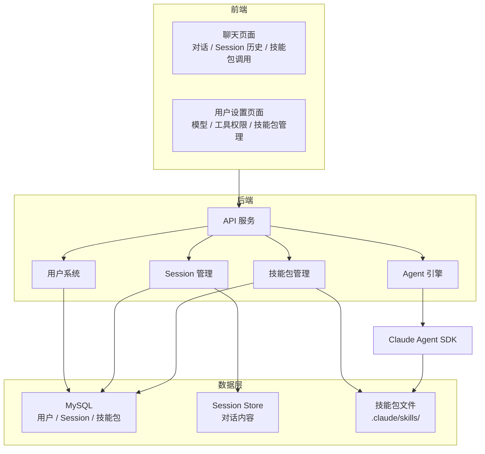

### 1.4 技术栈

| 层级 | 技术 | 版本 | 说明 |
|------|------|------|------|
| **前端** | React | 18+ | 用户界面 |
| | Ant Design | 5+ | UI 组件库 |
| | TypeScript | 5+ | 类型安全 |
| **后端** | Python | 3.10+ | 运行环境 |
| | FastAPI | 0.100+ | API 框架 |
| | Claude Agent SDK | 0.1.80+ | Agent 核心 |
| **数据层** | MySQL | 8.0+ | 用户/Session 元数据 |
| | Redis | 7+ | Session 内容缓存 |
| **部署** | Docker | - | 容器化 |

---

## 2. 技术选型

### 2.1 前端选型

| 技术 | 选择理由 |
|------|----------|
| React | 社区成熟、组件丰富、适合聊天 UI |
| Ant Design | 企业级 UI、完整组件库 |
| WebSocket | 实时通信、流式消息展示 |
| Zustand | 轻量状态管理 |

### 2.2 后端选型

| 技术 | 选择理由 |
|------|----------|
| FastAPI | 高性能、原生 async、自动 API 文档 |
| Claude Agent SDK | 官方 SDK、完整 Agent 能力 |
| MySQL | 关系型数据、用户/Session 存储 |
| Redis | Session 缓存、实时状态 |

### 2.3 Claude Agent SDK 内置能力

**使用 SDK 后无需开发的能力：**

| 能力 | 说明 |
|------|------|
| 查询引擎 | `query()` 单次查询 + `ClaudeSDKClient` 多轮对话 |
| 内置工具 | 30+ 工具（Bash, Read, Write, Edit, WebSearch, WebFetch...） |
| MCP 协议 | 外部 MCP Server 接入 + SDK MCP Server（in-process） |
| Hooks 系统 | PreToolUse, PostToolUse, Stop, Notification 等 |
| 权限模式 | default, acceptEdits, plan, bypassPermissions |
| 会话管理 | SessionStore API、会话恢复 |
| 上下文压缩 | Auto Compact 自动压缩 |
| Prompt Cache | 自动缓存优化 |
| 多模型支持 | 动态切换模型 |

---

## 3. 整体架构设计

### 3.1 系统架构图

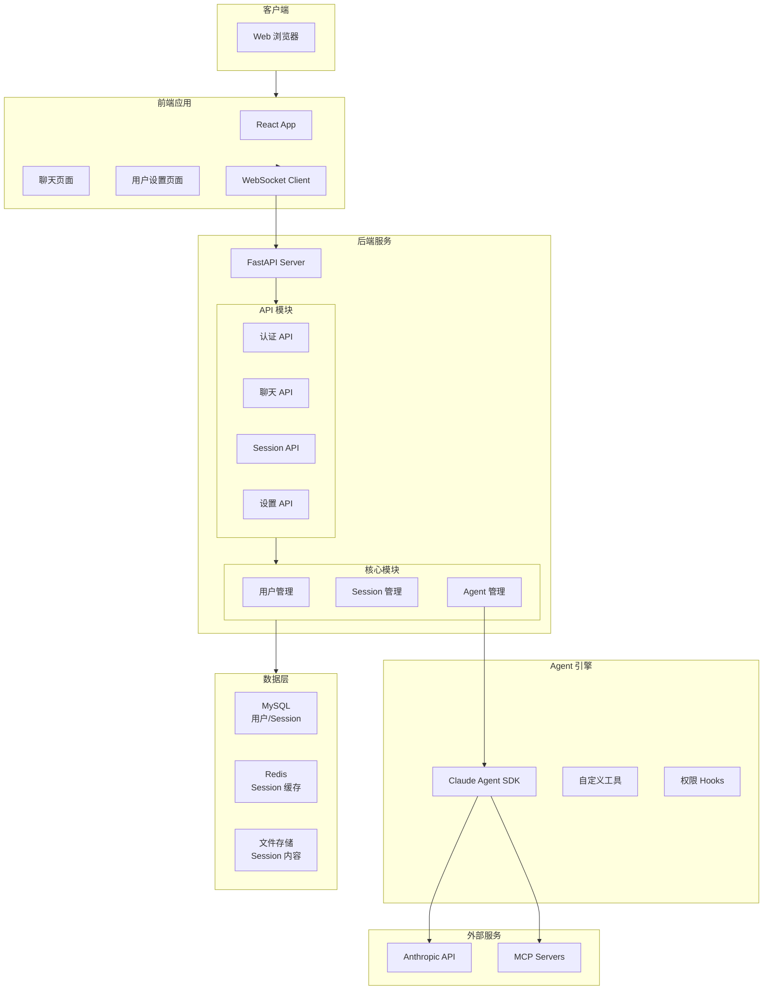

### 3.2 核心数据流

**系统整体数据流（前端、后端、Agent SDK、数据库四角色交互）**

```mermaid
sequenceDiagram
    participant FE as 前端
    participant BE as 后端
    participant SDK as Agent SDK
    participant DB as 数据库

    %% ===== 注册流程 =====
    rect rgb(240, 248, 255)
        Note over FE, DB: 【注册流程】
        FE->>BE: POST /api/auth/register {username, email, password}
        BE->>DB: INSERT users (用户基本信息)
        BE->>DB: INSERT user_tool_permissions (默认工具权限)
        DB-->>BE: 成功
        BE->>BE: 生成 JWT Token
        BE-->>FE: {token, user_info}
        FE->>FE: 存储 Token，跳转聊天页面
    end

    %% ===== 登录流程 =====
    rect rgb(255, 250, 240)
        Note over FE, DB: 【登录流程】
        FE->>BE: POST /api/auth/login {username, password}
        BE->>DB: SELECT users WHERE username=?
        DB-->>BE: 用户信息 + password_hash
        BE->>BE: bcrypt 验证密码
        BE->>BE: 生成 JWT Token
        BE->>DB: SELECT user_tool_permissions WHERE user_id=?
        DB-->>BE: 用户工具权限列表
        BE-->>FE: {token, user_info, settings}
        FE->>FE: 存储 Token，跳转聊天页面
    end

    %% ===== 初始化：获取 Session 列表 =====
    rect rgb(240, 255, 240)
        Note over FE, DB: 【获取 Session 列表】
        FE->>BE: GET /api/sessions (带 Token)
        BE->>BE: 验证 Token，获取 user_id
        BE->>DB: SELECT sessions WHERE user_id=? ORDER BY updated_at DESC
        DB-->>BE: Session 元数据列表
        BE-->>FE: Session 列表 JSON
        FE->>FE: 渲染 Session 历史侧边栏
    end

    %% ===== 聊天流程 =====
    rect rgb(255, 240, 245)
        Note over FE, DB: 【聊天流程】
        
        FE->>BE: WebSocket 连接 /api/ws/{session_id}
        BE->>BE: 验证 Token，验证 session 归属
        
        FE->>BE: 发送消息 {content}
        
        BE->>DB: SELECT sessions WHERE id=? (获取 Session 元数据)
        DB-->>BE: Session 信息
        
        BE->>DB: SELECT users WHERE id=? (获取用户配置)
        DB-->>BE: 用户配置
        
        BE->>DB: SELECT user_tool_permissions WHERE user_id=? (获取工具权限)
        DB-->>BE: 工具权限配置
        
        BE->>BE: 创建 SessionStore (session_id)
        BE->>SDK: ClaudeSDKClient(session_store, options=用户配置)
        SDK->>DB: SessionStore.load() 加载历史消息
        DB-->>SDK: 历史消息列表
        
        SDK->>SDK: 执行对话
        
        loop 工具调用（如有）
            SDK->>BE: PreToolUse Hook 触发
            BE->>DB: 检查 user_tool_permissions
            DB-->>BE: {enabled, requires_confirmation}
            alt 工具已启用
                BE-->>SDK: allow
                alt 需要确认
                    BE-->>FE: 弹出确认框
                    FE->>BE: 用户确认允许
                    BE->>SDK: 执行工具
                else 不需要确认
                    BE->>SDK: 直接执行工具
                end
            else 工具已禁用
                BE-->>SDK: deny
                SDK-->>FE: 提示"工具已禁用"
            end
        end
        
        loop 流式响应
            SDK-->>BE: Message 流
            BE-->>FE: WebSocket 流式消息
            FE->>FE: 实时渲染消息
        end
        
        SDK->>DB: SessionStore.save() 保存消息
        BE->>DB: UPDATE sessions (tokens, cost)
        DB-->>BE: 成功
        BE-->>FE: 消息完成
    end

    %% ===== 用户设置流程 =====
    rect rgb(230, 230, 250)
        Note over FE, DB: 【用户设置流程】
        
        FE->>BE: GET /api/settings
        BE->>DB: SELECT users + user_tool_permissions WHERE user_id=?
        DB-->>BE: 用户全部配置
        BE-->>FE: 配置数据
        
        FE->>FE: 渲染设置页面
        
        FE->>BE: PUT /api/settings/model {model: "claude-opus-4-6"}
        BE->>DB: UPDATE users SET default_model=?
        DB-->>BE: 成功
        BE-->>FE: 更新成功
        
        FE->>BE: PUT /api/settings/tools [{tool_name, enabled, requires_confirmation}]
        BE->>DB: UPDATE user_tool_permissions (批量)
        DB-->>BE: 成功
        BE-->>FE: 更新成功
    end

    %% ===== 技能包创建流程 =====
    rect rgb(255, 255, 230)
        Note over FE, DB: 【技能包创建流程】
        
        FE->>BE: WebSocket 发送 "帮我创建一个台风响应流程..."
        BE->>SDK: ClaudeSDKClient.query(prompt=用户需求)
        SDK->>SDK: 分析需求，生成技能包定义
        SDK-->>BE: 技能包内容
        BE-->>FE: 流式返回技能包定义
        FE->>FE: 渲染技能包定义，用户可修改
        
        FE->>BE: POST /api/skills/confirm {skill_name, content}
        BE->>BE: 生成 SKILL.md 文件内容
        BE->>DB: INSERT user_skills (元数据)
        BE->>DB: 写入文件 .claude/skills/{user_id}/{skill_name}/SKILL.md
        DB-->>BE: 成功
        BE-->>FE: 创建成功
        FE->>FE: 提示"可使用 /{skill_name} 调用"
    end

    %% ===== 技能包执行流程 =====
    rect rgb(230, 255, 255)
        Note over FE, DB: 【技能包执行流程】
        
        FE->>BE: WebSocket 发送 "/台风积水检测"
        BE->>BE: 解析技能包调用
        
        BE->>DB: SELECT user_skills WHERE user_id=? AND skill_name=?
        DB-->>BE: 技能包元数据
        
        BE->>DB: 读取 SKILL.md 文件
        DB-->>BE: 技能包完整内容
        
        BE->>SDK: ClaudeSDKClient.query(prompt=技能包内容)
        SDK->>SDK: 理解工作流步骤
        
        loop 步骤执行
            SDK->>BE: 调用自定义工具 (typhoon_tools, device_tools...)
            BE->>BE: 执行工具，获取结果
            BE-->>SDK: 工具执行结果
            SDK-->>BE: 步骤完成消息
            BE-->>FE: 流式返回进度
            FE->>FE: 渲染执行状态
        end
        
        SDK-->>BE: 工作流完成
        BE->>DB: UPDATE sessions (保存结果)
        BE-->>FE: 执行完成
    end
```

**流程说明：**

| 流程 | 前端 | 后端 | Agent SDK | 数据库 |
|------|------|------|-----------|--------|
| **注册** | 发送注册信息 → 显示成功 | 验证 → 创建用户 → 初始化权限 | - | INSERT users + tool_permissions |
| **登录** | 发送登录 → 存储 Token | 验证密码 → 生成 Token → 加载配置 | - | SELECT users + tool_permissions |
| **获取 Session** | 请求列表 → 渲染侧边栏 | 验证 Token → 查询 | - | SELECT sessions |
| **聊天** | WebSocket → 渲染消息 | 加载配置 → 创建 SDK → 处理流 | load() → 执行 → save() | SELECT/UPDATE sessions + Redis |
| **设置** | 显示/修改 → 保存 | 更新配置 | - | UPDATE users + tool_permissions |
| **技能包创建** | 描述需求 → 确认保存 | 生成 SKILL.md → 写入 | 分析需求生成定义 | INSERT user_skills + 文件 |
| **技能包执行** | 输入 `/技能包` → 显示进度 | 解析 → 加载 SKILL.md → 启动 SDK | 执行工作流 → 调用工具 | SELECT user_skills + 文件 |

### 3.3 核心组件职责

| 组件 | 职责 | 开发方 |
|------|------|--------|
| 前端应用 | 用户界面、WebSocket 通信 | 自研 |
| API 服务 | RESTful API、WebSocket 服务 | 自研 |
| 用户管理 | 用户 CRUD、认证 | 自研 |
| Session 管理 | Session 元数据、内容存储 | 自研 |
| Agent 管理 | Agent 创建、加载用户配置 | 自研 |
| 技能包管理 | 技能包创建、解析、执行调度 | 自研 |
| Claude Agent SDK | Agent 核心、工具执行 | Anthropic |
| Claude Code CLI | QueryEngine、压缩、缓存 | Anthropic |

---

## 4. 用户系统设计

### 4.1 用户数据模型

| 字段 | 类型 | 说明 |
|------|------|------|
| id | VARCHAR(36) | 用户唯一标识 |
| username | VARCHAR(50) | 用户名 |
| email | VARCHAR(100) | 邮箱 |
| password_hash | VARCHAR(255) | 密码（bcrypt加密） |
| default_model | VARCHAR(50) | 默认模型 |
| mcp_servers | JSON | MCP Server 配置 |
| agent_options | JSON | Agent 运行选项 |
| created_at | TIMESTAMP | 创建时间 |
| updated_at | TIMESTAMP | 更新时间 |

### 4.2 用户配置分布

```
┌─────────────────────────────────────────────────────────────────────────┐
│                     用户配置的存储位置                                     │
├─────────────────────────────────────────────────────────────────────────┤
│                                                                         │
│  users 表字段：                                                          │
│  ─────────────────────────────────────────────────────────────────────  │
│  - default_model      → 用户默认模型（单值）                              │
│  - mcp_servers        → MCP Server 配置（JSON）                          │
│  - agent_options      → Agent 运行选项（JSON）                           │
│                                                                         │
│  user_tool_permissions 表：                                              │
│  ─────────────────────────────────────────────────────────────────────  │
│  - 工具权限配置（独立表，每用户每工具一条记录）                             │
│  - 字段：user_id, tool_name, enabled, requires_confirmation             │
│                                                                         │
└─────────────────────────────────────────────────────────────────────────┘
```

### 4.3 用户工具权限示例数据

**user_tool_permissions 表数据：**

| user_id | tool_name | enabled | requires_confirmation |
|---------|-----------|---------|----------------------|
| user-001 | Bash | true | true |
| user-001 | Read | true | false |
| user-001 | Write | true | true |
| user-001 | Edit | true | true |
| user-001 | WebSearch | true | false |
| user-002 | Bash | false | false |
| user-002 | Read | true | false |
| ... | ... | ... | ... |

### 4.4 认证流程

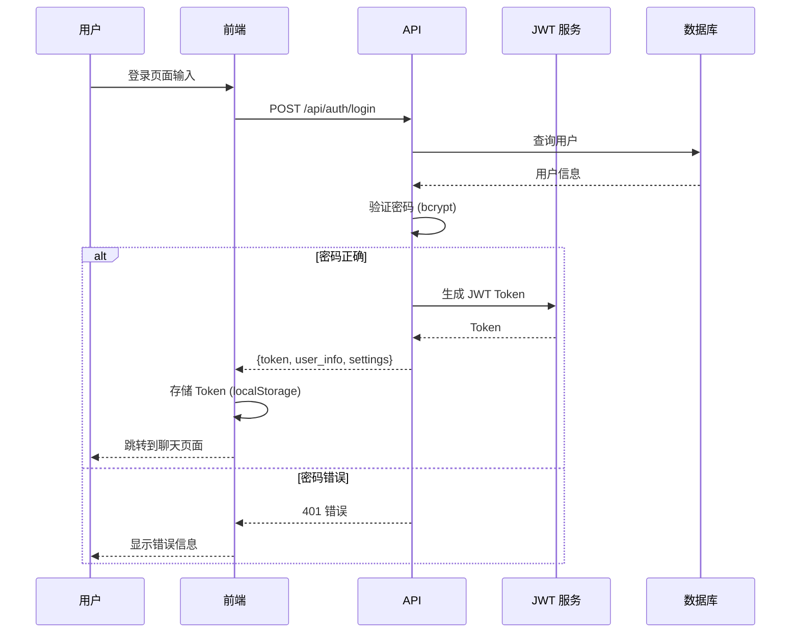

### 4.4 认证 API 设计

| API | 方法 | 说明 |
|------|------|------|
| `/api/auth/login` | POST | 用户登录，返回 JWT Token + 用户配置 |
| `/api/auth/register` | POST | 用户注册 |
| `/api/auth/logout` | POST | 用户登出 |
| `/api/auth/me` | GET | 获取当前用户信息 + 配置 |
| `/api/auth/refresh` | POST | 刷新 Token |

---

## 5. Session 管理设计

### 5.1 核心概念：两种 Session

**用"书"的比喻来理解：**

```
┌─────────────────────────────────────────────────────────────────────────┐
│                     "聊天对话" 的两层信息                                  │
├─────────────────────────────────────────────────────────────────────────┤
│                                                                         │
│  类比：一本书                                                            │
│                                                                         │
│  ┌─────────────────────┐        ┌─────────────────────────────┐        │
│  │  书的封面/目录       │        │  书的内容（正文）            │        │
│  │  (DB Session)       │        │  (SDK Session)              │        │
│  │                     │        │                             │        │
│  │  - 书名 → 对话标题   │        │  - 第1章 → 第1条消息        │        │
│  │  - 作者 → 用户      │        │  - 第2章 → 第2条消息        │        │
│  │  - 页数 → token数   │        │  - 第3章 → 第3条消息        │        │
│  │                     │        │  ...                        │        │
│  │                     │        │                             │        │
│  │  存在：MySQL         │        │  存在：SessionStore         │        │
│  │                     │        │  (Redis/MySQL/文件)         │        │
│  │                     │        │                             │        │
│  │  用途：              │        │  用途：                      │        │
│  │  - 快速找书          │        │  - 阅读内容                 │        │
│  │  - 统计有多少书      │        │  - 继续阅读（恢复对话）     │        │
│  │  - 不打开就能看      │        │  - Agent 需要内容才能回答  │        │
│  │    基本信息          │        │                             │        │
│  └─────────────────────┘        └─────────────────────────────┘        │
│                                                                         │
│  关联方式：书的 ID = 内容的 ID（同一个标识）                               │
│                                                                         │
└─────────────────────────────────────────────────────────────────────────┘
```

### 5.2 SessionStore 的位置与实现

**SessionStore 与 SDK 的关系：**

```
┌─────────────────────────────────────────────────────────────────────────┐
│                        SessionStore 的关系                               │
├─────────────────────────────────────────────────────────────────────────┤
│                                                                         │
│   Claude Agent SDK                                                      │
│   ┌─────────────────────────────────────────────────────┐              │
│   │                                                     │              │
│   │   SDK 提供：                                        │              │
│   │   - SessionStore 接口定义（规定要实现哪些方法）      │              │
│   │   - 调用 SessionStore 的时机                        │              │
│   │                                                     │              │
│   │   接口方法：                                        │              │
│   │   ┌─────────────────────────────────────┐          │              │
│   │   │  save(messages, metadata)           │          │              │
│   │   │  load() → messages, metadata        │          │              │
│   │   └─────────────────────────────────────┘          │              │
│   │              ↑                                    │              │
│   │              │ 我们自己实现                        │              │
│   │              │                                    │              │
│   │   我们实现：                                       │              │
│   │   ┌─────────────────────────────────────┐          │              │
│   │   │  MySQLSessionStore                  │          │              │
│   │   │  - save(): 存到我们选择的位置       │          │              │
│   │   │  - load(): 从我们选择的位置读       │          │              │
│   │   └─────────────────────────────────────┘          │              │
│   │                                                     │              │
│   │   SDK 运行时自动调用：                              │              │
│   │   - 每轮对话结束 → 调用 save()                     │              │
│   │   - 启动 Agent → 调用 load()                      │              │
│   │                                                     │              │
│   └─────────────────────────────────────────────────────┘              │
│                                                                         │
│   我们传给 SDK：                                                         │
│   ClaudeSDKClient(session_store=我们实现的SessionStore)                 │
│                                                                         │
└─────────────────────────────────────────────────────────────────────────┘
```

### 5.3 SessionStore 存储位置选择

| 存储位置 | 适合场景 | 性能 | 成本 |
|----------|----------|------|------|
| Redis | 活跃对话（正在进行） | 最快 | 高 |
| MySQL | 持久化存储 | 中 | 低 |
| 文件 | 大量历史对话 | 慢 | 最低 |

**推荐：Redis（活跃） + MySQL/文件（历史）**

### 5.4 Session 关联流程

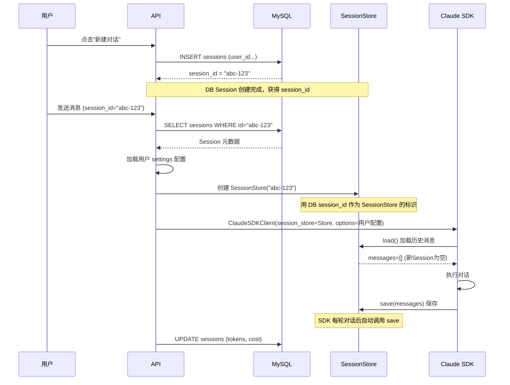

### 5.5 Session 数据模型

**MySQL Session 表（元数据）：**

| 字段 | 类型 | 说明 |
|------|------|------|
| id | VARCHAR(36) | Session ID，关联 SessionStore |
| user_id | VARCHAR(36) | 所属用户 |
| title | VARCHAR(200) | Session 标题 |
| model | VARCHAR(50) | 使用的模型 |
| status | VARCHAR(20) | 状态：active, archived, deleted |
| total_input_tokens | INT | 输入 token 统计 |
| total_output_tokens | INT | 输出 token 统计 |
| total_cost | DECIMAL | 成本统计 |
| created_at | TIMESTAMP | 创建时间 |
| updated_at | TIMESTAMP | 更新时间 |

**SessionStore 存储内容：**

| 内容 | 说明 |
|------|------|
| session_id | 与 MySQL sessions.id 相同（关联标识） |
| messages | 对话消息列表（每条消息的完整内容） |
| context | 对话上下文信息 |
| metadata | token 统计、成本等 |

### 5.6 实际使用场景

**场景1：用户查看历史列表**

```
用户打开聊天页面
    ↓
系统查询 MySQL sessions 表
    ↓
返回对话列表（只返回元数据，不加载内容）
    ↓
用户看到：
    1. 研究React - 昨天 - 2000 tokens
    2. 写HTTP服务 - 3天前 - 1500 tokens
    ...
    
（这一步不需要 SessionStore，只查 MySQL）
```

**场景2：用户进入某个对话**

```
用户点击"研究React"
    ↓
系统用 session_id="abc-123" 创建 SessionStore
    ↓
SessionStore.load() 加载消息内容
    ↓
用户看到完整对话记录（10轮对话）
    
（这一步需要 SessionStore 加载内容）
```

**场景3：用户继续对话**

```
用户发送新消息："再写一个示例"
    ↓
Agent 用 SessionStore.load() 获取历史上下文
    ↓
Agent 看到之前的 React 讨论，理解上下文
    ↓
Agent 回复："好的，基于刚才讨论的特性..."
    ↓
SessionStore.save() 保存新消息
    ↓
MySQL 更新 token 统计
```

### 5.7 Session API 设计

| API | 方法 | 说明 |
|------|------|------|
| `/api/sessions` | GET | 获取用户 Session 列表（只返回元数据） |
| `/api/sessions` | POST | 创建新 Session |
| `/api/sessions/{id}` | GET | 获取 Session 详情（含消息内容） |
| `/api/sessions/{id}` | DELETE | 删除 Session |
| `/api/sessions/{id}/title` | PATCH | 更新标题 |
| `/api/sessions/{id}/archive` | PATCH | 归档 Session |

---

## 6. 前端页面设计

### 6.1 页面结构

```
前端页面：
├── 登录/注册页面
│
├── 聊天页面（主页面）
│   ├── Header：用户信息、设置入口
│   ├── Sidebar：Session 历史列表
│   ├── ChatArea：消息区域
│   │   ├── 消息列表（用户/助手消息）
│   │   ├── 工具调用展示
│   │   ├── 技能包执行进度展示
│   │   └── 流式输出动画
│   └── InputArea：输入框、发送按钮、技能包快捷入口
│
└── 用户设置页面
    ├── 模型设置
    ├── 工具权限设置
    ├── MCP Server 配置
    ├── Agent 选项设置
    └── 技能包管理
        ├── 技能包列表
        ├── 创建/编辑技能包
        └── 技能包详情（SKILL.md 编辑器）
```

### 6.2 聊天页面布局

```
+--------------------------------------------------+
|  Header: Logo | 用户名 | [设置]                   |
+--------------------------------------------------+
|          |                                       |
| Sidebar  |         Chat Area                     |
|          |                                       |
| Session  |  +-------------------------------+   |
| 历史列表 |  | 用户消息                      |   |
|          |  +-------------------------------+   |
| [新建]   |                                       |
|          |  +-------------------------------+   |
| Session1 |  | Agent 回复（流式）            |   |
| Session2 |  | - 文本内容                    |   |
| Session3 |  | - 工具调用 [展开]             |   |
| ...      |  +-------------------------------+   |
|          |                                       |
|          |  +-------------------------------+   |
|          |  | 输入框 | 发送                  |   |
|          |  +-------------------------------+   |
+--------------------------------------------------+
```

### 6.3 消息类型渲染

| 消息类型 | 渲染方式 |
|----------|----------|
| 用户消息 | 简单文本，右侧显示 |
| 助手文本 | Markdown 渲染，左侧显示，流式动画 |
| Tool Use | 可折叠卡片，显示工具名、参数 |
| Tool Result | 可折叠卡片，显示执行结果 |
| Thinking | 隐藏或可展开的思考过程 |
| Error | 红色高亮错误信息 |

### 6.4 用户设置页面

**模型设置：**

```
+--------------------------------------------------+
|  模型设置                                         |
+--------------------------------------------------+
|                                                  |
|  默认模型：                                       |
|  ┌────────────────────────────────────────────┐  |
|  │ ▸ claude-sonnet-4-5                        │  |
|  │   claude-opus-4-6                          │  |
|  │   claude-haiku-4-5                         │  |
|  └────────────────────────────────────────────┐  |
|                                                  |
|  [保存设置]                                       |
+--------------------------------------------------+
```

**工具权限设置：**

```
+--------------------------------------------------+
|  工具权限设置                                     |
+--------------------------------------------------+
|                                                  |
|  工具列表（从 user_tool_permissions 表加载）：    |
|  +--------------------------------------------+  |
|  | 工具名称 | 启用 | 需确认 |                  |  |
|  +--------------------------------------------+  |
|  | Bash    | [✓] | [✓]    | [编辑详细设置] |  |
|  | Read    | [✓] | [ ]    | [编辑详细设置] |  |
|  | Write   | [✓] | [✓]    | [编辑详细设置] |  |
|  | Edit    | [✓] | [✓]    | [编辑详细设置] |  |
|  | WebSearch| [✓] | [ ]    | [编辑详细设置] |  |
|  | WebFetch | [✓] | [ ]    | [编辑详细设置] |  |
|  +--------------------------------------------+  |
|                                                  |
|  [保存设置]                                       |
+--------------------------------------------------+
```

**保存逻辑：**

- 模型设置 → 更新 users.default_model 字段
- 工具权限 → 批量更新 user_tool_permissions 表
- MCP Server → 更新 users.mcp_servers JSON 字段

---

## 7. 后端 API 设计

### 7.1 API 模块划分

| 模块 | 路径前缀 | 功能 |
|------|----------|------|
| 认证 | `/api/auth` | 登录、注册、Token 验证 |
| Session | `/api/sessions` | Session 管理、历史查询 |
| 聊天 | `/api/chat` | WebSocket、消息发送 |
| 设置 | `/api/settings` | 用户个人设置 |
| 技能包 | `/api/skills` | 技能包管理、创建、编辑 |

### 7.2 API 详细列表

**认证 API：**

| API | 方法 | 说明 |
|------|------|------|
| `/api/auth/login` | POST | 登录 |
| `/api/auth/register` | POST | 注册 |
| `/api/auth/logout` | POST | 登出 |
| `/api/auth/me` | GET | 获取当前用户 + 配置 |
| `/api/auth/refresh` | POST | 刷新 Token |

**Session API：**

| API | 方法 | 说明 |
|------|------|------|
| `/api/sessions` | GET | Session 列表（当前用户） |
| `/api/sessions` | POST | 创建 Session |
| `/api/sessions/{id}` | GET | Session 详情（含消息） |
| `/api/sessions/{id}` | DELETE | 删除 Session |
| `/api/sessions/{id}/title` | PATCH | 更新标题 |
| `/api/sessions/{id}/archive` | PATCH | 归档 |

**聊天 API：**

| API | 方法 | 说明 |
|------|------|------|
| `/api/ws/{session_id}` | WebSocket | WebSocket 连接 |
| `/api/chat/{session_id}/message` | POST | 发送消息（HTTP 备用） |
| `/api/chat/{session_id}/stream` | GET | SSE 流（备用） |

**用户设置 API：**

| API | 方法 | 说明 |
|------|------|------|
| `/api/settings` | GET | 获取用户全部设置（含工具权限） |
| `/api/settings/model` | GET/PUT | 默认模型设置 |
| `/api/settings/mcp-servers` | GET/PUT | MCP Server 配置 |
| `/api/settings/agent-options` | GET/PUT | Agent 选项设置 |
| `/api/settings/tools` | GET | 获取用户所有工具权限 |
| `/api/settings/tools` | PUT | 批量更新工具权限 |
| `/api/settings/tools/{name}` | GET/PUT | 单个工具权限设置 |

**技能包 API：**

| API | 方法 | 说明 |
|------|------|------|
| `/api/skills` | GET | 获取用户所有技能包 |
| `/api/skills` | POST | 创建新技能包（对话生成后确认保存） |
| `/api/skills/{name}` | GET | 获取技能包详情（步骤列表） |
| `/api/skills/{name}` | PUT | 更新技能包（对话修改后确认保存） |
| `/api/skills/{name}` | DELETE | 删除技能包 |
| `/api/skills/{name}/execute` | POST | 执行技能包（在指定 Session 中） |

**技能包创建/修改流程：**
- 用户在聊天中描述需求 → Agent 生成技能包定义 → 用户确认 → 调用 API 保存
- 无需手动编写 SKILL.md，系统自动生成

---

## 8. 用户配置设计

### 8.1 配置加载流程

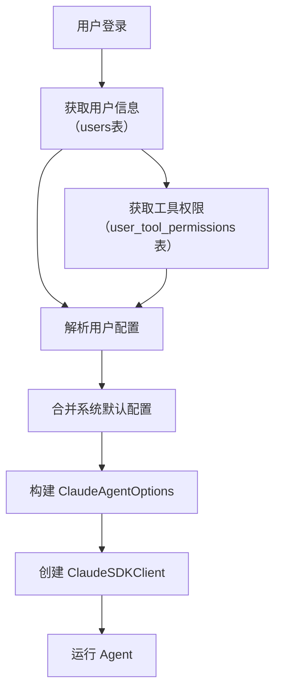

### 8.2 配置存储分布

```
┌─────────────────────────────────────────────────────────────────────────┐
│                        配置存储分布                                       │
├─────────────────────────────────────────────────────────────────────────┤
│                                                                         │
│  users 表（用户基本配置）：                                                │
│  ─────────────────────────────────────────────────────────────────────  │
│  - default_model      VARCHAR(50)   默认模型                             │
│  - mcp_servers        JSON          MCP Server 配置                      │
│  - agent_options      JSON          Agent 运行选项                        │
│                                                                         │
│  user_tool_permissions 表（工具权限）：                                    │
│  ─────────────────────────────────────────────────────────────────────  │
│  - user_id            VARCHAR(36)   用户ID                               │
│  - tool_name          VARCHAR(50)   工具名称                             │
│  - enabled            BOOLEAN       是否启用                             │
│  - requires_confirmation  BOOLEAN   是否需要确认                         │
│                                                                         │
│  system_config 表（系统默认）：                                            │
│  ─────────────────────────────────────────────────────────────────────  │
│  - default_model                    系统默认模型                          │
│  - available_models                 可用模型列表                          │
│  - default_tools_config             工具默认配置                          │
│                                                                         │
└─────────────────────────────────────────────────────────────────────────┘
```

### 8.3 配置优先级

```
┌─────────────────────────────────────────────────────────────────────────┐
│                        配置优先级                                         │
├─────────────────────────────────────────────────────────────────────────┤
│                                                                         │
│  优先级从高到低：                                                         │
│                                                                         │
│  1. 用户个人配置                                                          │
│     - users 表：default_model, mcp_servers, agent_options               │
│     - user_tool_permissions 表：工具权限                                  │
│                                                                         │
│  2. 系统默认配置（system_config 表）                                      │
│     - 用户没有设置时使用的默认值                                           │
│                                                                         │
│  合并逻辑：                                                               │
│  - 用户设置了 → 用用户设置                                                │
│  - 用户没设置 → 用系统默认                                                │
│                                                                         │
│  工具权限：                                                               │
│  - 新用户注册时，自动创建默认工具权限记录                                   │
│  - 用户可修改自己的工具权限                                               │
│                                                                         │
└─────────────────────────────────────────────────────────────────────────┘
```

### 8.4 新用户初始化

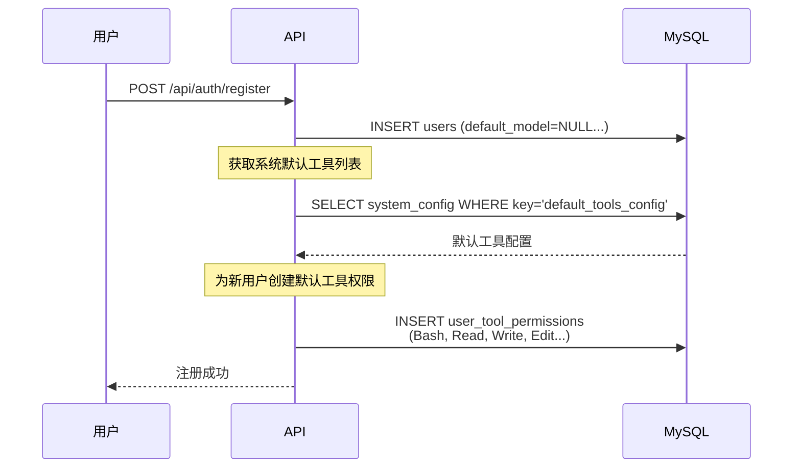

### 8.3 系统默认配置

**system_config 表（系统级默认值）：**

| 配置项 | 默认值 | 说明 |
|------|------|------|
| default_model | claude-sonnet-4-5 | 系统默认模型 |
| available_models | ["claude-sonnet-4-5", "claude-opus-4-6", "claude-haiku-4-5"] | 可用模型列表 |
| default_tools_config | {...} | 工具默认配置 |

---

## 9. 工具权限设计

### 9.1 权限配置位置

```
┌─────────────────────────────────────────────────────────────────────────┐
│                    工具权限存储位置                                        │
├─────────────────────────────────────────────────────────────────────────┤
│                                                                         │
│  user_tool_permissions 表（独立数据表）：                                  │
│                                                                         │
│  ┌───────────────────────────────────────────────────────────────────┐ │
│  │  user_id       VARCHAR(36)    用户ID                              │ │
│  │  tool_name     VARCHAR(50)    工具名称                            │ │
│  │  enabled       BOOLEAN        是否启用此工具                       │ │
│  │  requires_confirmation  BOOLEAN   执行前是否需要确认               │ │
│  └───────────────────────────────────────────────────────────────────┘ │
│                                                                         │
│  每个用户每个工具一条记录，便于：                                          │
│  - 查询用户所有工具权限                                                   │
│  - 批量更新权限配置                                                       │
│  - 统计分析用户权限设置                                                   │
│                                                                         │
│  示例数据：                                                               │
│  ┌─────────────────────────────────────────────────────────────────┐   │
│  │  user_id | tool_name | enabled | requires_confirmation          │   │
│  │  ─────────────────────────────────────────────────────────────  │   │
│  │  user-001 | Bash     | true    | true                           │   │
│  │  user-001 | Read     | true    | false                          │   │
│  │  user-001 | Write    | true    | true                           │   │
│  │  user-002 | Bash     | false   | false                          │   │
│  │  user-002 | Read     | true    | false                          │   │
│  └─────────────────────────────────────────────────────────────────┘   │
│                                                                         │
└─────────────────────────────────────────────────────────────────────────┘
```

### 9.2 权限与 SDK 的关联机制

**SDK 提供的权限能力：**

```
┌─────────────────────────────────────────────────────────────────────────┐
│                    Claude Agent SDK 的权限机制                            │
├─────────────────────────────────────────────────────────────────────────┤
│                                                                         │
│  SDK 提供的权限模式（permission_mode）：                                  │
│  ─────────────────────────────────────────────────────────────────────  │
│                                                                         │
│  permission_mode: "default"                                             │
│  - SDK 内置的交互式权限确认                                              │
│  - 每次工具执行时询问用户是否允许                                         │
│                                                                         │
│  permission_mode: "bypassPermissions"                                    │
│  - 绕过所有权限检查，全部自动执行                                         │
│  - 我们使用这个模式，通过 Hook 实现自己的权限系统                         │
│                                                                         │
│  ─────────────────────────────────────────────────────────────────────  │
│                                                                         │
│  SDK 提供的 Hooks 系统：                                                  │
│  ─────────────────────────────────────────────────────────────────────  │
│                                                                         │
│  PreToolUse Hook                                                        │
│  - 在工具执行前触发                                                      │
│  - 可以返回 decision: "allow" / "deny"                                  │
│  - 这是接入自定义权限系统的关键入口                                       │
│                                                                         │
└─────────────────────────────────────────────────────────────────────────┘
```

**接入流程：**

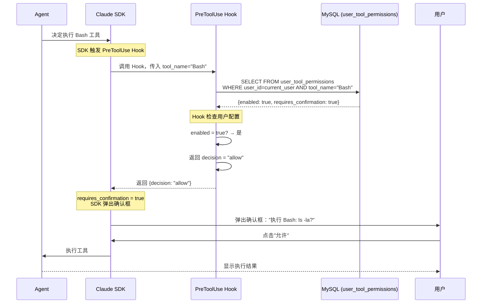

### 9.3 工具权限检查流程

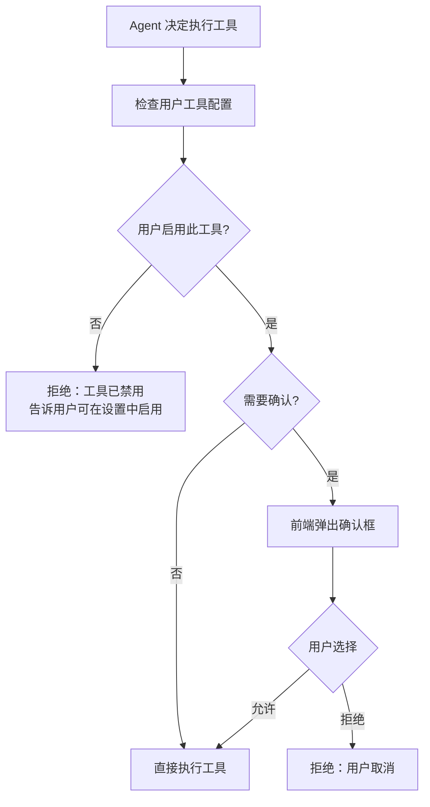

### 9.4 实际场景示例

**场景1：用户启用 Read 且不需要确认**

```
用户配置：tools.Read = {enabled: true, requires_confirmation: false}

流程：
Agent 决定执行 Read
    ↓
Hook 检查用户配置
    ↓
enabled = true? → 是
    ↓
requires_confirmation = false? → 是
    ↓
Hook 返回 allow
    ↓
直接执行

结果：成功执行，无需确认
```

**场景2：用户禁用 Bash**

```
用户配置：tools.Bash = {enabled: false, requires_confirmation: true}

流程：
Agent 决定执行 Bash
    ↓
Hook 检查用户配置
    ↓
enabled = false? → 是
    ↓
Hook 返回 deny

结果：拒绝执行，Agent 告知用户 "此工具已禁用，可在设置中启用"
```

**场景3：用户启用 Bash 且需要确认**

```
用户配置：tools.Bash = {enabled: true, requires_confirmation: true}

流程：
Agent 决定执行 Bash
    ↓
Hook 检查用户配置
    ↓
enabled = true? → 是
    ↓
Hook 返回 allow
    ↓
SDK 弹出确认框："执行命令: ls -la?"
    ↓
用户点击"允许"
    ↓
执行工具

结果：成功执行
```

### 9.5 前端确认框设计

```
+--------------------------------------------------+
|  ⚠️ 工具执行确认                                   |
+--------------------------------------------------+
|                                                  |
|  Agent 想要执行以下工具：                          |
|                                                  |
|  工具：Bash                                       |
|  内容：rm -rf /tmp/test                          |
|                                                  |
|  +--------------------------------------------+  |
|  |  [✓] 记住此选择，本次对话不再询问            |  |
|  +--------------------------------------------+  |
|                                                  |
|  [允许执行]  [拒绝]                               |
+--------------------------------------------------+
```

**确认框显示内容：**

| 工具 | 显示内容 |
|------|----------|
| Bash | 显示要执行的命令 |
| Read | 显示要读取的文件路径 |
| Write | 显示要写入的文件路径 |
| Edit | 显示 old_string 和 new_string 的摘要 |
| WebFetch | 显示 URL |

---

## 10. 技能包设计

### 10.1 技能包概念

```
┌─────────────────────────────────────────────────────────────────────────┐
│                        技能包（Skills）概念                                │
├─────────────────────────────────────────────────────────────────────────┤
│                                                                         │
│  什么是技能包？                                                           │
│  ─────────────────────────────────────────────────────────────────────  │
│  - 预定义的工作流模板                                                     │
│  - 包含多个步骤的业务流程                                                 │
│  - 用户通过 /skill_name 在聊天中调用                                      │
│  - Agent 按技能包定义的流程执行                                           │
│                                                                         │
│  使用场景：                                                               │
│  ─────────────────────────────────────────────────────────────────────  │
│  - 台风天气响应流程：查台风→匹配设备→检测算法→下发任务                      │
│  - 数据分析流程：获取数据→清洗→分析→生成报告                               │
│  - 报警处理流程：接收报警→查询设备→判断级别→派发工单                        │
│                                                                         │
│  技能包 vs 普通对话：                                                     │
│  ─────────────────────────────────────────────────────────────────────  │
│  - 普通对话：用户提问 → Agent 单次回答                                    │
│  - 技能包：用户调用 → Agent 执行完整工作流（多步骤、有依赖）               │
│                                                                         │
└─────────────────────────────────────────────────────────────────────────┘
```

### 10.2 技能包创建方式：对话生成

```
┌─────────────────────────────────────────────────────────────────────────┐
│                    对话生成技能包（推荐方式）                               │
├─────────────────────────────────────────────────────────────────────────┤
│                                                                         │
│  创建流程：                                                               │
│  ─────────────────────────────────────────────────────────────────────  │
│                                                                         │
│  1. 用户在聊天页面描述需求                                                 │
│     "帮我创建一个台风天气响应流程：查台风路径→匹配设备→下发积水任务"         │
│                                                                         │
│  2. Agent 理解需求，生成技能包定义                                        │
│     Agent 分析用户描述，提取：                                            │
│     - 技能包名称                                                         │
│     - 工作流步骤                                                         │
│     - 需要调用的工具                                                     │
│                                                                         │
│  3. Agent 展示生成的技能包内容                                            │
│     用户确认或修改                                                        │
│                                                                         │
│  4. 用户确认后，系统保存技能包                                            │
│     自动创建 SKILL.md 文件                                               │
│     写入数据库元数据                                                     │
│                                                                         │
│  优势：                                                                   │
│  ─────────────────────────────────────────────────────────────────────  │
│  - 用户无需学习 SKILL.md 格式                                            │
│  - 自然语言描述，门槛低                                                   │
│  - Agent 智能理解，生成规范定义                                          │
│                                                                         │
└─────────────────────────────────────────────────────────────────────────┘
```

**对话生成示例：**

```
用户：帮我创建一个台风天气响应的技能包，流程是：
1. 查询今天的台风路径
2. 找出台风经过区域内的摄像头
3. 检查积水检测算法是否可用
4. 如果可用，给这些摄像头下发积水检测任务

Agent：好的，我为你生成以下技能包：

【技能包名称】typhoon-weather-workflow
【描述】台风天气响应工作流 - 检测台风影响区域并下发积水检测任务

【工作流步骤】
步骤1: 获取台风路径坐标
  - 工具: typhoon_china_today_path()
  - 输入: yyyymm 格式的日期
  
步骤2: 匹配受影响的设备
  - 工具: device_serial_match()
  - 输入: 步骤1返回的台风坐标
  
步骤3: 掷取可用算法列表
  - 工具: applet_list()
  
步骤4: 检查积水算法并下发任务
  - 判断: 积水算法是否在步骤3的列表中
  - 工具: dispatch_applet_task()

请确认是否保存这个技能包？如有修改请告诉我。

用户：确认保存，名称改为"台风积水检测"

Agent：已保存技能包 "台风积水检测"。你可以在聊天中输入 /台风积水检测 来使用它。
```

### 10.3 技能包文件格式（SKILL.md）

基于 Claude Agent SDK 的 Skills 标准，技能包使用 Markdown 文件定义（用户无需手动编写，由系统根据对话自动生成）：

**文件结构：**

```markdown
---
name: typhoon-weather-workflow
description: Use when handling typhoon weather scenarios - match affected areas by coordinates, retrieve algorithm list, and dispatch waterlogging tasks
---

# 台风天气工作流

## 概述

该技能自动化完整的台风天气响应工作流...

## 何时使用

**症状和使用场景：**
- 处理台风天气警报
- 需要基于坐标匹配设备
- ...

**不适用于：**
- 独立的算法管理
- ...

## 核心工作流

完整的台风响应遵循以下序列：

1. 获取台风路径坐标
2. 根据坐标匹配受影响的设备
3. 从系统检索可用算法列表
4. 检查积水算法是否存在
5. 向受影响的设备下发积水任务

## 实现模式

### 步骤 1：获取台风路径
[具体的实现代码或调用方式]

### 步骤 2：匹配受影响的设备
[具体的实现代码或调用方式]

...

## API 参考

[技能包依赖的 API 或工具说明]

## 关键决策点

[流程中的关键判断点]
```

**Frontmatter 元数据：**

| 字段 | 类型 | 说明 |
|------|------|------|
| name | string | 技能包名称（唯一标识） |
| description | string | 技能包描述（用于 Agent 判断何时使用） |

### 10.4 技能包存储架构

```
┌─────────────────────────────────────────────────────────────────────────┐
│                     技能包存储架构                                         │
├─────────────────────────────────────────────────────────────────────────┤
│                                                                         │
│  存储位置：                                                               │
│  ─────────────────────────────────────────────────────────────────────  │
│                                                                         │
│  MySQL（技能包元数据）：                                                   │
│  ┌───────────────────────────────────────────────────────────────────┐ │
│  │  user_skills 表                                                    │ │
│  │  - user_id       用户ID                                            │ │
│  │  - skill_name    技能包名称                                         │ │
│  │  - description   描述                                              │ │
│  │  - file_path     SKILL.md 文件路径                                  │ │
│  │  - created_at    创建时间                                          │ │
│  │  - updated_at    更新时间                                          │ │
│  └───────────────────────────────────────────────────────────────────┘ │
│                                                                         │
│  文件系统（SKILL.md 内容）：                                               │
│  ┌───────────────────────────────────────────────────────────────────┐ │
│  │  .claude/skills/{user_id}/{skill_name}/SKILL.md                   │ │
│  │                                                                   │ │
│  │  目录结构：                                                        │ │
│  │  .claude/skills/                                                  │ │
│  │  ├── user-001/                                                    │ │
│  │  │   ├── typhoon-weather-workflow/                                │ │
│  │  │   │   └── SKILL.md                                             │ │
│  │  │   └── data-analysis-flow/                                      │ │
│  │  │       └── SKILL.md                                             │ │
│  │  └── user-002/                                                    │ │
│  │      └── alarm-handler/                                           │ │
│  │          └── SKILL.md                                             │ │
│  └───────────────────────────────────────────────────────────────────┘ │
│                                                                         │
│  为什么用两种存储？                                                       │
│  ─────────────────────────────────────────────────────────────────────  │
│  - MySQL：快速查询、列表展示、元数据管理                                   │
│  - 文件：SDK 直接读取、内容编辑、版本管理                                  │
│                                                                         │
└─────────────────────────────────────────────────────────────────────────┘
```

### 10.5 技能包调用流程

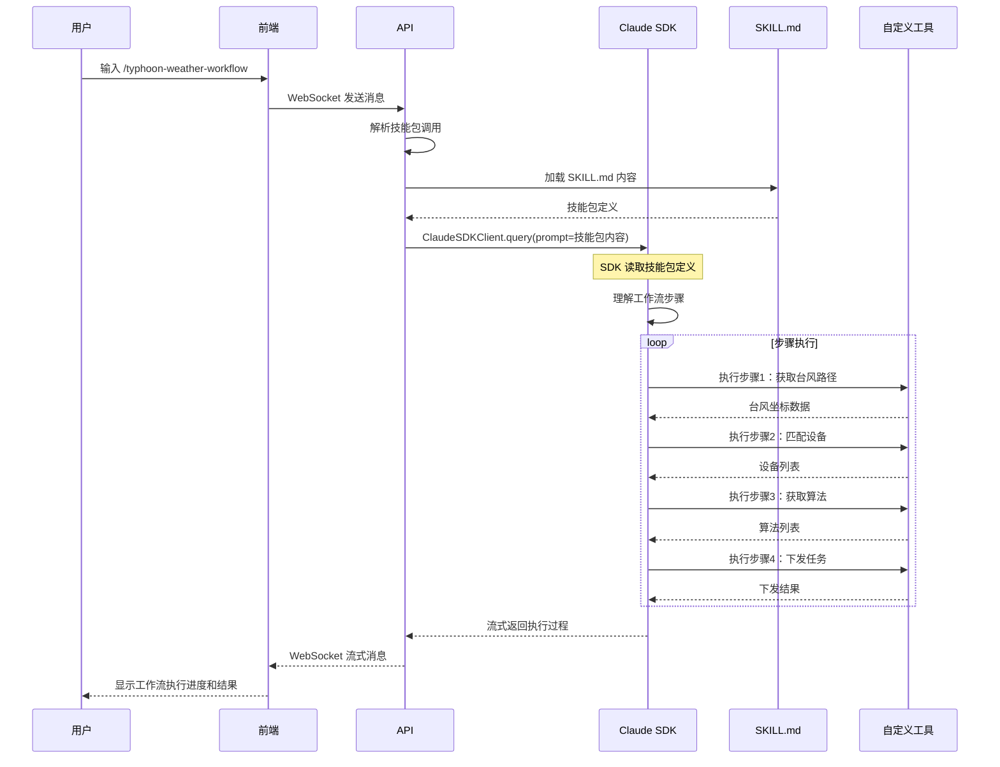

### 10.6 技能包与自定义工具的关系

```
┌─────────────────────────────────────────────────────────────────────────┐
│                 技能包与自定义工具的关系                                    │
├─────────────────────────────────────────────────────────────────────────┤
│                                                                         │
│  技能包定义工作流步骤                                                     │
│  ─────────────────────────────────────────────────────────────────────  │
│  SKILL.md 描述：                                                         │
│  - 步骤1：调用 typhoon_china_today_path() 获取台风路径                    │
│  - 步骤2：调用 device_serial_match() 匹配设备                            │
│  - 步骤3：调用 applet_list() 获取算法                                    │
│  - 步骤4：调用 dispatch_applet_task() 下发任务                           │
│                                                                         │
│  自定义工具实现具体功能                                                   │
│  ─────────────────────────────────────────────────────────────────────  │
│  backend/tools/ 目录：                                                   │
│  - typhoon_tools.py     → typhoon_china_today_path()                    │
│  - device_tools.py      → device_serial_match()                         │
│  - applet_tools.py      → applet_list(), dispatch_applet_task()         │
│                                                                         │
│  关系：                                                                   │
│  ─────────────────────────────────────────────────────────────────────  │
│  - 技能包是"流程编排者"                                                   │
│  - 自定义工具是"具体执行者"                                               │
│  - Agent 读取技能包，按步骤调用对应工具                                    │
│                                                                         │
└─────────────────────────────────────────────────────────────────────────┘
```

### 10.6 技能包管理流程

**创建技能包（对话生成方式）：**

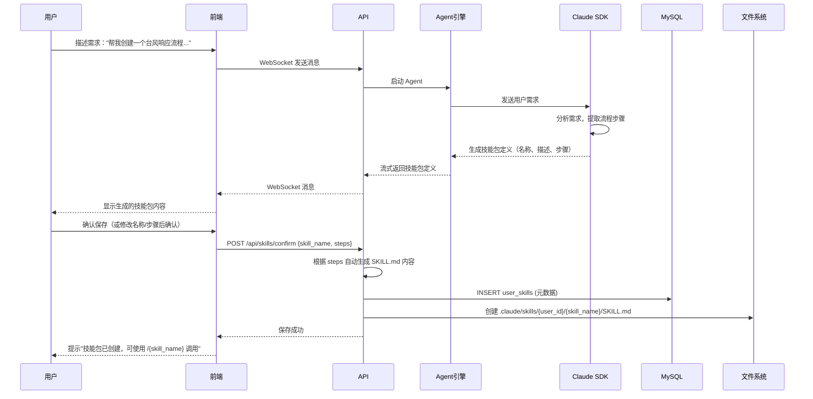

**修改技能包：**

```
用户：修改"台风积水检测"技能包，把步骤3改成先检查算法再检查设备

Agent：好的，我帮你修改步骤顺序：

原步骤：
1. 获取台风路径
2. 匹配设备
3. 获取算法
4. 下发任务

修改后：
1. 获取台风路径
2. 获取可用算法
3. 检查积水算法是否存在
4. 匹配受影响的设备
5. 下发积水任务

请确认是否保存修改？

用户：确认

Agent：已更新技能包 "台风积水检测"。
```

**执行技能包：**

```
用户在聊天页面输入：/台风积水检测

系统处理：
1. 解析输入，识别技能包调用
2. 加载用户技能包列表，验证技能包存在
3. 读取 SKILL.md 文件内容
4. 将技能包内容作为 prompt 发送给 Agent
5. Agent 按技能包定义的流程执行
6. 每个步骤的执行结果流式返回给用户
```

### 10.7 前端技能包设置页面

**技能包列表页面：**

```
+--------------------------------------------------+
|  技能包管理                                       |
+--------------------------------------------------+
|                                                  |
|  提示：在聊天页面输入需求即可创建技能包             |
|  例如："帮我创建一个台风响应流程..."               |
|                                                  |
|  我的技能包：                                     |
|  +--------------------------------------------+  |
|  | 名称 | 描述 | 创建时间 | 操作             |  |
|  +--------------------------------------------+  |
|  | 台风积水检测 | 台风响应流程... | 2025-05-13 | [查看] [删除] |  |
|  | 数据分析流程 | 数据分析... | 2025-05-10 | [查看] [删除] |  |
|  +--------------------------------------------+  |
|                                                  |
+--------------------------------------------------+
```

**技能包详情页面（查看生成的 SKILL.md）：**

```
+--------------------------------------------------+
|  技能包详情：台风积水检测                          |
+--------------------------------------------------+
|                                                  |
|  基本信息：                                       |
|  名称：台风积水检测                               |
|  描述：台风天气响应工作流 - 检测台风影响区域并下发任务 |
|  创建时间：2025-05-13                             |
|                                                  |
|  工作流步骤：                                     |
|  +--------------------------------------------+  |
|  | 步骤1: 获取台风路径坐标                     |  |
|  |   工具: typhoon_china_today_path()         |  |
|  |                                            |  |
|  | 步骤2: 获取可用算法列表                     |  |
|  |   工具: applet_list()                      |  |
|  |                                            |  |
|  | 步骤3: 检查积水算法是否存在                 |  |
|  |   判断: "积水" 是否在步骤2结果中            |  |
|  |                                            |  |
|  | 步骤4: 匹配台风区域内的设备                 |  |
|  |   工具: device_serial_match()              |  |
|  |                                            |  |
|  | 步骤5: 下发积水检测任务                     |  |
|  |   工具: dispatch_applet_task()             |  |
|  +--------------------------------------------+  |
|                                                  |
|  使用方式：在聊天中输入 /台风积水检测              |
|                                                  |
|  提示：如需修改，在聊天中描述修改需求即可           |
|  例如："修改台风积水检测，把步骤3改成..."           |
|                                                  |
|  [关闭]                                           |
+--------------------------------------------------+
```

**聊天页面技能包快捷入口：**

```
+--------------------------------------------------+
|  聊天输入框                                       |
+--------------------------------------------------+
|                                                  |
|  [/] 技能包快捷入口                               |
|  ┌────────────────────────────────────────────┐  |
|  │ 台风积水检测                                │  |
|  │ 数据分析流程                                │  |
|  │ [创建新技能包...]                           │  |
|  └────────────────────────────────────────────┘  |
|                                                  |
|  输入框: [请输入消息或输入 / 调用技能包     ] [发送] |
+--------------------------------------------------+
```

### 10.8 技能包执行状态展示

```
+--------------------------------------------------+
|  执行技能包：台风天气工作流                        |
+--------------------------------------------------+
|                                                  |
|  执行进度：                                       |
|                                                  |
|  ✓ 步骤1：获取台风路径                            |
|    └ 结果：获取 5 个台风路径点                    |
|                                                  |
|  ✓ 步骤2：匹配受影响的设备                        |
|    └ 结果：匹配 3 个设备                         |
|                                                  |
|  ● 步骤3：获取可用算法列表                        |
|    └ 执行中...                                   |
|                                                  |
|  ○ 步骤4：检查积水算法                            |
|                                                  |
|  ○ 步骤5：下发积水任务                            |
|                                                  |
+--------------------------------------------------+
```

---

## 11. 项目目录结构

```
agent_platform/
├── frontend/                    # 前端应用
│   ├── src/
│   │   ├── pages/               # 页面组件
│   │   │   ├── Login.tsx
│   │   │   ├── Chat.tsx
│   │   │   └── Settings.tsx
│   │   │   └── SkillsManage.tsx  # 技能包管理页面
│   │   ├── components/          # 公共组件
│   │   │   ├── SkillEditor.tsx  # 技能包编辑器
│   │   │   ├── SkillProgress.tsx # 技能包执行进度
│   │   ├── hooks/               # React Hooks
│   │   ├── stores/              # 状态管理
│   │   ├── services/            # API 服务
│   │   ├── types/               # TypeScript 类型
│   │   ├── App.tsx
│   │   └── main.tsx
│   ├── package.json
│   └── vite.config.ts
│
├── backend/                     # 后端服务
│   ├── api/                     # API 路由
│   │   ├── auth.py
│   │   ├── sessions.py
│   │   ├── chat.py
│   │   ├── settings.py
│   │   └── skills.py            # 技能包 API
│   ├── models/                  # 数据模型
│   │   ├── user.py
│   │   ├── session.py
│   │   ├── tool_permission.py
│   │   └── skill.py             # 技能包模型
│   ├── services/                # 业务服务
│   │   ├── skill_service.py     # 技能包服务
│   ├── core/                    # 核心模块
│   ├── tools/                   # 自定义工具
│   │   ├── typhoon_tools.py     # 台风相关工具
│   │   ├── device_tools.py      # 设备相关工具
│   │   └── applet_tools.py      # 算法/小程序工具
│   ├── hooks/                   # 权限 Hooks
│   ├── migrations/              # 数据库迁移
│   ├── main.py                  # 入口
│   └── requirements.txt
│
├── .claude/                     # Claude SDK 配置
│   ├── skills/                  # 技能包文件存储
│   │   ├── {user_id}/           # 用户目录
│   │   │   ├── {skill_name}/    # 技能包目录
│   │   │   │   └── SKILL.md     # 技能包定义文件
│   ├── settings.json            # SDK 全局设置
│   └── settings.local.json      # SDK 本地设置
│
├── docker/                      # Docker 配置
│   ├── docker-compose.yml
│   ├── frontend.Dockerfile
│   ├── backend.Dockerfile
│   └── nginx.conf
│
├── docs/                        # 文档
│   ├── api.md
│   ├── frontend.md
│   └── deployment.md
│
├── scripts/                     # 脚本
│   ├── init_db.py
│   └── seed_data.py
│
└── README.md
```

---

## 12. 数据库设计（MySQL）

### 12.1 数据表概览

| 表名 | 说明 |
|------|------|
| users | 用户表（含基本设置） |
| sessions | Session 元数据表 |
| user_tool_permissions | 用户工具权限表 |
| user_skills | 用户技能包元数据表 |
| system_config | 系统默认配置表 |

### 12.2 Session 存储架构

```
┌─────────────────────────────────────────────────────────────────┐
│                    Session 存储架构                              │
├─────────────────────────────────────────────────────────────────┤
│                                                                 │
│  数据类型           存储位置           用途                      │
│  ─────────────────────────────────────────────────────────────  │
│                                                                 │
│  Session 元数据      MySQL              用户历史列表              │
│  - id, title       sessions表         快速查询                  │
│  - model                              成本统计                  │
│  - token统计                                                   │
│                                                                 │
│  Session 消息内容    Redis + 文件       Agent 对话上下文          │
│  - messages        (SessionStore)      会话恢复                  │
│  - context                            消息持久化                │
│                                                                 │
│  关联方式:                                                       │
│  MySQL sessions.id = SessionStore.session_id                    │
│                                                                 │
└─────────────────────────────────────────────────────────────────┘
```

### 12.3 数据表字段设计

**用户表：**

| 字段 | 类型 | 说明 |
|------|------|------|
| id | VARCHAR(36) | UUID |
| username | VARCHAR(50) | 用户名 |
| email | VARCHAR(100) | 邮箱 |
| password_hash | VARCHAR(255) | 密码哈希 |
| default_model | VARCHAR(50) | 默认模型 |
| mcp_servers | JSON | MCP Server 配置 |
| agent_options | JSON | Agent 选项 |
| created_at | TIMESTAMP | 创建时间 |
| updated_at | TIMESTAMP | 更新时间 |

**用户工具权限表 (user_tool_permissions)：**

| 字段 | 类型 | 说明 |
|------|------|------|
| id | INT AUTO_INCREMENT | 主键 |
| user_id | VARCHAR(36) | 用户 ID（外键） |
| tool_name | VARCHAR(50) | 工具名称 |
| enabled | BOOLEAN | 是否启用 |
| requires_confirmation | BOOLEAN | 是否需要确认 |
| created_at | TIMESTAMP | 创建时间 |
| updated_at | TIMESTAMP | 更新时间 |

**索引：**
- UNIQUE(user_id, tool_name) — 每用户每工具唯一
- INDEX(user_id) — 查询用户所有权限

**用户技能包表 (user_skills)：**

| 字段 | 类型 | 说明 |
|------|------|------|
| id | INT AUTO_INCREMENT | 主键 |
| user_id | VARCHAR(36) | 用户 ID（外键） |
| skill_name | VARCHAR(100) | 技能包名称 |
| description | VARCHAR(500) | 技能包描述 |
| file_path | VARCHAR(255) | SKILL.md 文件路径 |
| created_at | TIMESTAMP | 创建时间 |
| updated_at | TIMESTAMP | 更新时间 |

**索引：**
- UNIQUE(user_id, skill_name) — 每用户每技能包唯一
- INDEX(user_id) — 查询用户所有技能包

**Session 表 (sessions)：**

| 字段 | 类型 | 说明 |
|------|------|------|
| id | VARCHAR(36) | Session ID（关联 SDK） |
| user_id | VARCHAR(36) | 用户 ID |
| title | VARCHAR(200) | 标题 |
| model | VARCHAR(50) | 模型 |
| status | VARCHAR(20) | 状态 |
| total_input_tokens | INT | 输入 tokens |
| total_output_tokens | INT | 输出 tokens |
| total_cost | DECIMAL(10,4) | 成本 |
| created_at | TIMESTAMP | 创建时间 |
| updated_at | TIMESTAMP | 更新时间 |

**系统配置表 (system_config)：**

| 字段 | 类型 | 说明 |
|------|------|------|
| key | VARCHAR(50) | 配置项名称 |
| value | JSON | 配置值 |
| updated_at | TIMESTAMP | 更新时间 |

---

## 13. 实施计划

### 13.1 开发阶段（总计 6 周）

| 阶段 | 时间 | 任务 | 产出 |
|------|------|------|------|
| Phase 1 | 第 1 周 | 后端基础 + 用户系统 | 用户认证 API、数据库 |
| Phase 2 | 第 2 周 | Session 管理 + Agent 核心 | Session API、Agent 引擎 |
| Phase 3 | 第 3 周 | 前端聊天页面 | 聊天 UI、WebSocket |
| Phase 4 | 第 4 周 | 前端用户设置页面 | 模型/工具配置 UI |
| Phase 5 | 第 5 周 | 技能包模块 | 技能包管理 API、UI、执行流程 |
| Phase 6 | 第 6 周 | 测试 + 部署 | 完整系统上线 |

### 13.2 验收标准

| 标准 | 要求 |
|------|------|
| 多用户支持 | 用户注册/登录、数据隔离 |
| 聊天功能 | 多轮对话、流式输出、Session 历史 |
| 用户配置 | 用户可设置模型、工具权限 |
| 技能包功能 | 用户可创建/编辑/执行技能包 |
| 数据持久化 | Session 存储、配置存储 |
| 安全认证 | JWT 认证、数据隔离 |
| 性能 | WebSocket 流式响应 < 100ms |
| 安全认证 | JWT 认证、数据隔离 |
| 性能 | WebSocket 流式响应 < 100ms |

---

## 附录：参考资料

1. [Claude Agent SDK Python](https://github.com/anthropics/claude-agent-sdk-python)
2. [Claude Agent SDK Demos](https://github.com/anthropics/claude-agent-sdk-demos)
3. [Agent SDK Workshop](https://github.com/anthropics/agent-sdk-workshop)
4. [FastAPI 文档](https://fastapi.tiangolo.com/)
5. [React 文档](https://react.dev/)
6. [Ant Design 文档](https://ant.design/)