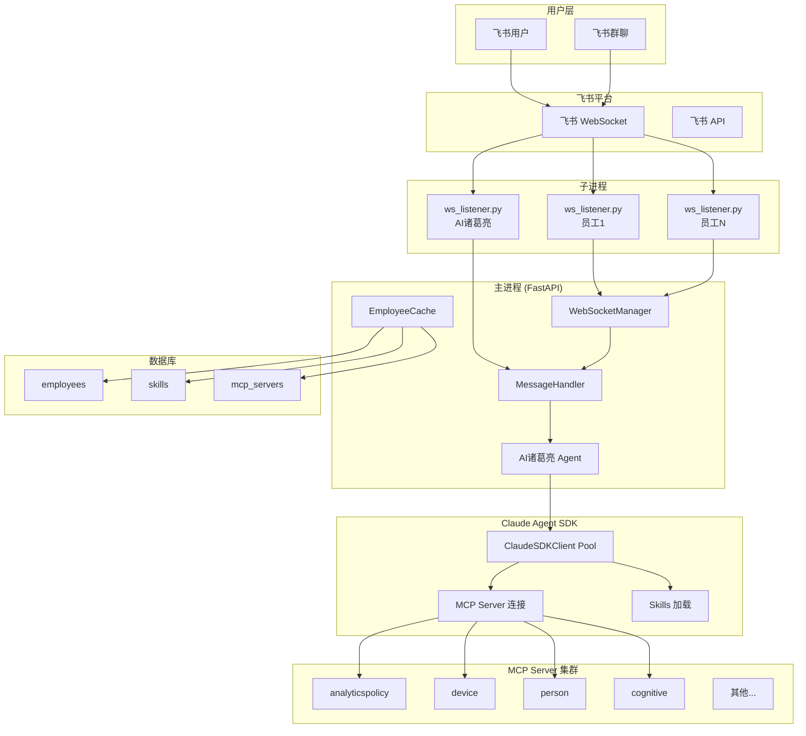
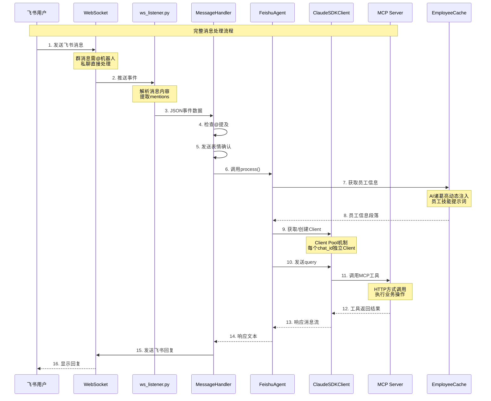
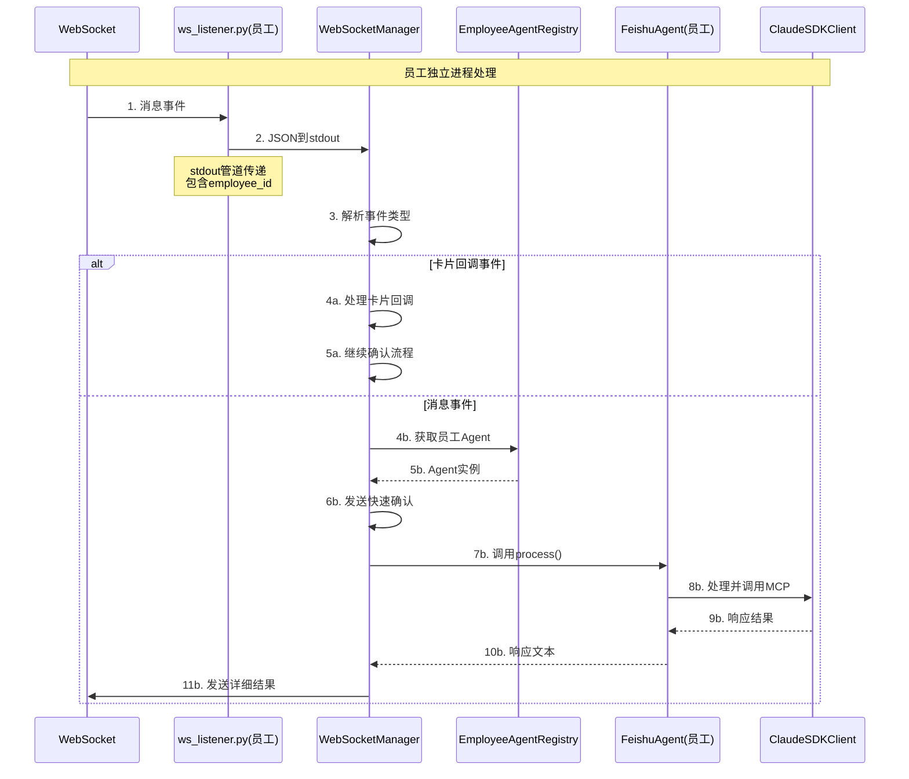
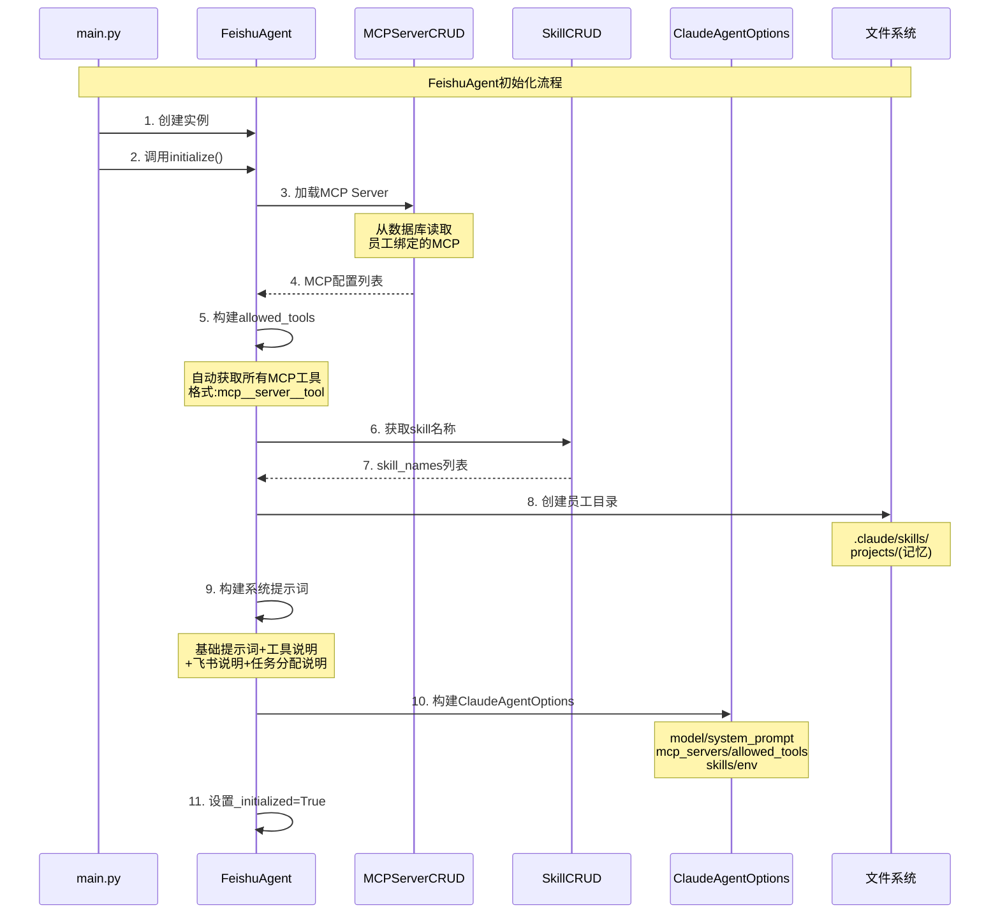
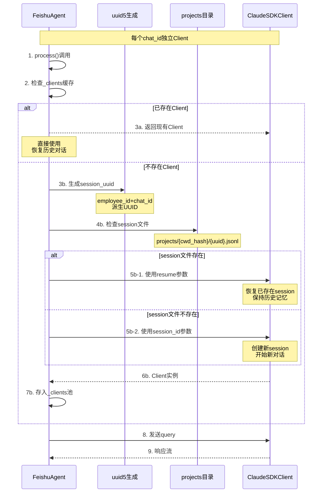
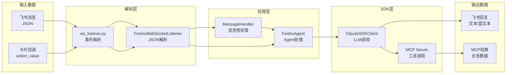

# 代码流程深度分析报告 - 飞书 Agent (AI诸葛亮)

## 文件信息
- **项目路径**: `/data/caidanfeng/project/ai/agent/agent-feishu`
- **分析时间**: 2026-05-29
- **语言**: Python 3.12
- **分析深度**: 递归深度分析

## 概述

飞书 Agent（AI诸葛亮）是一个基于 Claude Agent SDK 的多员工协作系统，实现了：
- **AI诸葛亮（总指挥）**: 负责分析任务、分配给员工
- **员工 Agent**: 执行具体任务，通过 MCP Server 调用业务系统
- **多 Chat 记忆隔离**: 每个 chat_id 独立的 Claude SDK Client
- **Skills 机制**: 员工绑定的技能配置，支持动态加载

---

## 系统架构流程图

### 1. 整体架构图



### 2. 生命周期流程图


### 3. 时序图

#### 3.1 总体时序图 - 消息处理流程



#### 3.2 子时序图 - 员工消息处理



#### 3.3 子时序图 - Agent 初始化



#### 3.4 子时序图 - Client Pool 机制



---

## 完整调用树

```
run.py:main()
├── cleanup_old_processes() [项目内部]
│   ├── subprocess.run(["pgrep", "-f", "ws_listener.py"]) [标准库]
│   ├── os.kill(pid, signal.SIGTERM) [标准库]
│   └── time.sleep(2) [标准库]
├── uvicorn.Config() [第三方库] - 配置HTTP服务
└── uvicorn.Server(config).serve() [第三方库] - 启动服务

main.py:lifespan()
├── WebSocketManager(on_message=on_employee_message) [项目内部]
│   └── _processes: Dict[str, EmployeeProcess] [数据结构]
├── get_employee_cache() [项目内部]
│   └── EmployeeCache() [类初始化]
│       └── _cache: Dict[str, dict]
│       └── _refresh_interval: 30秒
├── cache.refresh() [项目内部 - 详细分析]
│   ├── EmployeeCRUD.list() [数据库操作]
│   │   └── pymysql.connect() [第三方库]
│   │   └── cursor.execute("SELECT * FROM employees")
│   └── SkillCRUD.get_by_name() [数据库操作]
│       └── 获取skills详情
│   └── 更新_cache字典
├── FeishuAgent() [项目内部 - 详细分析]
│   └── employee_id = None (AI诸葛亮)
│   └── employee_config = {}
├── feishu_agent.initialize() [项目内部 - 核心流程]
│   ├── _load_mcp_servers() [项目内部]
│   │   └── AI诸葛亮返回空{} (不加载MCP)
│   ├── _get_bot_info() [项目内部]
│   │   └── lark.Client.builder() [第三方库]
│   ├── _get_skill_names() [项目内部]
│   │   └── 返回[] (AI诸葛亮无skills)
│   ├── _get_system_prompt() [项目内部 - 详细分析]
│   │   ├── get_bot_profile("commander") [项目内部]
│   │   │   └── BotProfile.load_prompt()
│   │   ├── 添加任务分配说明
│   │   └── 返回完整提示词
│   ├── 创建commander目录
│   └── ClaudeAgentOptions() [SDK配置]
├── MessageHandler(feishu_agent) [项目内部]
├── FeishuWebSocketListener() [项目内部]
│   └── asyncio.create_subprocess_exec(ws_listener.py) [启动子进程]
├── feishu_listener.start() [项目内部]
│   └── _read_messages() [异步任务]
│   └── _read_stderr() [异步任务]
├── 初始化员工Agents [循环处理]
│   ├── 创建.claude/skills目录
│   ├── SkillCRUD.get_by_name() [数据库]
│   ├── 写入SKILL.md文件
│   ├── 复制shared_scripts
│   └── registry.create_agent(employee_id, emp)
│       └── FeishuAgent(employee_id, employee_config)
│       └── agent.initialize() [员工初始化]
│           ├── _load_mcp_servers() [加载员工MCP]
│           ├── _get_skill_names() [获取员工skills]
│           ├── _get_system_prompt() [员工提示词]
│           └── ClaudeAgentOptions(skills=skill_names)
└── asyncio.create_task(cache.start_periodic_refresh()) [定时刷新]

ws_listener.py:main() [独立子进程]
├── argparse解析参数 [标准库]
├── EventDispatcherHandler.builder() [第三方库]
│   ├── register_p2_im_message_receive_v1(do_p2p_im_message_receive_v1)
│   └── register_p2_card_action_trigger(do_p2_card_action_trigger)
├── Client() [lark-oapi WebSocket客户端]
└── ws_client.start() [阻塞运行]
    └── do_p2p_im_message_receive_v1() [事件回调]
    │   ├── _extract_content() [项目内部]
    │   ├── _extract_mentions() [项目内部]
    │   └── print(json.dumps(event_data)) [输出到stdout]
    └── do_p2_card_action_trigger() [卡片回调]
    │   ├── 提取action_value
    │   └── print(json.dumps(event_data))
    └── [阻塞等待事件]

FeishuAgent.process() [核心消息处理]
├── 检查_initialized [状态检查]
├── AI诸葛亮: 获取员工缓存 [动态注入]
│   └── cache.get_employee_prompt_section()
│       └── 生成可用员工信息段落
├── 员工: 构建任务提示词 [直接处理]
├── _get_or_create_client(chat_id) [Client Pool]
│   ├── _generate_session_uuid(chat_id) [UUID派生]
│   ├── 检查session文件存在
│   ├── ClaudeAgentOptions(resume/session_id) [恢复/新建]
│   ├── ClaudeSDKClient(options) [创建Client]
│   └── await client.connect() [建立连接]
├── await client.query(prompt) [发送请求]
├── async for msg in client.receive_response() [接收响应流]
│   ├── AssistantMessage处理 [SDK类型]
│   │   ├── TextBlock: 累加response_text
│   │   └── ToolUseBlock: 记录tool_calls
│   └── ResultMessage: 结束循环
└── 返回response_text

MessageHandler.handle() [消息处理入口]
├── 构建MessageContext [上下文封装]
├── _is_bot_mentioned() [群消息检查]
├── _send_reaction("THUMBSUP") [飞书表情]
├── _extract_user_input() [内容提取]
│   └── 移除@提及和命令前缀
├── agent.process(user_input, context) [调用Agent]
├── _send_message(chat_id, response_text) [发送回复]
│   ├── 检测<at id="...">格式 [@员工]
│   ├── lark.Client.builder() [飞书API]
│   └── CreateMessageRequest [发送消息]
│   └── 富文本/纯文本格式处理

WebSocketManager.start_employee() [启动员工进程]
├── asyncio.create_subprocess_exec(ws_listener.py) [创建进程]
│   ├── --app-id, --app-secret, --employee-id
│   └── stdout=PIPE, stderr=PIPE
├── 存入_processes字典
├── asyncio.create_task(_read_messages()) [读取stdout]
├── asyncio.create_task(_read_stderr()) [写日志文件]
└── EmployeeCRUD.update_status("active", pid) [更新数据库]

WebSocketManager.restart_employee() [重启员工]
├── stop_employee() [停止旧进程]
├── 清理.claude/skills目录 [保留projects]
├── SkillCRUD.get_by_name() [读取skill]
├── 写入SKILL.md [更新配置]
├── 复制shared_scripts [脚本文件]
├── start_employee() [启动新进程]
└── _notify_ai_zhugeliang() [通知总指挥]
```

---

## 核心方法详细分析

### 1. FeishuAgent.initialize()

**位置**: `app/core/feishu_agent.py:62`

**输入输出**:
| 参数 | 类型 | 方向 | 描述 |
|------|------|------|------|
| self.employee_id | str | 输入 | 员工ID，None表示AI诸葛亮 |
| self.employee_config | Dict | 输入 | 员工配置信息 |
| 返回 | None | 输出 | 设置_initialized=True |

**内部实现**:
1. **加载 MCP Server**: AI诸葛亮返回空{}, 员工从数据库读取绑定的MCP
2. **获取机器人信息**: 从配置或飞书API获取bot_open_id
3. **构建 allowed_tools**: 自动获取所有MCP工具名称
4. **构建系统提示词**: 基础提示词+工具说明+飞书说明+任务分配说明
5. **设置工作目录**: 员工目录用于Skills和记忆存储
6. **构建 SDK 配置**: ClaudeAgentOptions包含所有配置

**调用关系**:
- 调用: `_load_mcp_servers()`, `_get_bot_info()`, `_get_skill_names()`, `_get_system_prompt()`
- 被调用: `lifespan()`, `registry.create_agent()`

---

### 2. FeishuAgent.process()

**位置**: `app/core/feishu_agent.py:383`

**输入输出**:
| 参数 | 类型 | 方向 | 描述 |
|------|------|------|------|
| user_input | str | 输入 | 用户消息内容 |
| context | MessageContext | 输入 | 消息上下文(chat_id, user_id等) |
| 返回 | str | 输出 | Agent响应文本 |

**内部实现**:
1. **检查初始化状态**: 未初始化返回错误
2. **构建消息提示词**: 
   - AI诸葛亮: 动态注入员工缓存信息
   - 员工: 直接构建任务处理提示词
3. **获取/创建 Client**: 每个chat_id独立的Client实例
4. **发送 query**: 调用SDK发送请求
5. **接收响应流**: 异步迭代处理响应消息
6. **累加响应文本**: 处理TextBlock和ToolUseBlock

**调用关系**:
- 调用: `_get_or_create_client()`, `client.query()`, `client.receive_response()`
- 被调用: `MessageHandler.handle()`, `on_employee_message()`

---

### 3. _get_or_create_client()

**位置**: `app/core/feishu_agent.py:144`

**输入输出**:
| 参数 | 类型 | 方向 | 描述 |
|------|------|------|------|
| chat_id | str | 输入 | 聊天ID |
| 返回 | ClaudeSDKClient | 输出 | SDK客户端实例 |

**内部实现**:
1. **检查缓存**: chat_id已存在则返回现有Client
2. **生成 UUID**: 从employee_id+chat_id派生session_uuid
3. **检查session文件**: 判断是否恢复历史session
4. **创建Client**: 
   - 存在: 使用`resume`参数恢复
   - 不存在: 使用`session_id`参数新建
5. **建立连接**: await client.connect()
6. **存入缓存**: _clients[chat_id] = client

**关键设计**: 实现多Chat记忆隔离，每个聊天独立记忆

---

### 4. lifespan()

**位置**: `app/main.py:592`

**输入输出**:
| 参数 | 类型 | 方向 | 描述 |
|------|------|------|------|
| app | FastAPI | 输入 | 应用实例 |
| 返回 | AsyncGenerator | 输出 | 生命周期上下文 |

**内部实现**:
1. **初始化 WebSocketManager**: 管理员工子进程
2. **刷新员工缓存**: 从数据库读取所有员工
3. **初始化 AI诸葛亮**: 创建总指挥Agent
4. **初始化消息处理器**: MessageHandler绑定Agent
5. **启动 WebSocket监听**: 创建子进程监听飞书事件
6. **初始化员工Agents**: 为每个员工创建Agent实例
7. **启动定时刷新**: 每30秒刷新员工缓存

**调用关系**:
- 调用: `WebSocketManager()`, `cache.refresh()`, `FeishuAgent()`, `MessageHandler()`, `FeishuWebSocketListener()`, `registry.create_agent()`
- 被调用: `FastAPI(lifespan=lifespan)`

---

### 5. WebSocketManager.start_employee()

**位置**: `app/core/ws_manager.py:64`

**输入输出**:
| 参数 | 类型 | 方向 | 描述 |
|------|------|------|------|
| employee_id | str | 输入 | 呡工ID |
| app_id | str | 输入 | 飞书App ID |
| app_secret | str | 输入 | 飞书App Secret |
| 返回 | bool | 输出 | 启动成功/失败 |

**内部实现**:
1. **创建子进程**: asyncio.create_subprocess_exec(ws_listener.py)
2. **传递参数**: app_id, app_secret, employee_id
3. **存入字典**: EmployeeProcess数据结构
4. **启动读取任务**: _read_messages() 和 _read_stderr()
5. **更新数据库**: 设置status='active', process_id

---

### 6. ws_listener.py 事件处理

**位置**: `ws_listener.py`

**核心流程**:
```
ws_client.start() [阻塞]
    ├── do_p2p_im_message_receive_v1() [消息回调]
    │   ├── _extract_content() [提取文本]
    │   ├── _extract_mentions() [提取@列表]
    │   └── print(json.dumps(event_data)) [输出到stdout]
    └── do_p2_card_action_trigger() [卡片回调]
        ├── 提取selected_value
        └── print(json.dumps(event_data))
```

**输出格式**: NDJSON到stdout，供主进程读取

---

## 数据流分析



**数据流转详细说明**:
1. **飞书消息 → ws_listener**: WebSocket推送事件
2. **ws_listener → stdout**: JSON格式事件数据
3. **stdout → WebSocketManager**: 管道读取
4. **WebSocketManager → Agent**: 调用process()
5. **Agent → ClaudeSDK**: 发送query
6. **ClaudeSDK → MCP**: 调用HTTP工具
7. **MCP → 业务系统**: 执行实际操作
8. **响应 → 飞书**: 发送回复消息

---

## 关键决策点

| 位置 | 条件 | 结果 | 说明 |
|------|------|------|------|
| MessageHandler:58 | `event.is_group and not _is_bot_mentioned` | 跳过处理 | 群消息未@机器人则忽略 |
| MessageHandler:63 | `sender_id == bot_open_id` | 跳过处理 | 过滤机器人自己的消息 |
| FeishuAgent:229 | `not self.employee_id` | 不加载MCP | AI诸葛亮不加载MCP Server |
| FeishuAgent:398 | `not self.employee_id` | 注入员工缓存 | AI诸葛亮动态获取员工信息 |
| FeishuAgent:149 | `chat_id in self._clients` | 返回现有Client | Client Pool缓存检查 |
| FeishuAgent:173 | `session_exists` | 使用resume参数 | 恢复历史对话记忆 |
| ws_listener:187 | `LARK_AVAILABLE` | 退出 | SDK不可用时终止 |
| main.py:508 | `event_type == 'card.action.trigger'` | 处理卡片回调 | 区分消息和卡片事件 |

---

## 异常处理

### 1. 进程清理
- **位置**: `run.py:21`
- **处理**: SIGTERM → SIGKILL 强制清理
- **场景**: 避免遗留进程占用端口

### 2. 消息处理异常
- **位置**: `MessageHandler:82`
- **处理**: 发送错误消息到飞书
- **场景**: Agent处理失败时反馈用户

### 3. Agent初始化失败
- **位置**: `main.py:702`
- **处理**: 记录错误日志，跳过该员工
- **场景**: 员工配置错误时不影响其他员工

### 4. WebSocket连接异常
- **位置**: `FeishuWebSocketListener:97`
- **处理**: 返回False，设置running=False
- **场景**: 飞书连接失败时优雅退出

### 5. MCP Server不存在
- **位置**: `FeishuAgent:239`
- **处理**: warning日志，跳过该Server
- **场景**: 配置错误时不中断初始化

---

## Skills 机制详解

### Skills 目录结构
```
employee_skills/{employee_id}/
├── .claude/
│   ├── skills/
│   │   ├── {skill_name}/
│   │   │   ├── SKILL.md       # 技能定义(YAML+Markdown)
│   │   │   └── scripts/       # 技能脚本
│   │   └── ...
│   └── settings.json          # 员工设置
├── projects/                   # 对话记忆(session文件)
│   └── {cwd_hash}/
│       └── {session_uuid}.jsonl
└── memory/                     # 长期记忆(可选)
```

### SKILL.md 格式
```yaml
---
name: skill_name
description: 技能描述
trigger_keyword: 触发关键词
---

# 技能内容

详细的技能说明和执行步骤...
```

### Skills 加载流程


---

## MCP Server 配置

| Server | URL | 提供的工具 |
|--------|-----|-----------|
| analyticspolicy | http://172.20.25.104:8004/mcp | policy_list, policy_create, task_create, task_delete, task_sts_switch |
| device | http://172.20.25.104:8006/mcp | device_list, device_create, device_deactivate |
| person | http://172.20.25.104:8002/mcp | person_page_list, person_deactivate, person_group_deactivate |
| cognitive | http://172.20.25.104:8008/mcp | video_fetch_frame, extract_feature |
| scenetemplate | http://172.20.25.104:8005/mcp | template_page_list, template_info |
| entity | http://172.20.25.104:8001/mcp | entity_list, entity_search |
| permission | http://172.20.25.104:8003/mcp | dept_tree, user_list |
| utility | http://172.20.25.104:8009/mcp | files_upload, batch_import |

---

## 总结

### 核心设计特点

1. **多进程架构**: 主进程管理，员工独立子进程监听飞书
2. **Client Pool机制**: 每个chat_id独立ClaudeSDKClient，实现记忆隔离
3. **Skills动态加载**: 从数据库读取配置，写入SKILL.md文件
4. **MCP HTTP调用**: 员工通过MCP Server调用业务系统
5. **动态员工注入**: AI诸葛亮每条消息动态获取员工缓存

### 关键技术栈

- **Claude Agent SDK**: ClaudeSDKClient, ClaudeAgentOptions
- **飞书SDK**: lark-oapi (WebSocket, API)
- **FastAPI**: 异步HTTP服务，生命周期管理
- **PyMySQL**: 数据库操作
- **asyncio**: 异步进程管理、消息处理

### 执行流程概览

```
启动(run.py)
  → lifespan初始化(组件加载)
  → WebSocket监听(飞书事件)
  → 消息处理(MessageHandler)
  → Agent处理(FeishuAgent.process)
  → SDK调用(ClaudeSDKClient)
  → MCP工具(HTTP调用业务)
  → 响应发送(飞书API)
```

---

**文档保存路径**: `/data/caidanfeng/project/sessions/claude/s300_feishu/s303_feishu_yuangong_1/code_flow_analysis_feishu_agent_deep.md`