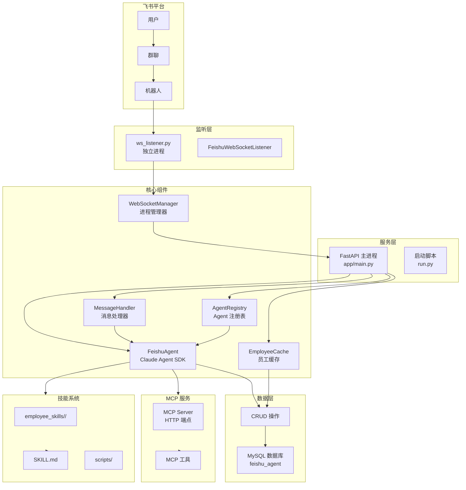
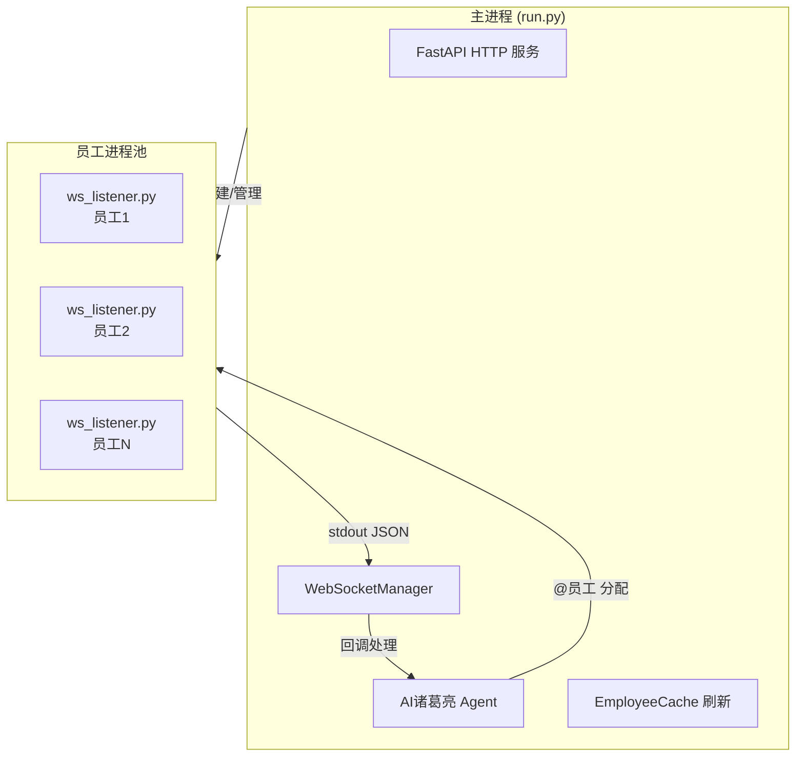
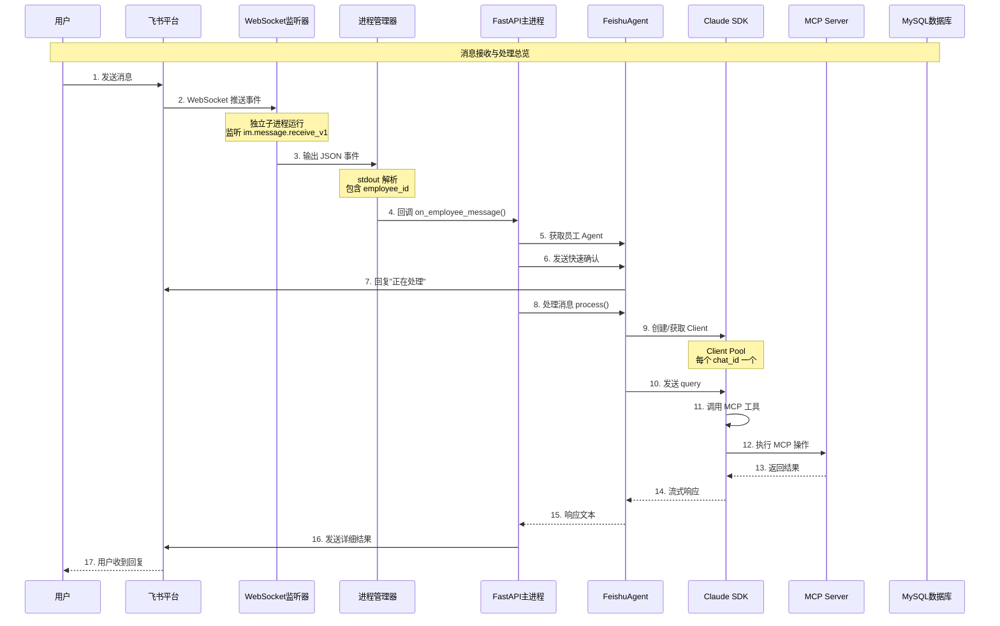
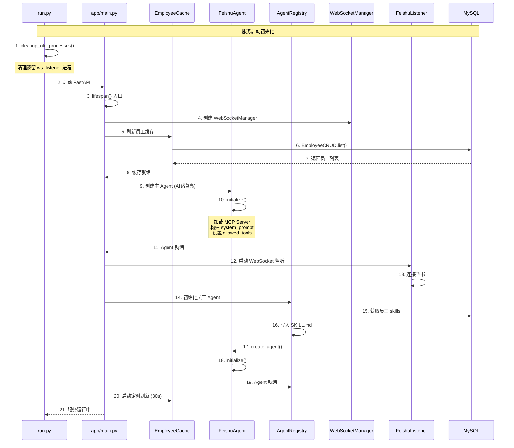
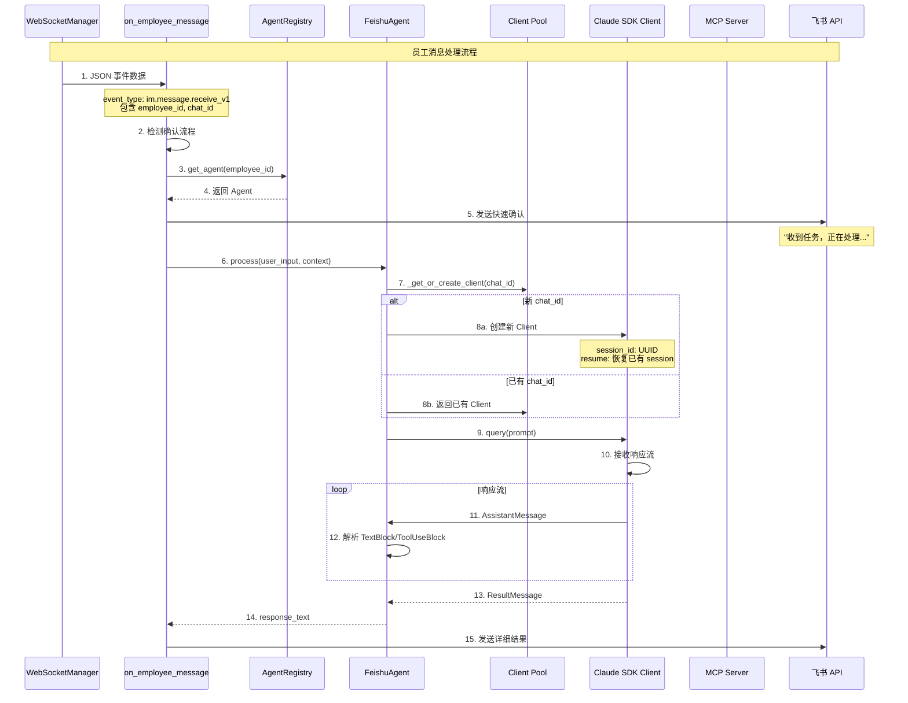
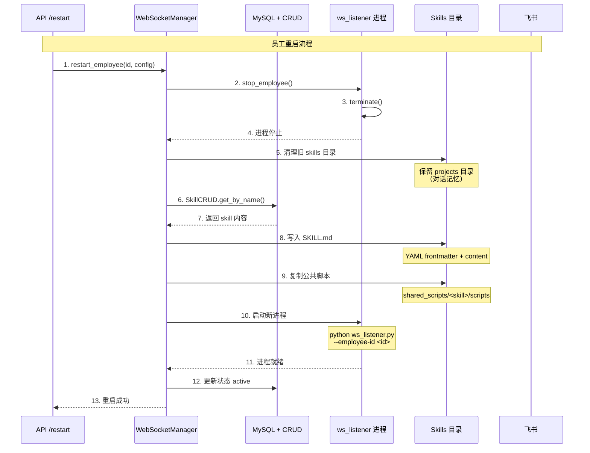
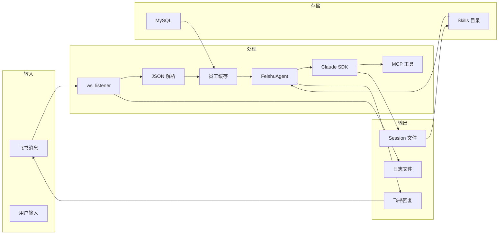

# 飞书 Agent 代码流程深度分析报告

## 文件信息
- **项目路径**: `/data/caidanfeng/project/ai/agent/agent-feishu`
- **分析时间**: 2026-05-29
- **语言**: Python 3.12
- **分析深度**: 递归深度分析
- **项目架构**: FastAPI + Claude Agent SDK + 多员工协作

## 概述

飞书 Agent（AI诸葛亮）是一个基于 Claude Agent SDK 的多员工协作系统，支持：
- **AI诸葛亮**: 任务分发机器人，负责接收用户请求并分配给对应员工
- **员工 Agent**: 拥有特定技能的任务执行者，通过 MCP Server 工具执行具体操作
- **记忆隔离**: 每个 chat_id 使用独立的 session，实现对话记忆隔离
- **Skills 机制**: 员工绑定的技能通过 SDK Skills 系统加载，实现能力扩展

## 系统架构流程图

### 1. 整体架构图



### 2. 生命周期流程图

```mermaid
flowchart LR
    Start["服务启动<br/>run.py"] --> Cleanup["清理旧进程"]
    Cleanup --> Init["初始化组件<br/>lifespan()"]
    Init --> CacheInit["刷新员工缓存"]
    CacheInit --> AgentInit["初始化主 Agent"]
    AgentInit --> WsStart["启动 WebSocket"]
    WsStart --> EmpInit["初始化员工 Agent"]
    EmpInit --> Running["服务运行"]
    Running --> Shutdown["关闭服务"]
    Shutdown --> WsStop["停止 WebSocket"]
    WsStop --> AgentDisconnect["断开 Agent"]
    AgentDisconnect --> CacheStop["停止缓存刷新"]
    CacheStop --> End["服务停止"]
```



### 3. 多进程架构图



## 时序图

### 3.1 总体时序图 - 消息处理完整流程



### 3.2 子时序图 - 服务启动流程



### 3.3 子时序图 - 员工处理消息



### 3.4 子时序图 - 员工重启流程



## 完整调用树

```
run.py
├── cleanup_old_processes() - 清理旧进程
│   ├── subprocess.run(["pgrep", "-f", "ws_listener.py"])
│   └── os.kill(pid, signal.SIGTERM/SIGKILL)
└── main() - 主入口
    ├── uvicorn.Config() - 创建配置
    └── uvicorn.Server.serve() - 启动服务
        │
        └── app/main.py (FastAPI)
            ├── lifespan() - 应用生命周期
            │   ├── WebSocketManager(on_message=on_employee_message) - 创建管理器
            │   ├── EmployeeCache.refresh() - 刷新员工缓存
            │   │   └── EmployeeCRUD.list() - 查询所有员工
            │   │       └── get_connection() - 获取数据库连接
            │   │       └── cursor.execute("SELECT * FROM employees")
            │   ├── FeishuAgent() - 创建主 Agent
            │   │   └── initialize()
            │   │       ├── _load_mcp_servers() - 加载 MCP Server
            │   │       │   └── MCPServerCRUD.get_by_name() - 查询 MCP 配置
            │   │       ├── _get_system_prompt() - 构建系统提示词
            │   │       │   └── get_bot_profile() - 获取角色配置
            │   │       │   └── SkillCRUD.get_by_name() - 获取技能信息
            │   │       └── ClaudeAgentOptions() - 构建 SDK 配置
            │   ├── MessageHandler() - 创建消息处理器
            │   ├── FeishuWebSocketListener() - 启动监听
            │   │   └── start() - 启动 WebSocket
            │   └── AgentRegistry.create_agent() - 初始化员工 Agent
            │       └── FeishuAgent.initialize()
            │           └── 写入 SKILL.md 到员工目录
            │           └── 复制公共脚本
            │   └── EmployeeCache.start_periodic_refresh() - 定时刷新
            │   │
            │   └── yield - 服务运行
            │   │
            │   └── 关闭流程
            │       ├── ws_manager.stop_all()
            │       ├── feishu_listener.stop()
            │       ├── agent.disconnect_all()
            │       └── registry.remove_agent()
            │
            ├── 路由处理
            │   ├── /health - 健康检查
            │   ├── /status - 状态查询
            │   ├── /employees - 员工管理
            │   │   ├── list_employees() - 获取员工列表
            │   │   ├── create_employee() - 创建员工
            │   │   ├── restart_employee() - 重启员工
            │   │   │   └── ws_manager.restart_employee()
            │   │   │       ├── stop_employee()
            │   │   │       ├── 写入 SKILL.md
            │   │   │       └── start_employee()
            │   │   │           └── asyncio.create_subprocess_exec()
            │   │   └── delete_employee() - 删除员工
            │   └── /internal - 内部 API
            │
            └── on_employee_message() - 消息回调
                ├── detect_confirm_scenario() - 检测确认流程
                ├── get_agent_registry().get_agent() - 获取 Agent
                ├── send_employee_message() - 发送快速确认
                └── agent.process() - 处理消息
                    ├── _get_or_create_client() - 获取/创建 Client
                    │   ├── _generate_session_uuid() - 生成 session ID
                    │   ├── 检查 session 文件是否存在
                    │   └── ClaudeSDKClient() - 创建 Client
                    │       ├── ClaudeAgentOptions(resume/session_id)
                    │       └── client.connect()
                    └── query() - 发送请求
                    └── receive_response() - 接收响应
                        ├── AssistantMessage - 解析消息
                        │   ├── TextBlock - 文本内容
                        │   └── ToolUseBlock - 工具调用
                        └── ResultMessage - 结束信号
                └── send_employee_message() - 发送结果

ws_listener.py (独立进程)
├── main() - 主入口
│   ├── argparse 解析命令行参数
│   ├── EventDispatcherHandler.builder() - 创建事件处理器
│   │   ├── register_p2_im_message_receive_v1()
│   │   └── register_p2_card_action_trigger()
│   └── Client() - 创建 WebSocket 客户端
│       └── start() - 启动监听
│
├── do_p2p_im_message_receive_v1() - 处理消息
│   ├── _extract_content() - 提取消息内容
│   │   ├── json.loads() - 解析 JSON
│   │   └── _extract_post_text() - 提取富文本
│   ├── _extract_mentions() - 提取 @提及
│   └── print(json.dumps()) - 输出 JSON
│
└── do_p2_card_action_trigger() - 处理卡片回调
    └── print(json.dumps()) - 输出 JSON
```

## 核心方法详细分析

### 1. FeishuAgent.initialize()

**位置**: `app/core/feishu_agent.py:62-137`

**输入输出**:
| 参数 | 类型 | 方向 | 描述 |
|------|------|------|------|
| employee_id | str | 输入 | 员工 ID（None 为 AI诸葛亮） |
| employee_config | dict | 输入 | 员工配置（skills, mcp_servers 等） |
| _mcp_servers | dict | 输出 | MCP Server 配置字典 |
| _allowed_tools | list | 输出 | 允许的工具列表 |
| _client_options | ClaudeAgentOptions | 输出 | SDK 配置对象 |

**内部实现**:
1. 加载 MCP Server（HTTP 方式）- 从数据库查询
2. 获取机器人信息 - bot_open_id
3. 构建 allowed_tools - 自动获取所有 MCP 工具名
4. 构建系统提示词 - 包含身份、工具权限、飞书说明
5. 设置工作目录 - 员工目录或 commander 目录
6. 构建 SDK 配置 - ClaudeAgentOptions
7. 设置 CLAUDE_CONFIG_DIR - session 文件保存在员工目录

**调用关系**:
- 调用: `_load_mcp_servers()`, `_get_system_prompt()`, `_get_skill_names()`
- 被调用: `lifespan()`, `AgentRegistry.create_agent()`

---

### 2. FeishuAgent.process()

**位置**: `app/core/feishu_agent.py:383-476`

**输入输出**:
| 参数 | 类型 | 方向 | 描述 |
|------|------|------|------|
| user_input | str | 输入 | 用户消息内容 |
| context | MessageContext | 输入 | 消息上下文（chat_id, user_id） |
| response_text | str | 返回 | Agent 响应文本 |

**内部实现**:
1. 构建 prompt - 包含员工信息（AI诸葛亮）或任务说明（员工）
2. 获取或创建 Client - 每个 chat_id 一个独立 Client
3. 发送 query - 调用 SDK
4. 接收响应流 - 异步迭代
5. 解析 AssistantMessage - TextBlock + ToolUseBlock
6. 等待 ResultMessage - 结束信号
7. 返回响应文本

**调用关系**:
- 调用: `_get_or_create_client()`, `client.query()`, `client.receive_response()`
- 被调用: `MessageHandler.handle()`, `on_employee_message()`

---

### 3. FeishuAgent._get_or_create_client()

**位置**: `app/core/feishu_agent.py:144-210`

**输入输出**:
| 参数 | 类型 | 方向 | 描述 |
|------|------|------|------|
| chat_id | str | 输入 | 聊天 ID |
| client | ClaudeSDKClient | 返回 | SDK 客户端实例 |

**内部实现**:
1. 检查 Client 池 - 是否已有对应 chat_id 的 Client
2. 生成 session UUID - 从 employee_id + chat_id 派生
3. 检查 session 文件是否存在 - 决定使用 resume 或 session_id
4. 创建 ClaudeSDKClient - 连接 SDK
5. 存入 Client 池 - 按 chat_id 存储

**关键逻辑**:
- 使用 UUID.uuid5 生成确定性 session_id，保证同一 chat_id 使用相同 session
- resume 参数恢复已存在 session，避免 "Session ID already in use" 错误
- Client 池实现多 chat 记忆隔离

---

### 4. WebSocketManager.start_employee()

**位置**: `app/core/ws_manager.py:64-102`

**输入输出**:
| 参数 | 类型 | 方向 | 描述 |
|------|------|------|------|
| employee_id | str | 输入 | 员工 ID |
| app_id | str | 输入 | 飞书 App ID |
| app_secret | str | 输入 | 飞书 App Secret |
| success | bool | 返回 | 启动是否成功 |

**内部实现**:
1. 获取 Python 路径 - sys.executable
2. 创建子进程 - asyncio.create_subprocess_exec()
3. 传入参数 --employee-id, --app-id, --app-secret
4. 创建 EmployeeProcess 对象 - 存入 _processes
5. 启动消息读取任务 - _read_messages(), _read_stderr()

---

### 5. WebSocketManager.restart_employee()

**位置**: `app/core/ws_manager.py:129-220`

**输入输出**:
| 参数 | 类型 | 方向 | 描述 |
|------|------|------|------|
| employee_id | str | 输入 | 员工 ID |
| employee_config | dict | 输入 | 员工配置 |
| success | bool | 返回 | 重启是否成功 |

**内部实现**:
1. 停止旧进程 - stop_employee()
2. 清理旧 skills 目录 - 保留 projects（对话记忆）
3. 从数据库读取 skills - SkillCRUD.get_by_name()
4. 写入 SKILL.md - YAML frontmatter + content
5. 复制公共脚本 - shared_scripts/ 到员工目录
6. 启动新进程 - start_employee()
7. 更新数据库状态 - EmployeeCRUD.update_status()
8. 通知 AI诸葛亮 - _notify_ai_zhugeliang()

---

### 6. MessageHandler.handle()

**位置**: `app/handlers/message_handler.py:45-86`

**输入输出**:
| 参数 | 类型 | 方向 | 描述 |
|------|------|------|------|
| event | FeishuMessageEvent | 输入 | 飞书消息事件 |
| response_text | str | 返回 | 发送到飞书的回复 |

**内部实现**:
1. 构建 MessageContext - chat_id, user_id, message_id
2. 检查是否需要处理 - 群消息需 @机器人
3. 过滤机器人自己的消息
4. 发送表情反应 - THUMBSUP
5. 提取实际消息内容 - 移除 @提及
6. 调用 Agent 处理 - agent.process()
7. 发送回复消息 - _send_message()

---

### 7. on_employee_message()

**位置**: `app/main.py:499-581`

**输入输出**:
| 参数 | 类型 | 方向 | 描述 |
|------|------|------|------|
| data | dict | 输入 | WebSocket 消息 JSON |
| 无返回值 | - | - | 直接发送消息到飞书 |

**内部实现**:
1. 解析事件类型 - im.message.receive_v1 或 card.action.trigger
2. 处理卡片回调 - on_card_callback()
3. 检测确认流程 - detect_confirm_scenario()
4. 发送快速确认 - "收到任务，正在处理..."
5. 构建 MessageContext
6. 调用 Agent 处理 - agent.process()
7. 发送详细结果

---

### 8. ws_listener.do_p2p_im_message_receive_v1()

**位置**: `ws_listener.py:49-76`

**输入输出**:
| 参数 | 类型 | 方向 | 描述 |
|------|------|------|------|
| data | P2ImMessageReceiveV1 | 输入 | 飞书 SDK 消息对象 |
| stdout JSON | str | 输出 | 打印到标准输出 |

**内部实现**:
1. 提取 message, sender 信息
2. 构建事件数据 dict
3. 提取消息内容 - _extract_content()
4. 提取 @提及 - _extract_mentions()
5. 输出 JSON - print(json.dumps())

---

### 9. EmployeeCache.refresh()

**位置**: `app/core/employee_cache.py:22-73`

**输入输出**:
| 参数 | 类型 | 方向 | 描述 |
|------|------|------|------|
| 无参数 | - | - | 刷新缓存 |
| _cache | dict | 输出 | 员工信息缓存 |

**内部实现**:
1. 查询所有员工 - EmployeeCRUD.list()
2. 清理不在数据库的员工 - 移除过期缓存
3. 过滤非活跃员工 - status != active
4. 获取 skills 详情 - SkillCRUD.get_by_name()
5. 更新缓存 - 保存 skill_names 和 skills_detail

---

### 10. EmployeeCache.get_employee_prompt_section()

**位置**: `app/core/employee_cache.py:131-163`

**输入输出**:
| 参数 | 类型 | 方向 | 描述 |
|------|------|------|------|
| 无参数 | - | - | 生成提示词 |
| prompt_section | str | 返回 | 员工信息提示词段落 |

**内部实现**:
1. 构建 "可用员工" 段落
2. 遍历缓存中的员工
3. 添加员工名称和 bot_open_id
4. 添加技能描述和触发关键词
5. 添加 @员工格式说明和示例

## 数据流分析

### 数据流图



### 数据流转详情

| 数据类型 | 来源 | 目标 | 格式 |
|---------|------|------|------|
| 飞书消息 | WebSocket | ws_listener stdout | JSON |
| 员工事件 | ws_listener | WsManager | JSON (employee_id, chat_id, content) |
| 员工配置 | MySQL | EmployeeCache | dict (id, name, skills, mcp_servers) |
| Skill 内容 | MySQL | SKILL.md | YAML frontmatter + Markdown |
| Agent prompt | process() | Claude SDK | string (包含员工信息) |
| MCP 工具调用 | Claude SDK | MCP Server | HTTP JSON |
| Session 记录 | Claude SDK | projects/<hash>/<uuid>.jsonl | JSONL |

## 关键决策点

| 位置 | 条件 | 结果 | 说明 |
|------|------|------|------|
| run.py:22 | pgrep 找到旧进程 | 清理进程 | 避免遗留进程冲突 |
| ws_listener.py:64 | event.is_group | 检查 @提及 | 群消息需 @机器人 |
| feishu_agent.py:229 | employee_id 为空 | AI诸葛亮不加载 MCP | 总指挥只分配任务 |
| feishu_agent.py:148 | chat_id in _clients | 返回已有 Client | Client 池复用 |
| feishu_agent.py:159 | session_file.exists() | 使用 resume | 恢复已有 session |
| ws_manager.py:143 | skills_dir.exists() | 清理但保留 projects | 保留对话记忆 |
| main.py:533 | detect_confirm_scenario() | 发送交互卡片 | 确认流程 |

## 异常处理

### 1. WebSocket 连接异常
- **位置**: ws_listener.py
- **处理**: auto_reconnect=True 自动重连
- **日志**: stderr 输出到员工日志文件

### 2. Agent 初始化失败
- **位置**: main.py lifespan
- **处理**: 捕获异常，记录日志，继续启动其他员工

### 3. MCP 工具调用失败
- **位置**: Claude SDK
- **处理**: 返回错误信息，Agent 在响应中说明

### 4. 消息发送失败
- **位置**: message_handler.py
- **处理**: 记录错误日志，不中断处理流程

### 5. 进程终止超时
- **位置**: ws_manager.py stop_employee
- **处理**: 5秒超时后 SIGKILL 强制终止

## 性能考虑

### 1. Client Pool 设计
- 每个 chat_id 一个独立 Client
- 避免 "Session ID already in use" 错误
- 支持多对话并行处理

### 2. 员工缓存定时刷新
- 每 30 秒刷新一次
- 减少 MySQL 查询压力
- AI诸葛亮 动态获取最新员工信息

### 3. 独立进程隔离
- 每个员工独立 WebSocket 进程
- 避免 WebSocket 连接共享冲突
- 进程崩溃不影响其他员工

### 4. Session 持久化
- 使用 resume 参数恢复 session
- 对话记忆保存在 JSONL 文件
- 服务重启不丢失记忆

## 总结

### 核心架构特点

1. **多进程架构**: 主进程管理多个员工子进程，实现隔离和并发
2. **Client Pool**: 每个 chat_id 独立 Client，实现记忆隔离
3. **Skills 动态加载**: 从数据库写入 SKILL.md，重启时更新
4. **MCP HTTP 方式**: 通过 HTTP 调用 MCP Server，无需本地进程

### 设计亮点

- **AI诸葛亮**: 总指挥只分配任务，不加载 MCP，避免直接操作
- **记忆持久化**: UUID.uuid5 生成确定性 session_id，resume 恢复已有 session
- **交互卡片**: 确认流程使用飞书交互卡片，提升用户体验
- **进程真实检查**: 通过 os.kill(pid, 0) 验证进程存活状态

### 可优化方向

- 增加 WebSocket 连接池管理
- 优化 Skills 同步机制（增量更新）
- 增加健康检查和自动恢复机制
- 支持 Agent 状态持久化