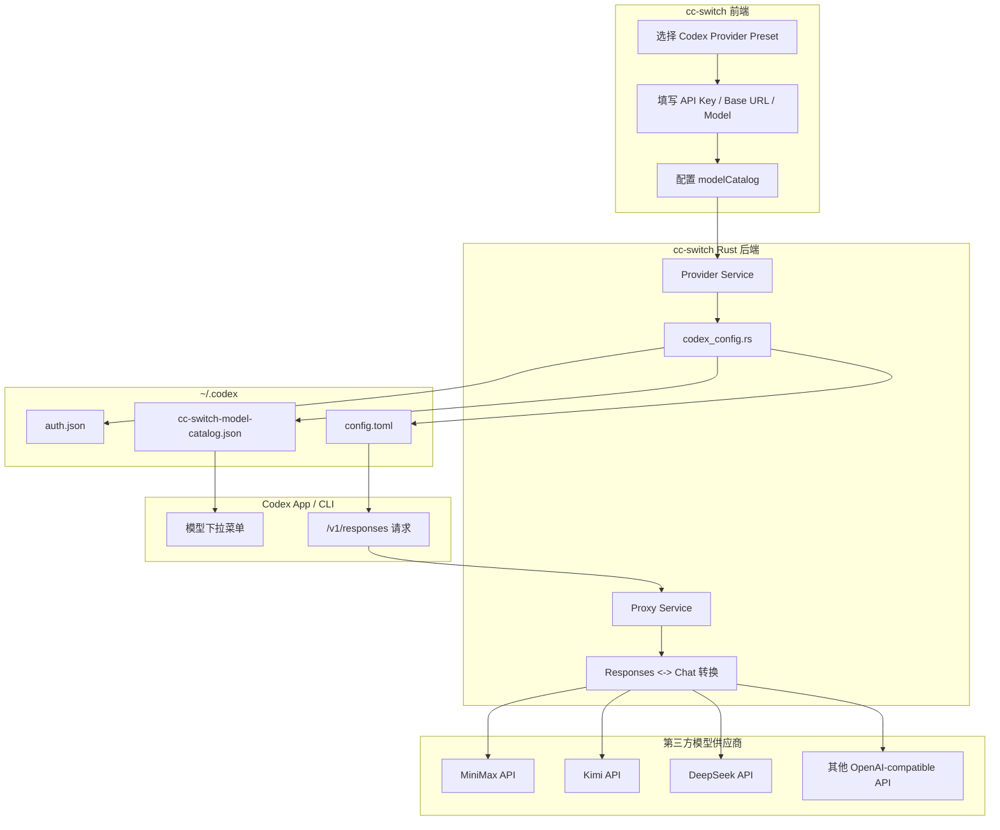
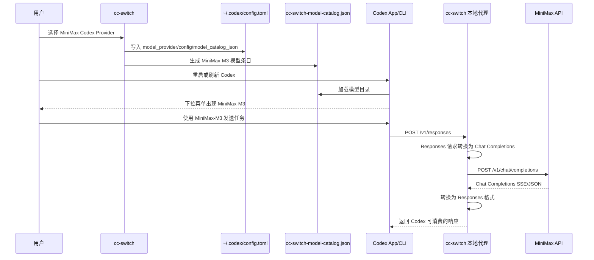

# cc-switch 实现 Codex 第三方大模型切换调研与落地方案

## 文件信息
- **调研项目路径**: `/data/caidanfeng/project/ai/tool/cc-switch`
- **目标文档路径**: `/data/caidanfeng/project/doc/mm-doc/agent/tool/codex-third-party-model-integration.md`
- **分析时间**: 2026-06-22
- **项目类型**: Tauri 桌面应用 + React 前端 + Rust 后端代理
- **结论**: 可以实现，而且 `cc-switch` 已经具备主要能力；当前重点是完善 MiniMax-M3 等模型预设、验证上游协议细节，以及决定是否合并官方 GPT 模型目录。

## 概述

目标效果是让 Codex 像截图中一样，在模型选择菜单中出现第三方模型，例如 `MiniMax-M3`，并且切换后能够正常由 Codex 发起请求、由第三方模型完成响应。

Codex 官方公开支持的底层机制包括：
- `~/.codex/config.toml` 中的 `model_provider` / `[model_providers.*]`
- `model_catalog_json` 指向自定义模型目录 JSON
- 支持 Responses API 和已弃用但仍可用的 Chat Completions API

`cc-switch` 当前已经不是简单修改 `model` 字段，而是实现了更完整的路径：
1. 在 UI 中选择 Codex provider preset。
2. 写入 Codex live config：`~/.codex/config.toml`。
3. 生成 `~/.codex/cc-switch-model-catalog.json`。
4. 通过 `model_catalog_json` 让模型出现在 Codex 下拉菜单中。
5. 对于只支持 OpenAI Chat Completions 的第三方供应商，由 cc-switch 本地代理完成 Codex Responses API 到 Chat Completions 的转换。

---

## 核心结论

### 1. 可实现程度

`cc-switch` 已经具备 80% 以上的能力：
- 已有 Codex provider 预设体系。
- 已有 MiniMax、DeepSeek、Kimi、GLM、Bailian、StepFun、SiliconFlow 等 Codex 预设。
- 已有 `modelCatalog` 到 Codex `model_catalog_json` 的生成逻辑。
- 已有 Codex Responses -> OpenAI Chat Completions 的代理转换逻辑。
- 已有 MiniMax reasoning 参数适配：`reasoning_split` 和 `reasoning_details`。
- 已有 provider-scoped token 写入逻辑，可避免覆盖用户官方 Codex 登录状态。

### 2. 当前缺口

当前 MiniMax 预设写的是 `MiniMax-M2.7`，不是截图里的 `MiniMax-M3`：

```ts
{
  name: "MiniMax",
  config: generateThirdPartyConfig(
    "minimax",
    "https://api.minimaxi.com/v1",
    "MiniMax-M2.7",
  ),
  apiFormat: "openai_chat",
  modelCatalog: modelCatalog([
    {
      model: "MiniMax-M2.7",
      displayName: "MiniMax M2.7",
      contextWindow: 200000,
    },
  ]),
}
```

要实现截图效果，需要把 MiniMax 预设扩展为 `MiniMax-M3`，或同时保留 `MiniMax-M2.7` 与 `MiniMax-M3`。

### 3. 重要限制

Codex 的 `model_catalog_json` 是替换模型目录，不是追加模型目录。

如果只把 MiniMax 写入 `cc-switch-model-catalog.json`，Codex 下拉里会只显示 cc-switch 生成的模型。如果希望截图那样同时显示 GPT 和 MiniMax，需要：
- 方案 A：生成 catalog 时合并官方 GPT 模型条目和第三方模型条目。
- 方案 B：让所有模型都走同一个本地代理 provider，由本地代理根据 model slug 路由到官方 OpenAI 或第三方供应商。
- 方案 C：保持现状，每次切换 provider 后下拉菜单只显示当前 provider 的模型集合。

---

## 关键代码位置

### 1. Codex 供应商预设

路径：

```text
/data/caidanfeng/project/ai/tool/cc-switch/src/config/codexProviderPresets.ts
```

职责：
- 定义 Codex provider preset。
- 定义 `auth`、`config.toml` 模板。
- 定义 `apiFormat`。
- 定义 `modelCatalog`。
- 定义 provider 特有 reasoning 能力。

关键函数：

```ts
export function generateThirdPartyAuth(apiKey: string): Record<string, any> {
  return {
    OPENAI_API_KEY: apiKey || "",
  };
}

export function generateThirdPartyConfig(
  providerName: string,
  baseUrl: string,
  modelName = "gpt-5.5",
): string {
  return `model_provider = "custom"
model = ${tomlString(modelName)}
model_reasoning_effort = "high"
disable_response_storage = true

[model_providers.custom]
name = ${tomlString(providerName)}
base_url = ${tomlString(baseUrl)}
wire_api = "responses"
requires_openai_auth = true`;
}
```

说明：
- Codex 侧仍配置 `wire_api = "responses"`。
- 实际第三方如果是 Chat Completions，由 cc-switch 本地代理转换。
- `requires_openai_auth = true` 用于让 Codex 使用 OpenAI 认证链路或代理认证链路。

### 2. Codex config 与 model catalog 生成

路径：

```text
/data/caidanfeng/project/ai/tool/cc-switch/src-tauri/src/codex_config.rs
```

关键常量：

```rust
pub const CC_SWITCH_CODEX_MODEL_PROVIDER_ID: &str = "custom";
pub const CC_SWITCH_CODEX_MODEL_CATALOG_FILENAME: &str = "cc-switch-model-catalog.json";
const CODEX_MODEL_CATALOG_TEMPLATE_SLUG: &str = "gpt-5.5";
```

职责：
- 找到 Codex 配置目录：`~/.codex`
- 写入 `auth.json` 和 `config.toml`
- 生成 `cc-switch-model-catalog.json`
- 注入或移除 `model_catalog_json`
- 读取 live config 并反解析 catalog
- 保留官方 Codex 登录，第三方 key 写入 provider scoped token

关键链路：

```rust
pub fn prepare_codex_config_text_with_model_catalog(
    settings: &Value,
    config_text: &str,
) -> Result<String, AppError> {
    let catalog_path = get_codex_model_catalog_path();

    if let Some(catalog) = codex_model_catalog_from_settings(settings, config_text)? {
        let config_text = set_codex_model_catalog_json_field(config_text, Some(&catalog_path))?;
        write_json_file(&catalog_path, &catalog)?;
        Ok(config_text)
    } else {
        set_codex_model_catalog_json_field(config_text, None)
    }
}
```

生成后的 Codex 配置大致为：

```toml
model_provider = "custom"
model = "MiniMax-M3"
model_reasoning_effort = "high"
disable_response_storage = true
model_catalog_json = "cc-switch-model-catalog.json"

[model_providers.custom]
name = "minimax"
base_url = "http://127.0.0.1:<cc-switch-proxy-port>/v1"
wire_api = "responses"
requires_openai_auth = true
experimental_bearer_token = "<provider api key>"
```

生成后的 catalog 大致为：

```json
{
  "models": [
    {
      "slug": "MiniMax-M3",
      "display_name": "MiniMax M3",
      "description": "MiniMax M3",
      "visibility": "list",
      "supported_in_api": true,
      "priority": 1000,
      "default_reasoning_level": "medium",
      "supported_reasoning_levels": [
        { "effort": "low", "description": "Fast responses with lighter reasoning" },
        { "effort": "medium", "description": "Balances speed and reasoning depth for everyday tasks" },
        { "effort": "high", "description": "Greater reasoning depth for complex problems" },
        { "effort": "xhigh", "description": "Extra high reasoning depth for complex problems" }
      ],
      "context_window": 200000,
      "max_context_window": 200000
    }
  ]
}
```

### 3. Codex 本地代理与协议转换

路径：

```text
/data/caidanfeng/project/ai/tool/cc-switch/src-tauri/src/proxy/providers/codex.rs
/data/caidanfeng/project/ai/tool/cc-switch/src-tauri/src/proxy/providers/transform_codex_chat.rs
/data/caidanfeng/project/ai/tool/cc-switch/src-tauri/src/proxy/handlers.rs
/data/caidanfeng/project/ai/tool/cc-switch/src-tauri/src/proxy/server.rs
```

职责：
- 识别 Codex 客户端请求。
- 判断 provider 是否需要 Chat Completions。
- 将 Codex Responses API 请求转换为 OpenAI Chat Completions 请求。
- 将 Chat Completions 响应转换回 Codex 期待的 Responses 格式。
- 处理 streaming、reasoning、usage、error mapping。

关键判断：

```rust
pub fn should_convert_codex_responses_to_chat(provider: &Provider, endpoint: &str) -> bool {
    matches!(
        path,
        "/responses" | "/v1/responses" | "/responses/compact" | "/v1/responses/compact"
    ) && codex_provider_uses_chat_completions(provider)
}
```

MiniMax reasoning 推断：

```rust
if haystack.contains("minimax") {
    return Some(CodexChatReasoningConfig {
        supports_thinking: Some(true),
        supports_effort: Some(false),
        thinking_param: Some("reasoning_split".to_string()),
        effort_param: Some("none".to_string()),
        effort_value_mode: None,
        output_format: Some("reasoning_details".to_string()),
    });
}
```

---

## 整体架构流程图



## 请求生命周期



---

## MiniMax-M3 落地改造方案

### 方案一：只把 MiniMax 预设升级到 M3

适合目标：
- 当前只需要 MiniMax-M3。
- 不要求 M2.7 保留。

修改位置：

```text
src/config/codexProviderPresets.ts
```

建议修改：

```ts
{
  name: "MiniMax",
  websiteUrl: "https://platform.minimaxi.com",
  apiKeyUrl: "https://platform.minimaxi.com/subscribe/coding-plan",
  auth: generateThirdPartyAuth(""),
  config: generateThirdPartyConfig(
    "minimax",
    "https://api.minimaxi.com/v1",
    "MiniMax-M3",
  ),
  endpointCandidates: ["https://api.minimaxi.com/v1"],
  apiFormat: "openai_chat",
  modelCatalog: modelCatalog([
    {
      model: "MiniMax-M3",
      displayName: "MiniMax M3",
      contextWindow: 200000,
    },
  ]),
  codexChatReasoning: {
    supportsThinking: true,
    supportsEffort: false,
    thinkingParam: "reasoning_split",
    effortParam: "none",
    outputFormat: "reasoning_details",
  },
  category: "cn_official",
  partnerPromotionKey: "minimax_cn",
  icon: "minimax",
  iconColor: "#FF6B6B",
}
```

风险：
- 如果 MiniMax-M3 的模型 ID 并不是 `MiniMax-M3`，请求会失败。
- 如果 MiniMax-M3 的 context window 不同，需要按官方文档修正。
- 如果 MiniMax-M3 的 reasoning 参数发生变化，需要同步修改 `codexChatReasoning`。

### 方案二：MiniMax 同时保留 M2.7 和 M3

适合目标：
- 用户可以在 Codex 下拉菜单里同时选择 `MiniMax-M2.7` 与 `MiniMax-M3`。

建议配置：

```ts
config: generateThirdPartyConfig(
  "minimax",
  "https://api.minimaxi.com/v1",
  "MiniMax-M3",
),
modelCatalog: modelCatalog([
  {
    model: "MiniMax-M3",
    displayName: "MiniMax M3",
    contextWindow: 200000,
  },
  {
    model: "MiniMax-M2.7",
    displayName: "MiniMax M2.7",
    contextWindow: 200000,
  },
]),
```

当前 `apply_codex_chat_upstream_model` 已支持 catalog 模型直通：

```rust
if catalog_model_ids.contains(request_model) {
    return Some(request_model.to_string());
}
```

因此，只要 Codex 请求里的 `model` 是 catalog 中的模型 ID，代理就会把该模型传给上游。

### 方案三：同时显示 GPT 与第三方模型

适合目标：
- 下拉菜单里同时出现 `GPT-5.5`、`GPT-5.4`、`MiniMax-M3` 等。

需要额外改造：
1. 生成 catalog 时保留官方 Codex 模型条目。
2. 追加第三方模型条目。
3. 本地代理按模型 ID 做路由：
   - `gpt-*` -> OpenAI / ChatGPT Codex 官方链路
   - `MiniMax-*` -> MiniMax
   - `kimi-*` -> Kimi
   - `deepseek-*` -> DeepSeek

当前 cc-switch 的 provider 模型更偏“切换 provider 后显示当前 provider 的模型”。如果要做“统一模型池”，需要新增跨 provider 路由表，而不是只改 preset。

---

## 写入后的 Codex 配置预期

切换到 MiniMax-M3 后，`~/.codex/config.toml` 应包含：

```toml
model_provider = "custom"
model = "MiniMax-M3"
model_reasoning_effort = "high"
disable_response_storage = true
model_catalog_json = "cc-switch-model-catalog.json"

[model_providers.custom]
name = "minimax"
base_url = "http://127.0.0.1:<proxy-port>/v1"
wire_api = "responses"
requires_openai_auth = true
experimental_bearer_token = "<minimax-api-key>"
```

`~/.codex/cc-switch-model-catalog.json` 应包含：

```json
{
  "models": [
    {
      "slug": "MiniMax-M3",
      "display_name": "MiniMax M3",
      "visibility": "list",
      "supported_in_api": true,
      "priority": 1000
    }
  ]
}
```

说明：
- 真实 JSON 会包含更多字段，因为 cc-switch 会从 `gpt-5.5` 模型模板复制能力字段。
- 关键字段是 `slug`、`display_name`、`visibility`、`supported_in_api`、`priority`、`context_window`。

---

## 验证步骤

### 1. 静态验证

检查 MiniMax preset：

```bash
grep -n "MiniMax" src/config/codexProviderPresets.ts
```

检查 catalog 生成逻辑：

```bash
grep -n "cc-switch-model-catalog" src-tauri/src/codex_config.rs
```

检查 Codex 转 Chat 逻辑：

```bash
grep -n "should_convert_codex_responses_to_chat" src-tauri/src/proxy/providers/codex.rs
```

### 2. 本地构建验证

远端当前环境没有 `cargo`，所以这一步需要在有 Rust 工具链的环境执行：

```bash
cd /data/caidanfeng/project/ai/tool/cc-switch
pnpm install
pnpm typecheck
cd src-tauri
cargo test codex_model_catalog
cargo test codex_chat
```

### 3. Codex catalog 验证

切换 MiniMax provider 后，检查：

```bash
cat ~/.codex/config.toml
cat ~/.codex/cc-switch-model-catalog.json
```

确认：
- `model = "MiniMax-M3"`
- `model_catalog_json = "cc-switch-model-catalog.json"`
- catalog 中存在 `"slug": "MiniMax-M3"`
- Codex 重启后下拉菜单出现 `MiniMax M3`

### 4. 请求链路验证

启动 cc-switch 代理后，从 Codex 发起一个小任务，观察代理日志：

```text
Codex /v1/responses
-> cc-switch proxy
-> transform_codex_chat
-> MiniMax /v1/chat/completions
-> response converted back to Responses
```

成功标准：
- Codex 能正常流式显示回答。
- 工具调用不报协议错误。
- reasoning 内容不会污染正文。
- usage 统计不阻断响应。

---

## 风险与注意事项

### 1. MiniMax-M3 官方参数需要确认

需要确认以下信息：
- 模型 ID 是否就是 `MiniMax-M3`
- 国内 endpoint 是否仍是 `https://api.minimaxi.com/v1`
- 国际 endpoint 是否仍是 `https://api.minimax.io/v1`
- 是否支持 OpenAI Chat Completions
- 是否仍使用 `reasoning_split`
- reasoning 输出是否仍在 `reasoning_details`
- context window 是否为 200000

### 2. Codex model_catalog_json 替换行为

如果用户开启 MiniMax provider 后发现 GPT 模型不见了，这是预期行为，不是 bug。因为 `model_catalog_json` 指向自定义目录后，Codex 使用该目录作为模型列表。

如果产品目标是“全量模型池”，需要做 catalog merge 和跨 provider routing。

### 3. 官方登录与第三方 key 的隔离

当前实现有保护逻辑：
- 第三方 provider 可只写 `config.toml`
- key 可写入 `[model_providers.<id>].experimental_bearer_token`
- 避免覆盖 `~/.codex/auth.json` 中的 ChatGPT 登录材料

这是正确方向，后续改造不要退回到“每次切换都重写 auth.json”的方式。

### 4. Chat Completions 已被 Codex 官方标记为 deprecated

Codex 官方文档说明 Chat Completions 支持未来会移除。因此长期方案应优先：
- 上游支持 Responses API
- 或 cc-switch 持续维护 Responses -> Chat 的兼容代理
- 或将第三方供应商通过统一代理适配成 Responses API

---

## 推荐落地路线

### 第一阶段：MiniMax-M3 单 provider 可用

目标：
- MiniMax preset 更新为 M3。
- Codex 下拉出现 MiniMax M3。
- 基础问答和代码任务可用。

任务：
1. 修改 `src/config/codexProviderPresets.ts` 中 MiniMax / MiniMax en preset。
2. 将 `MiniMax-M2.7` 替换或扩展为 `MiniMax-M3`。
3. 验证 `cc-switch-model-catalog.json` 生成正确。
4. 使用真实 MiniMax key 跑一次 Codex 请求。

### 第二阶段：多 MiniMax 模型可选

目标：
- 同一个 MiniMax provider 下支持 M2.7 与 M3。
- Codex 下拉菜单能选择多个 MiniMax 模型。

任务：
1. `modelCatalog` 添加多个模型。
2. 验证 `apply_codex_chat_upstream_model` 按请求模型直通。
3. 增加单元测试覆盖 catalog 多模型场景。

### 第三阶段：统一模型池

目标：
- 同一个 Codex 下拉菜单中同时出现官方 GPT 与第三方模型。

任务：
1. catalog 生成时合并官方模型缓存。
2. 设计 model slug -> provider route 映射。
3. 代理根据请求模型选择上游 provider。
4. 处理官方 GPT 与第三方 key 的认证隔离。
5. 增加回滚和故障转移逻辑。

---

## 最小改造建议

如果只追求截图效果，最小改动是：

```diff
- "MiniMax-M2.7"
+ "MiniMax-M3"
```

同时把 `modelCatalog` 里的展示名改为：

```ts
{
  model: "MiniMax-M3",
  displayName: "MiniMax M3",
  contextWindow: 200000,
}
```

如果希望兼容旧模型，则使用：

```ts
modelCatalog: modelCatalog([
  {
    model: "MiniMax-M3",
    displayName: "MiniMax M3",
    contextWindow: 200000,
  },
  {
    model: "MiniMax-M2.7",
    displayName: "MiniMax M2.7",
    contextWindow: 200000,
  },
]),
```

---

## 调研验证记录

已确认：
- 项目是 `cc-switch`，版本 `3.16.3`。
- `package.json` 描述为 `All-in-One Assistant for Claude Code, Codex & Gemini CLI`。
- `src/types.ts` 中已有 Codex 相关类型：`CodexChatReasoning`、`CodexCatalogModel`、`apiFormat`。
- `src/config/codexProviderPresets.ts` 中已有 MiniMax Codex preset。
- `src-tauri/src/codex_config.rs` 中已有 `cc-switch-model-catalog.json` 生成逻辑。
- `src-tauri/src/proxy/providers/codex.rs` 中已有 MiniMax reasoning 适配。
- 远端机器当前没有 `cargo`，无法直接运行 Rust 测试。

未验证：
- MiniMax-M3 的真实模型 ID。
- MiniMax-M3 的官方 context window。
- MiniMax-M3 的真实 reasoning 参数是否完全沿用 M2.7。
- 实际 API key 请求是否成功。

## 总结

`cc-switch` 可以实现 Codex 第三方模型切换，并且当前代码已经覆盖了最难的三件事：写 Codex 配置、生成模型下拉 catalog、代理转换 Responses 与 Chat Completions。

如果产品目标只是“让 MiniMax-M3 出现在 Codex 模型下拉并可用”，改造量很小，主要集中在 MiniMax preset 和联调验证。

如果产品目标是“GPT 与多个第三方模型同时出现在同一个下拉菜单，并按模型自动路由”，则需要在现有基础上继续做 unified catalog 与跨 provider routing，这是下一阶段能力。
