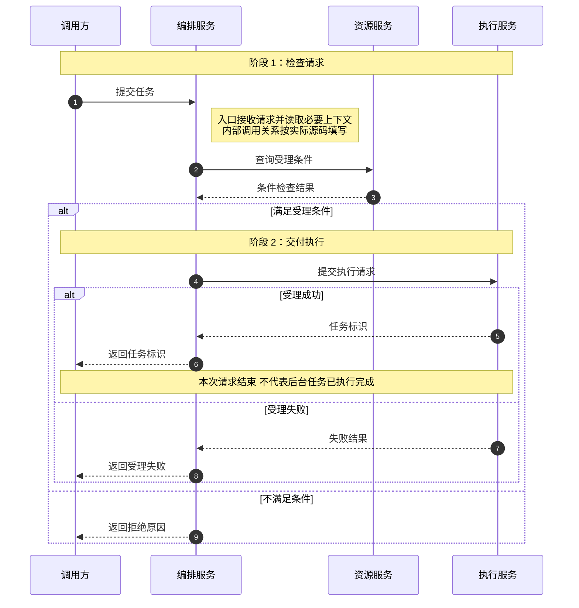

# 2026-09-16 代码逻辑文档生成方法参考

本版以 08-16 版为基础重新整理，采用“链路说明文档 + 源码业务注释”的方式：文档帮助读者理解整体流程、方法职责和输入输出，具体实现直接在源码旁解释。不再在文档中按“第多少行到多少行”逐段讲解，也不把源码注释复制成另一份细节说明。

目标读者是后续接手和排查的人。只读文档，应能说清链路解决什么问题、谁调用谁、数据怎样交接以及结果意味着什么；打开源码后，应能借助相邻注释理解变量、条件、循环和状态修改，而不是继续猜代码的业务含义。

## 适用范围与交付内容

适用于方法逻辑、启动链路、跨服务交互、调度流程、配置同步、数据库到运行态转换，以及异步或流式执行链路的说明。

| 产物 | 负责讲清什么 | 不放什么 |
| --- | --- | --- |
| 链路说明文档 | 整体时序、方法职责、调用来源、源码入口、重要输入输出、贯穿示例和跨方法边界 | 方法源码、按行号分段的实现讲解、完整局部变量流水账 |
| 源码业务注释 | 方法契约、变量的业务含义、关键判断、循环与状态修改、异常及其影响 | 大量 JSON 快照、与当前代码无关的背景、机械翻译代码的注释 |

实际使用本规范前，明确代码目录、文档保存位置、需要分析的方法或链路，以及是否允许修改源码注释。用户已提供的信息不重复询问；没有确认的路径和环境不猜测。

仅要求编写或修改本规范，不代表授权修改任何项目源码。用户只要求检查、分析或明确“先不要改”时，不添加源码注释；只读文件、第三方依赖、生成代码或未授权范围也不直接修改。此时可以完成允许范围内的文档，并说明哪些源码注释尚未落地，不把未完成的注释工作报告为已完成。

## 基本原则

1. **文档讲链路，源码讲实现。** 保留有上下文的方法说明，不退化成方法目录；具体取值、循环、判断和赋值过程放到代码旁，不在 Markdown 中再写一遍。
2. **解释业务，不翻译语法。** 说明处理什么对象、为什么需要这个条件、数据从哪里来、改变后影响谁。设计动机要有代码或业务依据，不能随意补写“提高效率”“保证正确性”。
3. **按真实关系衔接。** 方法按实际链路组织，源码注释跟随实际执行位置。章节相邻、共享数据、发布事件都不自动等于直接调用或必然连续执行。
4. **例子具体且一致。** 同一链路使用贯穿示例，重要数据用 JSON 展示；已有快照引用，变化展示增量。独立触发场景与主例分开，不把模拟值当成运行事实。
5. **只改注释，不改行为。** 不重命名、不调整条件、不移动语句、不改变参数或返回值、不顺手重构。发现疑似缺陷时说明观察到的实际行为，修复另行确认，不能把期望行为写成现有行为。
6. **少设栏目，讲解连续。** 不要求每段都套“规则、执行过程、主例结果、触发场景、注意事项”的固定标签。说明深度由实际复杂度决定，详细不等于注释多、JSON 多或标题多。

## 文档怎么写

### 整体结构

文首先说明业务问题、分析范围及已确认的源码版本或读取时间，再给整体时序图。短方法不强行套多阶段结构；长链路按实际阶段组织。

```markdown
# <日期> <链路或方法名> 代码逻辑说明

<业务问题、范围、源码版本或读取时间。>

## 整体时序图
<需要时先给角色表，再给图。>

## 核心概念与贯穿示例
<必要术语、场景和初始数据；简单场景可简写。>

## 方法说明
### 1. <阶段名称，与图一致>
#### 1.1 <方法名及主要动作>
#### 1.2 <下一方法及主要动作>
### 2. <下一阶段名称>
#### 2.1 <方法名及主要动作>

## 边界与排查（需要时）
## 完整业务例子
```

不设置独立的“入口行数速查”或按方法堆列表的“关键入口导航”。排查类长文可在方法说明前放“问题现象 → 阅读章节 → 检查依据”的简表，正常阅读仍应连续，不依赖反复跳转。

### 方法说明

每个纳入分析的方法保留自己的说明，通常按以下顺序展开：

**标题 → 职责与承接说明 → 源码入口 → 当前示例状态 → 输入说明或引用 → 输出及副作用 → 后续去向。**

标题下先用通俗的话说明这个方法负责什么，再交代实际上游类或方法、调用条件、参数来源。框架、定时任务、事件和回调入口应说明注册或触发来源，不能把发布者直接写成接收方法的调用方。省略中间层级时补简短关系说明，未确认的关系标明待确认。

源码入口显示文本和目标都使用完整绝对路径加真实行号，例如 `[/abs/path/ModelService.java:80](/abs/path/ModelService.java:80)`。入口指向方法声明，行号在源码注释修改完成后重新核对。路径含空格时使用 Markdown 尖括号目标；不要把文档行数当源码行数。

当前示例状态用一句话点明对象、轮次及关键值，不重贴全局快照。输入和输出分别说明；数据已出现时直接引用来源，并说明参数对应关系。开头展示的输出是本次调用结束后的结果预览，不是调用开始时已经可用的数据。

影响后续链路的条件必须留在文档中，例如“有效需求为空就结束本阶段”“目标变化后不再进入下一阶段”“只受理请求，不等待执行完成”。这里只说明条件及业务影响，具体判断过程、局部循环和字段修改由源码注释解释。

方法结尾用自然语言交代结果由谁使用、会继续到哪里或为何结束，不再强制增加一个重复前文的“方法小结”栏目。也不要在入口后只写“详见代码注释”，从而省掉本方法的职责和数据交接。

以下模板只展示文档组织方式，实际路径、字段和关系必须按源码替换：

````markdown
#### 1.1 <方法名及主要动作>

<说明本方法负责的业务工作、实际调用来源及条件、参数从哪里来。>

入口：[/绝对路径/Service.java:80](/绝对路径/Service.java:80)

当前示例状态：<本次对象、轮次及必要状态；说明模拟假设。>

输入示例（只展示实际参数的相关字段；已有相同数据时改为引用）：

```json
{"参数名": "本例输入值"}
```

输出示例（调用结束时的结果，保持实际返回类型）：

```json
{"结果字段": "本例输出值"}
```

<说明返回结果的业务含义、实际副作用，以及会影响后续链路的条件。>

<自然承接下一方法或交代最终收尾。实现过程见上述方法中的业务注释，不在此复制。>
````

不再设置“细节说明”“对应解释”或逐行号的实现章节，也不把旧内容改名为“执行步骤”继续完整搬进文档。允许解释链路关键判断，但不能据此恢复另一份逐段源码解说。

### 时序图

- 跨服务整体图中，每个服务作为一个 participant，内部路由、Handler、Service、Client 调用链放在该服务旁的 Note 中。外部服务使用真实服务名，不臆造内部类；Pod 等运行实例按实际交互需要单列并说明身份。
- 服务内部图可展开关键类、方法和数据节点；数据节点尽量写具体表、配置或结果字段，不只写无法辨认的“DB”“核心服务”。不展开每条日志、局部变量或序列化调用。
- 参与者超过 3 个时，先给“参与者、含义、职责”角色表。术语首次出现时说明业务含义，图与正文名称保持一致。
- 用 `Note over A,B: 阶段 N：名称` 分隔阶段，编号和名称对应正文。`autonumber` 只是消息序号；不用 `rect` 背景色。
- `Note right of X`、`Note left of X` 用于说明内部处理、条件或收到结果后的动作；左右只影响布局，时机由消息位置决定。长说明可用 `<br/>` 换行。
- 条件用 `alt / else`，重复查询用 `loop`。提前返回后的成功步骤不能画成无条件执行；不同事件或不同轮次应明确分开。
- WebSocket 同方向重复消息可以合并，并用 Note 说明序列；保留握手、双向交互、错误和结束。发送成功、受理成功、执行完成不是同一个状态。
- 图中箭头代表实际交互或调用，不能把一个方法先后调用的两个辅助方法串成“辅助方法 A 调用辅助方法 B”。调用树同样应区分同级调用和嵌套调用。

以下仅演示跨服务图的写法，不代表实际项目。生成业务文档时按已确认行为替换，正文阶段对应“1. 检查请求”和“2. 交付执行”：

| 参与者 | 含义 | 职责 |
| --- | --- | --- |
| 调用方 | 请求发起者 | 提交任务并接收受理结果 |
| 编排服务 | 本项目服务 | 检查请求并交付任务 |
| 资源服务 | 外部依赖 | 返回是否满足受理条件 |
| 执行服务 | 任务接收者 | 受理任务，后续执行 |



真实链路存在异常、超时或清理流程时，按源码补充相应路径，不从这个格式示例推断它们的行为。

## 源码注释怎么写

### 方法注释

在分析范围内的重要方法上方，用项目现有的注释风格说明业务职责、参数含义、返回值和重要副作用。方法注释描述通用契约，不绑定某次示例的固定值，也不重复罗列全部调用方。当前分析链路从哪里进入，主要由文档的承接说明交代。

需要讲清的内容包括：输入代表什么、允许哪些状态、修改传入对象还是返回新对象、返回 true/false 分别意味着什么，以及异常或异步返回的边界。只写“处理数据”“执行调度”“返回结果”不算有效的方法说明。

已有注释准确且足够清楚时保留，不再叠加一套重复说明。已有注释与实现冲突时，核对源码后修正注释，并在交付中说明；无法确认的业务动机不写成定论。

### 关键逻辑注释

把注释放在相关代码前，必要时用简短行尾注释标识容易误解的字段。按自然执行顺序连续解释，不另造“块一、块二”或文档章节编号，也不在注释里记录固定源码行号。

| 代码中的处理 | 注释需要解释的内容 |
| --- | --- |
| 读取变量、配置或对象 | 数据从哪里来，业务上代表什么，是否是当前快照、缓存或共享对象 |
| 默认值与初始化 | 什么情况下采用默认值，影响哪个判断；局部标记与整次调用累计标记有何区别 |
| 条件与提前返回 | 比较的业务含义，成立或不成立会继续什么、跳过什么；不能只复述比较符号 |
| 循环与筛选 | 遍历哪些对象、如何选择或排除，迭代之间是否共享修改后的状态，何时结束 |
| 计数、集合和字段更新 | 原值如何取得，修改哪个对象、范围多大，立即修改还是先收集后处理，谁继续使用结果 |
| 关键方法调用 | 当前为何调用，参数从哪里来，返回值或副作用怎样改变当前流程 |
| 返回、异常和资源清理 | 此时已经完成什么、哪些动作不会再执行，错误怎样传播，是否存在部分完成或残留状态 |

注释应尽量覆盖分析范围内有实际作用的处理逻辑，不因主例未触发就略过关键分支。简单 getter/setter、重复日志和能直接看懂的样板代码可以合并说明，不要求每行有注释。

复杂循环或条件需要写清中间过程，可以在注释里用少量具体值说明，例如“旧计数为 2，本次加到 3，达到阈值后才加入待清理列表”。示例必须标明是假设，覆盖进入该分支的前置条件；不能把示例中的阈值、设备名或遍历顺序写成系统固定规则。

主例未进入关键分支时，优先在该分支旁补一个简短的可触发例子，不把整套初始状态重复贴在注释里。完整场景和较大 JSON 放文档；源码注释使用足以理解当前位置的关键值，不依赖读者先跳到文档某章才能看懂当前代码。

状态未变但判断过程重要时也要解释，例如“只有一个成员，没有两两比较对象，因此保留原分配”，不能只写“无变化”。但不要在源码中写死“本轮一定不修改”，因为真实请求可能走另一条分支。

对于缺陷或边界，先讲实际行为再讲影响，例如“这里只修改目标列表，未更新预测环境，后续计算仍读取旧快照”。有疑点时注明待确认，不把所有注释写成泛泛的风险提醒，也不要借写注释修复代码。

### 注释示例

以下仅示范注释写法，不是对任何项目源码的还原，也不展示方法实现。假设已有方法接收组名、该组已分配设备集合和在线设备集合，读取成员中的缺失计数及阈值；设备在线时清除旧计数，缺失达到阈值时先收集待删设备，遍历结束后再删除分配并清理相应计数，返回是否实际删除了分配。

方法上方可写成下面这样。实际参数名、修改范围和返回含义必须按真实方法替换：

```java
/**
 * 检查本组已分配设备，对连续缺失达到阈值的设备清理分配记录。
 * 在线设备会清除历史缺失计数；曾恢复在线的设备，之后再次缺失时重新累计。
 * 本方法修改传入的分配集合和成员计数，不向设备发送卸载请求。
 *
 * @param groupName 当前分配组，用于区分不同组的缺失计数
 * @param assignedIds 当前组已分配的设备 ID，清理时会原地修改
 * @param onlineIds 本次快照中的在线设备 ID
 * @return 是否实际删除了分配；仅增加缺失计数不算分配变化
 */
```

构造计数键的位置，说明变量区分的业务对象：

```java
// 缺失次数按组和设备分别记录，避免一个组的离线记录影响另一个组。
// 例如 face-group:GPU-A 与 other-group:GPU-A 对应两个不同的计数。
```

在线分支前，解释为什么要清除历史计数：

```java
// 本次快照已包含该设备，历史缺失不应再计入下一段连续缺失过程。
// 例如旧计数为 2，设备恢复在线后清掉旧值；下次缺失从 1 开始，而不是累计到 3。
```

累计缺失和判断阈值的位置，用具体值解释中间过程：

```java
// 先读取这组设备的旧计数，没有记录才从 0 开始，再累加本次缺失。
// 假设阈值为 3：旧值 2 加到 3 时加入待清理列表；从 0 加到 1 时仍保留分配。
// 此处只记录待删设备，暂不修改正在遍历的 assignedIds，真正删除在遍历完成后执行。
```

统一删除的位置，讲清修改范围和结果：

```java
// 只删除本组已经达到缺失阈值的分配，并清理对应计数；其他设备保持不变。
// 例如本组原有 GPU-A、GPU-B，仅 GPU-A 达到阈值，则保留 GPU-B。
// 这只是分配记录的变化，不能据此认定设备上的任务已经停止。
```

这类注释的重点是解释“数据为何这样处理、例子如何得到结果、影响到哪里”，不是把每条语句改写成中文。真实实现若按模型重复累计、使用旧快照、采用不同清理时机或返回条件，必须据实说明，不能套用本示例。

## 示例数据与 JSON

### 展示与去重

在文档中定义贯穿示例的业务目标、必要输入、配置和运行状态。数据量由解释需要决定，不强制凑两张表或固定步骤数；模拟值、假定依赖返回和实际观测分别标明，不包含真实密码、令牌等敏感信息。

| 情形 | 写法 |
| --- | --- |
| 首次使用的数据 | 展示与当前方法或链路有关的具体字段，说明来源和业务含义 |
| 上游输出直接作为下游输入 | 在下游引用已有输出，交代参数映射，并就地点明必要关键值 |
| 新增、转换、筛选或计算结果 | 展示有助于理解链路的新数据，不因输入字段没变就省略所有结果 |
| 状态发生变化 | 只展示变化字段及必要对象标识，说明变化前后及业务影响 |
| 同一数据原样沿用 | 文字说明并链接来源，不重复完整快照 |

JSON 服务于方法交接和业务例子，不再为源码中的每个局部步骤强制配 JSON。关键中间数据确实影响读者理解时可以展示，但不配套重建按行号逐段解释的章节。

输入和输出分别说明，需要新数据时用两个独立 JSON 块；只包含实际读取或返回的相关字段，裁剪时注明。对象、数组、字符串、数值和布尔值保持真实类型，不能一律包装成自造的 input/output 对象。

读取的成员状态、配置和依赖不是显式参数，要单独说明。无参数可直接写“无显式参数”；返回 void 时写“无返回值”并说明副作用，不用 null 冒充。只有真实返回空值才写 null；未知结果注明待确认，异常退出说明没有正常返回，异步返回与后续完成分开讲。

变量变化记录不是实际响应，应在代码块前标明。例如下面只是说明用的增量，不代表对象含有 before/after 字段：

```json
{
  "objectId": "task-001",
  "status": {
    "before": "pending",
    "after": "accepted"
  }
}
```

JSON 必须合法，不写注释、省略号或裸箭头。复杂对象和数组正常换行缩进，不把多层参数压成一行；少量必要标识和关键值可以再次出现，去重针对完整重复数据，不是禁止重复一个字段名或一个 true。

### 贯穿示例与边界

主例沿实际调用关系向前推进，新方法只补充本次所需状态，不重置成最初输入。独立触发场景明确改变了哪些前提，不能与主例或其他独立场景混用；需要连续推演时明确声明连续关系。

文档末尾用自然语言或简表汇总：调用前状态、输入、经过哪些方法、关键数据如何交接、最终结果及后续消费者。引用已经展示的数据，不再次复制全部输入输出；方法内部的逐步比较留在源码注释中。主例是失败场景时，写清已完成的动作和最终停止位置，不强行改写为成功结果。

跨方法边界可在文档中按“场景、行为、影响、对应方法”汇总，例如清理后提前返回、配置已写入但通知失败、受理成功而执行未完成。当前方法的分支和异常仍应在源码相应位置解释，文档汇总不能代替源码注释。

链路很长需要拆成总览和分册时，总览集中放公共状态和整体图；分册交代自己负责的阶段、当前状态和方法交接，不重复整份公共快照。跨主题主控方法保留调用顺序及进入条件，其他分册负责的内部实现用链接衔接。

## 修改与验证

1. **先确认范围与现状。** 阅读项目工作约定和版本控制状态，识别用户已有改动；明确本次允许修改哪些方法的注释，以及文档保存位置。文档与源码分属不同目录时分别核对。
2. **先读实现再写解释。** 读取当前方法及决定关键行为的下游实现，核对参数、返回类型、共享状态、提前返回、异常和异步边界。普通库调用无需递归展开；未确认信息不能用示例补成事实。
3. **注释只改授权位置。** 沿用项目注释语言和风格，保留准确的已有说明。不得修改依赖库、生成文件或大范围格式化，不移动可执行语句，也不撤销用户改动。
4. **避开有语义的特殊标记。** 不改编译指令、代码生成或检查工具指令、许可证头等特殊注释。Python docstring 等会成为运行时对象的内容，不默认等同于无行为影响的普通注释；需要时沿用普通注释写法，涉及可观察行为的改动另行确认。
5. **按最终源码完成文档。** 先完成注释，再确认方法声明行号并填写入口链接；校对文档、注释、真实实现和示例是否一致。生成后的行号变动应重新核对，不在注释中维护另一套固定行号。
6. **检查本次差异。** 相对修改前状态核对新增改动是否仅为注释和约定的文档；保留原格式及换行风格。不能只凭“只改注释”的主观判断，也不把用户已有代码改动算成本次修改。
7. **做必要验证并说明结果。** 按项目工具和变更风险做语法、编译或已有相关检查，确认注释定界符、特殊字符等没有破坏源码；文档检查 JSON、围栏、入口链接和图文关系。未执行的验证如实说明，不声称测试通过。

完成交付时，简要给出文档路径、添加或完善注释的源码文件和方法、验证结果，以及尚未完成或待确认的部分。不因为写注释而重启服务、部署程序或执行数据修改；尤其不能重启 Docker。

## 校验清单

1. 文档是否讲清业务问题、分析范围、整体链路、方法职责、调用来源和后续去向，而不是只剩入口列表？
2. 是否已经移除 Markdown 中逐行号的实现解释和方法源码，没有换个标题继续复制同样内容？
3. 时序图是否采用正确粒度，角色表、阶段编号与正文一致，提前返回、异步和不同轮次是否画对？
4. 每个重要方法的注释是否说明真实契约，返回值、副作用、异常和异步完成是否区分？
5. 关键取值、条件、循环、状态变化与调用是否在对应源码位置解释清楚，而不是只翻译语法或堆风险提醒？
6. 复杂逻辑是否用可触发的小例子讲清中间过程和影响，示例是否明确假设且不依赖文档才能读懂当前代码？
7. JSON 是否具体、合法、易读且不重复完整快照，输入输出是否对应真实类型，公共上下文和局部参数是否区分？
8. 文档和源码注释是否分工明确，没有把同一段详细过程维护两份；保留的边界是否确实影响跨方法理解或排查？
9. 源码改动是否得到授权且仅限注释，是否保留用户已有改动、避免修改运行逻辑和特殊指令？
10. 方法入口是否按注释完成后的实际行号核对，示例是否与代码行为一致，验证及未完成项是否如实交代？

验收看的是两处能否配合使用：文档让读者找到正确链路和方法，源码注释让读者理解具体实现。方法名、栏目和注释数量齐全，不等于解释已经清楚。
