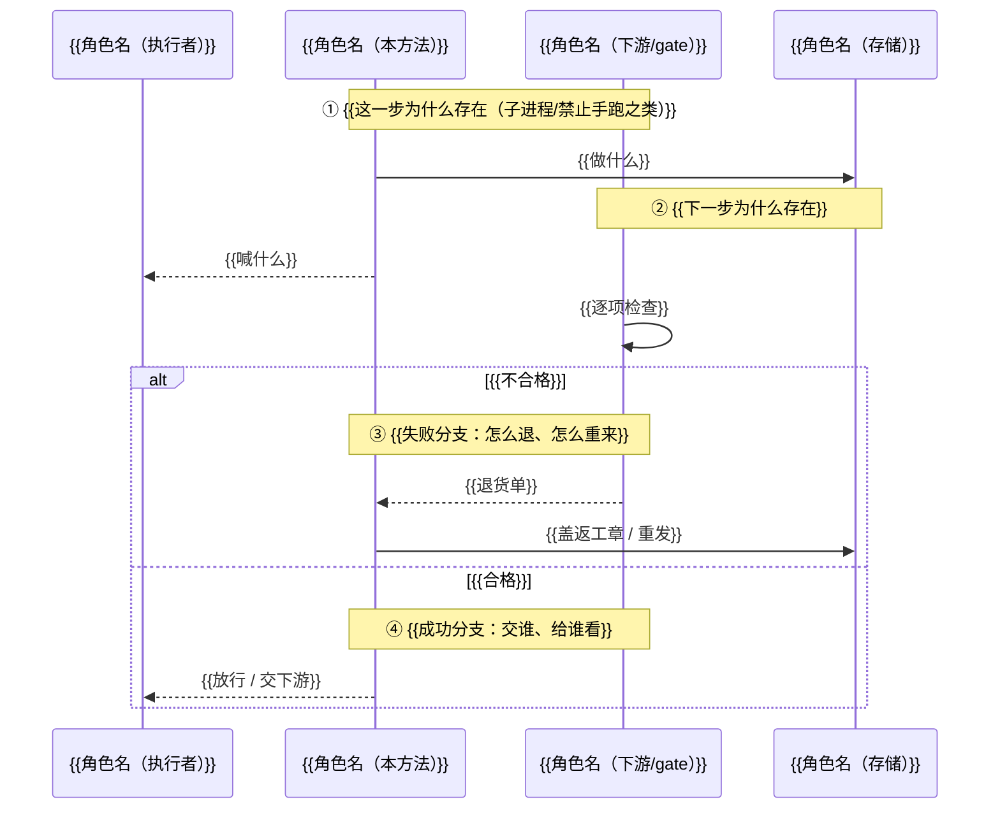
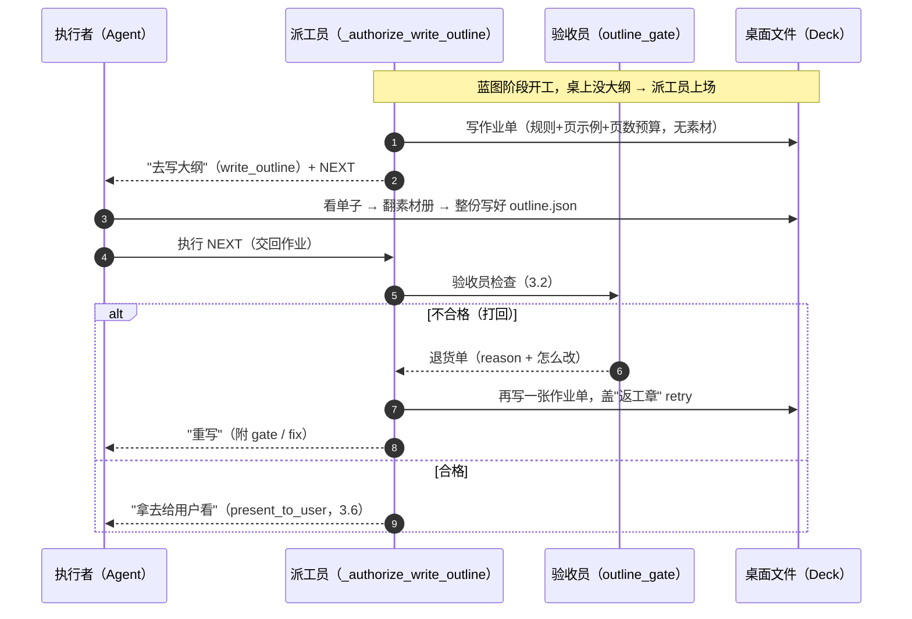

# 2026-09-22 harness 章节方法文档规范模板（Spec）

> 本文档是**通用规范模板**：规定任意文档中"章节方法"小节的写法——必须包含哪些要素、各要素的格式与填写规范、可复制的骨架、以及验收清单。它**不绑定任何具体项目、模块或方法**；具体方法的实况叙事由各自文档承担，本规范只管"怎么写"。
>
> **本版核心原则**：每个方法小节**必须以"一句话故事"拟人化导读开头**——先把方法拟人成一个角色（派工员 / 验收员 / 执行者…），用大白话讲清"谁干什么、跟谁打交道、只做什么不做什么"，再展开技术要素。目标是**"先被人看懂，再供查代码"**：技术细节（JSON、行号、表格）是证据，不是理解的前置门槛。范例见 [code-flow 文档 3.1 `_authorize_write_outline`](2026-09-22-harness-ppt-compose-code-flow.md)。

## 1. 目的与适用范围

- **目的**：统一 harness 各文档中对单个方法/函数/入口的描述写法，让任意一个方法小节都能按同一规范快速产出、可读、可验收。**首要目标是"人能看懂"**——不要一上来就甩 `spill`/`payload`/`gate=None` 这种黑话墙，先把画面建起来。
- **适用对象**：任意文档中描述某个方法、函数、CLI 入口、gate、handler、服务接口的小节。
- **不适用**：概述、总览时序图、背景/结论等非方法性段落。

## 2. 六要素（每个方法小节必须全部包含）

| 序 | 要素 | 作用 | 是否必需 |
| --- | --- | --- | --- |
| 0 | **一句话故事**（拟人化导读） | 把方法拟人成角色，开篇先讲清"谁干什么" + 给一张"角色 + 文件"清单 | 必需 |
| 1 | **输入** | 说明该方法从哪里拿数据 | 必需 |
| 2 | **输出** | 说明该方法把数据/动作交到哪里 | 必需 |
| 3 | **时序图** | 用 mermaid 画出该方法在调用链中的位置与上下游，参与者用角色名 | 必需 |
| 4 | **时序图解释** | 逐条解释图中每一步——**图内 `Note` 或图外列表二选一**，不重复（见 4.3/4.4） | 必需 |
| 5 | **解释说明** | 职责、边界、失败路径、真实例子 | 必需 |

> 缺任一要素即不达标（见第 6 章验收清单）。其中第 0 项"一句话故事"是本规范的核心：它是全节的"地图"，决定下面时序图、解释说明用哪套角色名。术语（`spill`/`payload`/`gate`…）可以出现，但必须**嵌进人话句子里当配角**，不能堆成一堵墙挡在开头。

## 3. 通用模板骨架（复制即用）

每个方法小节按以下骨架填写，`{{...}}` 为占位符：

````markdown
### {{N.M}} `{{method_name}}` {{一句话职责}}

> **一句话故事**：把 `{{method_name}}` 想象成一位 **{{角色名}}**。它 {{只做什么 / 不做什么}}——它的活是 **{{一句话动作}}**：{{把什么递给谁}}，让 **{{角色B}}** {{干什么}}。{{产物}}交给 **{{角色C}}**；{{不合格/失败}}就 {{怎么退回 / 重试}}。
>
> 记住 **{{n}} 个角色 + {{m}} 份关键文件**：
> - **{{角色名}}**（本方法）：{{只做什么}}
> - **{{角色B}}**（{{执行者 / 上游}}）：{{干什么}}
> - **{{角色C}}**（{{下游 / gate}}）：{{干什么}}
> - 文件① `{{file_a}}`：{{素材 / 输入}}（来源）
> - 文件② `{{file_b}}`：{{产物 / 输出}}
>
> **代码位置**：全函数 [{{file:起点-终点}}]({{全路径}}:起点)。关键行：[{{file:NN}}]({{全路径}}:NN) {{做什么}}。

**输入**：

| 项 | 说明 |
| --- | --- |
| {{参数/文件/上下文}} | {{来源与含义}} |

**输出**：

| 项 | 说明 |
| --- | --- |
| {{返回/写盘/stdout}} | {{去向与副作用}} |

**时序图**（{{角色名}}的一天——{{首次}}与{{重试}}都画在里面）：


`Note over` 就是图内解释——每条 Note 讲清"谁→谁、做了什么、为什么"，图外就不必再写故事版/详细解释（二选一，见 4.4）。

**{{人话小标题，如"两本文件长什么样"}}**（真实节选）：
{{JSON / 表格 / 产物对照，用一句话引出}}

**解释说明**：{{职责边界 / 失败路径 / 真实例子}}。入口 [{{file:NN}}]({{file 全路径}}:NN)。
````

## 4. 填写规范细则

### 4.0 一句话故事（拟人化导读）——本规范核心

- **每个方法小节开头必须有一句话故事**，用 `>` 引用块呈现，紧跟标题。
- 把方法**拟人成一个角色**（派工员 / 验收员 / 执行者 / 调度员 / 收发员…），用一句大白话讲清它"扮什么、跟谁打交道、只做什么不做什么"。
- 紧接着给读者一张**"角色 + 文件"清单**：几个角色、几份关键文件、它们分别是什么。这是全节的地图。
- **术语当配角**：`spill`/`payload`/`gate`/`args_inline` 这类黑话可以出现，但必须嵌进人话句子里，不能堆成一堵墙挡在开头。
- 故事要跟下面的时序图、解释说明**用同一套角色名**，全文一致。
- 把**代码行号**也放进故事块：给全函数范围 + 几个关键分行引用，让读者想看代码时一键跳到。

### 4.1 输入

- 用**表格**列出，每行一项：调用参数 / 读取的文件 / 依赖的上下文字段。
- 写明**真实来源与路径**（如某配置文件的某字段、某上下文的某键）。
- 可选输入标注"（可选）"；来自 CLI 的参数注明 CLI 名（如 `--xxx`）。
- 不要把"输出"混进输入表。

### 4.2 输出

- 用**表格**列出，每行一项：返回动作 / 写盘文件 / stdout / 退出码。
- 写明**去向与副作用**（如"写 `xxx`，下游 Y 读取"；"上下文落盘某键"）。
- 有退出码语义时写明（如 `0` 成功 / `非 0` 失败）。
- 副作用（建目录、删文件、改状态）必须显式列出。

### 4.3 时序图

- 用 mermaid `sequenceDiagram`，**推荐 `autonumber`**（图内 Note 承载解释时可不加，Note 的 ① ② ③ 就是编号）。
- **参与者用角色名命名**（执行者 / 派工员 / 验收员 / 桌面文件），**同一文档内保持一致**，并与"一句话故事"里的角色名呼应；**禁止用冷冰冰的 `A/C/G/D` 或 `主 Agent/CTL/Gate` 这种没拟人的标签**。
- 聚焦**该方法在调用链中的位置**，不要画整条系统流程；上下游用 `Note` 或邻接消息点到为止。
- 分支用 `alt ... else ... end`；循环用 `loop ... end`；可选步骤用 `opt ... end`。
- 消息方向：实线 `->>` 发起调用，虚线 `-->>` 返回/回传。
- **解释放图内（推荐）**：用 `Note over {{角色A}},{{角色B}}: {{① 人话解释}}` 把"谁→谁、做了什么、为什么"直接标在对应步骤旁，一条 Note 一段解释（含失败/成功分支各一条）；多行解释用 `<br/>` 换行。图内 Note 已解释的步骤，图外**不必**再写故事版/详细解释（见 4.4 二选一）。
- 图里每条消息要么有图内 Note，要么在图外解释里有对应条目——**必须二选一，不许重复**。

### 4.4 时序图解释（图内 Note 或图外列表，二选一）

- **首选：图内 Note（推荐）**——把解释直接写进 mermaid 图的 `Note over` 里（写法见 3 章骨架），编号用 ① ② ③…，一条 Note 一段"为什么"。图内解释的好处：图和解释一处看全，不用来回找；读者扫一眼图就懂全部。
- **备选：图外列表**——mermaid 图后跟"**时序图详细解释**"，逐条编号与图中消息对应（1、2、3…），每条讲清三件事：**谁→谁、做了什么、为什么**。不要复述图里已有的字面信息，要解释"为什么这一步存在、它的判定/副作用是什么"。分支步骤在解释里点明触发条件。
- **二选一，不许重复**：同一节要么图内 Note、要么图外列表，不要两头都写同一批解释。
- 短流程（≤6 步）优先图内 Note；长流程（>6 步）图内 Note 会挤，可退而求其次用图外列表。

### 4.5 解释说明

- 一段话覆盖：**职责边界**（只做什么、不做什么）、**失败路径**（什么情况打回 / 重试 / 终止）、**真实例子**（可引用同项目的实况文档或真实产物）。
- 末尾附**入口行号链接**：`入口 [file:NN](.../file:NN)`，行号必须 grep 核实后写入（见第 5 章）。**最好给全函数范围 + 关键分行**，不只给起点。

### 4.6 拟人化写法总则（贯穿全节）

- **角色一致性**：一句话故事定的角色名（派工员 / 执行者 / 验收员），全文沿用——时序图参与者、时序图解释（图内 Note 或图外列表）、子段落都用同一套。
- **人话小标题**：子段落标题用大白话，不要工程腔。对照——

  | ✅ 推荐（人话） | ❌ 不推荐（工程腔） |
  | --- | --- |
  | 两本文件长什么样 | 素材与产物（JSON 对照） |
  | 真实跑了一遍 | 实况示例（真实运行产物） |
  | 退货故事 | 重写轮实况 |
  | 修法（第 N 次终于过关） | 失败处理与修正策略 |

- **术语嵌句**：黑话嵌进人话句子里当配角，不堆墙、不当主语。对照——

  | ✅ 推荐（术语嵌进人话） | ❌ 不推荐（黑话墙） |
  | --- | --- |
  | 派工员喊"去写大纲"（`write_outline`），把"写完执行这句"（`NEXT`）一起给执行者 | `next_action.type=write_outline`；输出是动作字典与 spill 文件；返回 `args_inline=false` |
  | 验收员说不合格，派工员盖"返工章"（`retry`）重发 | gate 失败时 `_authorize_write_outline(gate 非空)` 重派，spill 多出 `retry` 字段，payload 附 `gate`+`fix` |

- **证据当配角**：JSON、行号、表格都保留，但用一句话引出（"册子①长这样："），不当理解的前置门槛。

## 5. 命名与引用规范

- **小节编号**：`N.M`，N 为所在章号，M 为方法在该章内的序号。
- **小节标题**：`### N.M \`method_name\` 一句话职责`。
- **代码行号链接**：指向被文档覆盖的源码全路径，格式 `[file:NN](/full/path/file:NN)`；**写入前必须 grep 核实行号**，源码改动后需复核。**优先给全函数范围 `[file:起点-终点]` + 关键分行引用**，不只给起点。
- **真实产物引用**：引用同项目实况文档小节或真实运行产物时，注明"真实"或"模拟"。
- **占位符**：模板骨架里用 `{{...}}`，填写后必须全部替换，不得残留。
- **角色命名**：同一文档内角色名保持一致；跨小节若涉及同一方法，沿用既有角色名。

## 6. 验收清单（每节自检）

填写完一个方法小节后，逐项核对：

- [ ] 标题为 `### N.M \`method\` 职责` 格式
- [ ] **开头有"一句话故事"拟人化导读**，把方法拟成角色，讲清谁干什么
- [ ] 导读里有一张**"角色 + 文件"清单**
- [ ] 导读里附**代码位置**（全函数范围 + 关键分行）
- [ ] 有 **输入** 表格，列真实来源/路径
- [ ] 有 **输出** 表格，列去向/副作用/退出码
- [ ] 有 mermaid `sequenceDiagram`（图内 Note 解释时可不加 `autonumber`）
- [ ] **参与者用角色名命名**，跟一句话故事呼应，同文档内一致（禁用冷标签 A/C/G/D）
- [ ] 有 **时序图解释**（图内 `Note` ① ② ③ 或图外"详细解释"逐条编号，**二选一**）
- [ ] 图内 Note 与图外解释**不重复**（选了一条路就别走另一条）
- [ ] 有 **解释说明**，含职责边界 / 失败路径 / 真实例子
- [ ] **子段落用人话小标题**（非工程腔，见 4.6 对照表）
- [ ] **术语嵌进人话句子**，无黑话墙（见 4.6 对照表）
- [ ] 末尾入口行号链接已 grep 核实（最好给全函数范围 + 关键分行）
- [ ] 无 `{{...}}` 占位符残留

## 7. 拟人化填写示例（取自真实范例）

> 以下取自 [code-flow 文档 3.1](2026-09-22-harness-ppt-compose-code-flow.md) `_authorize_write_outline` 的真实填写，是本规范倡导写法的**范例**。括注 `〔规范点评〕` 指出每处符合哪条规则。

### 示例 `_authorize_write_outline` 派发内容型大纲

> **一句话故事**：蓝图阶段开工，窗口里坐着一位 **派工员**（就是本方法 `_authorize_write_outline`）。它自己不写大纲——它只 **发作业单**：把一张"怎么写大纲"的说明书递给 **执行者**（Agent），让执行者照单子把摘要翻译成大纲。大纲写完交给 **验收员**（3.2 的 gate）；不合格就退回，派工员在单子上盖个"返工章"再发一次，直到合格。
>
> 记住 **三个角色 + 两本册子 + 一张单子**：
> - **派工员**（本方法）：只发单，不动笔。
> - **执行者**（Agent）：读作业单 + 翻素材册 → 写出大纲。
> - **验收员**（3.2）：查大纲合不合格，不合格开退货单。
> - 册子① `content_digest.json`：**素材**。
> - 册子② `outline.json`：**产物**。
> - 单子 `.next_write_outline.json`：只有"怎么写"的规则，**没有摘要内容**。
>
> **代码位置**：全函数 [compose_ctl.py:578-686](...:500)。关键行：[:606](...:606) 写作业单、[:612](...:612) 组派工单、[:631](...:631) 重写轮盖返工章。

〔规范点评：满足 4.0——一句话故事把方法拟人成"派工员"，给了"三角色+两册子一单子"清单，术语 `content_digest.json`/`outline.json`/`.next_write_outline.json` 嵌进人话句子里当配角；满足 4.6 + 第 5 章——代码位置给全函数范围 500-593 + 三个关键分行。〕

**时序图**（派工员的一天——首次派活与重写轮都画在里面）：



〔规范点评：满足 4.3——参与者用角色名（执行者/派工员/验收员/桌面文件），跟一句话故事呼应，没用冷标签 A/C/G/D 当主名；此例走"图外列表"路线（`autonumber` 编号 + 图后故事版），同样满足 4.4 二选一。〕

**时序图故事版**（对照上图编号）：① 蓝图阶段开工，桌上没大纲 → 派工员上场；② 写一张作业单（只有规则，没素材）；③ 递给执行者"去写大纲"；④ 执行者看单子 + 翻素材册 + 整份写好 `outline.json`；⑤ 交回 CTL，转交验收员；⑥ 不合格 → 派工员盖"返工章"重发，执行者整份重写；⑦ 合格 → 给用户看。

〔规范点评：满足 4.4——此例走"图外列表"路线：`autonumber` 编号 + 图后故事版 ①②③ 速览。另一种等价写法是"图内 `Note`"（见 code-flow 3.2，短流程更推荐）；二选一即可。〕

**两本册子长什么样**（真实节选）：

册子①是 **素材**（派工员不碰、执行者自己去翻）：`content_digest.json` 节选……
册子②是 **产物**（执行者照单子把素材填进去后写出来的）：`outline.json` 节选……
对照着看：大纲 bullet 的 `text` 就是把册子① `must_keep_facts` 的原文**原样抄**过来——验收员正是按"事实原文内嵌"来查。

〔规范点评：满足 4.6——子段落用人话小标题"两本册子长什么样"（非"素材与产物（JSON 对照）"），用一句话引出 JSON 证据。〕

**退货故事**（真实跑了 3 次）：验收员把大纲打回 3 次，每次派工员都盖"返工章"（`retry`）重发……

| 第几次退货 | 验收员说什么 | 派工员返工章上写什么 |
| --- | --- | --- |
| 1 | 目录页 10 条，但单栏最多 4 条 | `density_floor_batch`：拆页或换布局 |
| 2 | 4 条事实没原样抄进 bullet | `must_keep_facts not covered`：每条事实原文放进 bullet |
| 3 | 9 个模块名没出现在标题里 | `missing_modules`：保留 ≥80% 模块 |

修法（执行者第 4 次终于过关）：把模块名直接放进 bullet 标题、把事实原文原样抄进 `text`——整份重写（不许打补丁）。

〔规范点评：满足 4.5 + 4.6——"退货故事"/"修法（第 4 次终于过关）"是人话小标题；失败路径 + 真实例子齐全；术语 `retry`/`density_floor_batch` 嵌进故事句子里。〕
