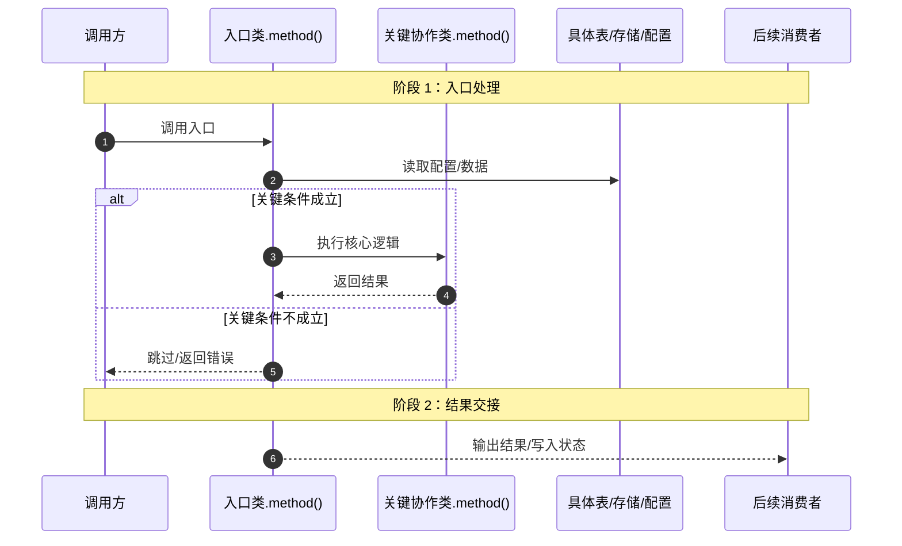
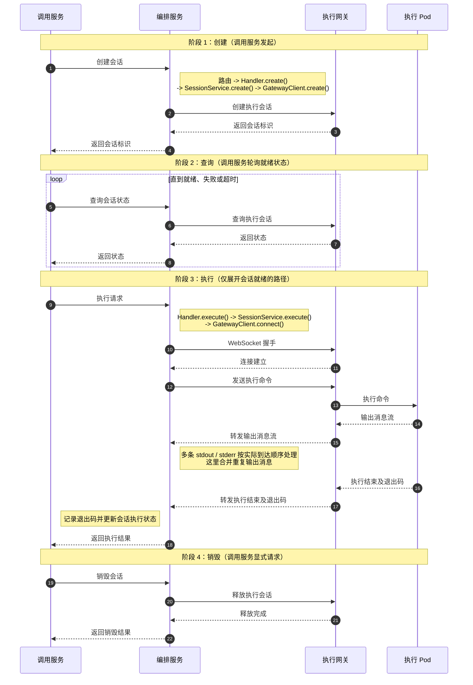

# 2026-08-16 代码逻辑文档生成方法参考

本文记录一种通用的代码逻辑文档生成方式，适合以后分析方法逻辑、启动链路、调度链路、配置同步链路、DB 到运行态转换链路、工具调用链路时参考。

目标读者是后续排查和接手的人。文档要让读者先明白这条链路解决什么业务问题，再按源码顺序结合统一示例理解处理过程、字段与状态变化及其业务影响。源码行号用于核对依据；不打开源码，读者也应能说明方法的职责、例子如何走完以及结果意味着什么。

## 适用场景

- 需要解释一个方法或链路“怎么跑起来、怎么执行”，但不想只贴源码。
- 需要把配置字段、入口方法、运行态对象、请求对象、返回结果之间的关系讲清楚。
- 需要画 Mermaid 时序图，但图不能细到每个局部变量。
- 需要解释跨服务调用、多阶段生命周期或 WebSocket 等流式交互，并区分服务边界和内部实现。
- 需要给后续排查人员一个能直接对照源码、日志、数据库和配置的文档。

## 基本原则

1. 主体先给整体时序图，让读者先知道全链路；参与者超过 3 个时，先在图前给角色说明表。
2. 默认省略独立的入口行数速查表，时序图后按链路展开方法说明；排查类或较长的文档可按需增加“问题现象 → 阅读章节 → 重点检查什么”的问题排查导航。
3. 不展示方法源码代码块。每个方法保留入口链接，显示文本和目标都使用完整绝对路径加行号；细节说明按真实源码行号范围分段，并链接到各段起始源码行。
4. 尽量解释当前方法的完整执行逻辑，在同一组“细节说明”中按源码顺序讲解，分支、跳过和异常在对应行号段一起说明，不拆成不同路径的章节。普通样板逻辑可以简述，略过时标明内容和源码范围。时序图、请求参数和示例数据可以保留。
5. 各行号段结合统一示例逐步推演，文档最后再汇总完整业务例子，包含调用前状态、调用参数、执行过程、调用后结果；同一条链路优先沿用前面的示例数据。
6. 每个结论要能回到源码行号、表字段、配置项或日志现象。
7. 区分不同触发时机，例如启动配置阶段、运行调度阶段、执行结果回写阶段，不要混成一团。
8. 每段细节说明先用人话说明本步解决的业务问题，再详细讲处理过程、统一示例的变化及其业务影响；源码行号用来定位证据，不能把说明写成逐行翻译。术语首次出现时先说明业务含义，再给技术名称或变量名；无法确认的设计意图不推测。
9. 阶段下的多个方法使用 `N.1/N.2/N.3` 子小节，每节只讲一个方法，按“标题 → 承接说明 → 源码入口 → 当前示例状态 → 方法输入示例或引用 → 方法输出示例或引用 → 按行号展开的细节说明 → 方法小结”展开。细节说明也可命名为“对应解释”；每段交代相关变量的值及变化，段内涉及的方法调用分别说明输入、输出，JSON 按下条规则展示，不集中到方法末尾。
10. 按分析范围选择图的粒度：跨服务整体图以服务为参与者，内部调用链用 Note 标注；服务内部细节图才展开到关键类、方法和数据节点。
11. 每个方法小节标题下、源码入口前，先用一句通俗的话说明本方法负责什么、解决什么业务问题，再交代实际上游类、方法、调用条件或触发机制、参数来源和后续去向。调用关系以源码为依据，不能根据章节顺序推断。标题保持简洁，不能只列标题和源码链接就直接进入行号解释。
12. JSON 遵循“首次展示、变化展示、不变引用”：首次只展示与当前逻辑相关的字段，变化只展示增量，已有且未变化的数据用文字和章节链接引用，不重复整份快照。方法输入、输出分别说明，需要新展示时使用独立 JSON 块；上游输出直接作为下游输入时引用即可。JSON 是示例数据，不是方法源码；模拟值明确标注，未知值不编造，无返回值与返回 null 要区分，状态修改等副作用另行说明。

## 推荐文档结构

以后生成代码逻辑文档时，优先使用下面这个顺序：

模板中的 JSON 块仅在首次展示相关数据时填写；已有且未变化的数据改为文字和章节链接引用，发生变化只展示相关字段的增量，不为凑齐模板重复快照。

````markdown
# <日期> <链路名或方法名> 代码逻辑说明

## 整体时序图

参与者超过 3 个时，先列角色说明表；表中名称与图中显示名称保持一致。

| 参与者 | 含义 | 职责 |
| --- | --- | --- |
| 调用方 | 触发链路的上游 | 提供输入并接收结果 |
| 入口类.method() | 本项目入口 | 校验输入、协调处理 |
| 关键协作类.method() | 内部协作组件 | 执行核心逻辑 |
| 具体表/存储/配置 | 数据节点 | 提供配置或保存状态 |
| 后续消费者 | 结果使用方 | 接收输出并继续处理 |

下面是服务内部细节图模板，阶段编号和名称与正文对应。实际生成时，在图前用一两句话说明链路要解决的业务问题。跨服务整体图使用后文“跨服务、多阶段示例”的服务级粒度。



## 方法说明

### 1. 入口处理

<说明本阶段的业务目标，与图中“阶段 1：入口处理”对应。>

#### 1.1 <入口方法及主要动作>

<第一句说明本方法负责什么业务问题，再写实际上游类、方法、调用条件及参数来源；框架触发则说明触发来源和注册位置，最后交代后续去向。>

入口：[/绝对路径/XxxService.java:10](/绝对路径/XxxService.java:10)

当前示例状态：<给出当前对象、轮次（如有）及本方法需要的具体输入和状态，首次解释重要术语的业务含义。模拟数据注明为示例；以下行号是格式占位，实际生成时按源码替换。>

方法输入 JSON：

```json
{"参数名": "本例输入值"}
```

方法输出 JSON（本次调用结束时的结果）：

```json
{"结果字段": "本例输出值"}
```

细节说明：

[第 10-13 行](/绝对路径/XxxService.java:10)：<先说明本步的业务目的，再详细解释条件、处理过程和本例变化；涉及分支或异常时在这里一起说明，另一情形的数据单独标注。>

主要变量 JSON（首次展示本段相关字段）：

```json
{"主要变量": "本段结束时的本例值"}
```

[第 14-15 行](/绝对路径/XxxService.java:14)：<沿用上一段结果，详细解释本段行为及影响，并按后文模板分别说明段内调用的输入、输出；与已展示数据相同则引用。>

主要变量变化 JSON（说明用，非实际对象；仅展示变化字段）：

```json
{"主要变量": {"before": "上一段值", "after": "接续处理后的本例值"}}
```

方法小结：<说明完成了什么、统一示例当前结果的业务含义，以及下一步交给谁。>

### 2. 结果交接

<说明本阶段的业务目标，与图中“阶段 2：结果交接”对应。>

#### 2.1 <后续方法及主要动作>

<先说明本方法负责的业务工作，再说明实际调用方及与前文的关系、输入来源和输出；省略的调用层级用简短调用链补齐。>

入口：[/绝对路径/XxxConsumer.java:30](/绝对路径/XxxConsumer.java:30)

当前示例状态：<重述承接上游后本方法所需的当前值及含义，说明参数怎样传入；新增数据注明来源或模拟假设，不要求读者回翻。>

方法输入：<若与上游输出相同，链接到上游输出所在章节，并说明参数对应关系；新增、转换或筛选字段时才补充相关 JSON。>

方法输出 JSON：

```json
{"结果字段": "本次调用的本例输出值"}
```

细节说明：

[第 30-33 行](/绝对路径/XxxConsumer.java:30)：<解释业务目的、处理过程及示例变化，分支与异常在所属行号段说明；涉及方法调用时分别说明输入、输出，已有数据用引用。>

主要变量 JSON（首次出现的相关字段；已有字段引用，变化字段用增量）：

```json
{"主要变量": "本段结束时的本例值"}
```

[第 34 行](/绝对路径/XxxConsumer.java:34)：<说明本段如何完成交接或返回、具体值及业务影响，核对本段结果与本方法输出 JSON 一致。>

变量状态：<如果本段仅交接或返回、未修改字段，说明沿用上一段结果并链接来源，不再重复 JSON。>

方法小结：<归纳本方法完成的业务动作、当前结果及下一步或最终收尾。>

## 具体例子

<汇总前文逐段推演的业务过程，同一条链路优先沿用前面的数据。下面的表名和数值仅演示格式，实际生成时替换为与正文一致的内容。>

### 场景

一句话描述这次例子要模拟什么。

### 调用前数据

`table_a`：

| id | name | status |
| --- | --- | --- |
| 1 | demo | 1 |

`table_relation`：

| id | a_id | target |
| --- | --- | --- |
| 10 | 1 | targetA |

### 调用参数

```json
{"names": ["demo"], "action": "add"}
```

### 执行过程

```text
1. 查询主对象 demo。
2. 查询 demo 的关联关系。
3. 根据关联关系生成目标配置。
4. action == add 时启用对象。
5. 保存结果。
```

### 调用后结果

| name | status | config |
| --- | --- | --- |
| demo | 0 | [{"target":"targetA"}] |

后续影响：

- 后续消费者会读取 `table_a.config`。
- 如果配置为空，后续链路不会按该对象调度。
````

## 时序图写法

时序图只保留影响理解的对象，先确定图的分析范围，再选择参与者粒度。

### 参与者粒度与命名

- 跨服务整体图：每个服务作为一个 participant，本项目服务与外部服务都使用实际服务名，例如 Harness、Clotho、EG；内部调用链放在该服务旁的 Note 中，不展开到每个类。
- Pod 等运行实例可按实际交互需要单独作为 participant，在角色表中说明其性质和职责，不把运行实例误写成服务。
- 服务内部细节图：本项目内部节点写到具体类或方法，外部依赖仍写实际服务名，不要求外部服务的类或方法。
- 图中使用稳定、简短的 participant 标识，通过 `participant ID as 显示名称` 指定读者看到的名称。

服务内部细节图推荐保留：

```text
调用方
入口类/方法，例如 DynamicModelManager.refreshMonopolizedConfigs()
关键协作类，例如 XWorkerManager、StreamManager、Repository
具体主表，例如 x_dynamic_model
具体关联表，例如 gpu_card_group_model_relation
具体配置/结果字段，例如 x_dynamic_model.monopolized_configs
后续消费者
```

不推荐放进图里：

```text
只有“核心服务”“DB”这种无法落到源码和表的泛化节点
每个 Repository 的返回 Optional
每次 JSON.parse / JSON.toJSONString
每条 log
每个局部变量
每个 continue / return 的微小分支
跨服务整体图中每个 HTTP 请求的路由 -> Handler -> Service -> Client 内部调用链（用 Note 标注）
WebSocket 同方向的每条重复消息（合并为一条箭头，用 Note 说明消息序列）
```

命名要求：

- 服务名、类名和方法名遵循上面的粒度要求，不写无法辨认职责的“核心服务”。
- 需要展示的数据节点写到具体表名、配置项或关键字段，不只写“DB”。
- 服务内部细节图中，如果一个方法只读写一张表，图里直接写这张表；如果多张表合成一个结果，至少写主表、关联表、结果字段。
- 跨服务整体图不强制展开服务内部的数据表和结果字段，必要信息放在 Note 或后续代码说明中。

消息合并不能丢掉关键时序：WebSocket 的握手、双向交互、结束和错误等影响流程的消息应保留独立箭头；只有同方向、可概括的重复消息才合并。HTTP 内部调用链的折叠要求适用于跨服务整体图，内部细节图仍可展开关键协作方法。

### 阶段分隔与条件分支

- 创建、查询、执行、销毁等先后阶段，使用 `Note over ParticipantA,ParticipantZ: 阶段 N：xxx` 分隔，参与者标识必须已在图中声明。
- 图与正文共用阶段编号和名称：图中“阶段 N：xxx”对应正文“### N. xxx”，阶段内的方法使用 `N.1/N.2`。一个阶段只有一个方法时，也保持阶段与方法层级清楚；单方法、无阶段的分析不必人为分阶段。
- `autonumber` 只是图中消息箭头的序号，不作为正文章节编号。不能把消息序号、阶段编号和方法小节编号混用。
- 阶段标题覆盖本阶段相关参与者，需要统一展示时可覆盖整条链路的首尾参与者。
- 本文统一不使用 `rect` 背景色划分阶段，保持图的样式简洁。
- `alt / else` 只表达条件分支，不用来分隔先后阶段；重复查询可用 `loop`，不要把重复消息逐条展开。
- 启动配置、运行执行等由不同事件触发的阶段，应注明各自触发时机；如果不属于同一次连续调用，可拆成独立时序图，避免暗示它们必然连续发生。

### Note 用法

| 写法 | 推荐用途 |
| --- | --- |
| `Note right of X: ...` | 标注 X 的内部逻辑、关键条件或内部调用链 |
| `Note left of X: ...` | 标注 X 收到结果后的后续动作，也可按布局需要放置其他说明 |
| `Note over A,B: ...` | 标注跨多个参与者的阶段标题或公共说明 |

`right of` 和 `left of` 只决定注释位置，上表是本文的排版约定，不代表 Mermaid 赋予它们不同的业务语义。动作发生的时机由 Note 在消息序列中的位置体现。较长说明可以用 `<br/>` 换行，Note 只保留关键链路，完整实现仍放在后面的代码说明中。

### 角色说明表

当参与者超过 3 个时，在时序图前增加角色说明表，至少包含“参与者、含义、职责”。缩写和技术名词首次出现时，先解释它在本链路中的业务含义与作用，再给技术名称；服务与运行实例要区分，职责应来自已确认的代码或接口信息。角色表放在“整体时序图”章节内，图后默认展开方法说明，排查类或长文档可先放问题排查导航。

### 跨服务、多阶段示例

以下使用通用服务名演示写法，调用关系、方法名和消息名均为示意，不代表 Harness、Clotho、EG 或任何实际项目的实现。生成业务文档时必须按源码、接口或可验证的调用记录替换。

| 参与者 | 含义 | 职责 |
| --- | --- | --- |
| 调用服务 | 生命周期操作的发起方 | 发起创建、查询、执行和销毁请求 |
| 编排服务 | 本项目服务 | 校验请求、协调下游调用并维护状态 |
| 执行网关 | 外部服务 | 转发执行请求与结果 |
| 执行 Pod | 运行实例 | 执行任务并产生输出 |



示例仅展示主要成功路径。实际链路中的查询失败、执行失败和资源清理条件，应按分析目标补充 `alt / else` 或单独说明；外部服务内部如何创建、调度或销毁 Pod，没有证据时不展开。

这张图对应的正文阶段应命名为“1. 创建”“2. 查询”“3. 执行”“4. 销毁”，各阶段的方法再使用 `1.1/1.2` 等编号；括号中的触发条件作为补充说明，不另起一套阶段编号。

## 问题排查导航（可选）

默认不提供独立的入口行数速查表，也不另列方法名目录。每个方法的入口链接和各段的行号链接负责定位源码；问题排查导航负责回答“遇到这个现象，应该先读哪一节、重点检查什么”。

排查类或较长的文档，可在整体时序图后、方法说明前按“问题现象 → 阅读章节 → 重点检查什么”提供简短表格。正文仍按业务主线连续展开，正常阅读不依赖跳转；没有明确排查需求时可省略。

模板（问题、章节和锚点按实际分析替换，不把所有现象归因于单一原因）：

```markdown
## 问题排查导航

| 问题现象 | 阅读章节 | 重点检查什么 |
| --- | --- | --- |
| <用户或运维能观察到的现象> | [<对应阶段或方法标题>](#实际章节锚点) | <应核对的条件、输入、状态或日志及其预期表现> |
```

- 以读者的问题组织条目，不把方法名或技术步骤当成问题现象。优先链接到解释该现象及相关分支、异常的行号段所在章节。
- “重点检查什么”写可核对的判断依据，不只写“检查配置”“看日志”，也不在导航里另列源码路径和行号。
- 按实际标题和所用 Markdown 渲染器的锚点规则填写链接；带编号的标题也要使用对应锚点，标题变化后检查跳转是否有效。
- 导航只辅助排查，不能代替职责说明、调用关系和方法内部的详细解释。

## 标题下的承接说明

每个方法小节都使用固定顺序：标题 → 承接说明 → 源码入口 → 当前示例状态 → 方法输入示例或引用 → 方法输出示例或引用 → 按行号展开的细节说明 → 方法小结。细节说明也可命名为“对应解释”，分支与异常统一在对应行号段说明。承接说明直接写成标题下的一段自然语言，放在“入口”链接之前，通常用 2 到 4 句讲清上下文，复杂阶段可适当展开。

- 第一句先用通俗的业务语言说明“这个方法负责什么、要解决什么问题”，不能只复述方法名或说它是“链路起点”。
- 随后交代从哪里调用过来：写出当前分析链路中的上游类、方法及调用条件，说明为什么此时需要调用它、关键参数或状态从哪里传入。职责句不能替代调用来源。
- 上一节不一定是当前方法的直接调用方。若中间省略了调用层级，用简短调用链补齐；有多个调用方时，优先说明当前分析链路中的那个，其他调用方只在影响理解时补充。
- 若由框架、定时任务或事件触发，说明触发来源及注册位置，例如路由映射、调度注解、监听器注册或回调绑定；区分事件发布方与框架回调，不强行写成普通方法直接调用。
- 交代这一段主要完成什么，以及关键条件如何决定流程是否继续。
- 说明产生的结果交给谁，或状态由谁继续使用，自然引出下一段；链路末尾则交代最终返回或收尾结果。
- 异步事件、定时任务和不同分支要说明实际触发关系，不要为了文字连贯把它们写成直接调用或必然连续执行。未确认的调用方、注册位置、监听方或下游行为应注明待确认，不根据章节顺序推断调用关系。

标题只概括入口及主要动作，详细背景放在标题下。不要只把标题换句话复述成“本节介绍某方法”，也不要把所有细节塞进标题。

标题下的承接说明负责让读者理解“为什么读到这里、这一步把链路推进到哪里”；入口链接之后的细节说明负责结合具体行号和统一示例，详细展开字段、处理过程、分支、异常及其影响。两者都要保留，避免原文重复，也不能用阶段总说明替代每个 `N.1/N.2` 子小节自己的承接说明。

## 方法说明写法

每个方法按“标题 → 承接说明 → 源码入口 → 当前示例状态 → 方法输入示例或引用 → 方法输出示例或引用 → 按行号展开的细节说明 → 方法小结”展开，不展示方法源码代码块。方法入口链接用于打开实现，行号链接用于核对业务解释的依据。方法输出示例是本次调用结束时的结果预览，不表示入口时已经得到该值；正文仍需逐段讲清它怎样产生。

输入、输出快照只包含本方法实际读取的输入字段和实际返回的相关字段，截取时注明“仅展示相关字段”；修改的成员状态或外部状态另作变量变化说明，不当作返回值。公共上下文完整快照只展示一次。相同数据已在前文展示时，输入或输出位置用文字和章节链接引用，并说明对应关系，不因进入新方法或上下游交接而重贴。

- 方法入口的显示文本和目标都使用完整绝对路径加行号，格式为 `[/abs/path/file.go:10](/abs/path/file.go:10)`。
- 每段解释以可点击的行号范围开头，格式为 `[第 10-13 行](/abs/path/file.go:10)`；范围显示在文本中，链接目标只写该段起始源码行。单行使用 `[第 14 行](/abs/path/file.go:14)`。
- 本方法的行号默认属于入口文件。涉及其他文件时，明确显示文件名或完整路径，并链接到实际文件，例如 `[other.go 第 20-25 行](/abs/path/other.go:20)`；同名文件应写清路径，避免混淆。
- 行号以生成文档时读取的源码为准，不使用文档的显示序号。文档应提示后续源码变动时重新校准行号和链接。

以下是写法模板，路径、行号、JSON 字段和值都是格式占位，实际文档必须按源码及统一示例替换。方法的真实输出可以是对象、数组、数值、字符串等，不要求包装成模板中的对象。

````markdown
### N. <方法名及主要动作>

<第一句用业务语言说明本方法负责什么，再写实际上游类、方法、调用条件及参数来源；框架触发则说明触发来源和注册位置，最后交代后续去向。>

入口：[/绝对路径/path/to/file.go:10](/绝对路径/path/to/file.go:10)

当前示例状态：<就地交代当前业务对象、轮次（如有）、本方法需要的具体值及业务含义；沿用上游结果，不重置数据。模拟数据注明为示例。>

方法输入 JSON：

```json
{"参数名": "统一示例的输入值"}
```

方法输出 JSON（本次调用结束时）：

```json
{"结果字段": "统一示例的输出值"}
```

细节说明：

[第 10-13 行](/绝对路径/path/to/file.go:10)：<说明业务目的、变量含义和详细处理过程，结合本例当前值解释判断、变化及影响；本段内的分支、跳过和异常在这里说明。>

主要变量 JSON（首次展示相关字段；若已在输入中展示，则改为引用）：

```json
{"主要变量": "本段结束时的本例值"}
```

[第 14-20 行](/绝对路径/path/to/file.go:14)：<沿用上一段结果，详细解释本段行为。若调用下游方法，说明方法名、参数从哪个当前变量取得、返回值怎样被使用；下面的输入、输出分别给首次出现的数据，已有且相同则改为引用。>

调用 `<下游类.方法>` 的输入 JSON：

```json
{"参数名": "从当前变量传入的本例值"}
```

调用 `<下游类.方法>` 的输出 JSON：

```json
{"结果字段": "此次下游调用的本例返回值"}
```

主要变量变化 JSON（接收下游结果并处理后；说明用，非实际对象）：

```json
{"主要变量": {"before": "处理前的本例值", "after": "处理后的本例值"}}
```

<未变化字段用一句话说明并链接来源；若仅接收下游输出而无额外转换，直接引用该输出，不再贴变量快照。多个调用各自说明输入、输出对应关系，但相同数据不重复成块展示。>

方法小结：<用 2 到 3 句说明完成的业务工作、统一示例当前结果或状态及含义、下一步交给谁或怎样结束。>
````

如果一个阶段需要解释多个入口，使用与图一致的阶段编号，每个方法保留自己的输入、输出说明及细节解释；数据相同可以引用已有示例，不能省略各方法的职责和处理过程：

```markdown
### N. <链路阶段名>

<阶段编号与名称对应时序图。先说明本阶段业务目标，再交代承接的上游和输出去向。>

#### N.1 <第一个入口方法及主要动作>

<按单方法模板展开：职责与调用来源、入口链接、当前状态、输入及输出示例或引用、逐段细节说明及相关变量值或变化、方法小结。JSON 首次展示、变化展示、不变引用。>

#### N.2 <第二个入口方法及主要动作>

<同样完整展开；说明实际调用关系、输入如何承接上游结果以及输出如何产生。与前文相同的输入、输出链接到已有示例，不重复 JSON。>
```

方法覆盖规则：

- 以当前分析的方法为单位，尽量解释完整执行逻辑，覆盖参数处理、变量初始化、条件分支、循环、方法调用、异常处理和返回结果。
- 长方法按源码顺序划分业务逻辑段，每段有行号链接、详细解释及相关变量的值和变化说明；JSON 按首次、变化、不变规则处理，分支及异常在其对应位置说明。行号用于核对依据，不能机械切割业务叙述；续段要交代怎样接续上一段结果。
- 普通样板逻辑、无关 import 和重复日志可以简述或略过，但要标明略过的内容及源码范围。影响状态、错误语义、资源释放或排查结论的逻辑必须解释。
- 行号范围应与本段实际解释的逻辑对应，不用一个大范围包住整段笼统概括；不连续的逻辑分别标注，略过的部分不能算作已经解释。
- 方法源码通过链接查看，正文用自然语言和必要的行内变量名、条件表达式讲清逻辑，不复制整段源码。时序图、请求参数和示例数据不受此限制。

### 示例 JSON 去重

同一份快照全文只展示一次，完整公共数据放在统一示例中。各方法只取当前解释所需字段；后续优先引用已有数据，变化只展示增量，不复制整个对象。引用时一句话点明相关对象、关键值及用途，避免读者必须反复跳转才能理解当前判断。

下面仅示范写法，字段及字符串类型均为模拟假设，实际文档以源码为准。首次输入只展示当前方法需要的字段：

```json
{"workerId": "W1", "runtime": ""}
```

如果下一段只检查 `workerId`，文字说明即可：“workerId 沿用[本节输入](#示例-json-去重)中的 W1，本段未修改；本次检查针对 W1。”不重贴输入 JSON。

如果后续修改了 `runtime`，只展示该字段的变化，并在文字中解释业务影响。以下为变化说明，`before` / `after` 是文档标记，不是实际对象字段或返回结构；值应保持源码中的真实类型，不能把箭头混入实际值：

```json
{"runtime": {"before": "", "after": "[W1]"}}
```

其他字段未变化，沿用上述输入。若下游输入与本方法输出相同，分别保留输入、输出说明，但下游输入直接链接到已有输出，并说明参数映射；仅在新增、转换或筛选字段时补充相应 JSON。

## 细节说明写法

当前方法的入口链接之后，先给当前示例状态，分别说明输入、输出并给示例或已有数据的引用，再按源码行号顺序展开细节说明，最后给方法小结。分支、跳过和异常处理都在对应行号段解释，不另拆分类小节。每段交代相关变量的值及变化，首次给相关字段 JSON，变化给增量，未变用文字和章节链接引用；段内方法调用的输入、输出同样去重。不把多个方法或行号段的解释集中堆到最后。

每段以行号链接定位证据，但正文先说“这一步要解决什么业务问题”，再讲变量、条件和处理步骤，结合当前示例推演，最后说明结果的业务意义及影响。不能只翻译赋值、判断和调用，也不能只说数值从多少变为多少；要让读者知道这次变化使业务能够继续什么、完成了什么或阻止了什么。根据已确认的源码行为或业务说明解释作用，不推测作者的设计意图。

技术名词、缩写、重要变量及状态首次出现时，先解释它在当前业务中代表什么、为什么读者需要知道它，再给技术名称或源码标识。状态码应说明对应的业务状态；同一术语保持同一称呼，不能仅展开英文缩写或将方法名翻译为中文。后文必要时带上简短的业务称谓，避免让读者连续解读一串陌生标识。

示例状态既要连续，也要就地可读。首次交代具体输入和初始状态；进入新方法、关键阶段或新轮次时，用一句话点明当前对象、轮次和影响判断的关键值及含义，不是重贴整份快照。引用应写清沿用哪个变量、来自哪个章节并带链接，不只写“同前”。发生变化时展示相关字段的“原值 → 新值”增量并解释业务影响；没有变化时说明沿用来源、未修改，以及本段的判断或控制流变化，不再贴相同 JSON。同一链路承接上游结果，不因重述而重置状态；新增依赖数据或返回值注明来源，模拟数据标为示例，不虚构更新。

遇到条件、分支或异常处理，就在其对应行号段讲清触发条件、具体处理及业务影响，并说明统一示例为什么进入或不进入。本例未执行的代码明确标注“本例未执行”，不要编造其执行结果；需要展示该分支的变量值或调用输入、输出时，另标“分支示例”，给出触发它的具体数据。分支示例不改变后续统一示例的状态，也不移到方法末尾集中解释。统一示例用于分析失败时，按实际失败过程说明，不强行改成成功例子。

每个方法最后必须有简短小结，通常 2 到 3 句：完成了什么业务工作、统一示例当前结果或状态意味着什么、下一步交给谁或怎样结束。小结不重抄行号解释，也不能代替完整逻辑覆盖或各段变量说明。源码无法确认的信息注明待确认，不用示例补成事实。

详细程度以读者能理解业务为准，不必每行单独写一句，也不机械地为每段套齐清单。按实际逻辑展开下面这些内容：

- 本步在业务中解决什么问题、推动了什么结果，再说明对应的校验、配置读取、请求转换、执行或回写动作；不能只给一个技术步骤名称。
- 每个行号段必须交代与本段逻辑相关的变量值及变化，但不强制每段有 JSON。首次出现先解释业务含义、来源和用途，只展示必要字段；发生变化只展示增量，已有且未变化的数据用文字和章节链接引用。同段新增或变化字段可合并展示，并标明处理前后或循环轮次；对象和集合截取时注明范围，不凑字段。未知值不编造，未执行的结果不当作已产生的数据。
- 当前讲解的方法及段内涉及的方法调用，都分别说明输入和输出。新展示的数据用独立的输入、输出 JSON 块，不合并成一个含 input/output 的对象；已有且相同的数据在相应位置用文字和章节链接引用，不再重贴。当前方法的输入、输出说明放在细节说明之前，下游调用放在对应行号段内并标明方法名。输入按实际参数、输出按实际返回结构说明，交代参数来源及返回值用途；上游输出直接成为下游输入时明确对应关系，仅在新增、转换或筛选字段时补相关 JSON。
- 无显式参数时，输入 JSON 用 `{}` 并说明“无显式参数”，读取的上下文或成员状态放在主要变量 JSON 中。无返回值时，输出可用 `{"hasReturnValue": false}`，必须注明这是文档说明标记，不是真实返回对象，并在变量 JSON 中展示实际状态变化；真实返回空值才写 `null`。异常退出要说明没有正常返回及实际异常，不虚构错误响应；未知输出可用 `{"availability": "unknown"}` 并注明是待确认标记。异步方法的本次返回与后续事件结果分开说明。
- JSON 只展示示例数据，不展示方法源码；使用合法 JSON，不写注释或省略号。模拟值在代码块外注明为示例，模板占位字段和值在实际文档中须替换。变量快照、方法输入和输出使用同一组连续数据，JSON 不能代替通俗、详细的文字解释。
- 具体处理过程：条件如何判断、循环处理哪些业务对象、何时继续或退出、调用传了什么参数、返回值如何使用和怎样收尾；分支与异常也在对应行号段按同样深度解释。
- 关键输入字段来自哪里：HTTP body、header、配置项、数据库记录、ctx Principal、上一步构造的对象、上游服务返回。
- 关键输出字段传给谁：写到哪个 struct 字段、传给哪个方法、进入哪个 channel、落到哪张表、被哪个后续组件读取。
- 哪个条件会导致分支变化：开关是否开启、字段是否为空、权限是否匹配、列表是否为空、工具是否允许、上游是否返回错误。
- 这一步失败会影响什么：HTTP 状态码、run 状态、stream 是否中断、消息是否落库、工具是否可见、后续消费者是否拿不到结果。
- 如果涉及身份或权限，要说明每个 ID 的语义，例如 `user_id`、`org_user_id`、`owner_id` 分别代表什么，避免只写变量名。
- 如果涉及异步或流式处理，要说明 channel/SSE/event 的生产者和消费者是谁，以及什么时候收尾。
- 如果涉及配置和运行态转换，要说明配置字段如何进入运行时对象，以及后续请求是否会复用这份运行态。

推荐粒度：

- 解释篇幅随业务和代码复杂度调整，不限制固定条数；每段讲清业务目的、处理过程、当前示例变化及影响，避免一句话带过，也避免把没有业务作用说明的变量变化堆成长段。
- 简单代码可以合并解释，普通 getter/setter 交代读写的字段和用途即可；复杂分支、循环、方法调用、异常处理和状态变化要详细展开，不遗漏会改变执行结果的路径。
- 首次出现的重要变量和术语必须有业务含义及作用说明，检查读者能否理解“它代表什么、与当前任务有什么关系”，而不只是知道对应的英文或源码名称。
- 如果这段代码是排查问题的关键点，可以额外补一句“排查时看什么现象或日志”。

避免写法：

```text
这段代码进行处理。
这里调用了方法。
然后返回结果。
```

也要避免先列入口 1、入口 2、入口 3，然后最后统一写“细节说明”。每个入口下都应提供自己的行号链接、详细处理过程和示例推演。

推荐组织方式：先交代本方法职责、调用来源、源码入口和当前示例状态，再分别给方法输入、输出示例或引用。细节说明按“可点击的源码行号 → 业务目的 → 详细处理过程及本例影响 → 相关变量说明”逐段展开，数据首次展示、变化展示、不变引用。涉及调用就在该段说明输入、输出，分支与异常也在原位置讲清。最后给方法小结，减少的是重复快照，不是解释深度。

多入口章节推荐写法：

```text
#### 9.1 StreamMainAgent：把 AgentEvent 写入 eventCh
承接说明：先说明本方法在业务中负责传递什么执行进展，再解释事件和 eventCh 的业务含义、实际调用方与参数来源，以及后续由谁消费。
源码入口 + 当前示例状态 + 方法输入示例或引用 + 方法输出示例或引用 + 按行号展开的细节说明（相关变量及调用数据首次展示、变化展示、不变引用）+ 方法小结

#### 9.2 StreamMainAgentWithSSE：消费 eventCh 并发送 SSE
承接说明：先说明本方法负责把执行进展送到客户端，再交代实际调用方或触发注册位置、如何取得事件通道，以及流何时结束；不能把数据传递关系直接视为方法调用。
源码入口 + 当前示例状态 + 方法输入示例或引用 + 方法输出示例或引用 + 按行号展开的细节说明（相关变量及调用数据首次展示、变化展示、不变引用）+ 方法小结
```

## 具体例子写法

各行号段中的示例随解释展开，方法小结收拢局部结果，文档最后再汇总完整业务例子。同一条链路沿用前文数据，用业务语言说明各阶段怎样推进、最终解决了什么问题；状态变化写明含义，不只列字段或数值，也不重复所有行号解释。

例子必须包含：

- 场景说明。
- 调用前至少两个表、对象、配置或运行态状态。
- 调用参数或请求体。
- 3 到 9 步执行过程。
- 调用后关键字段变化或返回结果。
- 后续谁消费这个结果。

例子不要只写“假设 A 变成 B”。要写清楚字段链路，例如：

```text
gpu_card_group_model_relation.group_id
    -> gpu_card_group.id
    -> gpu_card_group.name / card_limit / is_exclusive
    -> x_dynamic_model.monopolized_configs
```

或：

```text
config_core.yml.capabilities.codeInterpreterUrl
    -> OpenConfig.CodeInterpreterURL
    -> codeinterpreter.NewClient()
    -> sandbox.NewSessionRunner()
    -> RegisterBuiltinsWithConfig()
    -> execute_code
```

## 边界场景

当前方法的分支与异常在对应行号段解释，不能因缺少独立边界场景章节而省略。跨方法的边界场景可在文末完整业务例子之前汇总，引用对应方法的行号说明，避免重复大段解释；这个汇总章节可选，不能代替方法内的说明。

模板：

```markdown
## 边界场景

| 场景 | 行为 | 影响 |
| --- | --- | --- |
| 输入为空 | 直接返回 | 不改数据 |
| 主对象不存在 | 跳过当前对象 | 继续处理后续对象 |
| 关联关系为空 | 写入空配置/禁用对象 | 后续链路不会再按该配置调度 |
| 已有同名配置 | 保留旧配置 | 避免清掉运行态字段 |
| action == add | 自动启用对象 | 后续链路可消费 |
| action != add | 不自动启用 | 只同步配置，不改变启用状态 |
```

## 校验清单

写完文档后检查：

1. 主体是否先给整体时序图，参与者超过 3 个时是否在图前给角色说明表。
2. 是否省略独立的入口行数速查表；按需提供的问题排查导航是否按现象组织、链接到对应章节，并给出具体检查依据，跳转是否有效。
3. 方法入口链接和各段行号链接是否指向正确文件的对应源码行，是否避免在导航中另列源码路径和行号。
4. 方法是否按实际链路组织，细节说明是否按源码行号顺序展开，分支与异常是否在对应行号段解释且没有遗漏，是否避免拆成两类说明。
5. 每个方法的 `入口` 是否使用完整绝对路径加行号作为链接显示文本和目标。
6. 是否省去方法源码代码块，入口链接后是否依次给当前示例状态、方法输入示例或引用、方法输出示例或引用，再展开按行号分段的细节说明。
7. 每段是否先讲业务目的，再解释条件和中间步骤，结合示例说明变化的业务意义，避免仅翻译代码行为或列数值。
8. 是否说明了关键字段从哪里来、传到哪里去。
9. 是否区分了启动配置阶段、运行执行阶段和结果回写阶段。
10. 是否尽量解释当前方法的完整执行逻辑，避免因篇幅限制只讲关键片段；略过的内容及源码范围是否注明。
11. 是否在文末汇总完整业务例子，并包含调用前、调用参数、执行过程、调用后；同一条链路是否优先沿用正文示例数据。
12. 是否说明了后续消费者。
13. 阶段下多个方法是否拆成子小节，每个方法是否都有职责与承接说明、源码入口、当前状态、分别说明的输入及输出示例或引用、按行号展开的细节说明和方法小结。
14. 各段解释是否标注真实源码行号范围并链接到该段起始行，范围与解释内容是否对应，跨文件时是否明确文件归属。
15. 是否避免了“入口 1/入口 2 后统一细节说明”的写法。
16. 是否按图的范围选择粒度：跨服务整体图以服务为参与者，内部细节图才展开关键类、方法和数据节点。
17. 跨服务整体图是否用 Note 标注内部调用链，外部服务是否使用实际服务名而未臆造内部实现。
18. 是否用 `Note over` 分隔阶段、用 `alt / else` 表达条件分支，并避免使用 `rect` 背景色。
19. Note 的位置是否对应实际时机，是否避免把左右位置误当成业务语义。
20. WebSocket 重复消息是否适当合并，并保留握手、双向交互、结束和错误等关键时序。
21. 角色表及正文首次出现的重要术语、缩写和状态是否解释业务含义与作用，是否避免只翻译英文；角色名称是否与图中一致。
22. 每个方法小节（含 `N.1/N.2`）是否在标题下、源码入口前先给承接说明。
23. 承接说明第一句是否用人话说明本方法负责什么，再交代实际上游类、方法、调用条件和参数来源；框架触发是否说明来源和注册位置，后续去向是否清楚。
24. 标题下的承接说明与按行号展开的细节说明是否各有作用，是否避免空泛复述标题、重复整段解释或编造调用关系。
25. 省略的调用层级是否补齐，多调用方是否聚焦当前分析链路；是否避免把章节相邻或事件、数据传递关系当成直接调用，未确认的信息是否注明待确认。
26. 是否用详细、通俗的语言讲到参数处理、变量初始化、分支、循环、调用、异常和返回结果，说明实际存在的处理逻辑、数据变化及影响，而不只是复述方法名。
27. 新方法、关键阶段或轮次开始时，是否就地提醒所需当前状态及含义；示例是否连续、值变化是否讲清原值与新值，是否避免要求回翻、重置状态或混入反例结果。
28. 未走到的分支是否在对应行号段说明条件、具体行为及业务影响，并标注本例未执行；分支示例是否单独标明且不改变统一示例的后续状态，模拟数据与未确认信息是否明确区分。
29. 每个方法是否有简短小结，说明完成了什么、主示例当前结果意味着什么以及下一步，而不是重复逐行解释。
30. 图中阶段编号和名称是否与正文一致，方法是否使用阶段下的子编号，是否避免把箭头消息序号当成章节编号。
31. 不打开源码，读者能否说清方法解决什么业务问题、主示例怎样走完、结果意味着什么；若不能，不能仅凭结构和行号齐全判定合格。
32. 每个行号段是否讲清相关变量的值及变化；首次是否只展示必要字段，变化是否用原值、新值的增量说明，未变化变量是否通过文字和章节链接引用而不重贴 JSON，前后状态是否一致。
33. 当前方法及段内涉及的方法调用是否分别说明输入、输出，并对应实际参数和返回结构；已有相同数据是否引用，上游输出与下游输入的对应关系是否清楚；是否区分无参数、无返回值、真实空值、异常及未知结果，异步返回是否与后续结果区分。
34. 同一份快照是否只展示一次，是否避免因方法切换、调用交接或小结而重贴；增量是否只包含变化字段并保持真实类型，引用是否可定位，是否保留了详细、通俗的解释而非只剩数据与跳转。

## 当前参考样例

当前可参考：

```text
docs/architecture/代码解释/2026-08-29-harness-capabilities-sandbox-tool-execution-flow.md
docs/architecture/代码解释/2026-08-29-harness-llm-chat-flow-code-logic.md
```

该样例体现的重点：

- 主体先给整体时序图；按本文规则，参与者超过 3 个时还需在图前补充角色说明表。
- 参考样例中的入口行数速查表不再作为必需结构；新文档默认省略，排查类或长文档按需增加问题排查导航。
- 新文档的方法入口使用完整绝对路径加行号作为链接显示文本，每段解释用可点击的行号范围定位源码。
- 参考样例中的方法源码代码块不再沿用，新文档结合统一示例按源码顺序详细解释，分支与异常在对应行号段讲清；相关变量及方法输入、输出按“首次展示、变化展示、不变引用”去重，行号用于核对依据。
- 使用参考样例生成新文档时，每个方法先讲业务职责和调用来源，关键阶段提醒示例状态，最后给方法小结；图与正文使用一致的阶段编号。
- 最后用 `execute_code` 的具体调用例子解释配置、Runner、HTTP 调用和 sandbox 执行之间的关系。
- LLM chat 样例额外体现了 session 入口、agent engine、provider、tool call、MCP/sandbox 和消息回写之间的分层关系。
