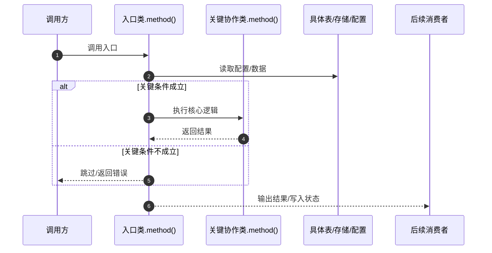

# 2026-09-13 代码逻辑文档生成方法参考

本文记录一种通用的代码逻辑文档生成方式，适合以后分析方法逻辑、启动链路、调度链路、配置同步链路、DB 到运行态转换链路、工具调用链路时参考。

目标读者是后续排查和接手的人。文档要让读者**先看懂全链路，再沿着源码行号和统一示例理解具体处理过程、字段与状态变化**，需要核对时可直接打开源码。判断文档是否合格，最终标准只有一条：**不打开源码，读者能否说清这个方法解决什么业务问题、统一示例怎样走完、结果意味着什么。** 结构齐全但读者看不懂，不算合格。

本版本相对 2026-08-16 版本的主要修订：

- 示例数据从"强制逐段全量 JSON"改为"受控增量"：同一份完整快照只展示一次，变化字段用"原值 → 新值"展示，未变化字段用引用说明，示例 JSON 总行数不应显著超过文字解释。
- 明确"输出示例必须对应该方法真实返回结构（以源码方法签名为准）"，禁止复制粘贴其他方法的示例模板；输入/输出相同的数据允许跨方法引用，不重复贴。
- 新增"示例一致性"要求：同一小节内当前示例状态、输入示例、输出示例、细节说明、方法小结五者讲同一件事、数值一致。
- 叙述方式新增硬性要求：每段先讲业务动机（为什么需要这一步、作用和影响），再讲代码行为；承接说明有实际承接关系时回指上一步结果；一段只讲一件事。
- 新增"核心概念速查表"和"拆分文档"规范：贯穿术语集中解释一次；拆分后的分册共享示例，不重复贴全量快照。
- 校验清单删除"未变化也必须展示 JSON"等助长冗余的检查项，新增内容质量与一致性检查项。

## 适用场景

- 需要解释一个方法或链路"怎么跑起来、怎么执行"，但不想只贴源码。
- 需要把配置字段、入口方法、运行态对象、请求对象、返回结果之间的关系讲清楚。
- 需要画 Mermaid 时序图，但图不能细到每个局部变量。
- 需要解释跨服务调用、多阶段生命周期或 WebSocket 等流式交互，并区分服务边界和内部实现。
- 需要给后续排查人员一个能直接对照源码、日志、数据库和配置的文档。
- 需要把一条长链路拆成多个主题文档（例如调度链路的模型目标、高频流目标、低频复用），每个主题一篇，配一篇总览。

## 基本原则

1. 主体先给整体时序图，让读者先知道全链路；参与者超过 3 个时，先在图前给角色说明表。
2. 默认省略独立的入口行数速查表，时序图后按链路展开方法说明；长文档可按需增加指向文内章节的关键入口导航。
3. 不展示方法源码代码块。每个方法保留入口链接，显示文本和目标都使用完整绝对路径加行号；细节说明按真实源码行号范围分段，并链接到各段起始源码行。
4. 尽量解释当前方法的完整执行逻辑，长方法按源码顺序分段讲解，不因省去代码而只写概括。普通样板逻辑可以简述，略过时标明内容和源码范围。时序图、请求参数和示例数据可以保留，但示例数据**受控使用**：同一快照不重复、只给相关字段、变化给增量。
5. 各行号段结合统一示例逐步推演，文档最后再汇总完整业务例子，包含调用前状态、调用参数、执行过程、调用后结果；同一条链路优先沿用前面的示例数据。
6. 每个结论要能回到源码行号、表字段、配置项或日志现象。
7. 区分不同触发时机，例如启动配置阶段、运行调度阶段、执行结果回写阶段，不要混成一团。
8. 每段细节说明都要详细、通俗地讲清**业务动机**（为什么需要这一步）和实际处理过程（这步做了什么、数据怎么变化、影响下一步），并结合统一示例说明具体值如何参与判断、运算或调用。不能只复述方法名，也不能直接从输入跳到最终结果，更不能只贴 JSON 代替解释。
9. 如果一个章节包含多个入口，必须拆成 `N.1/N.2/N.3` 这样的子小节，每个子小节只讲一个入口方法，按"标题 → 承接说明 → 源码入口 → 当前示例状态 → 方法输入/输出示例或引用 → 按行号分段的细节说明 → 方法小结"展开。
10. 按分析范围选择图的粒度：跨服务整体图以服务为参与者，内部调用链用 Note 标注；服务内部细节图才展开到关键类、方法和数据节点。
11. 每个方法小节标题下、源码入口前，必须先写一段承接说明（2 到 4 句），**第一句用通俗的业务语言说明本方法负责什么、解决什么问题**，再写调用来源或触发机制、关键参数来源、本段职责和后续去向。有实际承接关系时回指上一步的示例结果；首次入口或独立定时触发没有上一步示例时，不强求回指。调用关系以源码为依据，不能根据章节顺序推断。
12. 示例数据的一致性优先于示例数据的完备：宁可少展示几个字段，也不能让 JSON 与文字矛盾、或贴出一个与方法真实返回不符的结果。

## 推荐文档结构

```markdown
# <日期> <链路名或方法名> 代码逻辑说明

## 整体时序图（含角色说明表）
## 核心概念速查表
## 贯穿示例与初始状态
## 问题排查导航（排查类或长文档可选）
## 方法说明（按阶段分章，每个方法一个子小节）
## 边界场景（跨方法时可汇总，可选）
## 具体例子（文末汇总）
```

### 整体时序图

参与者超过 3 个时，先列角色说明表；表中名称与图中显示名称保持一致。

| 参与者 | 含义 | 职责 |
| --- | --- | --- |
| 调用方 | 触发链路的上游 | 提供输入并接收结果 |
| 入口类.method() | 本项目入口 | 校验输入、协调处理 |
| 关键协作类.method() | 内部协作组件 | 执行核心逻辑 |
| 具体表/存储/配置 | 数据节点 | 提供配置或保存状态 |
| 后续消费者 | 结果使用方 | 接收输出并继续处理 |

服务内部细节图模板（跨服务整体图使用"跨服务、多阶段示例"的服务级粒度）：



图与正文共用阶段编号和名称：图中 `阶段 N：xxx` 对应正文 `### N. xxx`，阶段内的方法使用 `N.1/N.2`。`autonumber` 只是图中消息箭头的序号，不作为正文章节编号。

### 核心概念速查表

长文档或拆分文档，在时序图后、贯穿示例前放一张速查表，把贯穿全文的技术名词、缩写、重要状态集中解释一次（一词一句，用业务语言），正文首次出现时引用速查表即可，不再重复展开。

| 术语 | 业务含义 | 本章示例 |
| --- | --- | --- |
| <名词/缩写> | <这个词在当前业务里代表什么、为什么读者需要知道它> | <统一示例中的取值> |

### 贯穿示例与初始状态

给出统一示例的初始状态（以下全部是**模拟数据**，不是数据库查询结果）。主示例贯穿全文，各章沿用；仅当解释主线没有经过的分支时，才标明"另一种情形/独立示例"。

| 输入对象 | 主示例初始值 |
| --- | --- |
| <输入对象> | <初始值> |

示例要满足：

- 初始状态具体、可查：给出对象、轮次、关键字段值。
- 示例轮次明确：说明 R1/R2/R3 各轮的状态推进（如果需要多轮）。
- 加载可能跨多轮，示例轮次是说明分支用的，**不是固定轮次完成或定时延迟保证**；没有代码等待"所有东西完成"的总屏障时不要暗示存在。
- 解释与执行不一致时，以代码说明为准并注明。

### 方法说明

每个方法固定顺序：**标题 → 承接说明 → 源码入口 → 当前示例状态 → 方法输入/输出示例或引用 → 按行号展开的细节说明 → 方法小结**。细节说明也可命名为"对应解释"，分支与异常在对应行号段说明。

### 具体例子

文档最后汇总完整业务例子，包含调用前状态（至少两个表/对象/配置）、调用参数、3 到 9 步执行过程、调用后关键字段变化、后续消费者。同一条链路优先沿用正文示例数据。

## 时序图写法

时序图只保留影响理解的对象，先确定图的分析范围，再选择参与者粒度。

### 参与者粒度与命名

- 跨服务整体图：每个服务作为一个 participant，本项目服务与外部服务都使用实际服务名；内部调用链放在该服务旁的 Note 中，不展开到每个类。
- Pod 等运行实例可按实际交互需要单独作为 participant，在角色表中说明其性质和职责，不把运行实例误写成服务。
- 服务内部细节图：本项目内部节点写到具体类或方法，外部依赖仍写实际服务名。
- 图中使用稳定、简短的 participant 标识，通过 `participant ID as 显示名称` 指定读者看到的名称。

服务内部细节图推荐保留：

```text
调用方
入口类/方法，例如 XDispatcher.dispatchMaster()
关键协作类，例如 MonopolizedCompatibilityHelper、XDispatcherGpuModel
具体主表，例如 x_dynamic_model
具体关联表或配置字段，例如 x_dynamic_model.monopolized_configs
后续消费者
```

不推荐放进图里：

```text
只有"核心服务""DB"这种无法落到源码和表的泛化节点
每个 Repository 的返回 Optional
每次 JSON.parse / JSON.toJSONString
每条 log
每个局部变量
每个 continue / return 的微小分支
跨服务整体图中每个 HTTP 请求的路由 -> Handler -> Service -> Client 内部调用链（用 Note 标注）
WebSocket 同方向的每条重复消息（合并为一条箭头，用 Note 说明消息序列）
```

命名要求：

- 服务名、类名和方法名遵循上面的粒度要求，不写无法辨认职责的"核心服务"。
- 需要展示的数据节点写到具体表名、配置项或关键字段，不只写"DB"。
- 跨服务整体图不强制展开服务内部的数据表和结果字段，必要信息放在 Note 或后续代码说明中。
- 消息合并不能丢掉关键时序；HTTP 内部调用链的折叠要求适用于跨服务整体图，内部细节图仍可展开关键协作方法。

### 阶段分隔与条件分支

- 创建、查询、执行、销毁等先后阶段，使用 `Note over ParticipantA,ParticipantZ: 阶段 N：xxx` 分隔，参与者标识必须已在图中声明。
- `autonumber` 只作消息序号，不作为正文章节编号。不能把消息序号、阶段编号和方法小节编号混用。
- 本文统一不使用 `rect` 背景色划分阶段。
- `alt / else` 只表达条件分支；重复查询可用 `loop`，不要把重复消息逐条展开。
- 启动配置、运行执行等由不同事件触发的阶段，应注明各自触发时机；如果不属于同一次连续调用，可拆成独立时序图。

### Note 用法

| 写法 | 推荐用途 |
| --- | --- |
| `Note right of X: ...` | 标注 X 的内部逻辑、关键条件或内部调用链 |
| `Note left of X: ...` | 标注 X 收到结果后的后续动作 |
| `Note over A,B: ...` | 标注跨多个参与者的阶段标题或公共说明 |

`right of` 和 `left of` 只决定注释位置；动作发生的时机由 Note 在消息序列中的位置体现。较长说明可以用 `<br/>` 换行，Note 只保留关键链路。

### 角色说明表

当参与者超过 3 个时，在时序图前增加角色说明表，至少包含"参与者、含义、职责"。缩写和技术名词首次出现时，先解释它在本链路中的业务含义与作用，再给技术名称；服务与运行实例要区分。

## 问题排查导航（可选）

排查类或较长的文档，可在整体时序图后、方法说明前按"问题现象 → 阅读章节 → 重点检查什么"提供简短表格。正文仍按业务主线连续展开，正常阅读不依赖跳转。

```markdown
## 问题排查导航

| 问题现象 | 阅读章节 | 重点检查什么 |
| --- | --- | --- |
| <用户或运维能观察到的现象> | [<对应阶段或方法标题>](#实际章节锚点) | <应核对的条件、输入、状态或日志及其预期表现> |
```

- 以读者的问题组织条目，不把方法名或技术步骤当成问题现象。
- "重点检查什么"写可核对的判断依据，不只写"检查配置""看日志"，也不在导航里另列源码路径和行号。
- 按实际标题和所用 Markdown 渲染器的锚点规则填写链接；标题变化后检查跳转是否有效。

## 标题下的承接说明

每个方法小节标题下、源码入口前，先写一段承接说明（2 到 4 句，复杂阶段可适当展开），固定顺序：

1. **第一句**：用通俗的业务语言说明"这个方法负责什么、要解决什么问题"，不能只复述方法名。
2. **回指上一步（有实际承接关系时）**：用一句话回指上一方法/上一阶段的示例结果（"上一步选中了 W1"），让读者知道自己走到链路哪一步；首次入口或独立定时触发没有上一步示例时，直接写调用来源即可，不硬凑回指。
3. **调用来源**：写出当前分析链路中的上游类、方法及调用条件，说明关键参数或状态从哪里传入。上一节不一定是直接调用方，省略的调用层级用简短调用链补齐。
4. **后续去向**：说明本方法的结果交给谁，或状态由谁继续使用，自然引出下一段；链路末尾则交代最终返回或收尾结果。

若由框架、定时任务或事件触发，说明触发来源及注册位置；区分事件发布方与框架回调。异步事件、定时任务和不同分支要说明实际触发关系，不写成必然连续执行。未确认的信息注明待确认。

## 方法说明写法

每个方法按"标题 → 承接说明 → 源码入口 → 当前示例状态 → 方法输入/输出示例或引用 → 按行号展开的细节说明 → 方法小结"展开，不展示方法源码代码块。方法输出示例是本次调用结束时的结果预览，不表示入口时已经得到该值；正文仍需逐段讲清它怎样产生。

- 方法入口的显示文本和目标都使用完整绝对路径加行号，格式为 `[/abs/path/file.go:10](/abs/path/file.go:10)`。
- 每段解释以可点击的行号范围开头，格式为 `[第 10-13 行](/abs/path/file.go:10)`；链接目标只写该段起始源码行。
- 本方法的行号默认属于入口文件。涉及其他文件时，明确显示文件名或完整路径。
- 行号以生成文档时读取的源码为准，文档应提示后续源码变动时重新校准行号和链接。

以下是写法模板，路径、行号、JSON 字段和值都是格式占位，实际文档必须按源码及统一示例替换。方法的真实输出可以是对象、数组、数值、字符串等，不要求包装成模板中的对象；**输出示例必须对应该方法真实的返回结构**。**模板中的输入/输出示例只在首次展示或需要新数据时填写；上游输出直接作为下游输入、或与已展示数据相同时，用文字和章节链接引用即可，不为凑齐模板重复贴 JSON。**

````markdown
### N. <链路阶段名>

<阶段编号与名称对应时序图。先说明本阶段业务目标，再交代承接的上游和输出去向。>

#### N.1 <入口方法及主要动作>

<承接说明：先讲本方法负责什么业务问题（人话第一句），有实际承接关系时回指上一步示例结果，再写实际上游类、方法、调用条件及参数来源，最后交代后续去向。>

入口：[/绝对路径/path/to/file.go:10](/绝对路径/path/to/file.go:10)

当前示例状态：<就地交代当前业务对象、轮次（如有）、本方法需要的具体值及业务含义；沿用上游结果，不重置数据。模拟数据注明为示例。>

方法输入示例（只含本方法相关字段；与已展示数据相同时引用来源）：

```json
{"参数名": "统一示例的输入值"}
```

方法输出示例（本次调用结束时，对应真实返回结构；与已展示数据相同时引用来源）：

```json
{"结果字段": "统一示例的输出值"}
```

细节说明：

[第 10-13 行](/绝对路径/path/to/file.go:10)：<先讲这一步解决什么业务问题、作用和影响（能从源码确认的后果才写），再解释变量含义、判断条件、处理过程和本例变化，最后说明结果给谁用/影响下一步。本段内的分支、跳过和异常在这里说明。>

[第 14-20 行](/绝对路径/path/to/file.go:14)：<沿用上一段结果，详细解释本段行为。若调用下游方法，说明方法名、参数从哪个当前变量取得、返回值怎样被使用；关键调用才给输入/输出示例，简单调用在文字中说明即可；上游输出直接作为下游输入时引用来源，不重贴。>

方法小结：<用 2 到 3 句说明完成的业务工作、统一示例当前结果或状态及含义、下一步交给谁或怎样结束。>
````

多入口场景：每个方法保留自己的职责、承接说明、当前示例状态、细节解释和方法小结，**不能共用一组输入、输出或细节说明**；但输入/输出数据相同可以引用已有示例——上游输出直接作为下游输入时，在输入位置用文字和章节链接引用来源并说明对应关系，不为进入新方法重贴 JSON。单个小节只展示本方法相关字段，不变上下文引用"核心概念速查表"或"贯穿示例与初始状态"。

方法覆盖规则：

- 以当前分析的方法为单位，尽量解释完整执行逻辑，覆盖参数处理、变量初始化、条件分支、循环、方法调用、异常处理和返回结果。
- 长方法按源码顺序划分业务逻辑段，每段有行号链接、详细解释和示例变化，分支及异常在其对应位置说明。行号用于核对依据，不能机械切割业务叙述。
- 普通样板逻辑、无关 import 和重复日志可以简述或略过，但要标明略过的内容及源码范围。影响状态、错误语义、资源释放或排查结论的逻辑必须解释。
- 方法源码通过链接查看，正文用自然语言和必要的行内变量名、条件表达式讲清逻辑，不复制整段源码。时序图、请求参数和示例数据不受此限制，但示例数据遵守"示例数据与 JSON 写法"一节的受控规则。

## 细节说明写法

当前方法的入口链接之后，先给当前示例状态，以及输入、输出示例或引用（首次展示或需要新数据时给 JSON，已有数据用引用），再按源码行号顺序展开细节说明，最后给方法小结。

每条细节说明的固定结构：

1. **动机句（1-2 句）**：先讲"这一步解决什么业务问题、作用和影响"，再讲代码行为。只有能从源码或业务说明确认的后果才写"不做的后果"，无法确认的设计意图不推测；不能只翻译赋值、判断和调用，也不能只说数值从多少变为多少。
2. **处理过程**：变量含义、实际判断条件、循环处理哪些业务对象、何时继续或退出、传入什么参数、返回值如何使用。
3. **示例推演**：代入统一示例的具体值，说明判断/计算过程和得到什么中间结果。
4. **业务影响**：结果意味着什么、传给谁、影响下一步什么。这一步失败会影响什么（状态、后续消费者是否拿不到结果）。

一条细节说明只讲一个业务动作及其影响；辨析、警告等补充信息用"注意/边界"单独成段或单独一句，不把多个知识点压进同一段。

示例状态既要连续，也要就地可读。首次交代具体输入和初始状态；进入新方法、关键阶段或新轮次时，重述本段需要的对象、轮次和当前状态及含义，不只写"同前""沿用上一轮"。同一链路承接上游结果，不因重述而重置状态；新增依赖数据或返回值注明来源，模拟数据标为示例。

遇到条件、分支或异常处理，就在其对应行号段讲清触发条件、具体处理及业务影响，并说明统一示例为什么进入或不进入。本例未执行的代码明确标注"本例未执行"，不要编造其执行结果；需要展示该分支的变量值或调用输入、输出时，另标"分支示例"。分支示例不改变后续统一示例的状态。

每个方法最后必须有简短小结，通常 2 到 3 句：完成了什么业务工作、统一示例当前结果或状态意味着什么、下一步交给谁或怎样结束。小结不重抄行号解释。

避免写法：

```text
这段代码进行处理。
这里调用了方法。
然后返回结果。
```

```text
只贴 JSON，不写文字解释；或先贴一大段 JSON 再说"见上"。
```

详细程度以读者能理解业务为准，不必每行单独写一句：

- 本步在业务中解决什么问题、推动了什么结果，再说明对应的校验、配置读取、请求转换、执行或回写动作。
- 关键输入字段来自哪里：HTTP body、header、配置项、数据库记录、ctx Principal、上一步构造的对象、上游服务返回。
- 关键输出字段传给谁：写到哪个字段、传给哪个方法、进入哪个 channel、落到哪张表、被哪个后续组件读取。
- 哪个条件会导致分支变化：开关是否开启、字段是否为空、权限是否匹配、列表是否为空、工具是否允许、上游是否返回错误。
- 如果涉及身份或权限，要说明每个 ID 的语义。
- 如果涉及异步或流式处理，要说明 channel/SSE/event 的生产者和消费者是谁，以及什么时候收尾。
- 如果涉及配置和运行态转换，要说明配置字段如何进入运行时对象，以及后续请求是否会复用这份运行态。

## 示例数据与 JSON 写法

示例数据用于辅助解释，**不能代替文字解释**，也不能重复自身。规则如下：

1. **同一快照不重复**：同一份完整快照全文只展示一次。全局不变的上下文（如全部 Worker 心跳、模型基础配置、统一示例状态）在"贯穿示例与初始状态"或首次出现的章节集中定义，后续小节用一句话引用（"W1/W2 心跳沿用 2.x 输入"），不重复贴整份快照。
2. **每个小节的输入/输出示例只含本方法相关字段**：不把整个全局状态整块贴进每个方法。方法输入示例展示本方法读取的关键参数；方法输出示例展示本方法真实返回的关键字段（以源码方法签名为准）。上游输出直接作为下游输入时引用来源，不重贴。
3. **变化字段用增量展示**：同一方法内多个行号段之间字段发生变化时，展示"原值 → 新值"或字段的 before/after；未变化的字段用文字说明"沿用输入，未变化"，不重复贴。`before` / `after` 是文档说明标记，不是实际对象字段或返回结构；值应保持源码中的真实类型，不能把箭头或标记混入实际值。例如后续修改了 `runtime`，只展示该字段的变化：

```json
{"runtime": {"before": "", "after": "[W1]"}}
```

4. **关键调用才给两份示例**：只有参数来源或返回值影响后续判断的调用才分别给输入、输出示例；简单调用在文字中说明即可，不强制独立 JSON 块；与已展示数据相同时引用来源。
5. **禁止复制粘贴其他方法的示例模板**：每个方法的输入/输出示例必须对应本方法真实签名与返回结构。生成或检查时对照源码方法签名核对，发现贴错立即修正。
6. **JSON 规模受控（比例只作提醒，不机械卡数值）**：示例 JSON 总行数不应显著超过文字解释行数（建议不超过全文 50%）；若生成结果明显以贴数据为主，说明示例写法退化，需要压缩。是否合格以读者能否顺畅理解为准。
7. **无参数/无返回值的规范化**：无显式参数时输入示例用 `{}` 并说明"无显式参数"；无返回值时输出可用 `{"hasReturnValue": false}` 并注明这是文档说明标记，不是真实返回对象。真实返回空值才写 `null`；未知输出用 `{"availability": "unknown"}` 并注明是待确认标记。
8. **一致性**：同一小节内"当前示例状态 / 方法输入示例 / 方法输出示例 / 细节说明 / 方法小结"五者必须讲同一件事、关键数值一致。生成完对照一遍，任何一处矛盾都要修正，不能留到读者发现。

## 拆分文档与主控方法

长链路拆成多篇主题文档时，遵守以下规则：

1. **总览与分册分工**：总览放跨阶段时序图、角色表、完整贯穿示例、术语速查表、问题排查导航、调用树和完整业务例子；分册放各自主题的方法级说明。
2. **分册不重复全量快照**：分册文首放一段简版示例状态（3-5 句话 + 关键初始值表，或链接"见总览贯穿示例"），不把角色表、完整示例表、全部术语表逐篇复制。
3. **同一示例跨文档一致**：各分册沿用同一主示例（同一对象、同一轮次、同一关键值），修改示例时同步各篇；分册之间用链接互指。
4. **主控/跨阶段方法去重**：横跨多阶段的主控方法（如 XDispatcher.dispatchMaster），在本主题分册中只详细展开本主题相关路径；其他阶段一句带过并链接到对应分册章节（"流阶段细节见 03 文档 X 节"），避免同一逻辑两篇重复解释。
5. **各分册保持可独立阅读**：每篇有自己的时序图（可以缩小范围到本主题阶段）、问题排查导航（只列本主题现象）和文末具体例子（只覆盖本主题），不要求读者先读完其他分册才能看懂。

## 具体例子写法

各行号段中的示例随解释展开，方法小结收拢局部结果，文档最后再汇总完整业务例子。同一条链路沿用前文数据，用业务语言说明各阶段怎样推进、最终解决了什么问题。

例子必须包含：

- 场景说明。
- 调用前至少两个表、对象、配置或运行态状态。
- 调用参数或请求体。
- 3 到 9 步执行过程。
- 调用后关键字段变化或返回结果。
- 后续谁消费这个结果。

例子不要只写"假设 A 变成 B"。要写清楚字段链路，例如：

```text
gpu_card_group_model_relation.group_id
    -> gpu_card_group.id
    -> gpu_card_group.name / card_limit / is_exclusive
    -> x_dynamic_model.monopolized_configs
```

````markdown
### 场景

一句话描述这次例子要模拟什么。

### 调用前数据

`table_a`：

| id | name | status |
| --- | --- | --- |
| 1 | demo | 1 |

### 调用参数

```json
{"names": ["demo"], "action": "add"}
```

### 执行过程

```text
1. 查询主对象 demo。
2. 查询 demo 的关联关系。
3. 根据关联关系生成目标配置。
4. action == add 时启用对象。
5. 保存结果。
```

### 调用后结果

| name | status | config |
| --- | --- | --- |
| demo | 0 | [{"target":"targetA"}] |

### 后续消费者

- 后续消费者会读取 `table_a.config`。
- 如果配置为空，后续链路不会按该对象调度。
````

## 边界场景

当前方法的分支与异常在对应行号段解释，不能因缺少独立边界场景章节而省略。跨方法的边界场景可在文末完整业务例子之前汇总，引用对应方法的行号说明，避免重复大段解释；这个汇总章节可选，不能代替方法内的说明。

模板：

```markdown
## 边界场景

| 场景 | 行为 | 影响 |
| --- | --- | --- |
| 输入为空 | 直接返回 | 不改数据 |
| 主对象不存在 | 跳过当前对象 | 继续处理后续对象 |
```

## 校验清单

写完文档后检查：

1. 主体是否先给整体时序图，参与者超过 3 个时是否在图前给角色说明表。
2. 是否省略独立的入口行数速查表；按需提供的问题排查导航是否按现象组织、链接到对应章节，并给出具体检查依据，跳转是否有效。
3. 方法入口链接和各段行号链接是否指向正确文件的对应源码行，是否避免在导航中另列源码路径和行号。
4. 方法是否按实际链路组织，细节说明是否按源码行号顺序展开，分支与异常是否在对应行号段解释且没有遗漏。
5. 每个方法的 `入口` 是否使用完整绝对路径加行号作为链接显示文本和目标。
6. 是否省去方法源码代码块，入口链接后是否依次给当前示例状态、方法输入示例或引用、方法输出示例或引用，再展开按行号分段的细节说明。
7. 每段是否**先讲业务动机**（为什么需要这一步、作用和影响；只有源码或业务说明能确认的后果才写"不做的后果"），再解释条件和中间步骤，结合示例说明变化的业务意义，避免仅翻译代码行为或列数值，避免推测无法确认的设计意图。
8. 是否说明了关键字段从哪里来、传到哪里去。
9. 是否区分了启动配置阶段、运行执行阶段和结果回写阶段。
10. 是否尽量解释当前方法的完整执行逻辑，避免因篇幅限制只讲关键片段；略过的内容及源码范围是否注明。
11. 是否在文末汇总完整业务例子，并包含调用前、调用参数、执行过程、调用后；同一条链路是否优先沿用正文示例数据。
12. 是否说明了后续消费者。
13. 阶段下多个方法是否拆成子小节，每个方法是否都有职责与承接说明、源码入口、当前状态、输入/输出示例或引用、按行号展开的细节说明和方法小结。
14. 各段解释是否标注真实源码行号范围并链接到该段起始行，范围与解释内容是否对应，跨文件时是否明确文件归属。
15. 是否避免了"入口 1/入口 2 后统一细节说明"的写法。
16. 是否按图的范围选择粒度：跨服务整体图以服务为参与者，内部细节图才展开关键类、方法和数据节点。
17. 跨服务整体图是否用 Note 标注内部调用链，外部服务是否使用实际服务名而未臆造内部实现。
18. 是否用 `Note over` 分隔阶段、用 `alt / else` 表达条件分支，并避免使用 `rect` 背景色。
19. Note 的位置是否对应实际时机，是否避免把左右位置误当成业务语义。
20. WebSocket 重复消息是否适当合并，并保留握手、双向交互、结束和错误等关键时序。
21. 角色表及正文首次出现的重要术语、缩写和状态是否解释业务含义与作用，是否避免只翻译英文；角色名称是否与图中一致；长文档是否提供核心概念速查表。
22. 每个方法小节（含 `N.1/N.2`）是否在标题下、源码入口前先给承接说明。
23. 承接说明第一句是否用人话说明本方法负责什么，第二句是否回指上一步示例结果，再交代实际上游类、方法、调用条件和参数来源；框架触发是否说明来源和注册位置，后续去向是否清楚。
24. 标题下的承接说明与按行号展开的细节说明是否各有作用，是否避免空泛复述标题、重复整段解释或编造调用关系。
25. 省略的调用层级是否补齐，多调用方是否聚焦当前分析链路；是否避免把章节相邻或事件、数据传递关系当成直接调用，未确认的信息是否注明待确认。
26. 是否用详细、通俗的语言讲到参数处理、变量初始化、分支、循环、调用、异常和返回结果，说明实际存在的处理逻辑、数据变化及影响，而不只是复述方法名或只贴 JSON。
27. 新方法、关键阶段或轮次开始时，是否就地提醒所需当前状态及含义；示例是否连续、值变化是否讲清原值与新值，是否避免要求回翻、重置状态或混入反例结果。
28. 未走到的分支是否在对应行号段说明条件、具体行为及业务影响，并标注本例未执行；分支示例是否单独标明且不改变统一示例的后续状态，模拟数据与未确认信息是否明确区分。
29. 每个方法是否有简短小结，说明完成了什么、主示例当前结果意味着什么以及下一步，而不是重复逐行解释。
30. 图中阶段编号和名称是否与正文一致，方法是否使用阶段下的子编号，是否避免把箭头消息序号当成章节编号。
31. **不打开源码，读者能否说清方法解决什么业务问题、主示例怎样走完、结果意味着什么；若不能，不能仅凭结构和行号齐全判定合格。**
32. **示例数据是否受控**：同一份完整快照是否只展示一次；每小节输入/输出示例是否只含本方法相关字段；未变化字段是否用引用而不是重复贴；变化是否用"原值 → 新值"说明并保持真实类型；示例 JSON 总行数是否没有显著超过文字解释行数（比例只作提醒，不以机械数值判合格）。
33. **示例一致性**：每小节"当前示例状态 / 方法输入示例 / 方法输出示例 / 细节说明 / 方法小结"五者是否讲同一件事、关键数值一致；每个方法的输出示例是否对应该方法真实返回结构（对照源码方法签名核对），是否存在复制粘贴其他方法示例模板的情况。
34. **拆分文档（如适用）**：分册是否不重复全量快照（角色表、完整示例表只在总览）；同一示例跨文档是否一致；主控/跨阶段方法是否只详细展开本主题路径、其他阶段链接到对应分册而非重复解释。

## 当前参考样例

生成新文档时，可参考本目录内已有的、通过上述校验清单的文档作为样例（如有）。样例体现的重点：

- 主体先给整体时序图；参与者超过 3 个时在图前补充角色说明表。
- 方法入口使用完整绝对路径加行号作为链接显示文本，每段解释用可点击的行号范围定位源码。
- 不展示方法源码代码块，结合统一示例按源码顺序详细解释，分支与异常在对应行号段讲清。
- 示例数据受控：同一快照不重复、变化给增量、输出对应真实返回结构；文字解释先讲业务动机再讲代码行为。
- 每个方法先讲业务职责和调用来源，承接说明回指上一步结果，最后给方法小结；图与正文使用一致的阶段编号。
- 长链路拆分时，总览放跨阶段时序、角色表、完整示例和术语速查表；分册放各自主题的方法说明，不重复全量快照。
- 文末汇总完整业务例子，说明后续消费者。