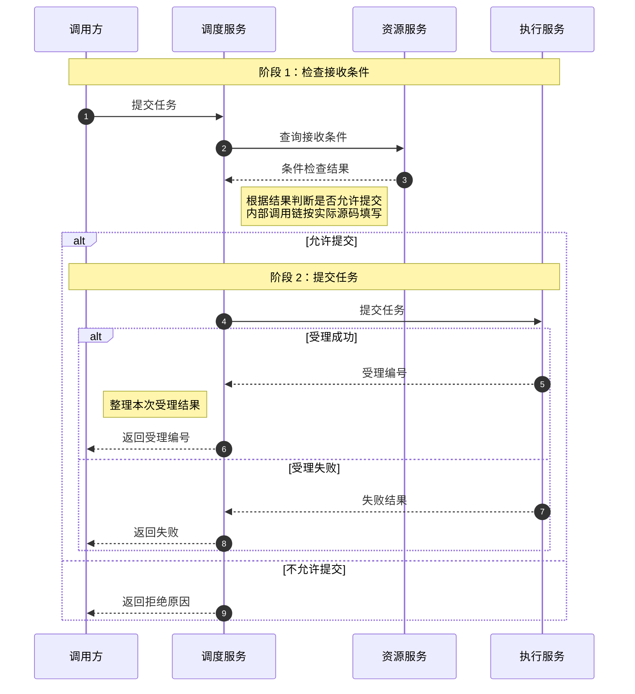

# 2026-09-14 代码逻辑文档生成方法参考

本文基于 2026-08-16、2026-09-13 两版重新组织，作为一份可独立使用的规范。适用于方法逻辑、启动链路、跨服务调用、调度流程、配置同步、数据库到运行态转换，以及异步或流式执行链路的说明。

目标是让接手或排查的人不打开源码，也能说清：这条链路解决什么问题、各方法为什么在这里执行、统一示例如何推进、结果意味着什么。源码链接用于核对证据，不能代替解释；格式齐全但读者看不懂，不算合格。

## 一、写作原则

1. **先讲规则，再用场景讲透过程，不逐句翻译。** 先说清处理什么业务对象、遵循什么规则或完成什么动作，再结合变量含义和具体数据解释实现过程、主例结果及业务影响。详细不以字数、行号段数或 JSON 数量衡量，而以读者能否理解“为什么得到这个结果，关键条件改变后会怎样”衡量。不能只写业务口号，也不能把“遍历、判断、赋值、调用”换成中文就当作讲解；主例未触发关键处理时，应用触发场景把该过程讲透。规则、处理行为和设计动机以源码或业务说明为依据，未知信息注明待确认。
2. **默认详细讲解，不输出逻辑摘要。** 每个纳入详细分析的方法必须有实际展开的“细节说明”正文，不能由作用、输入输出、分支摘要或问题分析替代。分析范围内每个有实际作用的处理步骤都要解释到，包括取值、初始化、条件、循环、调用、数据修改、异常和收尾；不能因为某步骤不改变当前示例结果就略过。篇幅由实际逻辑决定，几十行包含多个处理步骤的代码不能只配几句总结和最终 JSON。普通样板或重复逻辑可以合并简述，但要标明范围；完整覆盖不等于每行翻译一句。
3. **按实际关系组织。** 方法按业务链路排列，方法内部按源码顺序展开。章节相邻不等于直接调用；事件、定时任务和异步结果不写成必然连续执行。
4. **不贴方法源码。** 保留源码入口和真实行号链接，用自然语言及必要的行内标识解释。Mermaid、JSON 示例数据、表格不受此限制。
5. **解释充分，变量示例具体，完整快照不重复。** 同一条链路使用连续示例；主动展示有助于理解的输入、读取结果、判断、筛选和计算中间值、调用参数及状态变化，不把 JSON 限制为修改后的字段。首次展示相关数据，变化展示增量，原样沿用的完整快照引用来源；为就地读懂本段，可以保留少量必要标识和关键值。
6. **事实与示例分开。** 真实行为以已读取的源码、配置或其他可核对证据为准；模拟输入、假定依赖返回和未知结果明确区分，不把示例当成运行事实。

## 二、文档组织

### 单篇文档

推荐结构如下。短方法可以缩减无关章节，不为满足格式虚构角色、术语、输入对象或执行步骤。

```markdown
# <日期> <链路或方法名> 代码逻辑说明

<简述业务问题、分析范围及源码版本或读取时间（已确认时填写）。>

## 整体时序图
<按参与者数量决定是否先给角色表。>

## 核心概念（术语较多时）
## 贯穿示例与初始状态
## 问题排查导航（排查类或长文档可选）

## 方法说明
### 1. <阶段名称，与图一致>
#### 1.1 <方法名及主要动作>
#### 1.2 <方法名及主要动作>
### 2. <下一阶段名称>
#### 2.1 <方法名及主要动作>

## 边界场景（需要跨方法汇总时）
## 完整业务例子
```

主体先给整体时序图，再展开方法。单方法分析可直接使用方法标题，不强设多阶段。不要设置独立的“入口行数速查”或按方法堆列表的“关键入口导航”；需要排查导航时，按问题现象组织。

### 核心概念与初始状态

术语较多时，在图后用简表集中解释贯穿全文的概念，列出“术语、业务含义、示例中的对应对象”。正文首次使用时带一句必要的业务称谓，链接到概念定义，不要求读者频繁回翻，也不重复整段定义。重要状态码、身份 ID、配置字段不能只给英文名或数字。

在方法说明之前定义贯穿示例：业务目标、具体输入、必要配置或依赖状态、关键对象及字段初始值。只展示本次分析需要的数据，标明模拟数据或实际来源。多轮流程说明轮次和起始状态；轮次是示例推演，不是固定耗时或固定轮数完成的保证。贯穿示例称为“主例”，后续各方法连续承接；为展示主例未触发的关键处理，可在对应业务块就地补“触发场景”，明确改变的输入或状态，并与主例隔离。

### 问题排查导航

可放在方法说明之前，使用“问题现象 → 阅读章节 → 检查依据”的表格，不另列源码路径和行号。

| 问题现象 | 阅读章节 | 检查依据 |
| --- | --- | --- |
| <用户或运维观察到的现象> | <对应方法或阶段的章节链接> | <具体条件、状态、输入或日志及预期表现> |

导航按现象组织，不能将所有现象归为单一原因。链接指向解释相关判断、分支或异常的章节；正常阅读仍应连续，不依赖跳转。标题变更后检查锚点是否有效。

## 三、时序图

### 粒度与命名

- 跨服务整体图：每个服务作为一个 participant，使用实际服务名；服务内部路由、Handler、Service、Client 调用链放在 Note 中，不展开为每个类之间的箭头。外部服务不臆造类名或内部实现。
- 服务内部细节图：展开影响理解的具体类、方法、主表、关联表或配置字段。不只写无法辨认职责的“核心服务”“DB”，也不展开所有 Repository、序列化调用、局部变量和日志。
- Pod、进程等运行实例可按需要单独作为参与者，说明其性质，不误称为服务。participant 使用稳定简短标识，显示名通过 `as` 指定。
- 图中参与者超过 3 个时，在图前给角色表，至少列“参与者、含义、职责”；表中名称与图一致。

### 阶段与注释

| 写法 | 用途 |
| --- | --- |
| `Note over A,B: 阶段 N：名称` | 阶段分隔；编号和名称对应正文章节 |
| `Note over A,B: 说明` | 多个参与者的公共说明 |
| `Note right of X: 说明` | 常用于内部逻辑、调用链或条件 |
| `Note left of X: 说明` | 常用于收到结果后的处理 |

左右位置只影响排版，不代表业务语义；注释所在的消息位置才体现时机。长注释可用 `<br/>` 换行。不要使用 `rect` 背景色。

条件使用 `alt / else`，重复查询使用 `loop`。成功后的动作应放在成功分支中；提前返回或失败后不应继续执行的动作，不能无条件画在分支外。`autonumber` 仅为消息序号，不作为正文章节编号。

启动、定时调度、事件消费等若不是同一次调用，分别标注触发来源，必要时拆图。异步发布成功不等于下游处理完成；加载跨轮次时不虚构等待全部完成的总屏障。

WebSocket 或流式消息可合并同方向重复消息，并用 Note 说明序列；必须保留握手、双向交互、结果、错误与结束时序，不能合并掉影响判断的消息。

### 跨服务、多阶段示范

以下服务与行为均为格式示范，不代表实际项目。正文对应“阶段 1：检查接收条件”和“阶段 2：提交任务”；阶段 2 仅在接收条件成立时发生。

| 参与者 | 含义 | 职责 |
| --- | --- | --- |
| 调用方 | 请求发起方 | 提交任务、接收结果 |
| 调度服务 | 任务入口服务 | 检查接收条件、提交任务 |
| 资源服务 | 资源信息提供方 | 返回当前接收条件 |
| 执行服务 | 任务接收方 | 接收任务并返回受理结果 |



图中的“受理成功”不代表任务执行完成。真实项目如果存在超时、重试或后续回调，应按实际行为补充，不从本模板推断。

## 四、方法说明

### 小节组织

每个方法使用一份自己的说明，按以下顺序展开：

**标题 → 承接说明 → 源码入口 → 当前示例状态 → 输入示例或引用 → 输出示例或引用 → 细节说明 → 方法小结。**

“细节说明”是每个方法小节的必需正文，使用明确的“细节说明”标题或标签，在其下面按真实源码行号范围展开当前方法的处理过程。不能只写方法名、入口链接、“作用 / 输入 / 输出 / 分支一二三 / 失败边界”，就认为方法说明已经完成；也不能只补一个标题，下面仍是动作列表、几句概括或结果 JSON。跨方法的架构图、完整例子和问题检查报告都不能代替当前方法自己的细节说明。未实际展开的方法视为尚未完成，不能作为已完成的方法讲解交付。

标题概括方法及主要动作，不塞入全部背景。一个阶段包含多个方法时，用 `N.1/N.2` 拆开；阶段介绍不能代替每个方法的承接说明，也不能先罗列多个入口再集中解释。

承接说明通常用 2 到 4 句自然语言，直接放在标题下、源码链接前：第一句讲清方法负责什么业务问题，随后交代实际上游类、方法、调用条件或触发机制、参数来源及后续去向。有实际承接关系才回指上一节的示例结果；首次入口或独立触发不硬凑“上一步”。

上一节不一定是直接调用方，省略层级时补简短调用链；多个调用方优先说明当前分析的那个。框架、定时任务、事件或回调入口要说明注册位置及触发来源，区分发布者和实际调用者；无法确认的关系注明待确认。

当前示例状态用一句话提醒对象、轮次及影响本方法判断的关键值，不重贴全局快照。输入、输出分别说明，展示与去重规则见第五节。开头的输出是调用结束时的结果预览，不是入口时已经可用的数据。

### 源码定位

- 入口显示文本和目标均为绝对路径加真实行号：`[/abs/path/file.go:10](/abs/path/file.go:10)`。
- 每个业务块使用“业务动作名称 + 可点击源码行号”的标题或标签，例如 `**块一：组内一致性检查（[第 179-204 行](/abs/path/file.go:179)）**`。也可用 `[第 10-13 行](/abs/path/file.go:10)：<业务动作名称>`；单行用 `[第 14 行](/abs/path/file.go:14)`。行号链接目标只写起始行，不写范围；块序号只用于方法内部，不代替图的阶段编号。
- 本方法的行号默认属于入口文件；跨文件明确文件名并链接到实际文件，同名文件写清路径。路径含空格时使用 Markdown 的尖括号目标写法。
- 行号对应实际读取的源码，不能使用文档行数。不连续的代码分别标注；略过内容写明范围及原因，不能用大范围掩盖未解释部分。源码更新后重新校准链接；可记录已确认的提交版本。

### 细节说明的深度

本节要求适用于已经实际写出的细节正文，不能用补充“作用”“输入”“输出”或“风险”来代替。正文必须结合当前方法所承接的统一示例，解释变量的业务含义与来源、实际处理顺序、条件为何成立、中间结果如何产生，以及这些结果怎样影响后续动作。先确认细节说明存在，再检查是否完整、通俗、有业务含义；不是只检查有没有标题或行号。

按源码顺序划分有业务含义的逻辑段，每段围绕一个业务问题展开，可以包含为解决它而进行的多个处理步骤。分段不是本节要控制的数量指标；行号范围大或小，都要把范围内的实际处理过程讲到位。分支、跳过和异常就在对应行号段解释，不另拆“主路径”“其他分支与异常”两组章节。

推荐按下列顺序组织每个业务块。可以使用“规则、执行过程、主例结果、触发场景、注意”等简短标签，但标签下必须有实际讲解，不能只列结论；简单块不必机械凑齐全部标签。

| 内容 | 讲清的问题 |
| --- | --- |
| 业务块标题与行号 | 这一块在检查或处理什么，而不只是某个循环或变量名 |
| 规则 | 针对哪些对象，满足什么条件时如何处理，修改范围是什么；普通处理块说明目标和约束，不强行概括不存在的业务规则 |
| 执行过程 | 数据和变量从哪里来，比较谁、修改谁，各步骤怎样衔接并落实规则；关键调用和中间数据在对应位置解释 |
| 主例结果 | 代入主例当前值，说明为什么触发或未触发、改了什么或为何未变，结果交给谁 |
| 触发场景 | 主例未覆盖关键处理时，用最小但充分的具体场景推演条件、过程和结果，不只说“另一种情况会修改” |
| 注意事项 | 容易误解的顺序依赖、修改范围、空值、异步关系等；只写与本块实际逻辑相关的边界 |

规则句先让读者理解代码要实现什么，执行过程再说明它怎样实现；两者不能互相替代。已有结果怎样成为下一步的依据、条件为何成立、业务状态如何推进都要讲清，不能每翻译一句代码就附一句泛泛的“提高效率”或“保证正确性”，也不能根据示例结果反推作者的设计动机。

不要把“第多少行到多少行”写成一句塞满变量、条件和结论的提要。一个行号段可以有多个自然段和多个小 JSON：先解释变量代表什么、具体值从哪里来，再按处理顺序代入数值，把比较、筛选或运算过程讲开，最后说明结果意味着什么、交给谁。正文应让读者直接理解，不让读者拿着结论自己还原代码。

承接说明的 2 到 4 句、方法小结的 2 到 3 句只适用于各自位置，不限制细节说明篇幅。正文无需凑固定字数，但不能省掉连接结论的推导过程。若一个范围包含“遍历对象、查询状态、读取旧计数、更新计数、判断阈值、记录待清理对象、执行清理”，就把这些步骤的作用、数据传递和本例结果连续讲清，而不是缩成“检查状态，达到阈值则清理”。

对于“空值取默认值，再按条件分组”这类多步逻辑，要分别解释默认值何时生效、本例是否使用默认值、条件两边是什么、本例为何进入或不进入某组，以及哪些相关值没有因此改变。对于“不能等同于”“不代表”等辨析，要先说明两个概念各指什么、为什么容易混淆，再讲实际区别，不能只给一句否定结论。

下表用于判断过程是否解释充分，不要求把每个行号段写成同一套标签。源码中实际出现哪种处理，就讲清相应问题：

| 实际处理 | 应展开的解释 |
| --- | --- |
| 读取变量或对象 | 从哪个参数、集合、配置、缓存或查询取得，业务上代表什么，本例拿到什么；为空或不存在时如何处理 |
| 默认值或初始化 | 缺少数据时采用什么值，何时生效，本例是否触发；它怎样影响后续判断，不只是“设为 0” |
| 条件判断 | 判断双方及其业务含义，本例为何成立或不成立，每种结果进入哪里、允许或阻止什么 |
| 循环遍历 | 遍历哪些业务对象，每次拿到什么，前后迭代是否共享状态，何时跳过或退出，结束后留下什么 |
| 计数、计算或状态更新 | 原值如何取得，计数键区分什么对象，何时初始化、累加或清除，中间计算及本例变化，谁继续使用 |
| 集合增删或筛选 | 操作哪个集合、其中什么对象、匹配依据是什么；立即修改还是先收集稍后处理，结果怎样影响后续对象选择 |
| 方法调用 | 当前为什么需要它，实际传入什么，内部关键处理如何产生结果，返回或副作用怎样影响当前流程 |
| 返回、清理或异常 | 触发条件、已完成的动作、此后不再执行的动作，资源和状态最终如何收尾；错误怎样传播或被处理 |

重要下游调用如果决定本段业务含义，要读取相关实现后解释，不能只将方法名翻译为“执行检查/完成清理”。已在其他小节详细讲过的实现，当前说明其职责、实际参数、关键结果和对本段的影响，再链接详情，不重复全文；尚未确认的内部行为标待确认。

配置与运行态说明字段怎样传递、是否复用；身份或权限说明每个 ID 对应什么主体。异步或流式处理说明生产者、消费者、完成条件与收尾，不把即时返回和后续完成混为一谈。

主例结果不能只写“未执行”“不修改”或“沿用输入”，要代入具体条件说明原因，例如只有一个成员没有比较对象、只与本组比较被跳过、计数尚未达到阈值。当主例因此没有展示本块关键判断、冲突处理或状态修改时，必须在本块补充最小且可行的触发场景：写清改变了哪些输入或状态，逐步比较、处理，说明修改哪个对象、改成什么、是否影响后续步骤。不能仅标“本例未执行”就结束；主例已充分展示该过程时不重复举例。

触发场景是独立的分支示例，不是主例下一轮或必然发生的后续。标明场景起始状态，结束后仍由主例结果承接下一块；同一个触发场景若需跨块推演，要明确声明连续关系。只构造源码中存在且满足前置条件的场景，不为覆盖标签编造不可达分支；无法确认触发条件时注明待确认。

普通 getter/setter、重复日志和样板代码可以合并简述；影响业务判断、错误语义或资源释放的逻辑不能略过。每段都要交代相关变量，遇到新的读取结果、筛选集合、分组结果、计算中间值或关键参数，应优先配具体 JSON，不因原变量未修改就省略数据示范。纯粹沿用已有结果的段落可以只用文字；不凑 JSON 数量，也不虚构变量或变化。排查关键点可补一句应观察的状态或日志。

方法小结用 2 到 3 句归纳完成的业务工作、本例当前结果的意义及后续去向，不重抄行号解释或结果快照。承接说明负责“为什么读到这里”，细节说明负责“具体怎样完成”，小结负责“现在得到了什么”。

### 方法模板

以下路径、行号、字段和值都是占位，实际文档须替换。模板中的“细节说明”及其过程正文必须保留并实际展开，不能替换为“作用、输入输出、分支结论、失败边界”的摘要模板。JSON 紧跟相关解释，新增的中间结果也应展示，不限于输入、输出和修改后的字段；已有完整快照引用来源，必要的标识及少量关键值可以就地保留。

````markdown
#### N.1 <方法名及主要动作>

<第一句讲职责，再说明实际调用来源或触发机制、参数来源；有真实承接关系时回指前文结果，最后说明输出去向。>

入口：[/绝对路径/path/to/file.go:10](/绝对路径/path/to/file.go:10)

当前示例状态：<一句话提醒当前对象、轮次及关键值；模拟数据注明来源。>

输入示例（仅展示相关字段；已有数据则引用来源并说明参数对应关系）：

```json
{"参数名": "本例输入值"}
```

输出示例（调用结束时的结果预览；遵循实际返回结构，已有数据可引用）：

```json
{"结果字段": "本例输出值"}
```

**细节说明**

**块一：<业务检查或处理名称>（[第 10-45 行](/绝对路径/path/to/file.go:10)）**

规则：<先用业务语言说明对象、判断条件、处理动作及作用范围，以源码为依据。行号长度仅为占位，不作为分段标准。>

执行过程：<解释数据和主要变量的含义与来源，再按实际顺序讲清取值、比较、调用、更新与收尾怎样落实规则。说明步骤之间的关系，不能只写“遍历列表、检查状态”。>

<一个范围包含多个处理步骤时，用多个自然段逐步展开。关键调用分别给输入、输出示例或引用，中间变量 JSON 紧跟对应解释，不用最终结果代替过程。>

主例结果：<代入当前主例说明条件为何成立或不成立；没有修改时也要解释具体原因，说明后续使用哪个结果。需要时附相关中间值，已有完整快照不重贴。>

主例的相关结果 JSON（仅展示新信息；归纳字段标为文档说明）：

```json
{"当前对象标识": "本例对象", "中间结果": "本段新得到的具体结果"}
```

触发场景（主例未展示关键处理时）：<给出独立场景的最小输入变化，逐步代入判断，解释先处理谁、修改谁、改成什么，以及这个修改如何影响后续比较或动作。附必要输入、中间值及增量 JSON，不混入主例后续状态；主例已充分覆盖时可省略。>

注意：<按需说明顺序、修改范围、空值等边界。示例假定的遍历顺序不能写成真实优先级；源码未确认的关系注明待确认。>

**块二：<下一项业务处理名称>（[第 46-60 行](/绝对路径/path/to/file.go:46)）**

<承接块一的主例结果，按上述方式讲清规则、实际处理及主例结果。不要误用块一独立触发场景的状态；若继续同一个触发场景，另行标明。>

方法小结：<完成了什么、本例结果意味着什么、下一步交给谁或怎样结束。>
````

## 五、统一示例与 JSON

### 展示边界

JSON 展示数据，文字解释数据为什么这样产生以及对业务意味着什么。出现 `offlineCountAfter: 0`，不代表已经解释计数属于谁、旧值如何取得、何时清除和后续影响；不能把“JSON 中有这个字段”当成“对应逻辑已解释”。正文应讲清处理顺序与原因，JSON 再提供具体数值供核对，而不是从输入直接跳到最终结果。

| 场景 | 写法 |
| --- | --- |
| 首次需要某组数据 | 展示当前逻辑相关字段，说明来源和业务含义 |
| 读取、判断、筛选、分组或计算得到中间结果 | 主动展示具体值及相关对象；即使未修改输入，也不省略有助于理解的新结果 |
| 字段发生变化 | 展示变化字段的原值、新值，必要时保留对象标识，说明变化时机及影响 |
| 已有数据原样沿用，没有新的处理结果 | 一句话说明沿用哪些值、来自哪里，附章节链接；不重复完整快照 |
| 上游输出直接成为下游输入 | 引用已有输出，说明参数映射，不重贴 |
| 新增、筛选或转换了数据 | 展示新增或转换部分，说明与已有数据的关系 |
| 主例未触发关键处理 | 解释未触发原因；独立触发场景展示必要输入、判断过程和修改结果，不重贴主例完整快照 |

完整公共快照只展示一次，但不要求每个字段或数值只能出现一次。为了看懂本段，可以在新的中间结果 JSON 中保留对象 ID、轮次、比较用的关键值，不复制无关上下文。每块 JSON 应增加信息：展示新的结果、参与关系或实际传参，不能只是把相同快照换个标题再贴一遍。

引用时就地点明影响判断的关键值，避免只写“同前”或让读者必须跳转才能理解本段。引用指向原始数据或最近一次相关变化，不形成层层追溯，也不能在状态变化后仍沿用旧输入。未修改原变量不等于没有新的判断或筛选结果，不能以“不变引用”为理由省略这些过程数据。

去重针对同一业务数据的重复展示，不是全文搜索相同字符串：不同调用恰好返回 `true`、`null` 或 `{}`，可以就地写明，不能为了去重建立没有业务关系的引用。

主例与触发场景的 JSON 分别标明所属场景和时点。涉及循环内修改时，按源码确认后续比较读取的是实时更新值、旧快照还是缓存值，并用前一步实际留下的状态继续推演，不能每次重置成初始值。遍历顺序如果只是示例假设，要先声明；无序集合的某次遍历结果不代表固定业务优先级。变化标记、临时判断等文档归纳字段不伪装成实际对象或返回结构。

### 方法输入、输出与副作用

当前讲解的方法保留输入、输出两个独立说明位置；需要展示新数据时分别使用两个 JSON 块，不合成一个含 input/output 的包装对象。方法内仅关键调用需要同样展开，普通调用用文字交代参数来源、用途和结果即可。

关键调用包括：决定后续判断或主要数据转换的调用，以及落库、发布事件、修改关键状态、申请或释放资源等有重要副作用的调用。不能仅因返回 `void` 就视为普通调用。

输入遵循实际参数结构；读取的成员变量、配置和上下文单独说明，不伪装成显式参数。输出核对方法签名、返回语句、相关类型及必要的构造逻辑，不能只凭方法名推断。对象、数组、布尔值、数字和字符串保持真实类型；裁剪对象或集合时注明“仅展示相关字段/元素”，不冒充完整接口结构。

修改数据库、成员状态或发送消息等副作用单独说明，不包装成真实返回值。异常退出说明没有正常返回及实际异常；异步返回仅代表当次调用的结果，后续事件、完成通知或消费者结果另行说明。

无显式参数可写 `{}` 并注明含义；无返回值可用 `{"hasReturnValue": false}`，未知输出可用 `{"availability": "unknown"}`，二者均须标为文档说明而非真实响应。真实返回空值才写 `null`，不得用它代替未知结果。

### 规则、主例与触发场景示范

以下为模拟的组内分配检查，不是对截图或实际项目源码的还原。类名、行号、字段与算法均为示范假设，实际文档须读取完整源码再替换。这里不展示方法源码，只示范细节说明内部的写法；方法的入口、输入输出和小结仍按第四节提供。

假设每个组包含若干模型，模型的 `identity` 是已分配设备的逗号分隔字符串。第一块检查同组模型的字符串是否一致；第二块只处理至少有一个模型、且分配字符串非空的有效组，检查不同组是否重复占用设备。第二块每次读取对方组当前的分配值，修改当前组全部模型；空值等不满足前置条件的组另行跳过。此处不假定重新分配、卸载设备或持久化调用，也不讨论并发。

主例仅有一个组和一个模型，初始数据为：

```json
{
  "groups": {
    "face-group": [{"modelName": "demoFace", "identity": "GPU-A"}]
  },
  "changed": false
}
```

**块一：组内一致性检查（[第 179-204 行](/示例路径/GroupAllocationChecker.java:179)）**

**规则：** 同一个组内的模型应使用一致的分配描述。只要发现两个模型的 `identity` 不同，就把该组全部模型的该字段清空，不是只修改其中一个模型，也不是删除模型对象。

**执行过程：** 先取出当前组的模型列表，比较标记初始为 `true`，表示尚未发现不一致。随后比较组内不同模型的分配字符串：如果任何一对不相同，标记改为 `false`。比较结束后，只有标记为 `false` 才进入清空处理，将这个组每个模型的 `identity` 设为 `null`，并把整体修改标记 `changed` 设为 `true`。这样后续看到的是整组分配描述被重置，而不是仍保留部分互相矛盾的值。

这里的业务重点是“组内一致”，不是“所有组都分配同一设备”。组名决定哪些模型需要一起检查；不同组之间是否冲突，留给下一块处理。清空操作如何触发后续重新分配，要看实际下游，不能从本块的字段修改直接推断。

**主例结果：** `face-group` 只有 `demoFace` 一个模型，没有第二个模型可作两两比较，因此没有发现不一致，标记保持 `true`。本块不清空任何字段，`identity` 仍为 `GPU-A`，`changed` 仍为 `false`；值与主例输入相同，不重贴快照。不能只写“不修改”而省略没有比较对象这个原因。

**触发场景（独立场景 A）：** 在该组新增第二个模型 `demoFaceV2`，让它的分配值为 `GPU-B`；场景开始时 `changed=false`，不沿用其他触发场景的结果。只有这个变化就足以触发本块的核心处理：

```json
{
  "face-group": [
    {"modelName": "demoFace", "identity": "GPU-A"},
    {"modelName": "demoFaceV2", "identity": "GPU-B"}
  ]
}
```

比较 `demoFace` 和 `demoFaceV2` 时，`GPU-A` 与 `GPU-B` 不相同，因此标记由 `true` 变为 `false`。接着处理的是整组列表，所以两个模型都会被清空：不是保留第一个模型的分配，也不是只清掉后加入的模型。下面是文档归纳的变化数据，`before` / `after` 不是实际对象字段或方法返回值：

```json
{
  "face-group": {
    "demoFace.identity": {"before": "GPU-A", "after": null},
    "demoFaceV2.identity": {"before": "GPU-B", "after": null}
  },
  "changed": {"before": false, "after": true}
}
```

**注意：** 本例假设比较的是完整字符串，不是设备集合；真实实现是否排序、去重或规范化字符串，需要读代码确认。场景 A 到此结束，下一块仍承接原主例中的单组、单模型和 `GPU-A`，不能将场景 A 的空值当成主例后续输入。

**块二：跨组设备冲突检查（[第 206-234 行](/示例路径/GroupAllocationChecker.java:206)）**

**规则：** 不同有效组不能重复占用同一设备。发现重复设备时，从当前外层循环正在处理的组中去掉冲突项，再把剩余分配写回这个组的全部模型；不同时删除两边的设备，也不把整组模型删除。

**执行过程：** 外层循环选定当前组，取它的分配字符串并拆出设备列表；内层遍历其他组，遇到相同组名就跳过，避免把本组自己的分配当成冲突。对不同组，读取对方此刻的分配值，找出重复的设备。如果没有重复，不修改当前组；如果有重复，保留当前组中未冲突的设备，重新拼成分配字符串，写回该组所有模型，并设 `changed=true`。

这里要跟踪“哪一个是当前组”和“另一组此刻的值”。因为本例假设每次读取的是修改后的当前状态，前一次删除冲突项会影响之后的比较。若真实代码使用旧快照，则必须按真实读取方式推演，不能套用下面的结果。

**主例结果：** 仍然只有 `face-group` 一个有效组。内层遇到的也是 `face-group`，因为组名相同而被跳过，没有其他组参与比较，所以不会产生冲突项。分配仍为 `GPU-A`，整体修改标记仍为 `false`。这只能说明本例不存在跨组比较对象，不能用来展示冲突发生时的处理过程。

**触发场景（独立场景 B）：** 两个组各有一个模型，因此都满足块一的组内一致性要求。假设初始分配如下，且本次外层遍历顺序为 `face-group` 在前、`ped-group` 在后；JSON 对象键的书写顺序不代表真实程序的遍历保证：

```json
{
  "face-group": [{"modelName": "demoFace", "identity": "GPU-A,GPU-B"}],
  "ped-group": [{"modelName": "demoPed", "identity": "GPU-B,GPU-C"}]
}
```

先处理 `face-group`。它与自身比较时跳过，与 `ped-group` 比较时发现双方都有 `GPU-B`。删除对象是当前外层的 `face-group`，所以它去掉 `GPU-B`，保留 `GPU-A`；`ped-group` 此时尚未修改。接着外层进入 `ped-group`，再读取 `face-group` 时得到的已经是 `GPU-A`，不是初始的 `GPU-A,GPU-B`。于是 `ped-group` 的 `GPU-B,GPU-C` 与它没有交集，不再发生修改。

下面按执行时点归纳两次比较的新结果，并非方法返回对象：

```json
{
  "firstComparison": {
    "currentGroup": "face-group",
    "conflicts": ["GPU-B"],
    "identityChange": {"before": "GPU-A,GPU-B", "after": "GPU-A"}
  },
  "secondComparison": {
    "currentGroup": "ped-group",
    "otherGroupIdentityNow": "GPU-A",
    "conflicts": [],
    "currentIdentityAfter": "GPU-B,GPU-C"
  },
  "changed": true
}
```

结果是 `face-group` 留下 `GPU-A`，`ped-group` 保留 `GPU-B,GPU-C`。重点不是记住这个最终分配，而是理解：本例每次从当前外层组扣除冲突设备，修改又会立即成为后续比较的输入。因此不能用初始快照再算第二次比较，否则会错误地让两组都删除 `GPU-B`。

**注意：** 该结果依赖本场景声明的遍历顺序。如果顺序反过来，按同一假设规则，先处理的 `ped-group` 会去掉 `GPU-B`，保留 `GPU-C`；随后 `face-group` 可保留 `GPU-A,GPU-B`。源码若没有固定顺序，就不能描述为某组具有固定优先级，也不能仅凭本例推断资源分配公平性。场景 B 的结果不替换主例；主例仍未发生修改。

以上两块都先交代规则，再解释实际处理、主例未触发的原因和独立触发场景。新增 JSON 用于展示场景输入和新的判断、修改结果，没有反复贴全量快照。解释深度取决于真实逻辑，不要求每块固定字数，也不要求已由主例讲透的处理再次举例。

### 一致性与规模

每节的当前状态、输入、输出和小结应与细节说明中的主例保持一致；独立触发场景在对应位置明确标注，不混入主例结果。各场景内部在对应时间点一致，不是要求处理前后数值相等，而是变化有来源、有过程、有结果。开头已预览的输出，正文解释其产生过程；同一变化只详细展示一次，其他位置引用，不再复制结果快照。

主例跨方法、阶段和轮次连续推进，不因进入新小节重置。触发场景说明起点和相对主例改变的条件；没有声明连续关系时，不承接上一触发场景的状态。新增依赖数据标明来源，模拟返回明确写明假设；触发场景和未知结果不混入主例或已确认的执行过程。

JSON 必须合法，不含注释、裸箭头或省略号。变化标记与真实数据分开，示例值不能混入“原值 -> 新值”字符串来伪装实际字段。示例不得包含真实密码、令牌等敏感信息；真实数据引用需按项目要求脱敏。

JSON 服务于解释，不以越少越好为目标。同一行号段可以按实际处理过程配多个小 JSON，不设固定块数；每块都应紧跟相关文字，并带来新的信息。检查是否存在重复快照、无关字段或只贴数据不讲过程；篇幅比例只作提醒，不设置机械的 50% 门槛，也不靠压成一行规避检查。

## 六、长链路拆分

需要分成“总览 + 主题分册”时，明确每篇负责什么，规则如下：

- 总览说明跨阶段链路、完整角色关系、公共术语、贯穿示例与初始状态，并提供分册链接；按需增加问题排查导航或调用树，不为每项强设章节。
- 分册分析自己的主题，文首先用 3 到 5 句说明分析范围、当前对象、阶段和关键值，并链接总览。公共术语和完整快照不重复复制；本主题专用概念或新增输入就地解释。
- 分册可用本主题时序图；参与者超过 3 个时给本主题精简角色表，不复制总览完整表。问题排查导航仍为可选，不因拆分变成强制。
- 横跨多阶段的主控方法，先交代完整调用顺序、各阶段进入条件、数据交接和影响；本主题相关逻辑详细展开，其他阶段内部实现简述并链接到对应分册。会影响本主题的提前返回、异常和状态修改不能仅用链接略过。
- 跨文档使用同一条示例演进链，按各阶段实际状态承接，而非要求所有章节的轮次和字段值相等。修改示例后核对相关分册；不要机械地让各篇重复总览初始状态。
- 总览汇总完整业务结果，分册收拢本主题过程与结果。每篇的解释应就地可读，链接用于追溯细节，不要求先读完其他分册才能理解当前判断。

## 七、收尾与校验

### 完整业务例子与边界汇总

正文已逐段推演后，文末用简短叙述或表格串起同一示例：场景与目标、调用前必要状态、调用参数、主要阶段、中间变化、最终结果及后续消费者。通常用 3 到 9 步归纳，简单方法按实际步骤写，不凑步骤或输入对象数量。

文末引用已有数据，不重新复制完整初始快照、所有方法输入输出或行号解释。若统一示例是失败场景，就明确失败位置、已产生的状态变化和实际收尾，不能强行补成成功结果。

跨方法边界较多时，可在完整业务例子之前加“场景、条件、处理、影响、对应章节”表格。方法内部的分支和异常仍在对应行号段解释，汇总表不能代替正文。

### 检查清单

先逐个方法检查“细节说明”是否实际存在，再检查解释质量。缺少该部分，或只有标题、步骤列表、分支摘要和 JSON 而没有过程讲解，均直接判定该方法未完成；必须补齐对应正文后再继续验收，不能因全文很长或问题分析充分而放行。

1. 不打开源码，读者能否说清每块处理什么对象、遵循什么规则、各步骤怎样衔接、主例为何得到当前结果，关键条件变化后会怎样？不按字数、行号段数或 JSON 数量判断详细程度；只有动作列表、业务口号或结果摘要，即使格式完整也不合格。
2. 分析范围、实际调用方、触发时机和未确认信息是否清楚？是否避免把章节相邻、事件发布或数据传递写成直接调用或必然完成？
3. 图的粒度是否合适，角色及阶段编号是否与正文一致？失败、提前返回、异步完成和流式结束是否表达正确？
4. 每个方法是否有自己的职责与承接说明、源码入口、当前状态、分别说明的输入及输出、实际展开的“细节说明”和小结？是否错误地用作用、步骤列表、分支结论、失败边界或集中示例替代细节正文？无上一步时是否避免硬凑回指？
5. 入口与行号链接是否使用正确的绝对路径及真实源码行，范围是否对应解释内容，跨文件与略过部分是否明确？
6. 每个业务块是否先让读者理解规则或处理目标，再展开真实过程？对照行号范围，取值、默认值、循环、条件、调用、计数、集合修改和收尾是否都有对应解释，是否避免只给规则、结论或逐句翻译？修改谁、修改范围及对后续步骤的影响是否清楚？
7. 术语、ID 和状态是否结合当前业务讲清含义、来源和用途？条件为什么成立、处理为什么得到本例结果是否有推演？设计动机或“不做的后果”是否有证据，是否避免空泛补写“提高效率”“保证正确性”？
8. 主例未修改时是否用具体条件解释原因？主例未覆盖关键处理时，是否补了可行的最小触发场景并逐步推演，而非停在“本例未执行”？场景起始数据、改变的条件和修改结果是否清楚，与主例是否隔离，主例的输入、过程、输出及小结是否一致？
9. 同一完整快照是否避免重复，变化是否展示相关增量？新的读取、判断、筛选、分组和计算结果是否配了具体变量 JSON，而非只有最终输出或修改字段？是否允许少量必要标识和关键值就地出现，避免过度引用？
10. 关键调用是否分别说明输入、输出或引用，包含重要副作用的调用是否遗漏？普通调用是否避免不必要的成组 JSON？
11. 示例是否遵循真实参数、返回结构和字段类型，是否注明裁剪范围？无参数、无返回值、真实空值、未知结果、异常与异步结果是否区分？
12. JSON 是否合法、带来新信息且明确所属场景？循环内修改后是否按源码实际读取方式继续推演，避免每次回到初始值？遍历顺序假设是否标明，是否避免把它当成固定优先级？暂不看 JSON 时文字是否仍讲清规则、过程和结果，是否避免把归纳字段或状态变化当成真实返回值？
13. 拆分时是否明确总览与分册分工，主控方法是否保留必要的跨阶段关系？角色表、示例和术语是否避免整份复制，分册是否仍能就地理解？
14. 可选导航是否按问题现象组织并给具体检查依据？文末是否串起业务结果与后续消费者，而非重复快照或逐行解释？
15. 是否不展示方法源码块？Markdown 围栏是否正确嵌套、JSON 能否解析、章节链接和时序图是否能正常显示？嵌套模板外层使用四个反引号，内层使用三个。

写作和校验都以实际源码为依据：先完整读取分析范围及必要的下游实现，梳理有业务作用的处理步骤、数据关系与条件，再组织正文。这个覆盖核对用于写作检查，不要求另加一张读者可见的步骤清单。

写完后先逐个方法确认细节正文没有缺失或被摘要替代，再逐个业务块回看源码：规则是否准确，主例为什么得到当前结果，关键处理是否被主例或独立触发场景实际讲透；找出未解释的步骤、只有结论没有推导的判断，以及只在 JSON 出现却没有说明含义的字段。发现缺口就补进对应块的过程或场景推演，不能靠增加小结、拆更多行号或多贴结果 JSON 替代。因缺少源码等原因无法展开时，应明确标注该方法未完成及缺失信息，不能编造细节或将其判为完成。对照完过程覆盖与业务可读性，再校验事实、调用关系、示例一致性和格式。已有样例只参考写法，不能代替读取当前源码，也不能将其他项目的方法、字段、环境或结论直接套入。
