# Backend-Server 代码流程深度分析报告

## 文件信息
- **项目路径**: `/data/caidanfeng/project/ai/agent_open/tob-office-external/backend-server`
- **分析时间**: 2026/06/06
- **语言**: Go
- **分析深度**: 递归深度分析
- **索引状态**: 510 文件, 10412 节点, 29661 边

## 概述

本项目是一个企业级后端服务系统（2C-Backend），提供智能办公、数据分析、知识库管理等核心功能。系统采用分层架构设计，支持 HTTP REST API、gRPC、MCP（Model Context Protocol）等多种服务接口，集成了 LLM（Nova）服务、向量数据库、异步任务处理等外部组件。

## 系统架构流程图

### 1. 整体架构图

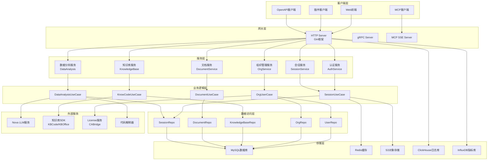

### 2. 应用启动生命周期流程图

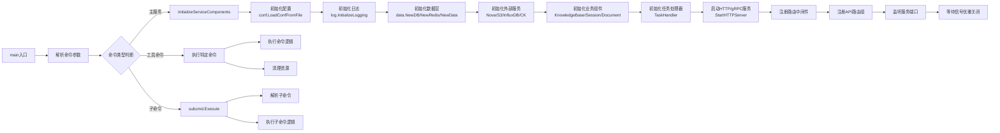

### 3. HTTP请求处理时序图

#### 3.1 总体请求处理流程

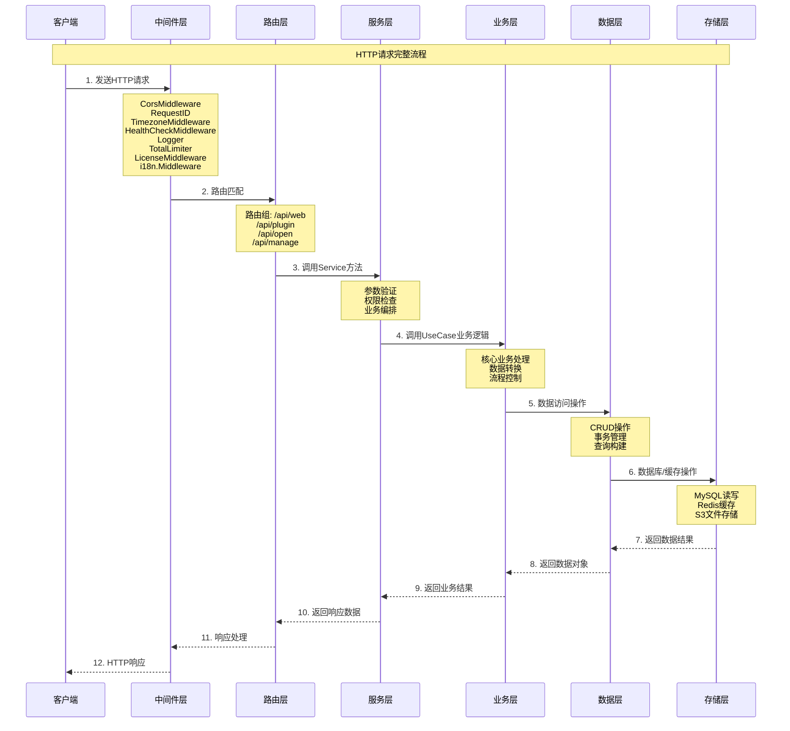

#### 3.2 认证登录流程

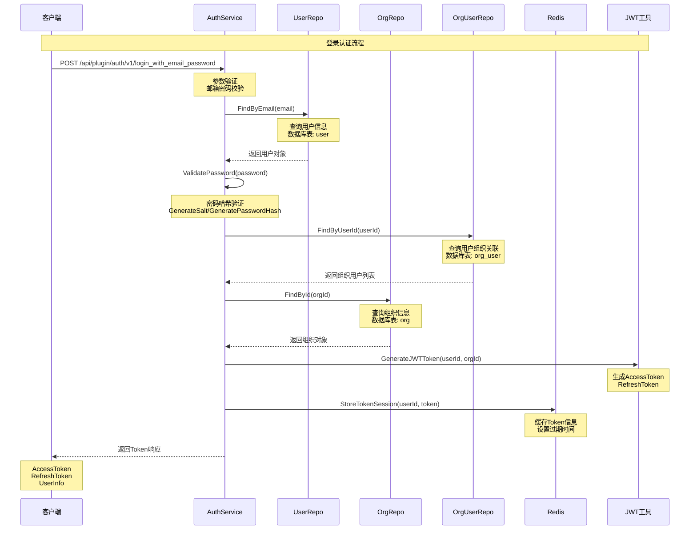

#### 3.3 会话聊天流程

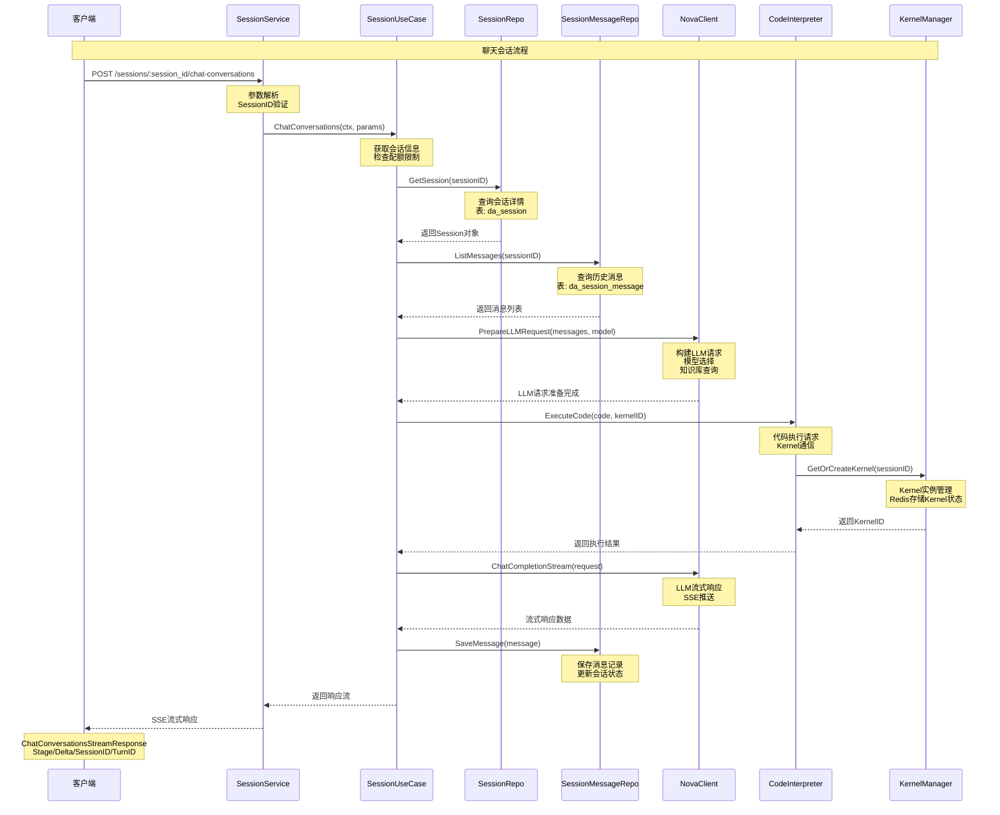

### 4. 异步任务处理流程图

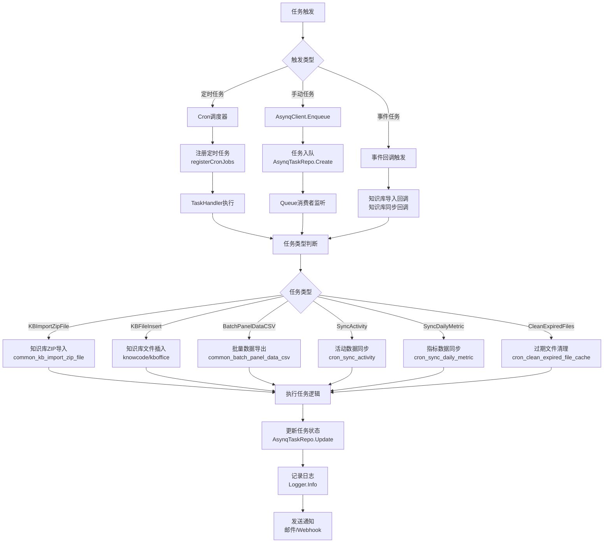

### 5. 知识库处理流程图

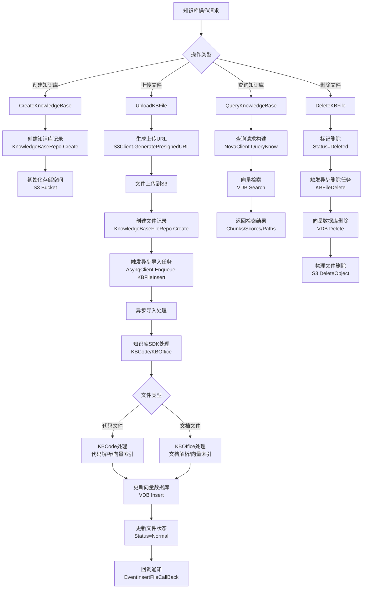

### 6. 数据分析流程图

```mermaid
flowchart LR
    A[数据分析请求] --> B[SessionUseCase]
    B --> C[获取Kernel实例<br/>KernelManager.GetOrCreateKernel]
    C --> D[代码解释器准备<br/>CodeInterpreterService]

    D --> E{执行模式}
    E -->|流式执行| F[SSE流式响应]
    E -->|批量执行| G[批量结果返回]

    F --> H[代码执行<br/>ExecuteCode]
    G --> H

    H --> I[Kernel通信<br/>WebSocket/gRPC]
    I --> J[执行结果<br/>Output/Error]

    J --> K[结果处理]
    K --> L[保存消息记录<br/>SessionMessageRepo.Save]
    L --> M[更新会话状态<br/>SessionRepo.Update]

    M --> N[生成图表<br/>PlotBlock]
    N --> O[返回响应<br/>ChatConversationsStreamResponse]
```

## 完整调用树

```
main (cmd/utils/main.go)
├── flag.Parse() → 标准库
├── switch command → 命令分支
│   ├── "generate_password" → runGeneratePassword()
│   │   ├── generatePassword() → 本地函数
│   │   ├── utils.GenerateSalt() → 工具库
│   │   └── utils.GeneratePasswordHash() → 工具库
│   │
│   ├── "generate_org_token" → runGenerateOrgToken()
│   │   ├── conf.LoadConfFromFile() → 配置加载
│   │   ├── log.InitializeLogging() → 日志初始化
│   │   ├── setup.InitializeServiceComponents() → 服务组件初始化 ⭐核心
│   │   └── TaskHandler.CreateOrgToken() → Token创建
│   │
│   ├── "force_exec_asynq_task" → runForceExecAsynqTask()
│   │   ├── setup.InitializeServiceComponents() → 服务组件初始化
│   │   └── TaskHandler.ForceExecAsynqTask() → 强制执行异步任务
│   │
│   ├── default → subcmd.Execute() → Cobra子命令框架
│   │   ├── org batch_create → 批量创建组织
│   │   ├── knowcode → 知识库代码处理
│   │   └── knowoffice → 知识库办公处理
│   │
│   └── 其他命令 → ...

InitializeServiceComponents (internal/setup/setup.go:42) ⭐核心初始化
├── ck.NewCKDB() → ClickHouse初始化
├── data.NewDB() → MySQL数据库初始化
├── data.NewRedis() → Redis初始化
├── data.NewData() → 数据层初始化
│   ├── 初始化GORM连接
│   ├── 初始化Redis客户端
│   └── 初始化验证码客户端
│
├── grpc.Dial() → License服务gRPC连接 (CABridge)
├── caBridge.NewLicenseManager() → License管理器
│   ├── SyncLicense() → 同步许可证
│   └── StartAutoRefresh() → 自动刷新许可证
│
├── data.NewUserRepo() → 用户仓库
├── data.NewOrgRepo() → 组织仓库
├── data.NewOrgUserRepo() → 组织用户仓库
├── data.NewDepartmentRepo() → 部门仓库
├── data.NewTokenRepo() → Token仓库
├── data.NewKnowledgeBaseRepo() → 知识库仓库
├── data.NewDocumentRepo() → 文档仓库
├── data.NewSessionRepo() → 会话仓库
│   └── NewSessionRepoWithVersion("v2") → V2版本会话仓库
│   └── NewSessionRepoWithVersion("open") → Open版本会话仓库
│
├── nova.NewNovaClient() → Nova LLM客户端初始化 ⭐关键外部服务
│   ├── ChatCompletion() → 聊天补全
│   ├── Embedding() → 向量嵌入
│   └── QueryKnow() → 知识库查询
│
├── kbcode.NewKBClient() → 知识库代码SDK客户端 (可选)
├── kboffice.NewKBClient() → 知识库办公SDK客户端 (可选)
│
├── influxdb.NewClient() → InfluxDB指标客户端
├── smtp.NewSmtp() → 邮件服务客户端
├── s3.NewS3Client() → S3对象存储客户端
├── collab.NewClient() → 协作服务客户端
│
├── biz.NewSessionUseCase() → 会话业务用例 ⭐核心业务
│   ├── SessionRepo → 会话仓库依赖
│   ├── SessionFileRepo → 会话文件仓库
│   ├── SessionMessageRepo → 消息仓库
│   ├── CodeInterpreterService → 代码解释器
│   ├── NovaClient → LLM客户端
│   ├── KBOfficeClient → 知识库客户端
│   └── KernelManager → Kernel管理器
│
├── biz.NewKnowCodeUseCase() → 知识库代码业务用例
├── bizOfficev2.NewKnowOfficeUseCase() → 知识库办公业务用例
├── biz.NewDataAnalysisUseCase() → 数据分析业务用例
├── biz.NewOrgUserCase() → 组织用户业务用例
│
├── kernelManager.NewKernelManager() → Kernel管理器
│   ├── RedisStorage → Redis存储
│   ├── KernelTaskClient → Kernel任务客户端
│   └── CodeInterpreterService → 代码解释器
│
├── asynqtask.NewTaskHandler() → 异步任务处理器 ⭐核心任务处理
│   ├── 所有Repo依赖注入
│   ├── 所有UseCase依赖注入
│   ├── 所有外部客户端依赖注入
│   └── registerCronJobs() → 注册定时任务
│   └── registerHandlers() → 注册任务处理器
│
└── 返回 ServiceComponents
    ├── Logger → 日志器
    ├── TaskHandler → 任务处理器
    ├── Cleanup → 清理函数

StartHTTPServer (internal/server/http.go:49) ⭐HTTP服务启动
├── gin.SetMode() → 设置Gin模式
├── gin.Default() → 创建Gin引擎
├── httpBase.NewValidator() → 创建参数验证器
│
├── 注册中间件
│   ├── CorsMiddleware → CORS跨域
│   ├── RequestID() → 请求ID
│   ├── TimezoneMiddleware() → 时区处理
│   ├── HealthCheckMiddleware → 健康检查
│   ├── Logger() → 日志记录
│   ├── TotalLimiter() → 总限流
│   ├── LicenseMiddleware() → License检查
│   ├── i18n.Middleware() → 国际化
│   ├── ginprometheus.HandlerFunc() → Prometheus指标
│
├── 创建路由组
│   ├── createCommonRouter() → 公共路由 (/doc)
│   ├── createManageRouter() → 管理路由 (/api/manage)
│   ├── createPluginRouter() → 插件路由 (/api/plugin)
│   ├── createPluginOrgRouter() → 插件组织路由 (/api/plugin/org)
│   ├── createWebRouter() → Web路由 (/api/web)
│   ├── createWebOrgRouter() → Web组织路由 (/api/web/org)
│   ├── createOpenAPIRouter() → OpenAPI路由 (/api/open)
│   ├── createPluginMCPRouter() → Plugin MCP路由 (/api/plugin/mcp)
│   ├── createOpenMCPRouter() → Open MCP路由 (/api/open/mcp)
│
├── http.Server.ListenAndServe() → 启动HTTP服务
│
├── signal.Notify() → 监听系统信号
├── server.Shutdown(ctx) → 优雅关闭
```

## 核心模块详细分析

### 1. 配置加载模块 (internal/conf)

**位置**: `internal/conf/conf.go`

**核心结构 Bootstrap**:
```go
type Bootstrap struct {
    DeployMode          string                     // 部署模式
    LogLevel            string                     // 日志级别
    Server              Server                     // HTTP/gRPC服务配置
    Data                Data                       // 数据库配置
    Nova                Nova                       // LLM服务配置
    KnowledgeBase       KnowledgeBase              // 知识库配置
    KnowledgeBaseCode   KnowledgeBaseCode          // 知识库代码配置
    KnowledgeBaseOffice KnowledgeBaseOffice        // 知识库办公配置
    OfficeV2            OfficeV2                   // 办公V2配置
    DataAnalysisV2      DataAnalysisConfigV2       // 数据分析配置
    S3                  S3                         // S3存储配置
    ExtService          ExtService                 // 外部服务配置
    Cron                CronConfig                 // 定时任务配置
    CaBridge            CaBridgeConfig             // License配置
    ...
}
```

**主要方法**:
- `LoadConfFromFile(path)` - 从文件加载配置
- `LoadConfFromDir(path)` - 从目录加载配置

**依赖关系**:
- 被 `main`, `InitializeServiceComponents` 调用
- 使用 `viper` 库解析配置文件

### 2. 数据访问层 (internal/data)

**核心仓库**:

| 仓库 | 功能 | 主要方法 |
|------|------|---------|
| UserRepo | 用户数据 | Create, FindByEmail, FindById, Update, Destroy |
| OrgRepo | 组织数据 | Create, FindById, FindByCode, Update, List |
| OrgUserRepo | 组织用户关联 | Create, Find, Delete, FindByUserId |
| DepartmentRepo | 部门数据 | Create, FindById, Delete, DepartmentsTree |
| TokenRepo | Token数据 | Create, ValidAccessToken, List, Delete |
| KnowledgeBaseRepo | 知识库 | Create, FindByCode, ListByOwner |
| KnowledgeBaseFileRepo | 知识库文件 | Create, FindByUUID, Update, Delete |
| DocumentRepo | 文档数据 | Create, FindByUID, List, Delete |
| SessionRepo | 会话数据 | Create, Get, Update, Delete, List |
| SessionMessageRepo | 消息数据 | Create, List, AppendBlock |
| AsynqTaskRepo | 异步任务 | Create, Update, Get, List |

**数据模型**:

| 模型 | 表名 | 主要字段 |
|------|------|---------|
| User | user | id, name, email, password, status |
| Org | org | id, name, code, token_salt, plugin_nova_qps |
| OrgUser | org_user | id, org_id, user_id, role, department_id |
| Department | department | id, org_id, parent_id, name, office_quota |
| Token | token | id, name, token_str, org_id, expired_date |
| KnowledgeBase | knowledge_base | id, code, name, owner_type, owner_id |
| KnowledgeBaseFile | knowledge_base_file | id, kb_id, name, uuid, status, vdb_status |
| Document | document | id, project_id, uid, title, content |
| DataAnalysisSession | da_session | id, session_id, title, owner_type, owner_id |
| AsynqTask | asynq_task | id, type, payload, status, result |

### 3. 业务逻辑层 (internal/biz)

**核心 UseCase**:

#### SessionUseCase
**位置**: `internal/biz/sessions.go:112`

**职责**: 会话管理、聊天对话、消息处理

**依赖**:
- SessionRepo, SessionFileRepo, SessionMessageRepo
- CodeInterpreterService, NovaClient
- KBOfficeClient, KernelManager
- DistributedLock, S3Client

**核心方法**:
| 方法 | 功能 | 输入 | 输出 |
|------|------|------|------|
| NewSession | 创建新会话 | NewSessionRequest | NewSessionResponse |
| GetSession | 获取会话详情 | sessionID | SessionInfo |
| ListSessions | 列出会话 | ListSessionsRequest | ListSessionsResponse |
| DeleteSession | 删除会话 | sessionID | error |
| ChatConversations | 聊天对话 | ChatConversationsRequest | StreamResponse |
| GetMessages | 获取消息 | GetMessagesRequest | GetVerboseMessagesResponse |
| CreateFile | 创建文件 | CreateFileRequest | CreateFileResponse |

#### KnowCodeUseCase
**位置**: `internal/biz/knowcode.go`

**职责**: 知识库代码管理、文件导入、向量索引

**依赖**:
- KnowledgeBaseRepo, KnowledgeBaseFileRepo
- KBCodeClient, S3Client, AsynqClient

#### KnowOfficeUseCase
**位置**: `internal/biz/officev2/know_office.go`

**职责**: 知识库办公文档管理

#### DataAnalysisUseCase
**位置**: `internal/biz/data_analysis.go`

**职责**: 数据分析、图表生成、Kernel管理

#### OrgUserCase
**位置**: `internal/biz/org.go`

**职责**: 组织用户管理、权限控制、配额管理

### 4. HTTP服务层 (internal/server)

**位置**: `internal/server/http.go`

**路由分组结构**:

```mermaid
flowchart TD
    ROOT["Gin Engine<br/>/"]

    ROOT --> COMMON["/doc<br/>Swagger文档"]

    ROOT --> MANAGE["/api/manage<br/>管理接口"]
    MANAGE --> MANAGE_SENS["/sensetive/v1<br/>敏感词管理"]

    ROOT --> PLUGIN["/api/plugin<br/>插件接口"]
    PLUGIN --> PLUGIN_AUTH["/auth/v1<br/>认证"]
    PLUGIN --> PLUGIN_SETTING["/setting/v1<br/>设置"]

    ROOT --> PLUGIN_ORG["/api/plugin/org<br/>插件组织接口"]
    PLUGIN_ORG --> PLUGIN_ORG_LLM["/llm/v1<br/>LLM接口"]
    PLUGIN_ORG --> PLUGIN_ORG_KB["/knowledge_base/v1<br/>知识库"]
    PLUGIN_ORG --> PLUGIN_ORG_MCP["/mcp/v1<br/>MCP服务"]

    ROOT --> WEB["/api/web<br/>Web接口"]
    WEB --> WEB_AUTH["/auth/v1<br/>认证"]
    WEB --> WEB_TOKEN["/token/v1<br/>Token管理"]
    WEB --> WEB_SETTING["/setting/v1<br/>设置"]

    ROOT --> WEB_ORG["/api/web/org<br/>Web组织接口"]
    WEB_ORG --> WEB_ORG_USER["/user/v1<br/>用户管理"]
    WEB_ORG --> WEB_ORG_DEPT["/department/v1<br/>部门管理"]
    WEB_ORG --> WEB_ORG_KB["/knowledge_base/v1<br/>知识库"]
    WEB_ORG --> WEB_ORG_OFFICE["/user/office/v1<br/>办公服务"]
    WEB_ORG --> WEB_ORG_CHAT["/chat/v1<br/>聊天"]
    WEB_ORG --> WEB_ORG_DA["/dashboard/v1<br/>仪表盘"]

    ROOT --> OPEN["/api/open<br/>OpenAPI接口"]
    OPEN --> OPEN_LLM["/llm/v1<br/>LLM兼容接口"]
    OPEN --> OPEN_OFFICE["/office/v1<br/>办公接口"]
    OPEN --> OPEN_MANAGE["/manage/org/v1<br/>组织管理"]

    ROOT --> MCP_PLUGIN["/api/plugin/mcp<br/>Plugin MCP"]
    MCP_PLUGIN --> MCP_PLUGIN_CALC["/calc/v1<br/>计算器MCP"]
    MCP_PLUGIN --> MCP_PLUGIN_KNOW["/org/know/v1<br/>知识库MCP"]

    ROOT --> MCP_OPEN["/api/open/mcp<br/>Open MCP"]
    MCP_OPEN --> MCP_OPEN_KNOW["/org/know/v1<br/>知识库MCP"]
```

**API端点统计**:
| 路由组 | 端点数量 | 主要功能 |
|---------|---------|---------|
| /api/plugin/auth | 7 | 登录、刷新、用户信息、注销 |
| /api/plugin/org/llm | 4 | 模型列表、补全、聊天补全 |
| /api/plugin/org/knowledge_base | 3 | 知识库列表、查询、文件信息 |
| /api/web/org/user | 11 | 用户CRUD、密码重置、激活禁用 |
| /api/web/org/department | 15 | 部门CRUD、树结构、用户管理 |
| /api/web/org/user/office | 40+ | 会话、文档、文件、设置、资产 |
| /api/open/llm | 5 | 数据分析、补全、聊天补全 |
| /api/open/office | 20+ | 会话、文件管理 |

### 5. 异步任务处理 (internal/asynqtask)

**位置**: `internal/asynqtask/base.go`

**TaskHandler 结构**:
```go
type TaskHandler struct {
    Config *conf.Bootstrap
    Logger *logrus.Logger

    // Repositories
    UserRepo, OrgRepo, OrgUserRepo...
    KbRepo, KbFileRepo...
    AsynqTaskRepo...
    RequestLogRepo...

    // External Clients
    SmtpClient, AsynqClient, InfluxClient...
    S3Cli, DistLock...

    // UseCases
    KbCodeUC, KbOfficeUC...
    SessionUseCase, OrgUC...

    // Managers
    LicenseManager, KernelManager...
}
```

**任务类型定义**:
| 任务类型 | 常量 | 处理方法 | 功能 |
|---------|------|---------|------|
| KBImportZipFile | "KBImportZipFile" | HandleKBImportZipFile | 知识库ZIP导入 |
| KBFileInsert | "KBFileInsert" | HandleKBFileInsert | 知识库文件插入 |
| KBFileDelete | "KBFileDelete" | HandleKBFileDelete | 知识库文件删除 |
| BatchPanelDataCSV | "BatchPanelDataCSV" | HandleBatchPanelDataCSV | 批量数据导出 |
| CronSyncActivity | "CronSyncActivity" | HandleCronSyncActivity | 活动数据同步 |
| CronSyncDailyMetric | "CronSyncDailyMetric" | HandleCronSyncDailyMetric | 指标数据同步 |
| CronCleanExpiredFileCache | "CronCleanExpiredFileCache" | HandleCleanExpiredFileCache | 过期文件清理 |
| CronTokenDailyStat | "CronTokenDailyStat" | HandleCronTokenDailyStat | Token统计 |
| DocSnapshotSave | "DocSnapshotSave" | HandleDocSnapshotSave | 文档快照保存 |

**任务执行流程**:
```
1. 任务入队: AsynqClient.Enqueue(taskType, payload)
2. 创建任务记录: AsynqTaskRepo.Create()
3. Queue消费者监听: srv.Run()
4. 任务处理器分发: HandleTask()
5. 执行具体逻辑: HandleKBImportZipFile等
6. 更新任务状态: AsynqTaskRepo.Update()
7. 记录日志: Logger.Info()
```

### 6. 外部服务集成

#### Nova LLM服务
**位置**: `internal/pkg/nova`

**功能**:
- ChatCompletion - 聊天补全
- Embedding - 向量嵌入
- QueryKnow - 知识库查询
- OCR - 图像OCR识别
- TitleGeneration - 标题生成
- PromptRewrite - 提示词重写

#### 知识库SDK (KBCode/KBOffice)
**位置**: `internal/pkg/kbcode`, `internal/pkg/kboffice`

**功能**:
- 文件导入处理
- 向量索引构建
- 文件删除处理
- 回调通知

#### 代码解释器 (CodeInterpreter)
**位置**: `internal/pkg/code_interpreter`

**功能**:
- Kernel实例管理
- 代码执行
- 结果返回

#### License服务 (CABridge)
**位置**: `internal/pkg/ca_bridge`

**功能**:
- License验证
- License同步
- 权限检查

## 数据流分析

### 请求日志数据流

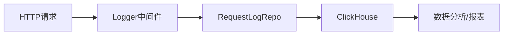

### 知识库文件数据流

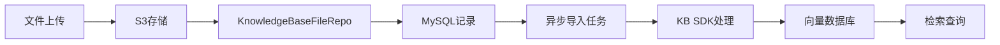

### 会话消息数据流

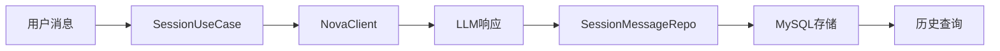

## 关键决策点

| 位置 | 条件 | 结果 | 说明 |
|------|------|------|------|
| main.go:61 | command 类型 | 执行不同命令 | 命令路由分发 |
| setup.go:60 | buildEnv.EnvName() != "dev" | 连接CABridge | 开发环境跳过License |
| setup.go:128 | KnowledgeBaseCode.Enabled | 创建KBCodeClient | 知识库代码功能开关 |
| setup.go:157 | KnowledgeBaseOffice.Enabled | 创建KBOfficeClient | 知识库办公功能开关 |
| http.go:111 | LogLevel == "debug" | Gin.DebugMode | 日志级别设置 |
| http.go:247 | Server.Http.MountDoc | 挂载Swagger文档 | 文档功能开关 |
| sessions.go:189 | version == "open" | 使用OpenRepo | 会话版本选择 |

## 异常处理分析

### 错误码定义 (internal/errs)

| 错误码 | 名称 | HTTP状态 | 说明 |
|---------|------|---------|------|
| ErrCodeSuccess | 成功 | 200 | 操作成功 |
| ErrCodeParamsInvalid | 参数无效 | 400 | 参数验证失败 |
| ErrCodeUnauthorized | 未授权 | 401 | 认证失败 |
| ErrCodeForbidden | 禁止访问 | 403 | 权限不足 |
| ErrCodeNotFound | 未找到 | 404 | 资源不存在 |
| ErrCodeInternal | 内部错误 | 500 | 服务器错误 |
| ErrCodeKnowledgeBaseNotFound | 知识库未找到 | 404 | 知识库不存在 |
| ErrCodeQuotaExceeded | 配额超限 | 403 | 配额不足 |
| ErrCodeLicenseInvalid | License无效 | 403 | License过期 |

### 中间件错误处理
- `httpBase.Response()` - 统一响应格式
- `httpBase.NewResponse()` - 标准错误响应
- `ginExt.GetCurrentOrgUser()` - 获取当前用户上下文
- `errs.ErrCodeToError()` - 错误码转换

## 总结

### 系统特点
1. **分层架构清晰**: API → Service → UseCase → Repo → Storage
2. **依赖注入设计**: 所有组件通过构造函数注入依赖
3. **异步任务机制**: Asynq实现定时任务和异步处理
4. **多协议支持**: HTTP REST、gRPC、MCP SSE
5. **外部服务集成**: Nova LLM、知识库SDK、代码解释器

### 核心业务流程
1. **认证登录**: 邮箱密码登录 → JWT生成 → Redis缓存
2. **知识库管理**: 文件上传 → S3存储 → 异步导入 → 向量索引
3. **会话聊天**: 会话创建 → Kernel初始化 → LLM调用 → 流式响应
4. **数据分析**: Kernel执行 → 代码解释器 → 结果处理 → 图表生成
5. **组织管理**: 用户管理 → 部门管理 → 配额控制 → 权限验证

### 技术栈
- **Web框架**: Gin
- **ORM**: GORM
- **缓存**: Redis
- **数据库**: MySQL, ClickHouse
- **对象存储**: S3
- **指标存储**: InfluxDB
- **任务队列**: Asynq
- **配置管理**: Viper
- **日志**: Logrus
- **文档**: Swagger

### 扩展点
- 新增API路由组
- 新增异步任务类型
- 新增UseCase业务模块
- 新增外部服务客户端
- 新增中间件功能