# Claude Code 与 Claude Agent SDK：Memory、Session、Compaction 详解

## 文档信息

| 项目 | 内容 |
|------|------|
| **文档标题** | Claude Code 与 Claude Agent SDK 核心机制详解 |
| **创建时间** | 2026-05-30 |
| **适用范围** | Claude Code CLI、Claude Agent SDK |
| **核心内容** | Memory、Session、Compaction 三大机制 |

---

## 目录

1. [概述](#概述)
2. [三大概念总览](#三大概念总览)
3. [Session（会话）详解](#session会话详解)
4. [Memory（记忆）详解](#memory记忆详解)
5. [Compaction（压缩）详解](#compaction压缩详解)
6. [三者协同工作](#三者协同工作)
7. [Claude Code vs Agent SDK 对比](#claude-code-vs-agent-sdk-对比)
8. [实现建议](#实现建议)
9. [常见问题解答](#常见问题解答)

---

## 概述

### Claude Code 与 Claude Agent SDK 简介

| 产品 | 描述 | 典型用途 |
|------|------|---------|
| **Claude Code** | Anthropic 官方的 CLI 工具 | 本地开发、命令行交互 |
| **Claude Agent SDK** | 构建 AI Agent 的开发框架 | 集成到应用、自定义 Agent |

### 两者关系

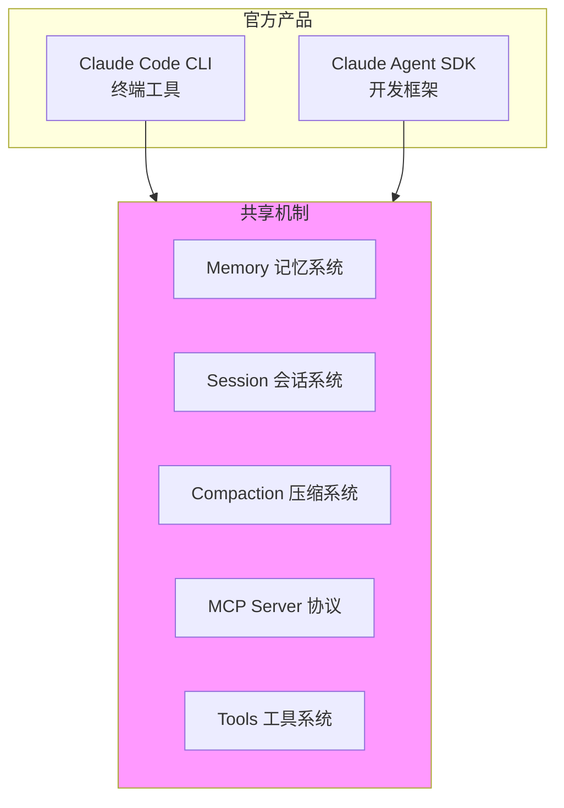

---

## 三大概念总览

### 生活化比喻

| 概念 | 生活比喻 | 本质 | 存什么 | 存多久 |
|------|---------|------|--------|--------|
| **Session（会话）** | 📞 **一次电话通话** | 当前对话的完整记录 | 逐条消息（你说一句、我回一句） | 短期（几天） |
| **Memory（记忆）** | 📝 **笔记本** | 长期记住的重要信息 | 精炼的关键信息（用户偏好、项目配置） | 长期（永久） |
| **Compaction（压缩）** | 🗜️ **通话记录摘要** | 长对话精简为关键点 | 旧消息的摘要（保留最近，压缩旧的） | 临时（压缩时） |

### 核心区别

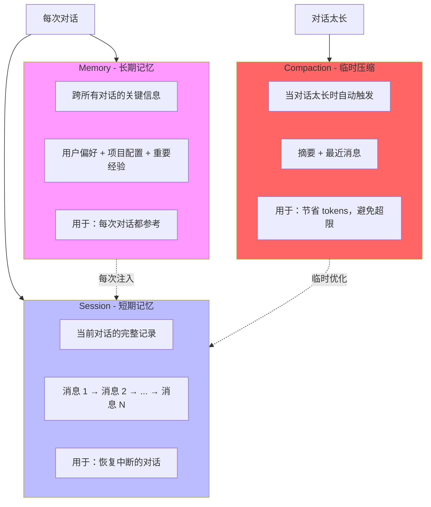

### 对比总表

| 特性 | Session | Memory | Compaction |
|------|---------|--------|------------|
| **存储内容** | 完整对话历史 | 精炼的关键信息 | 旧消息的摘要 |
| **生命周期** | 短期（几天） | 长期（永久） | 临时（请求时） |
| **跨对话使用** | ❌ 仅当前对话 | ✅ 跨所有对话 | ❌ 仅当前对话 |
| **触发方式** | 用户传 session_id | 系统自动加载 | 系统自动触发 |
| **存储位置** | 数据库/JSONL 文件 | Markdown 文件 | 内存/Context |
| **主要用途** | 恢复对话上下文 | 记住用户偏好 | 节省 tokens |
| **是否会丢失** | Session 删除时丢失 | 永久保存 | 请求结束消失 |

---

## Session（会话）详解

### 什么是 Session？

> **Session = 一次完整的对话过程**
> 
> 记录从用户发起对话到结束的所有消息交换，包括：
> - 用户输入
> - AI 响应
> - 工具调用
> - 工具返回结果

### Session 的作用

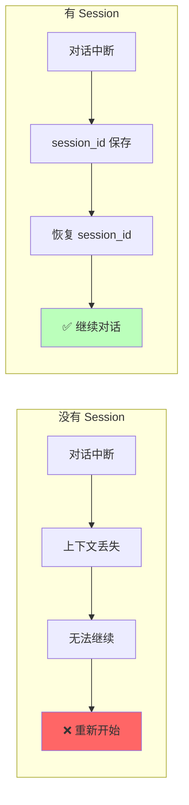

### Session 数据结构

#### Claude Code（JSONL 文件）

```jsonl
{"role": "user", "content": "帮我创建人脸解析任务", "timestamp": "2024-01-01T10:00:00"}
{"role": "assistant", "content": "好的，我来调用 createTask 工具", "timestamp": "2024-01-01T10:00:05"}
{"role": "tool_use", "name": "createTask", "input": {"taskId": "123"}, "timestamp": "2024-01-01T10:00:10"}
{"role": "tool_result", "content": "任务创建成功", "timestamp": "2024-01-01T10:00:15"}
{"role": "assistant", "content": "任务 123 已创建成功", "timestamp": "2024-01-01T10:00:20"}
```

**存储位置**：
```
~/.claude/projects/<project-hash>/conversations/conversation_<timestamp>.jsonl
```

#### Claude Agent SDK（MySQL）

```sql
-- sessions 表
CREATE TABLE sessions (
    session_id VARCHAR(100) PRIMARY KEY,
    created_at DATETIME,
    updated_at DATETIME,
    message_count INT,
    last_message TEXT,
    status VARCHAR(20) DEFAULT 'active'
);

-- messages 表
CREATE TABLE messages (
    id INT PRIMARY KEY AUTO_INCREMENT,
    session_id VARCHAR(100),
    role VARCHAR(20),  -- user/assistant
    content TEXT,
    tool_name VARCHAR(100),
    tool_input TEXT,   -- JSON
    tool_result TEXT,
    created_at DATETIME,
    FOREIGN KEY (session_id) REFERENCES sessions(session_id)
);
```

### Session 工作流程

```mermaid
sequenceDiagram
    participant User as 用户
    participant SDK as Claude SDK
    participant Storage as 存储（JSONL/MySQL）
    participant Model as Claude 模型

    Note over User,Model: Session 创建与恢复流程

    User->>SDK: 发送消息（无 session_id）
    SDK->>Storage: 创建新 Session
    Storage-->>SDK: 返回 session_id=abc123
    SDK->>Model: 发送消息
    Model-->>SDK: 返回响应
    SDK->>Storage: 保存消息（session_id=abc123）
    SDK-->>User: 返回响应 + session_id

    Note over User,Model: 对话中断，用户离开

    User->>SDK: 发送消息（session_id=abc123）
    SDK->>Storage: 查询 Session abc123
    Storage-->>SDK: 返回历史消息（50 条）
    Note over SDK: 恢复对话上下文<br/>is_resume = True
    SDK->>Model: 历史消息 + 新消息
    Model-->>SDK: 返回响应（基于历史）
    SDK->>Storage: 保存新消息
    SDK-->>User: 返回响应（知道之前聊了什么）

    style Storage fill:#bfb
```

### Session 恢复机制

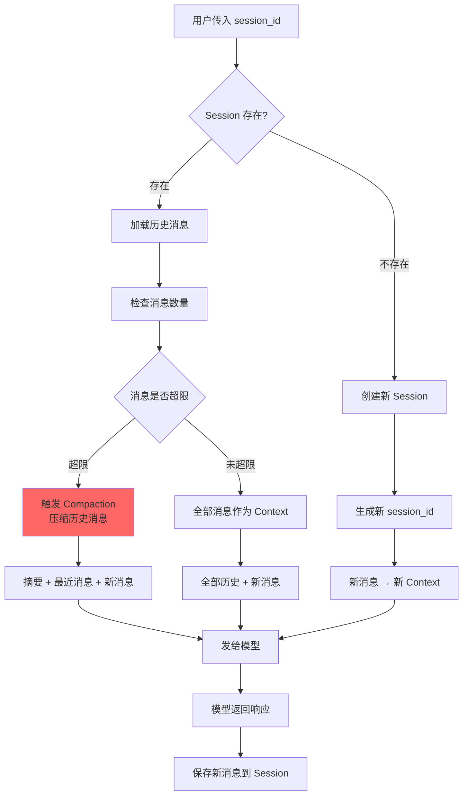

### Session API 示例

#### Claude Code CLI

```bash
# 恢复最近的 Session
claude --resume

# 恢复指定 Session
claude --resume <session-id>

# 继续最近的 Session
claude --continue

# 开始新 Session
claude --clear

# 查看 Session 列表
claude --list-sessions
```

#### Claude Agent SDK

```python
# 创建新对话
client = ClaudeSDKClient(options=ClaudeAgentOptions())
await client.connect()
await client.query("帮我创建任务")

# 恢复已有对话
options = ClaudeAgentOptions(resume="session_id_abc123")
client = ClaudeSDKClient(options=options)
await client.connect()
await client.query("继续刚才的任务")

# 获取 session_id
async for msg in client.receive_messages():
    if isinstance(msg, SystemMessage) and msg.subtype == "init":
        session_id = msg.data.get("session_id")
        print(f"Session ID: {session_id}")
```

---

## Memory（记忆）详解

### 什么是 Memory？

> **Memory = 跨对话的长期记忆**
> 
> 精炼的关键信息，每次对话都会加载，让 AI 知道：
> - 用户是谁
> - 用户偏好什么
> - 项目配置信息
> - 重要经验教训

### Memory 与 Session 的区别

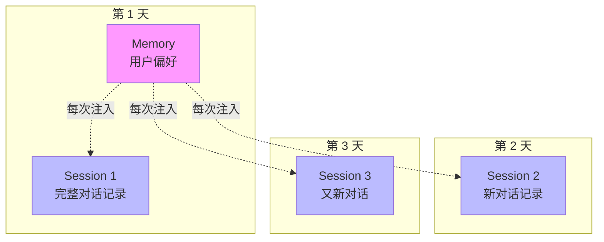

> **说明**：
> - Session 是独立的，每次新对话都是一个新 Session
> - Memory 跨 Session，永久保存，每次对话都会注入

### Memory 文件结构

#### Claude Code（Markdown 文件）

```
存储位置：
~/.claude/projects/<project-hash>/memory/

文件结构：
├── MEMORY.md              # 索引文件
├── user-background.md     # 用户背景
├── user-preference.md     # 用户偏好
├── project-config.md      # 项目配置
├── feedback-record.md     # 反馈记录
└── reference-links.md     # 外部资源
```

#### Memory 文件格式

```markdown
---
name: user-preference-code-style
description: 用户偏好简洁代码
metadata:
  type: feedback
---

用户偏好：
- 代码要简洁，不要冗余
- 使用中文回答
- 不喜欢太长的解释，直接给结论

**Why:** 用户多次反馈说"太长了"、"简洁点"

**How to apply:** 回复时先给结论，再给代码，不要长篇大论

相关记忆: [[user-background]], [[project-config]]
```

#### MEMORY.md 索引文件

```markdown
# Memory Index

- [用户背景](user-background.md) — 后端工程师，熟悉 Python
- [用户偏好](user-preference.md) — 喜欢简洁代码，中文回答
- [项目配置](project-config.md) — MySQL 172.20.25.104, MCP Server
- [反馈记录](feedback-record.md) — 多次要求简化输出
```

### Memory 类型分类

| 类型 | 用途 | 示例 |
|------|------|------|
| `user` | 用户是谁 | "用户是后端工程师，熟悉 Python 和 Docker" |
| `feedback` | 用户偏好 | "用户喜欢简洁代码，不喜欢长解释" |
| `project` | 项目配置 | "项目用 MySQL 172.20.25.104，端口 3306" |
| `reference` | 外部资源 | "API 文档: https://docs.example.com" |

### Memory 工作流程

```mermaid
sequenceDiagram
    participant User as 用户
    participant Claude as Claude Code/SDK
    participant Memory as Memory 系统
    participant Storage as 文件系统
    participant Model as 模型

    Note over User,Model: Memory 加载与使用流程

    User->>Claude: 开始新对话
    Claude->>Storage: 读取 MEMORY.md
    Storage-->>Claude: 返回索引
    Claude->>Storage: 读取所有 memory/*.md
    Storage-->>Claude: 返回记忆内容
    Claude->>Memory: 合并记忆内容
    Memory->>Memory: 注入到 system_prompt
    Note over Claude: AI 知道用户偏好和项目配置

    User->>Claude: 发送消息
    Claude->>Model: system_prompt(Memory) + 消息
    Model-->>Claude: 返回响应（基于记忆）
    Claude-->>User: 返回响应

    Note over User,Model: 发现新的重要信息

    Claude->>Storage: 写入新 memory 文件
    Claude->>Storage: 更新 MEMORY.md 索引
    Note over Storage: 新记忆保存成功<br/>下次对话可用

    style Storage fill:#f9f
```

### Memory 的注入方式

```python
# Claude Agent SDK 中注入 Memory

def get_agent_options(session_id=None, memory_content=None):
    system_prompt = f"""你是一个人脸解析任务管理专家。

## 用户偏好和项目信息（Memory）

{memory_content}

请根据用户偏好和项目配置进行回答。
"""

    return ClaudeAgentOptions(
        system_prompt=system_prompt,
        # ...
    )

# memory_content 内容示例：
"""
### 用户背景
- 后端工程师，熟悉 Python 和 Docker

### 用户偏好
- 代码简洁，不要冗余
- 使用中文回答
- 直接给结论

### 项目配置
- MySQL: 172.20.25.104:3306/mcp_test
- MCP Server: 9 个 Server，160 个工具
"""
```

---

## Compaction（压缩）详解

### 什么是 Compaction？

> **Compaction = 对话历史压缩**
> 
> 当对话消息太多时，自动将旧消息压缩成摘要，保留最近消息完整，避免：
> - Context tokens 超限
> - 模型无法处理
> - 成本过高

### Compaction 触发条件

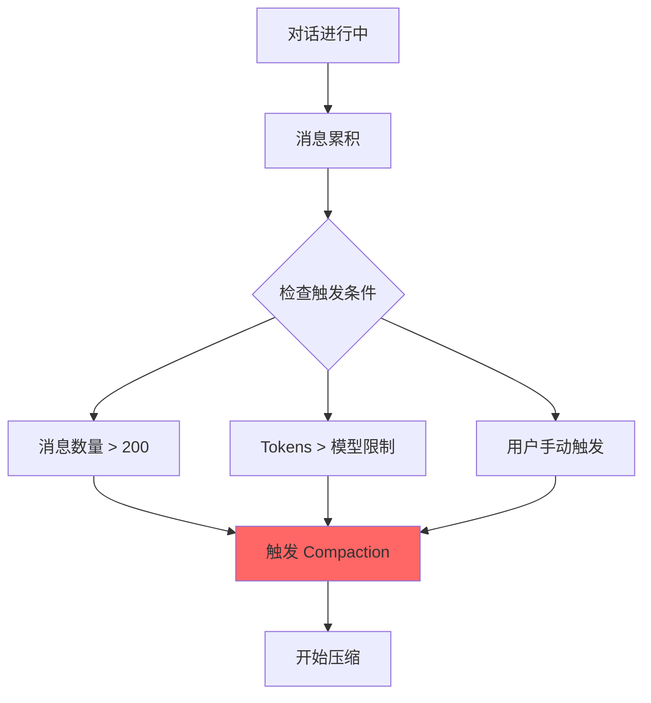

### Compaction 压缩过程

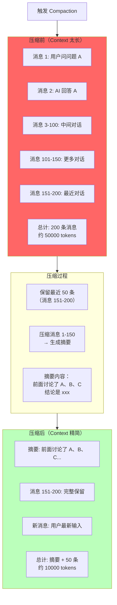

### 压缩前后对比示例

```
压缩前（发给模型的 Context）：
┌─────────────────────────────────────────────────────────────┐
│ 消息 1:   用户: 帮我创建任务                                 │
│ 消息 2:   AI: 调用 createTask, input={...}                  │
│ 消息 3:   工具返回: 任务 ID=123                              │
│ 消息 4:   AI: 任务创建成功                                   │
│ 消息 5:   用户: 配置参数                                     │
│ 消息 6:   AI: 调用 configParams                              │
│ ...                                                          │
│ 消息 150: AI: 配置完成                                       │
│ 消息 151: 用户: 查看状态                                     │
│ 消息 152: AI: 调用 getStatus                                 │
│ ...                                                          │
│ 消息 200: AI: 任务运行中                                     │
│ 消息 201: 用户: 总结一下                                     │
└─────────────────────────────────────────────────────────────┘
总计：201 条消息 → 50000+ tokens → 可能超限！

压缩后（发给模型的 Context）：
┌─────────────────────────────────────────────────────────────┐
│ [摘要]                                                       │
│ 前面 150 条对话的摘要：                                       │
│ - 创建了任务 123                                             │
│ - 配置了参数：streamWidth=1920, streamHeight=1080           │
│ - 使用了 deviceId=2057070369525977090                        │
│ - 讨论了方案 A 和 B，选择了方案 B                             │
│                                                             │
│ [最近消息 - 完整保留]                                         │
│ 消息 151: 用户: 查看状态                                     │
│ 消息 152: AI: 调用 getStatus                                 │
│ 消息 153: 工具返回: 正在运行                                  │
│ ...                                                          │
│ 消息 200: AI: 任务运行中                                     │
│                                                             │
│ [新消息]                                                     │
│ 消息 201: 用户: 总结一下                                     │
└─────────────────────────────────────────────────────────────┘
总计：摘要(2K) + 50 条(10K) + 新消息 → 约 12000 tokens → 正常处理
```

### Compaction 的两种处理方式

#### 方式 1：每次重新压缩（简单但低效）

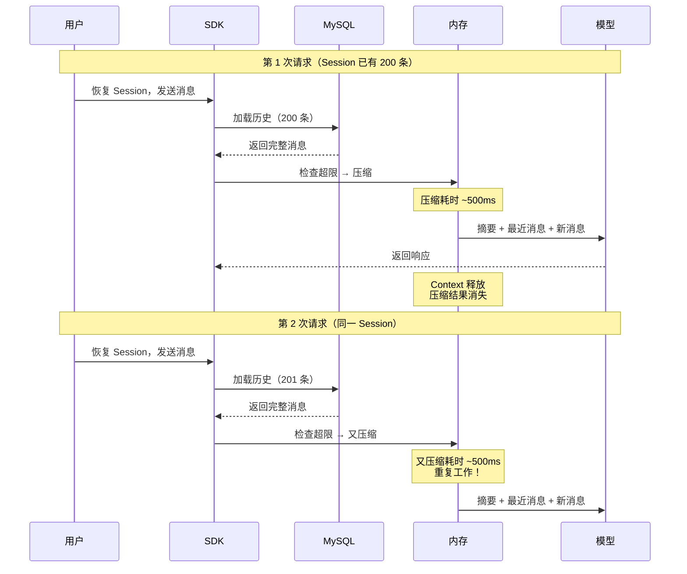

#### 方式 2：保存压缩结果（高效，Claude Code 做法）

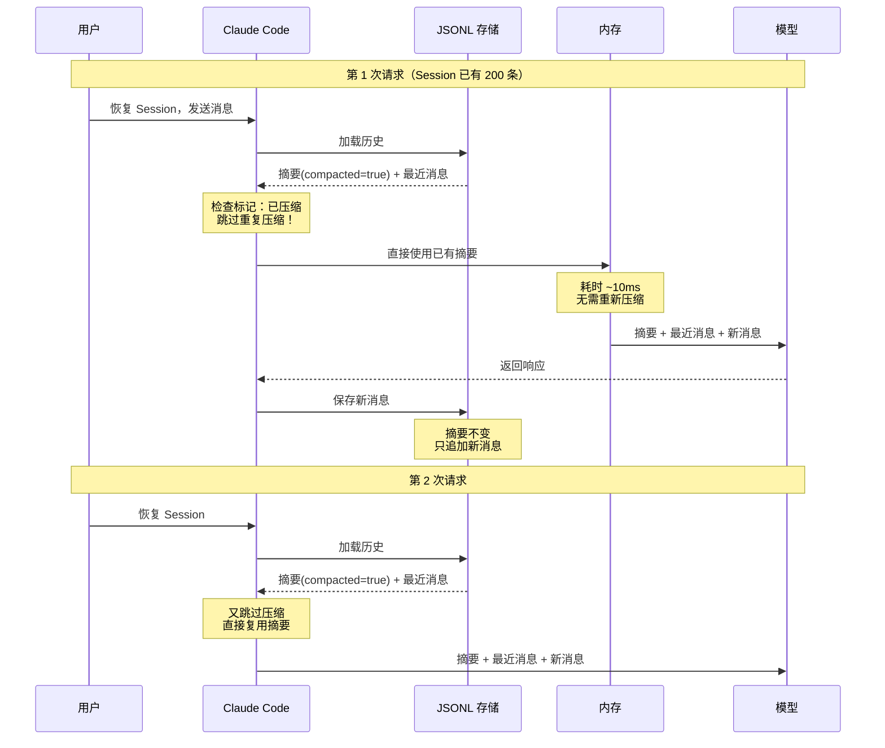

### Claude Code 的 Compaction 实现

#### JSONL 文件结构（带压缩标记）

```jsonl
{"role": "summary", "content": "前面讨论了任务创建...", "compacted": true, "original_turns": [1,150]}
{"role": "user", "content": "查看状态", "compacted": false, "turn": 151}
{"role": "assistant", "content": "调用 getStatus", "compacted": false, "turn": 152}
{"role": "tool_result", "content": "正在运行", "compacted": false, "turn": 153}
...
{"role": "assistant", "content": "任务运行中", "compacted": false, "turn": 200}
```

**关键字段**：
- `compacted: true` - 表示已压缩，是摘要
- `original_turns: [1,150]` - 表示摘要覆盖的消息范围
- `compacted: false` - 表示完整消息

#### 增量压缩机制

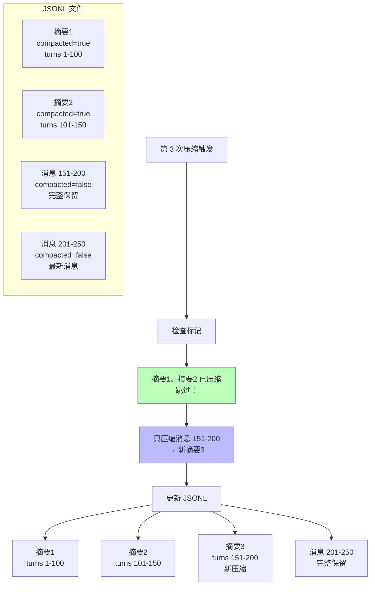

### Prompt Caching 优化

```
Prompt Caching（缓存优化）：
┌─────────────────────────────────────────────────────────────┐
│ 工作原理：                                                    │
│ - 缓存处理过的 Context                                        │
│ - 缓存生命周期：5 分钟（滚动重置）                              │
│ - 每次使用缓存 → 5 分钟计时器重置                              │
│ - 频繁使用 → 缓存一直有效                                      │
│                                                             │
│ 效果：                                                        │
│ - 摘要复用 → 不消耗 tokens                                    │
│ - 响应更快 → 无需重新处理                                     │
│ - 成本更低 → 缓存 tokens 费用 -90%                            │
│                                                             │
│ 预期命中率：> 95%                                              │
└─────────────────────────────────────────────────────────────┘

与 Compaction 配合：
- 已压缩的摘要 → 被 Prompt Cache 缓存
- 下次请求 → 直接使用缓存摘要
- 无需重新压缩 → 节省时间和成本
```

---

## 三者协同工作

### 时间线全景

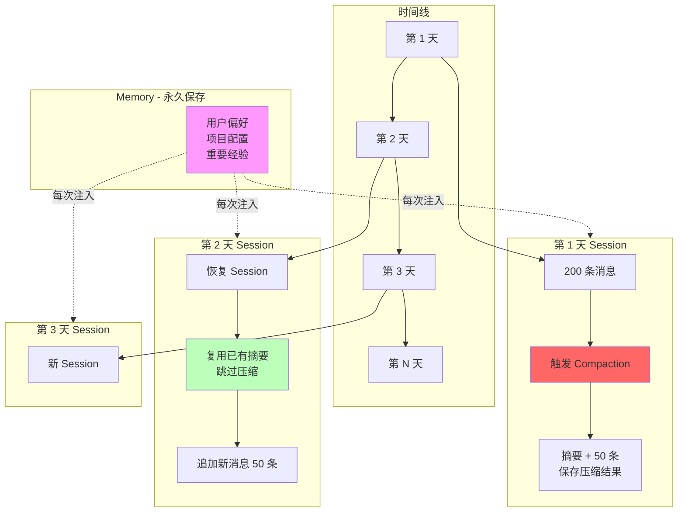

> **说明**：第 3 天新 Session 时，Memory 注入但 Session 是新的。

### 完整时序图

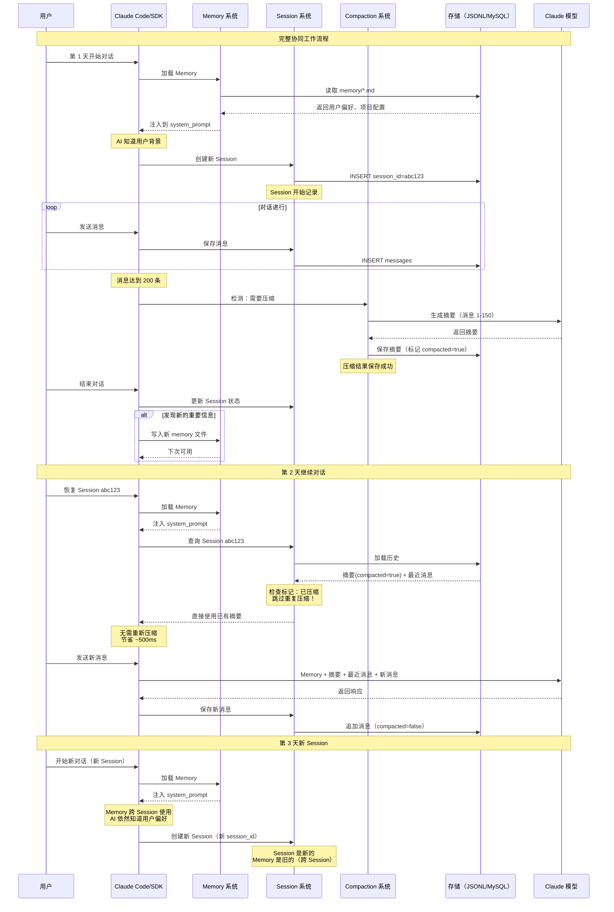

### 数据流向图

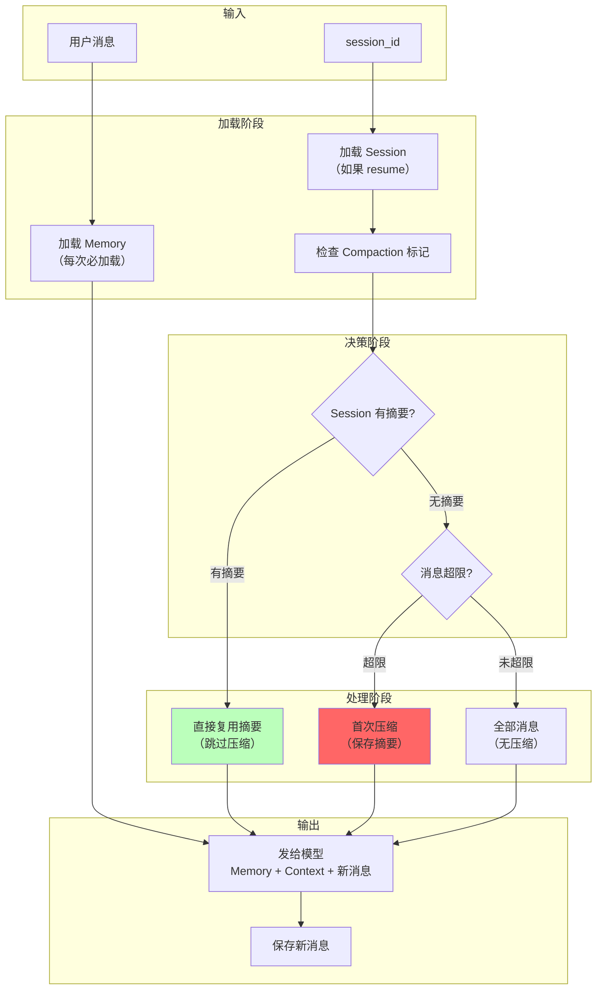

---

## Claude Code vs Agent SDK 对比

### 存储方式对比

| 特性 | Claude Code | Claude Agent SDK |
|------|-------------|------------------|
| **Session 存储** | JSONL 文件 | MySQL 数据库 |
| **Memory 存储** | Markdown 文件 | 需自行实现 |
| **Compaction 存储** | JSONL（带标记） | 需自行实现 |
| **存储位置** | `~/.claude/projects/` | 自定义 |

### 功能对比

| 功能 | Claude Code | Agent SDK |
|------|-------------|-----------|
| **Session 创建/恢复** | ✅ 自动 | ✅ 通过 `resume` 参数 |
| **Session 列表** | ✅ CLI 命令 | ❌ 需自行实现 |
| **Memory 加载** | ✅ 自动 | ❌ 需自行实现 |
| **Memory 写入** | ✅ 自动/手动 | ❌ 需自行实现 |
| **Compaction 触发** | ✅ 自动 | ✅ SDK 内部处理 |
| **Compaction 结果保存** | ✅ JSONL 标记 | ❌ 不保存，每次重新压缩 |
| **Prompt Caching** | ✅ 支持 | ✅ 支持 |

### Compaction 处理对比

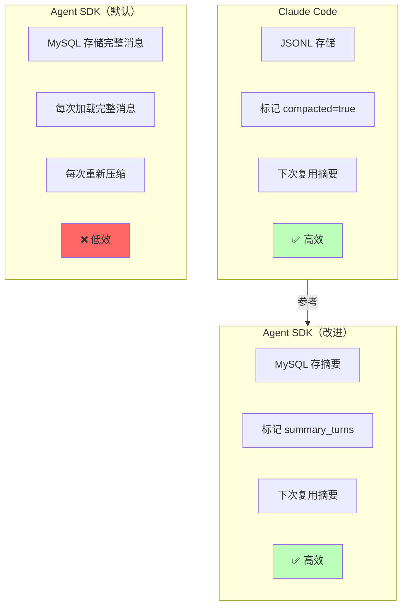

---

## 实现建议

### Agent SDK Memory 实现建议

```python
# 1. 定义 Memory 目录
MEMORY_DIR = "/project/ai/agent/mcp/.claude/memory"
MEMORY_INDEX = os.path.join(MEMORY_DIR, "MEMORY.md")

# 2. 加载 Memory
async def load_memories() -> str:
    """加载所有 memory 文件"""
    if not os.path.exists(MEMORY_INDEX):
        return ""

    memories = []
    with open(MEMORY_INDEX, 'r') as f:
        for line in f:
            if line.strip().startswith('- ['):
                # 解析索引，读取文件
                file_name = extract_file_name(line)
                file_path = os.path.join(MEMORY_DIR, file_name)
                if os.path.exists(file_path):
                    with open(file_path, 'r') as mf:
                        memories.append(mf.read())

    return "\n\n".join(memories)

# 3. 注入到 system_prompt
def get_agent_options(session_id=None):
    memory_content = load_memories()

    return ClaudeAgentOptions(
        system_prompt=f"""你是一个人脸解析任务管理专家。

## 用户偏好和项目信息（Memory）

{memory_content}

请根据以上信息进行回答。""",
        resume=session_id,
        # ...
    )

# 4. Memory API
async def memory_list_endpoint(request):
    """列出所有 Memory"""
    memories = []
    if os.path.exists(MEMORY_INDEX):
        with open(MEMORY_INDEX, 'r') as f:
            memories = [line.strip() for line in f if line.strip().startswith('- [')]
    return JSONResponse({"memories": memories})

async def memory_create_endpoint(request):
    """创建新 Memory"""
    data = await request.json()
    name = data.get("name")
    content = data.get("content")
    type = data.get("type", "user")

    # 写入文件
    file_path = os.path.join(MEMORY_DIR, f"{name}.md")
    with open(file_path, 'w') as f:
        f.write(f"""---
name: {name}
description: {data.get("description", "")}
metadata:
  type: {type}
---

{content}
""")

    # 更新索引
    with open(MEMORY_INDEX, 'a') as f:
        f.write(f"- [{name}]({name}.md) — {data.get('description', '')}\n")

    return JSONResponse({"success": True, "file": file_path})
```

### Agent SDK Compaction 优化建议

```python
# 1. MySQL 表结构调整
ALTER TABLE sessions 
ADD COLUMN summary TEXT COMMENT '压缩摘要',
ADD COLUMN summary_turns VARCHAR(100) COMMENT '摘要覆盖范围，如 1-150',
ADD COLUMN summary_updated_at DATETIME COMMENT '摘要更新时间';

# 2. 新增 summary_blocks 表
CREATE TABLE summary_blocks (
    id INT PRIMARY KEY AUTO_INCREMENT,
    session_id VARCHAR(100),
    start_turn INT COMMENT '起始消息',
    end_turn INT COMMENT '结束消息',
    summary TEXT COMMENT '摘要内容',
    created_at DATETIME,
    INDEX idx_session (session_id)
);

# 3. 增量压缩函数
async def incremental_compaction(session_id: str, threshold: int = 150):
    """增量压缩：只压缩未压缩的部分"""
    # 获取已压缩范围
    blocks = await get_summary_blocks(session_id)
    max_compacted_turn = max([b['end_turn'] for b in blocks]) if blocks else 0

    # 获取未压缩消息
    messages = await get_messages_after(session_id, max_compacted_turn)
    recent_keep = 50  # 保留最近 50 条完整

    if len(messages) > threshold:
        # 需要压缩
        to_compact = messages[:len(messages) - recent_keep]
        to_keep = messages[len(messages) - recent_keep:]

        # 生成摘要
        summary = await generate_summary(to_compact)

        # 保存摘要
        await save_summary_block(
            session_id,
            max_compacted_turn + 1,
            max_compacted_turn + len(to_compact),
            summary
        )

        return summary, to_keep
    else:
        # 不需要压缩
        return None, messages

# 4. 加载 Context（优先使用摘要）
async def load_context(session_id: str, new_message: str):
    """加载 Context，复用已有摘要"""
    # 加载摘要
    blocks = await get_summary_blocks(session_id)
    summaries = "\n\n".join([b['summary'] for b in blocks])

    # 加载最近完整消息
    max_turn = max([b['end_turn'] for b in blocks]) if blocks else 0
    recent = await get_messages_after(session_id, max_turn)

    # 构建 Context
    context = ""
    if summaries:
        context += f"[摘要]\n{summaries}\n\n"
    context += "[最近消息]\n" + format_messages(recent) + "\n\n"
    context += f"[新消息]\n{new_message}"

    return context
```

### 完整架构建议

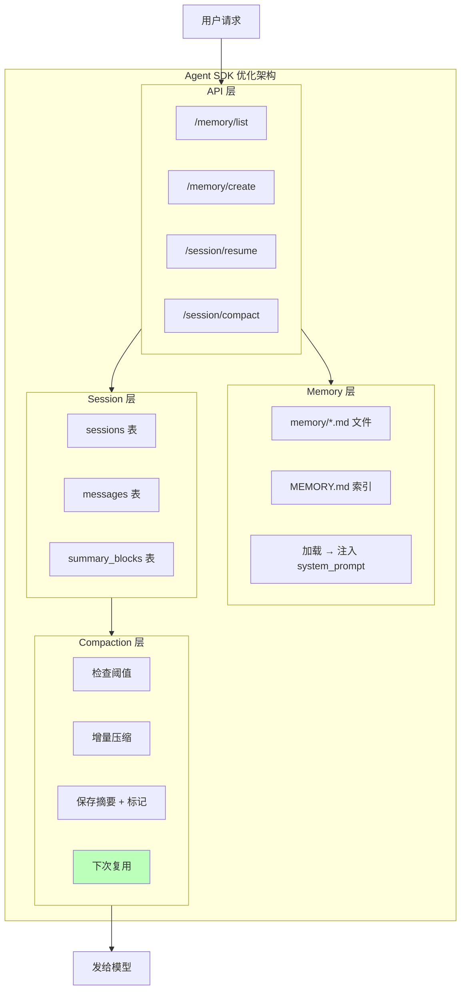

---

## 常见问题解答

### Q1: Session 和 Memory 有什么区别？

**Session**: "刚才我们聊了任务 123 的创建过程"（具体对话）
**Memory**: "用户喜欢简洁代码，项目用 MySQL 172.20.25.104"（长期偏好）

### Q2: Memory 每次对话都会加载吗？

✅ **是的**，每次对话开始时，Memory 会自动加载并注入到 system_prompt。

### Q3: Compaction 会丢失信息吗？

❌ **不会**，关键信息保留在摘要中，最近消息完整保留。MySQL 原始数据也不变。

### Q4: Claude Code 为什么不需要每次重新压缩？

因为 Claude Code 使用**标记系统**，在 JSONL 文件中标记已压缩的内容（`compacted=true`），下次直接复用。

### Q5: Agent SDK 如何优化 Compaction？

仿照 Claude Code：
1. 在 MySQL 中存储摘要
2. 标记摘要覆盖的消息范围
3. 下次加载时优先使用摘要，跳过重复压缩

### Q6: Memory 和 Session 可以同时用吗？

✅ **可以**，Memory 跨所有 Session，每次对话都注入；Session 仅当前对话，用于恢复上下文。

### Q7: Compaction 什么时候触发？

- 消息数量超过阈值（如 200 条）
- Tokens 超过模型限制
- 用户手动触发（Claude Code: `/compact`）

### Q8: 压缩结果保存在哪里？

- **Claude Code**: JSONL 文件，带 `compacted=true` 标记
- **Agent SDK（默认）**: 不保存，每次重新压缩
- **Agent SDK（优化后）**: MySQL summary_blocks 表

---

## 总结

### 三大机制一句话总结

| 机制 | 一句话总结 |
|------|-----------|
| **Session** | 短期记忆，保存当前对话的完整消息历史，用于"继续上次对话" |
| **Memory** | 长期记忆，保存精炼的关键信息，每次对话都参考，跨 Session 使用 |
| **Compaction** | 自动压缩，长对话精简为摘要，Claude Code 保存摘要，Agent SDK 需优化 |

### 最佳实践

1. **Memory**: 尽早实现，让 AI 知道用户偏好和项目配置
2. **Session**: 利用 `resume` 参数恢复对话，支持多轮交互
3. **Compaction**: 仿照 Claude Code，保存摘要避免重复压缩
4. **Prompt Caching**: 利用缓存优化，降低成本和响应时间

### 参考资料

- [Anthropic Documentation - Prompt Caching](https://docs.anthropic.com/en/docs/build-with-claude/prompt-caching)
- [Claude Code CLI Usage](https://docs.anthropic.com/en/docs/claude-code/cli-usage)
- [Claude Agent SDK](https://docs.anthropic.com/en/docs/claude-agent-sdk)

---

**文档创建时间**: 2026-05-30
**输出路径**: `/data/caidanfeng/project/doc/mm-doc/tmp/claude_memory_session_compaction_guide.md`