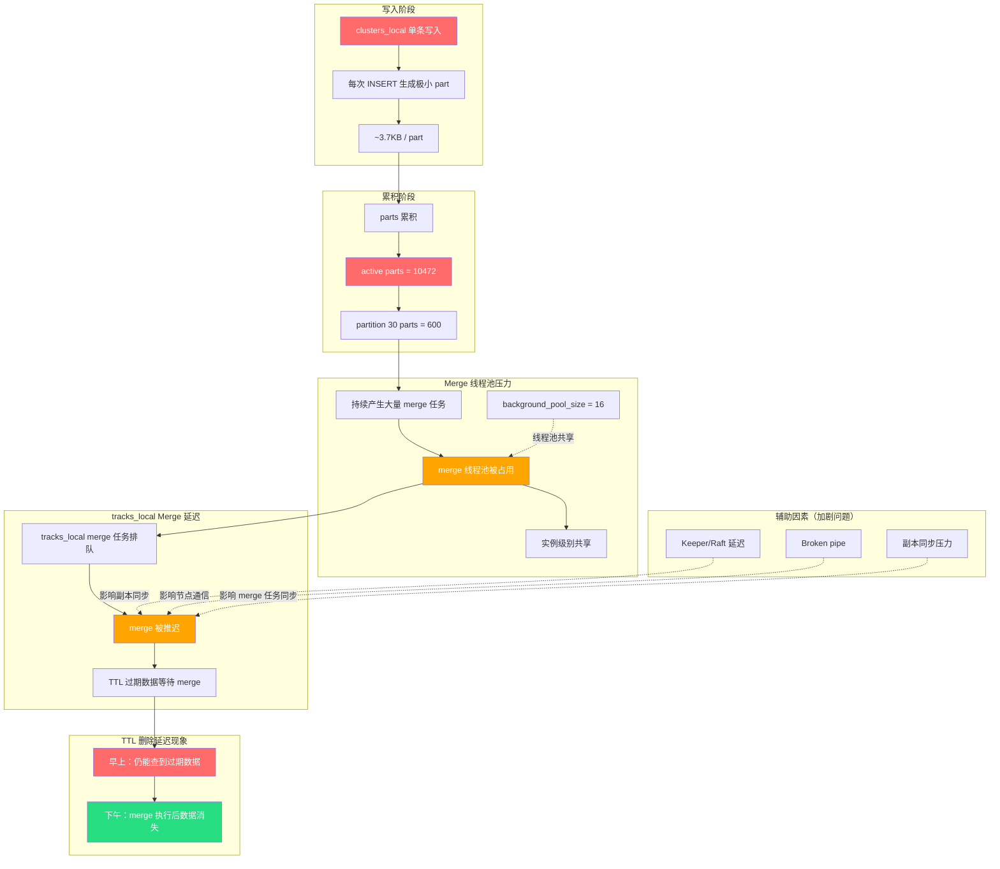

# ClickHouse tracks\_local TTL 删除延迟问题分析报告

## 问题概述

**现象**：设置了 31 天 TTL 的 `tracks_local` 表数据没有被及时删除，早上仍能查询到过期数据，下午才消失。

**根本原因**：`clusters_local` 表 parts 爆炸（10472 个 active parts），持续占用实例级别的 merge 线程池资源，导致 `tracks_local` 的 merge 任务被推迟，TTL 删除随之延迟。

***

## 流程图：问题影响链条



### 流程图说明

| 颜色 | 含义        |
| -- | --------- |
| 红色 | 问题源头、异常现象 |
| 橙色 | 中间影响环节    |
| 绿色 | 问题恢复状态    |

### 核心链路

**写入问题 → Parts 累积 → Merge 线程池占用 → tracks merge 延迟 → TTL 删除延迟**

### 辅助因素（虚线箭头）

- Keeper/Raft 延迟、Broken pipe、副本同步压力会加剧 merge 延迟问题

***

## 问题分析

### 1. clusters\_local 表 Part 爆炸情况

| 指标                 | 值       |
| ------------------ | ------- |
| active parts       | 10472   |
| partition 30 parts | 600     |
| partition 30 总大小   | 2.19MB  |
| 平均每 part 大小        | \~3.7KB |

**结论**：这是典型的单条 INSERT 导致 part 爆炸问题。每次写入生成极小的 part，merge 合并速度跟不上写入速度，导致 parts 累积。

### 2. tracks\_local 表状态正常

| 指标               | 值        |
| ---------------- | -------- |
| 每节点 active parts | \~90-103 |
| parts 数量         | 正常范围     |

**结论**：`tracks_local` 表本身没有 part 爆炸问题，不是自身原因导致 TTL 删除延迟。

### 3. TTL 删除机制说明

ClickHouse TTL 删除**不是实时**的，而是依赖 merge：

```
TTL 过期数据
    ↓
等待对应 part 被 merge
    ↓
merge 时判断 TTL 并删除过期数据
    ↓
如果 merge 被推迟 → TTL 删除也被推迟
```

### 4. Merge 线程池共享机制

ClickHouse 后台 merge 线程池是**实例级别共享**的：

- `background_pool_size`：默认 16 个线程
- 所有 ReplicatedMergeTree 表共享这些线程
- merge 任务按优先级排队执行

### 5. 问题影响链条

```
clusters_local 持续写入单条数据
    ↓
每次 INSERT 生成极小 part (~3.7KB)
    ↓
parts 累积到 10472 个
    ↓
持续产生大量 merge 任务
    ↓
merge 线程池被 clusters_local 占用
    ↓
tracks_local 的 merge 任务排队等待
    ↓
tracks_local TTL 过期数据没有被及时 merge
    ↓
早上仍能查到 TTL 过期数据
    ↓
后 merge 执行了，数据才被删
```

***

## 辅助影响因素

以下因素加剧了问题，但不是主因：

| 因素                    | 说明                                         |
| --------------------- | ------------------------------------------ |
| Keeper/Raft 延迟        | 日志中出现 `RaftInstance took long time`，影响副本同步 |
| Broken pipe           | 节点间通信断开，影响副本同步和 merge 任务同步                 |
| replication\_queue 积压 | olap-4 节点有 MERGE\_PARTS/GET\_PART 任务积压     |

***

## 验证方法

### 1. 查看当前 merge 任务

```sql
SELECT
    hostName(),
    table,
    count() AS merge_count,
    sum(total_size_bytes_compressed) / 1024 / 1024 AS total_mb
FROM system.merges
GROUP BY hostName(), table;
```

### 2. 查看 merge 线程池状态

```sql
SELECT
    hostName(),
    metric,
    value
FROM system.metrics
WHERE metric LIKE '%merge%' OR metric LIKE '%pool%'
ORDER BY hostName(), metric;
```

### 3. 查看 clusters\_local parts 详情

```sql
SELECT
    hostName(),
    partition,
    count() AS parts_count,
    sum(bytes_on_disk) / 1024 / 1024 AS size_mb
FROM clusterAllReplicas('clicks_cluster', system.parts)
WHERE database = 'rtc' AND table = 'clusters_local' AND active = 1
GROUP BY hostName(), partition
ORDER BY parts_count DESC;
```

***

## 解决方案

### 根本解决：修复 clusters\_local 写入方式

**当前问题**：单条写入，每次 INSERT 生成极小 part

**修复方案**：改为批量写入

| 方案          | 说明                                 |
| ----------- | ---------------------------------- |
| 批量 INSERT   | 每次写入至少 1000 行以上                    |
| 使用 Buffer 表 | 通过 Buffer 表缓冲后批量写入底层表              |
| 增加写入间隔      | 降低写入频率，每次写入更多数据                    |
| 调整 merge 配置 | 适当增加 `background_pool_size`（治标不治本） |

### 示例：使用 Buffer 表

```sql
-- 创建 Buffer 表
CREATE TABLE rtc.clusters_local_buffer AS rtc.clusters_local
ENGINE = Buffer(rtc, clusters_local, 16, 10, 100, 10000, 1000000, 10000000);

-- 写入改为写入 Buffer 表
INSERT INTO rtc.clusters_local_buffer VALUES (...);
-- Buffer 表会自动批量写入底层 clusters_local
```

### 紧急处理：手动触发 merge

```sql
-- 对 clusters_local 触发 OPTIMIZE（强制合并）
OPTIMIZE TABLE rtc.clusters_local FINAL;
```

注意：`OPTIMIZE FINAL` 会造成较大 IO 压力，建议在业务低峰期执行。

***

## 监控建议

### 1. 添加 parts 数量监控告警

```sql
-- 定期检查各表 parts 数量
SELECT
    database,
    table,
    count() AS parts_count
FROM system.parts
WHERE active = 1
GROUP BY database, table
ORDER BY parts_count DESC
LIMIT 10;
```

**告警阈值建议**：

- 单表 parts > 1000：告警
- 单表 parts > 5000：严重告警

### 2. 添加 merge 任务监控

```sql
SELECT count() FROM system.merges;
```

**告警阈值建议**：

- merge 任务 > 10：关注
- merge 任务 > background\_pool\_size：告警（线程池饱和）

### 3. 开启 part\_log 和 query\_log

```sql
-- 在 config.xml 中开启
<part_log>
    <database>system</database>
    <table>part_log</table>
</part_log>
```

这样可以追溯历史 merge 记录，便于问题排查。

***

## 总结

| 项目   | 结论                                                                   |
| ---- | -------------------------------------------------------------------- |
| 问题主因 | `clusters_local` 单条写入导致 parts 爆炸（10472个），占用 merge 线程池资源              |
| 影响机制 | merge 线程池共享 → clusters\_local 占用 → tracks\_local merge 推迟 → TTL 删除延迟 |
| 修复方向 | 修复 clusters\_local 写入方式，改为批量写入                                       |
| 辅助因素 | Keeper/Raft 延迟、Broken pipe、副本同步压力（加剧问题）                              |
| 监控建议 | 添加 parts 数量告警、merge 任务监控、开启 part\_log                                |

***

## 附录：关键日志证据

### 1. clusters\_local parts 状态

```
clusters_local active parts = 10472
partition 30 parts = 600
partition 30 总大小 = 2.19MB
平均每个 part ≈ 3.7KB
```

### 2. tracks\_local 副本同步状态

```
olap-4 的 tracks_local 有 replication_queue:
- type = MERGE_PARTS
- type = GET_PART
- last_exception = 空（不是失败，是积压）
```

### 3. Keeper/Raft 延迟日志

```
RaftInstance: appending entries from peer took long time
```

### 4. Broken pipe 日志

```
Broken pipe while writing to socket
```

***

**报告日期**：2026-06-08

**分析人**：Claude Code Assistant
