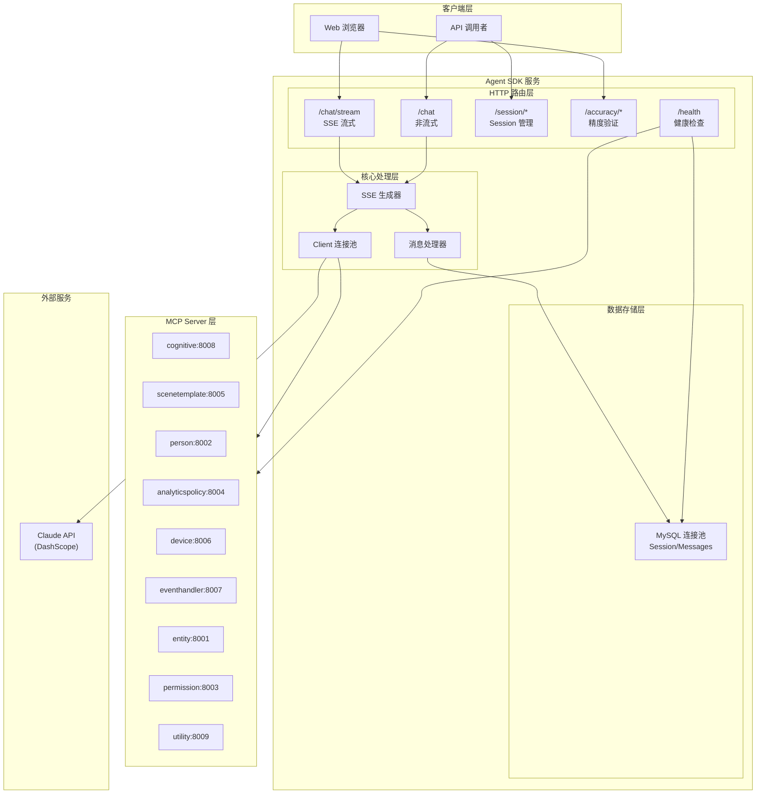
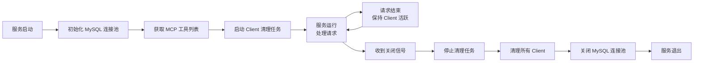
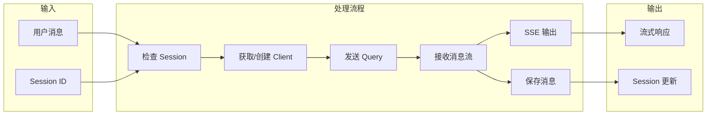
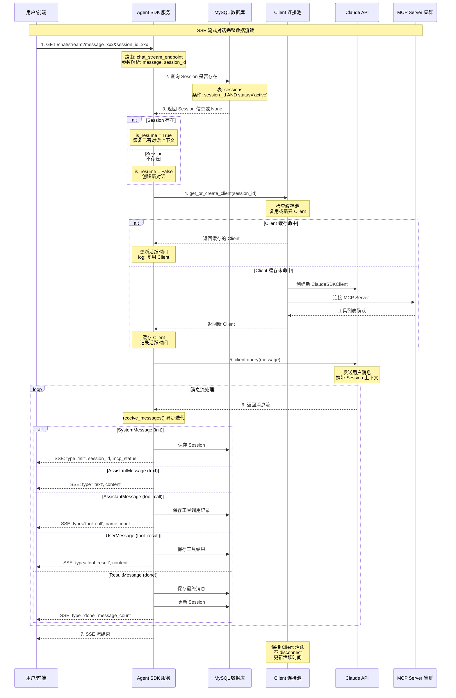
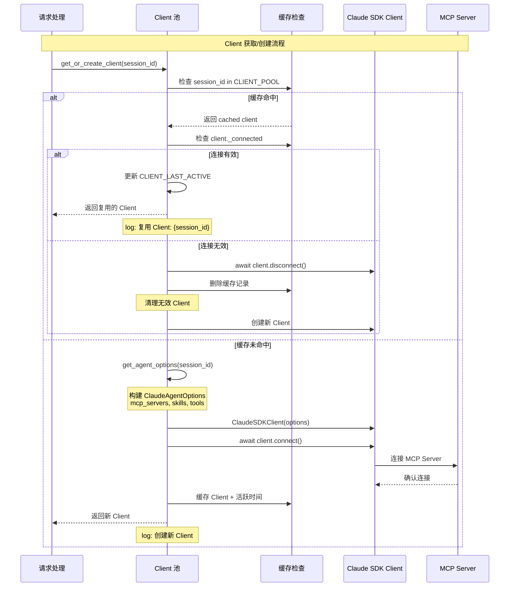
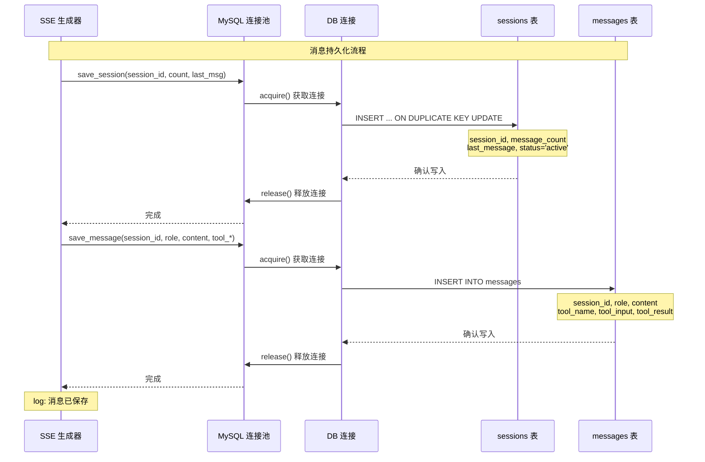
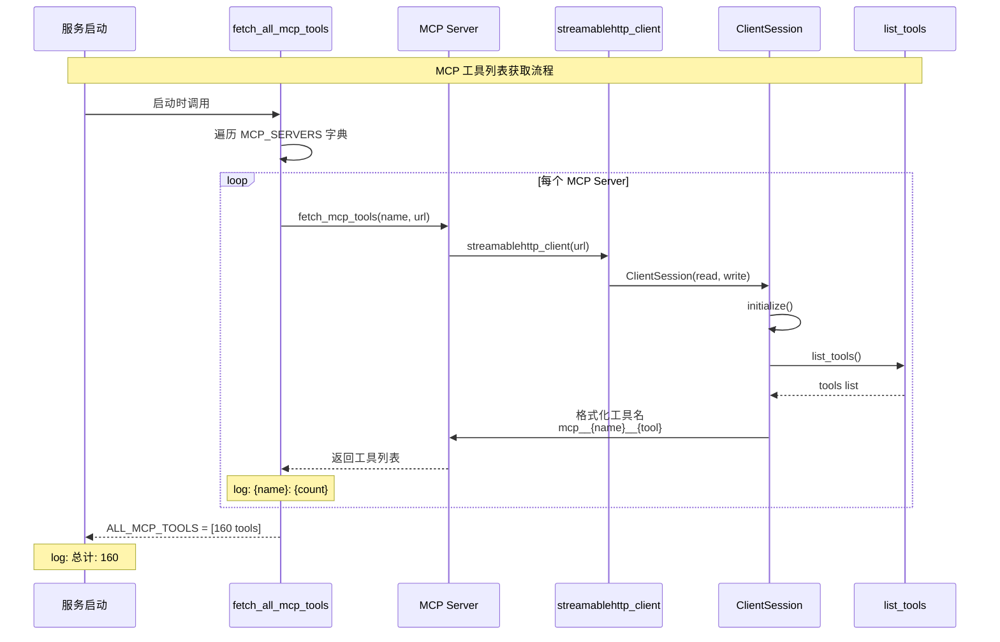
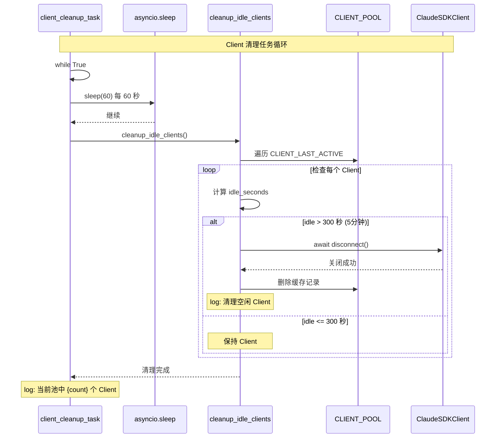
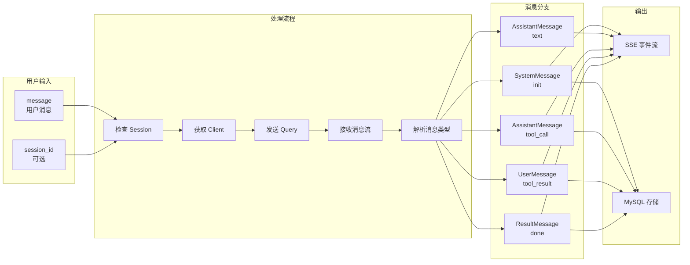
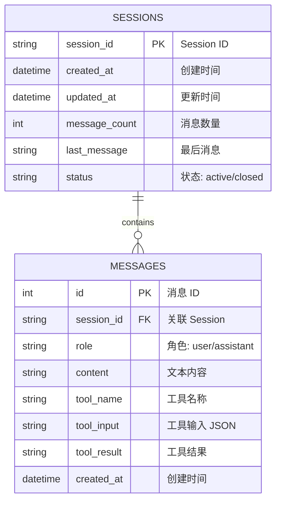

# 代码流程深度分析报告

## 文件信息
- **文件路径**: `/project/ai/agent/mcp/test_agent/agent_sdk_server.py`
- **分析时间**: 2026-05-30
- **语言**: Python
- **分析深度**: 递归深度分析（全量）
- **代码行数**: 1173 行
- **核心功能**: Claude Agent SDK HTTP 服务 - SSE 流式 + MySQL Session + 消息历史

## 概述

这是一个基于 **Claude Agent SDK** 的 HTTP 服务，提供以下核心功能：

| 功能模块 | 描述 |
|---------|------|
| **SSE 流式对话** | 通过 `/chat/stream` 接口实现 Server-Sent Events 流式输出 |
| **MySQL Session 管理** | 支持多轮对话上下文持久化存储 |
| **MCP Server 集成** | 连接 9 个 MCP Server，共 160 个工具 |
| **Client 连接池** | 优化 SDK Client 的创建和复用，减少连接开销 |
| **精度验证** | 人脸识别精度验证结果展示和 HTML 报告生成 |

---

## 系统架构流程图

### 1. 整体架构图



### 2. 生命周期流程图



### 3. 数据流转架构图



---

## 时序图

### 3.1 总体时序图 - SSE 流式对话完整流程



### 3.2 子时序图 - Client 连接池管理



### 3.3 子时序图 - MySQL Session/消息存储



### 3.4 子时序图 - MCP 工具获取



### 3.5 子时序图 - Client 定期清理



---

## 完整调用树

```
main() [入口函数]
├── print() - 标准库，输出启动信息
├── uvicorn.run() - 第三方库，启动 HTTP 服务
│   └── lifespan() [应用生命周期管理]
│       ├── init_mysql_pool() [初始化 MySQL 连接池]
│       │   └── aiomysql.create_pool() - 第三方库，创建异步连接池
│       │   └── log_print() [日志输出]
│       ├── fetch_all_mcp_tools() [获取所有 MCP 工具]
│       │   ├── log_print() [日志输出]
│       │   ├── fetch_mcp_tools() [获取单个 MCP Server 工具] (×9)
│       │   │   ├── streamablehttp_client() - MCP 库，建立 HTTP 连接
│       │   │   ├── ClientSession() - MCP 库，创建会话
│       │   │   ├── session.initialize() - MCP 库，初始化会话
│       │   │   ├── session.list_tools() - MCP 库，获取工具列表
│       │   │   └── log_print() [日志输出]
│       │   └── log_print() [日志输出]
│       ├── asyncio.create_task() - 标准库，创建清理任务
│       │   └── client_cleanup_task() [定期清理任务]
│       │       ├── asyncio.sleep() - 标准库，等待 60 秒
│       │       └── cleanup_idle_clients() [清理空闲 Client]
│       │           ├── datetime.now() - 标准库，获取当前时间
│       │           ├── client.disconnect() - SDK 方法，关闭连接 (×N)
│       │           └── log_print() [日志输出]
│       ├── yield - 等待服务运行
│       ├── cleanup_task.cancel() - 标准库，取消任务
│       ├── cleanup_all_clients() [清理所有 Client]
│       │   ├── client.disconnect() - SDK 方法，关闭连接
│       │   └── log_print() [日志输出]
│       └── close_mysql_pool() [关闭 MySQL 连接池]
│           ├── pool.close() - aiomysql 方法
│           ├── pool.wait_closed() - aiomysql 方法
│           └── log_print() [日志输出]
│
│   └── 路由处理 (请求时调用)
│       ├── chat_stream_endpoint() [SSE 流式对话]
│       │   ├── request.query_params.get() - Starlette 方法
│       │   ├── JSONResponse() - Starlette 响应 (错误时)
│       │   └── StreamingResponse() [SSE 流式响应]
│       │       └── chat_stream_generator() [SSE 生成器 - 核心]
│       │           ├── log_print() [日志输出]
│       │           ├── get_session() [查询 Session]
│       │           │   ├── MYSQL_POOL.acquire() - aiomysql 方法
│       │           │   ├── conn.cursor() - aiomysql 方法
│       │           │   ├── cur.execute() - SQL 查询
│       │           │   ├── cur.fetchone() - 获取结果
│       │           │   └── conn.commit() - 提交事务
│       │           ├── get_or_create_client() [获取/创建 Client]
│       │           │   ├── datetime.now() - 标准库
│       │           │   ├── client.disconnect() - SDK 方法 (清理时)
│       │           │   ├── get_agent_options() [构建 Agent 配置]
│       │           │   │   └── ClaudeAgentOptions() - SDK 配置类
│       │           │   ├── ClaudeSDKClient() - SDK 客户端创建
│       │           │   ├── client.connect() - SDK 连接方法
│       │           │   └── log_print() [日志输出]
│       │           ├── client.query() - SDK 发送消息
│       │           ├── client.receive_messages() - SDK 接收流
│       │           ├── save_session() [保存 Session]
│       │           │   ├── MYSQL_POOL.acquire() - 获取连接
│       │           │   ├── cur.execute() - INSERT/UPDATE SQL
│       │           │   ├── conn.commit() - 提交事务
│       │           │   └── log_print() [日志输出]
│       │           ├── save_message() [保存消息]
│       │           │   ├── json.dumps() - 标准库，序列化 JSON
│       │           │   ├── MYSQL_POOL.acquire() - 获取连接
│       │           │   ├── cur.execute() - INSERT SQL
│       │           │   ├── conn.commit() - 提交事务
│       │           │   └── log_print() [日志输出]
│       │           ├── json.dumps() - SSE 数据序列化
│       │           ├── yield - SSE 事件输出
│       │           └── CLIENT_LAST_ACTIVE 更新 - 活跃时间记录
│       │
│       ├── chat_endpoint() [非流式对话]
│       │   ├── request.json() - Starlette 方法
│       │   ├── JSONResponse() - 响应构建
│       │   └── chat_stream_generator() [复用 SSE 生成器]
│       │
│       ├── session_list_endpoint() [Session 列表]
│       │   ├── list_sessions() [列出 Session]
│       │   │   ├── MYSQL_POOL.acquire()
│       │   │   ├── cur.execute() - SELECT SQL
│       │   │   ├── cur.fetchall()
│       │   │   └── 数据格式化
│       │   └── JSONResponse()
│       │
│       ├── session_messages_endpoint() [Session 历史消息]
│       │   ├── get_messages() [获取消息]
│       │   │   ├── MYSQL_POOL.acquire()
│       │   │   ├── cur.execute() - SELECT SQL
│       │   │   ├── cur.fetchall()
│       │   │   ├── json.loads() - 解析 JSON
│       │   │   └── 数据格式化
│       │   └── JSONResponse()
│       │
│       ├── health_endpoint() [健康检查]
│       │   ├── os.listdir() - 标准库，遍历 Skills 目录
│       │   ├── os.path.exists() - 标准库，检查路径
│       │   └── JSONResponse()
│       │
│       ├── accuracy_list_endpoint() [精度验证列表]
│       │   ├── os.listdir() - 遍历目录
│       │   ├── os.path.exists() - 检查文件
│       │   ├── open() - 打开 JSON 文件
│       │   ├── json.load() - 解析 JSON
│       │   └── JSONResponse()
│       │
│       ├── accuracy_report_endpoint() [精度验证报告]
│       │   ├── request.path_params - 获取路径参数
│       │   ├── os.path.exists() - 检查路径
│       │   ├── open() + json.load() - 读取数据
│       │   ├── generate_accuracy_html() [生成 HTML]
│       │   │   ├── os.path.basename() - 标准库
│       │   │   ├── os.path.exists() - 标准库
│       │   │   ├── escape() - html 标准库
│       │   │   └── 字符串拼接生成 HTML
│       │   └── HTMLResponse()
│       │
│       └── accuracy_image_endpoint() [返回图片]
│           ├── request.path_params
│           ├── os.path.exists()
│           └── FileResponse()
```

---

## 核心方法详细分析

### 1. main() - 服务入口
**位置**: agent_sdk_server.py:1144-1169

**输入输出**:
| 参数 | 类型 | 方向 | 描述 |
|------|------|------|------|
| 无 | - | - | 入口函数，无参数 |

**内部实现**:
1. 打印服务启动信息（分隔线、功能描述、配置信息）
2. 列出所有 API 接口及其用途
3. 显示访问 URL
4. 调用 `uvicorn.run()` 启动 Starlette 应用

**调用关系**:
- 调用: `print()`, `uvicorn.run()`
- 被调用: `if __name__ == "__main__"` 条件触发

---

### 2. lifespan() - 应用生命周期管理
**位置**: agent_sdk_server.py:1087-1111

**输入输出**:
| 参数 | 类型 | 方向 | 描述 |
|------|------|------|------|
| app | Starlette | 输入 | Starlette 应用实例 |

**内部实现**:
```python
@asynccontextmanager
async def lifespan(app):
    # 启动阶段
    await init_mysql_pool()              # 1. 初始化 MySQL
    ALL_MCP_TOOLS = await fetch_all_mcp_tools()  # 2. 获取 MCP 工具
    cleanup_task = asyncio.create_task(client_cleanup_task())  # 3. 启动清理任务

    yield  # 服务运行期间

    # 关闭阶段
    cleanup_task.cancel()                # 4. 取消清理任务
    await cleanup_all_clients()          # 5. 清理所有 Client
    await close_mysql_pool()             # 6. 关闭 MySQL
```

**调用关系**:
- 调用: `init_mysql_pool()`, `fetch_all_mcp_tools()`, `asyncio.create_task()`, `cleanup_all_clients()`, `close_mysql_pool()`
- 被调用: Starlette `lifespan` 参数

---

### 3. chat_stream_generator() - SSE 流式生成器（核心）
**位置**: agent_sdk_server.py:377-493

**输入输出**:
| 参数 | 类型 | 方向 | 描述 |
|------|------|------|------|
| message | str | 输入 | 用户消息内容 |
| session_id | str | 输入(可选) | Session ID，用于恢复对话 |
| yield | SSE event | 输出 | SSE 格式的事件流 |

**内部实现**:
```
1. 记录日志，解析 session_id
2. 检查 Session 是否存在 (get_session)
3. 获取/创建 Client (get_or_create_client)
4. 发送用户消息 (client.query)
5. 循环处理消息流 (client.receive_messages):
   - SystemMessage (init): 保存 Session，输出初始化信息
   - AssistantMessage (text): 累积文本，输出 SSE text
   - AssistantMessage (tool_call): 保存工具调用，输出 SSE tool_call
   - UserMessage (tool_result): 保存工具结果，输出 SSE tool_result
   - ResultMessage (done): 保存最终消息，更新 Session，输出 SSE done
6. 异常处理，输出 SSE error
7. finally: 更新 Client 活跃时间（不 disconnect）
```

**关键决策点**:
| 位置 | 条件 | 结果 | 说明 |
|------|------|------|------|
| 385行 | session_id 存在且 Session 活跃 | is_resume=True | 恢复已有对话 |
| 385行 | Session 不存在 | is_resume=False | 创建新对话 |
| 407行 | msg 是 SystemMessage | subtype=='init' | 初始化阶段 |
| 426行 | msg 是 AssistantMessage | block 是 TextBlock | 输出文本 |
| 432行 | msg 是 AssistantMessage | block 是 ToolUseBlock | 工具调用 |
| 440行 | tool_name == 'AskUserQuestion' | 特殊处理 | 询问用户 |
| 467行 | msg 是 ResultMessage | 结束处理 | 完成对话 |
| 478行 | message_count >= 200 | 中断处理 | 达到消息限制 |

**调用关系**:
- 调用: `log_print()`, `get_session()`, `get_or_create_client()`, `client.query()`, `client.receive_messages()`, `save_session()`, `save_message()`, `json.dumps()`
- 被调用: `chat_stream_endpoint()`, `chat_endpoint()`

---

### 4. get_or_create_client() - Client 连接池管理
**位置**: agent_sdk_server.py:91-125

**输入输出**:
| 参数 | 类型 | 方向 | 描述 |
|------|------|------|------|
| session_id | str | 输入(可选) | Session ID |
| return | ClaudeSDKClient | 输出 | SDK 客户端实例 |

**内部实现**:
```
1. 检查 session_id 是否在 CLIENT_POOL 缓存中
2. 若缓存命中:
   - 检查 client._connected 是否有效
   - 有效: 更新活跃时间，返回 client
   - 无效: disconnect，删除缓存，创建新 client
3. 若缓存未命中:
   - 调用 get_agent_options() 构建配置
   - 创建 ClaudeSDKClient
   - await client.connect()
   - 缓存 client（若有 session_id）
4. 返回 client
```

**调用关系**:
- 调用: `datetime.now()`, `client.disconnect()`, `get_agent_options()`, `ClaudeSDKClient()`, `client.connect()`, `log_print()`
- 被调用: `chat_stream_generator()`

---

### 5. get_agent_options() - 构建 Agent 配置
**位置**: agent_sdk_server.py:344-374

**输入输出**:
| 参数 | 类型 | 方向 | 描述 |
|------|------|------|------|
| session_id | str | 输入(可选) | 用于 resume |
| return | ClaudeAgentOptions | 输出 | Agent 配置对象 |

**内部实现**:
```python
def get_agent_options(session_id=None):
    allowed_tools = ["Bash", "Read", "Write", "Edit", "Agent", "WebFetch", "WebSearch"] + ALL_MCP_TOOLS

    return ClaudeAgentOptions(
        setting_sources=["user", "project"],
        skills="all",
        system_prompt="""人脸解析任务管理专家...""",
        mcp_servers=MCP_SERVERS,  # 9 个 MCP Server
        permission_mode="auto",   # 预授权所有工具
        allowed_tools=allowed_tools,  # 160+ 工具
        cwd="/project/ai/agent/mcp",
        model=MODEL,
        resume=session_id,       # 恢复对话
        env={
            "ANTHROPIC_API_KEY": API_KEY,
            "ANTHROPIC_BASE_URL": BASE_URL,
        },
    )
```

**调用关系**:
- 调用: `ClaudeAgentOptions()`
- 被调用: `get_or_create_client()`

---

### 6. save_session() - 保存/更新 Session
**位置**: agent_sdk_server.py:181-195

**输入输出**:
| 参数 | 类型 | 方向 | 描述 |
|------|------|------|------|
| session_id | str | 输入 | Session ID |
| message_count | int | 输入 | 消息数量 |
| last_message | str | 输入(可选) | 最后一条消息 |
| return | None | 输出 | 无返回值 |

**内部实现**:
```python
async def save_session(session_id, message_count, last_message=None):
    async with MYSQL_POOL.acquire() as conn:
        async with conn.cursor() as cur:
            await cur.execute("""
                INSERT INTO sessions (session_id, message_count, last_message, status)
                VALUES (%s, %s, %s, 'active')
                ON DUPLICATE KEY UPDATE
                    message_count = %s,
                    last_message = %s,
                    updated_at = NOW(),
                    status = 'active'
            """, ...)
            await conn.commit()
    log_print("INFO", f"Session 已保存: {session_id}")
```

**调用关系**:
- 调用: `MYSQL_POOL.acquire()`, `conn.cursor()`, `cur.execute()`, `conn.commit()`, `log_print()`
- 被调用: `chat_stream_generator()`

---

### 7. save_message() - 保存单条消息
**位置**: agent_sdk_server.py:248-262

**输入输出**:
| 参数 | 类型 | 方向 | 描述 |
|------|------|------|------|
| session_id | str | 输入 | Session ID |
| role | str | 输入 | 消息角色 (user/assistant) |
| content | str | 输入(可选) | 文本内容 |
| tool_name | str | 输入(可选) | 工具名称 |
| tool_input | dict | 输入(可选) | 工具输入 |
| tool_result | str/dict | 输入(可选) | 工具结果 |

**内部实现**:
```python
async def save_message(session_id, role, content=None, tool_name=None, tool_input=None, tool_result=None):
    # JSON 序列化
    tool_input_str = json.dumps(tool_input, ensure_ascii=False) if tool_input else None
    tool_result_str = json.dumps(tool_result, ensure_ascii=False) if isinstance(tool_result, dict) else tool_result

    async with MYSQL_POOL.acquire() as conn:
        async with conn.cursor() as cur:
            await cur.execute("""
                INSERT INTO messages (session_id, role, content, tool_name, tool_input, tool_result)
                VALUES (%s, %s, %s, %s, %s, %s)
            """, ...)
            await conn.commit()
    log_print("DEBUG", f"消息已保存...")
```

**调用关系**:
- 调用: `json.dumps()`, `MYSQL_POOL.acquire()`, `conn.cursor()`, `cur.execute()`, `conn.commit()`, `log_print()`
- 被调用: `chat_stream_generator()`

---

### 8. fetch_all_mcp_tools() - 获取 MCP 工具列表
**位置**: agent_sdk_server.py:327-336

**输入输出**:
| 参数 | 类型 | 方向 | 描述 |
|------|------|------|------|
| return | list[str] | 输出 | 工具名称列表 |

**内部实现**:
```python
async def fetch_all_mcp_tools():
    all_tools = []
    log_print("INFO", "获取 MCP 工具列表...")
    for name, config in MCP_SERVERS.items():
        tools = await fetch_mcp_tools(name, config["url"])
        all_tools.extend(tools)
        log_print("INFO", f"  {name}: {len(tools)}")
    log_print("INFO", f"总计: {len(all_tools)}")
    return all_tools
```

**调用关系**:
- 调用: `log_print()`, `fetch_mcp_tools()`
- 被调用: `lifespan()`

---

### 9. fetch_mcp_tools() - 获取单个 MCP Server 工具
**位置**: agent_sdk_server.py:312-324

**输入输出**:
| 参数 | 类型 | 方向 | 描述 |
|------|------|------|------|
| server_name | str | 输入 | Server 名称 |
| server_url | str | 输入 | Server URL |
| return | list[str] | 输出 | 格式化后的工具列表 |

**内部实现**:
```python
async def fetch_mcp_tools(server_name, server_url):
    tools = []
    try:
        async with streamablehttp_client(server_url) as (read_stream, write_stream, _):
            async with ClientSession(read_stream, write_stream) as session:
                await session.initialize()
                result = await session.list_tools()
                for tool in result.tools:
                    tools.append(f"mcp__{server_name}__{tool.name}")
    except Exception as e:
        log_print("WARN", f"获取 {server_name} 工具失败: {e}")
    return tools
```

**调用关系**:
- 调用: `streamablehttp_client()`, `ClientSession()`, `session.initialize()`, `session.list_tools()`, `log_print()`
- 被调用: `fetch_all_mcp_tools()`

---

### 10. cleanup_idle_clients() - 清理空闲 Client
**位置**: agent_sdk_server.py:128-153

**输入输出**:
| 参数 | 类型 | 方向 | 描述 |
|------|------|------|------|
| return | None | 输出 | 无返回值 |

**内部实现**:
```python
async def cleanup_idle_clients():
    now = datetime.now()
    to_remove = []

    for session_id, last_active in CLIENT_LAST_ACTIVE.items():
        idle_seconds = (now - last_active).total_seconds()
        if idle_seconds > CLIENT_MAX_IDLE:  # 300秒
            to_remove.append(session_id)

    for session_id in to_remove:
        client = CLIENT_POOL.get(session_id)
        if client:
            try:
                await client.disconnect()
            except Exception as e:
                log_print("WARN", ...)
        del CLIENT_POOL[session_id]
        del CLIENT_LAST_ACTIVE[session_id]

    log_print("INFO", f"清理完成，当前池中 {len(CLIENT_POOL)} 个 Client")
```

**调用关系**:
- 调用: `datetime.now()`, `client.disconnect()`, `log_print()`
- 被调用: `client_cleanup_task()`

---

### 11. generate_accuracy_html() - 生成精度验证 HTML
**位置**: agent_sdk_server.py:709-946

**输入输出**:
| 参数 | 类型 | 方向 | 描述 |
|------|------|------|------|
| data | dict | 输入 | result.json 数据 |
| dir_name | str | 输入 | 目录名称 |
| return | str | 输出 | HTML 内容字符串 |

**内部实现**:
```
1. 解析 validation_result, kafka_messages, match_details
2. 构建 kafka_rows 数据结构（人脸信息 + 匹配结果）
3. 生成 HTML 头部 + CSS 样式
4. 生成统计信息区域
5. 遍历 kafka_rows:
   - Kafka 图片展示
   - Top 5 匹配结果展示（正确/错误标记）
6. 生成漏检列表（未识别的真值人脸）
7. 返回完整 HTML 字符串
```

**调用关系**:
- 调用: `os.path.basename()`, `os.path.exists()`, `escape()`
- 被调用: `accuracy_report_endpoint()`

---

## 数据流分析

### SSE 流式对话数据流图



### MySQL 数据存储结构



---

## 关键决策点汇总

| 位置 | 条件 | 结果 | 说明 |
|------|------|------|------|
| lifespan:1092 | 服务启动 | 初始化资源 | MySQL + MCP + 清理任务 |
| lifespan:1102 | 服务关闭 | 清理资源 | 取消任务 + 关闭连接 |
| chat_stream_generator:385 | Session 存在 | is_resume=True | 恢复对话 |
| chat_stream_generator:407 | SystemMessage | 输出初始化信息 | SSE type='init' |
| chat_stream_generator:426 | AssistantMessage + TextBlock | 输出文本 | SSE type='text' |
| chat_stream_generator:432 | AssistantMessage + ToolUseBlock | 输出工具调用 | SSE type='tool_call' |
| chat_stream_generator:440 | tool_name == 'AskUserQuestion' | 特殊处理 | SSE type='ask_user' |
| chat_stream_generator:467 | ResultMessage | 结束对话 | SSE type='done' |
| chat_stream_generator:478 | message_count >= 200 | 中断 | 达到限制 |
| get_or_create_client:96 | 缓存命中 | 复用 Client | 优化性能 |
| get_or_create_client:99 | 连接有效 | 返回 Client | 更新活跃时间 |
| get_or_create_client:104 | 连接无效 | 清理并重建 | disconnect + 新建 |
| cleanup_idle_clients:137 | idle > 300s | 清理 Client | 关闭空闲连接 |

---

## 异常处理分析

| 函数 | 异常类型 | 处理方式 | 说明 |
|------|---------|---------|------|
| chat_stream_generator | Exception | SSE error 输出 + traceback | 捕获所有异常，输出错误信息 |
| fetch_mcp_tools | Exception | log WARN + 返回空列表 | MCP 连接失败时跳过 |
| cleanup_idle_clients | Exception (disconnect) | log WARN + 继续 | 单个 Client 关闭失败不影响其他 |
| cleanup_all_clients | Exception (disconnect) | log WARN + 继续 | 同上 |
| accuracy_report_endpoint | Exception | HTML 错误页面 | 返回 500 错误信息 |

---

## 配置参数汇总

### MySQL 配置
| 参数 | 值 |
|------|------|
| Host | 172.20.25.104 |
| Port | 3306 |
| Database | mcp_test |
| minsize | 2 |
| maxsize | 10 |

### Client 连接池配置
| 参数 | 值 |
|------|------|
| CLIENT_MAX_IDLE | 300 秒 (5分钟) |
| 清理检查间隔 | 60 秒 |
| 消息数限制 | 200 |

### MCP Server 配置
| Server | URL |
|--------|------|
| cognitive | http://172.20.25.104:8008/mcp |
| scenetemplate | http://172.20.25.104:8005/mcp |
| person | http://172.20.25.104:8002/mcp |
| analyticspolicy | http://172.20.25.104:8004/mcp |
| device | http://172.20.25.104:8006/mcp |
| eventhandler | http://172.20.25.104:8007/mcp |
| entity | http://172.20.25.104:8001/mcp |
| permission | http://172.20.25.104:8003/mcp |
| utility | http://172.20.25.104:8009/mcp |

---

## 总结

### 设计亮点

1. **Client 连接池优化**: 通过 `CLIENT_POOL` 缓存避免频繁创建/销毁 SDK Client，减少连接开销
2. **SSE 流式输出**: 实时返回 AI 响应，用户体验好
3. **MySQL Session 持久化**: 支持多轮对话上下文恢复
4. **定期清理机制**: 自动清理空闲 Client，防止资源泄漏
5. **MCP Server 集成**: 统一管理 9 个 Server，160 个工具

### 改进建议

| 方面 | 建议 |
|------|------|
| 异常处理 | 可增加更细粒度的异常分类（网络错误、API 错误等） |
| 配置管理 | 可将配置移至配置文件或环境变量，便于部署 |
| 日志系统 | 可引入结构化日志（如 structlog），便于分析 |
| 测试覆盖 | 缺少单元测试，建议增加 pytest 测试 |

### 核心流程一句话总结

> 用户请求 → 检查 Session → 复用/创建 Client → 发送 Query → 循环接收消息流 → SSE 输出 + MySQL 存储 → 更新 Client 活跃时间

---

**文档生成时间**: 2026-05-30
**分析工具**: Code Flow Analyzer Skill
**输出路径**: `/data/caidanfeng/project/doc/mm-doc/tmp/code_flow_analysis_agent_sdk_server_deep.md`