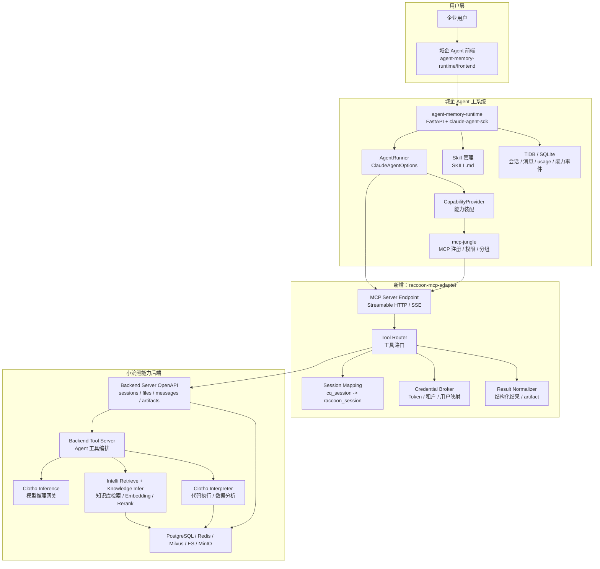
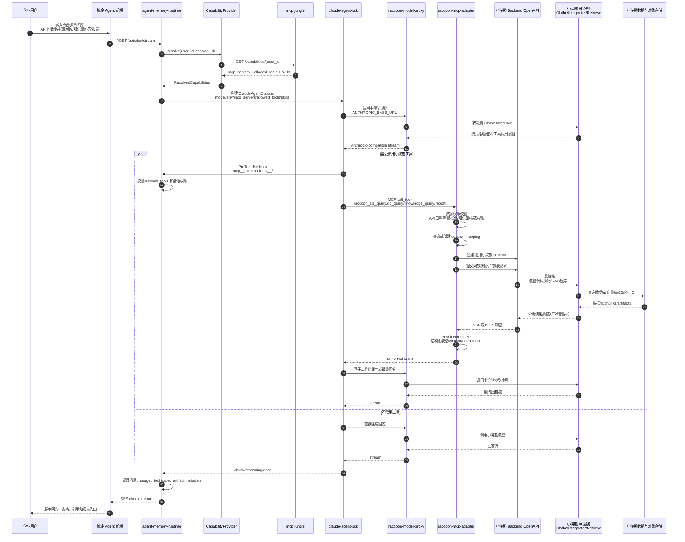
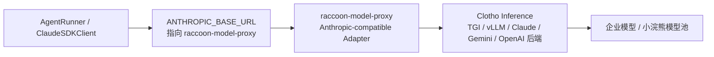
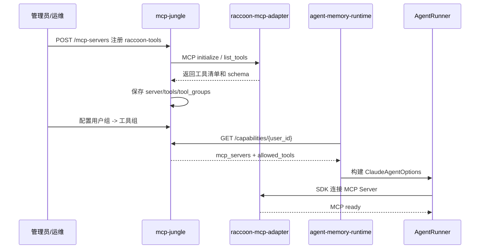
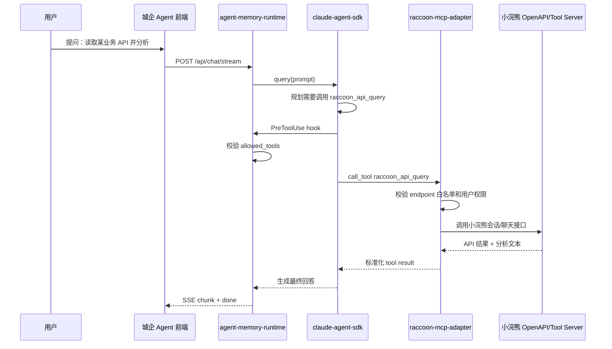
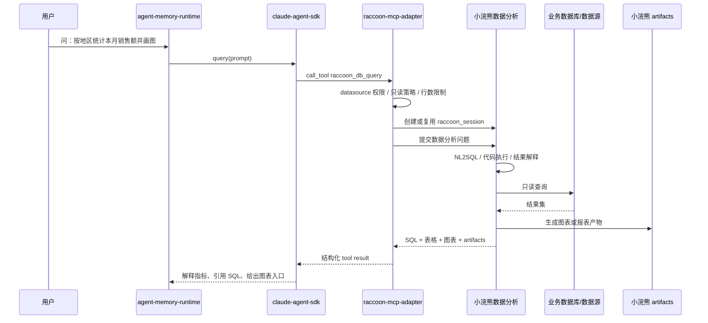
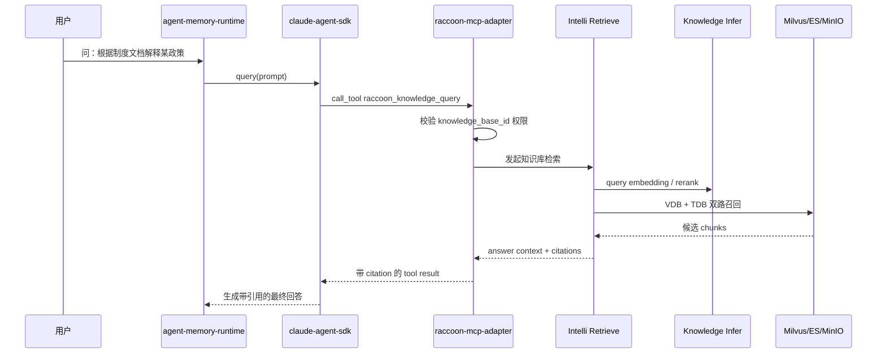
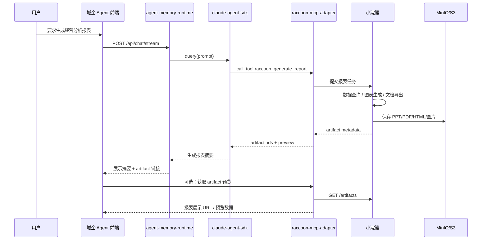

# 城企 Agent 对接小浣熊能力设计方案

> 目标路径：`/data/caidanfeng/project/doc/mm-doc/tmp/cq_agent_raccoon_integration_design.md`  
> 生成日期：2026-06-11  
> 主系统：城企 Agent（`cq_agent`）  
> 被集成系统：小浣熊 / SenseCode / Raccoon（`tob-office-external`）

## 1. 背景与目标

城企 Agent 当前以 `agent-memory-runtime` 为运行时核心，使用 `claude-agent-sdk` 作为 Agent 主框架，配套 `mcp-jungle` 做 MCP Server 注册、工具发现、用户分组与工具权限控制，`skill-creator-mvp` 做用户 Skill 生成、保存和安装。

本方案目标是以城企 Agent 为主控入口，将小浣熊作为能力后端接入，覆盖：

1. 小浣熊作为一个或多个 MCP 工具注册到城企 Agent。
2. `claude-agent-sdk` 的模型调用可切换或代理到小浣熊模型网关。
3. 问数能力拆为三类：
   - 问数 1：读取 API。
   - 问数 2：读取数据库，借助小浣熊能力。
   - 问数 3：读取文档知识库，借助小浣熊能力。
4. 报表生成、报表展示、结果文件和图表产物复用小浣熊已有会话、代码执行、知识库和 artifacts 能力。

## 2. 现状约束

### 2.1 城企 Agent 侧

`agent-memory-runtime` 的 `AgentRunner` 已经支持通过 `ClaudeAgentOptions` 注入：

- `model`：SDK 使用的模型名称。
- `env`：传给 Claude Code / Claude Agent SDK 子进程的环境变量，包括 `ANTHROPIC_API_KEY`、`ANTHROPIC_BASE_URL`、`CLAUDE_CONFIG_DIR`。
- `mcp_servers`：MCP Server 配置。
- `allowed_tools`：工具白名单。
- `skills`：用户安装的 `SKILL.md`。
- `PreToolUse` hook：对 `mcp__*` 工具进行二次权限校验。

`mcp-jungle` 已经提供：

- MCP Server 注册、预览、同步和启停。
- 工具表、工具分组、用户分组、用户工具权限。
- `/capabilities/{user_id}` 能力解析接口，供 `agent-memory-runtime` 动态装配 MCP tools。

### 2.2 小浣熊侧

小浣熊已有 OpenAPI / Office DataAnalysis 能力，包括：

- 创建会话：`POST /api/open/office/v2/sessions`
- 聊天问答：`POST /api/open/office/v2/sessions/{session_id}/chat/conversations`
- 上传文件：`POST /api/open/office/v2/sessions/{session_id或default_session}/{batch_id}/files`
- 获取消息：`GET /api/open/office/v2/sessions/{session_id}/messages`
- 获取产物：`GET /api/open/office/v2/sessions/{session_id}/artifacts`

小浣熊后端服务链路包括 Backend Server、Backend Tool Server、Clotho Inference、Clotho Interpreter、Intelli Retrieve、Knowledge Infer，可以覆盖模型推理、代码执行、文档知识库检索、数据分析和报表产物生成。

## 3. 总体设计

推荐引入一个独立的 `raccoon-mcp-adapter` 服务，作为城企 Agent 与小浣熊之间的适配层。该服务对上暴露 MCP 协议，对下调用小浣熊 OpenAPI、数据分析接口、知识库接口和模型网关。

### 3.1 设计原则

- 城企 Agent 仍是唯一用户入口和会话主控。
- 小浣熊作为工具能力后端，不直接侵入 `AgentRunner` 业务代码。
- 所有工具均通过 MCP 注册到 `mcp-jungle`，复用用户分组、工具分组、白名单和 `PreToolUse` 权限校验。
- 模型接入与工具接入解耦：工具走 MCP，模型走 `ANTHROPIC_BASE_URL` 兼容代理或 SDK Provider 适配。
- 小浣熊会话 ID、文件 ID、artifact ID 要在城企侧做映射，避免把后端内部 ID 直接暴露给终端用户。
- 问数链路返回结构化结果，报表链路返回 `artifact` 元数据和可展示 URL。

### 3.2 总体架构图



### 3.3 总体端到端时序图

下面的总体时序图覆盖一次完整用户请求：城企 Agent 接收问题，`claude-agent-sdk` 使用小浣熊模型代理进行规划，按需调用注册在 `mcp-jungle` 中的小浣熊 MCP 工具，小浣熊完成 API/数据库/知识库/报表处理，最终由城企 Agent 汇总返回。



## 4. 核心组件设计

### 4.1 raccoon-mcp-adapter

该服务是本次集成的关键新增组件，建议放在城企 Agent 仓库中独立子项目，例如：

```text
cq_agent/raccoon-mcp-adapter/
  src/
    main.py
    config.py
    auth.py
    raccoon_client.py
    session_mapping.py
    tools/
      api_query.py
      db_query.py
      knowledge_query.py
      report.py
      session.py
      file.py
```

职责：

- 暴露 MCP Server，供 `mcp-jungle` 注册和 `claude-agent-sdk` 调用。
- 封装小浣熊 OpenAPI 的认证、租户、用户、会话和错误码。
- 维护 `cq_user_id + cq_session_id -> raccoon_session_id` 映射。
- 将小浣熊 SSE 流、消息、文件、artifact 标准化为 MCP tool result。
- 对问数 SQL、API URL、知识库 ID 做策略校验和审计。

### 4.2 mcp-jungle 注册方式

建议注册一个 MCP Server：`raccoon-tools`。在工具数量稳定后，可以拆成多个 MCP Server：

- `raccoon-data-tools`：API 问数、数据库问数。
- `raccoon-knowledge-tools`：文档知识库问答。
- `raccoon-report-tools`：报表生成、artifact 查询。
- `raccoon-session-tools`：会话、文件上传、消息查询。

第一阶段推荐一个 MCP Server，原因是部署简单、权限配置集中、工具发现成本低。

### 4.3 Claude Agent SDK 模型接入

城企侧当前 `AgentRunner` 的模型由 `DEFAULT_MODEL` 控制，`build_agent_env()` 会注入：

- `ANTHROPIC_API_KEY`
- `ANTHROPIC_BASE_URL`
- `CLAUDE_CONFIG_DIR`

推荐提供一个“小浣熊模型代理层”，对上模拟 Anthropic API 或 Claude Agent SDK 可接受的模型网关协议，对下调用小浣熊 `Clotho Inference`。



模型接入分两阶段：

1. P0：继续使用当前 `ANTHROPIC_BASE_URL` 机制，将其指向小浣熊兼容代理；`DEFAULT_MODEL` 配置为小浣熊模型别名。
2. P1：改造 `agent-memory-runtime` 的 `_runner_model()`，允许 `CapabilityProvider` 或租户配置返回模型策略，但要加模型治理，不建议让远端能力解析结果直接无约束切换模型。

## 5. MCP 工具设计

### 5.1 工具清单

| 工具名 | 归属 | 功能 | 小浣熊依赖 |
|---|---|---|---|
| `raccoon_create_session` | session | 创建或获取小浣熊会话 | `/api/open/office/v2/sessions` |
| `raccoon_upload_file` | file | 上传文档、表格、数据文件 | `/files` |
| `raccoon_api_query` | 问数 1 | 读取业务 API 并总结 | 小浣熊 OpenAPI + Tool Server |
| `raccoon_db_query` | 问数 2 | 自然语言转 SQL / 执行受控查询 / 解释结果 | 小浣熊数据分析 + Interpreter |
| `raccoon_knowledge_query` | 问数 3 | 基于文档知识库 RAG 问答 | Intelli Retrieve + Knowledge Infer |
| `raccoon_generate_report` | 报表 | 生成图表、表格、PPT/PDF/HTML 报表 | Interpreter + artifacts |
| `raccoon_get_artifacts` | 报表 | 查询会话产物列表 | `/artifacts` |
| `raccoon_get_messages` | session | 获取小浣熊会话消息 | `/messages` |

### 5.2 工具输入输出契约

#### raccoon_api_query

输入：

```json
{
  "api_name": "string",
  "endpoint": "string",
  "method": "GET|POST",
  "params": {},
  "question": "string",
  "output_schema": "table|summary|json"
}
```

输出：

```json
{
  "answer": "string",
  "data": [],
  "source": {
    "type": "api",
    "endpoint": "string"
  },
  "raccoon_session_id": "string"
}
```

#### raccoon_db_query

输入：

```json
{
  "datasource_id": "string",
  "question": "string",
  "constraints": {
    "readonly": true,
    "max_rows": 1000,
    "timeout_seconds": 30
  },
  "need_chart": true
}
```

输出：

```json
{
  "answer": "string",
  "sql": "string",
  "columns": [],
  "rows": [],
  "chart": {
    "type": "bar|line|pie|table",
    "spec": {}
  },
  "artifacts": []
}
```

#### raccoon_knowledge_query

输入：

```json
{
  "knowledge_base_id": "string",
  "question": "string",
  "top_k": 8,
  "rerank": true,
  "citation_required": true
}
```

输出：

```json
{
  "answer": "string",
  "citations": [
    {
      "doc_id": "string",
      "title": "string",
      "chunk_id": "string",
      "score": 0.0,
      "quote": "string"
    }
  ]
}
```

#### raccoon_generate_report

输入：

```json
{
  "report_type": "dashboard|chart|ppt|pdf|html",
  "question": "string",
  "data_context": {},
  "style": "enterprise",
  "export": true
}
```

输出：

```json
{
  "summary": "string",
  "artifact_ids": [],
  "artifact_urls": [],
  "preview": {
    "type": "html|image|table",
    "content": "string"
  }
}
```

## 6. 关键流程时序图

### 6.1 MCP 注册与能力装配流程



### 6.2 用户发起问数 1：读取 API



### 6.3 用户发起问数 2：读取数据库



### 6.4 用户发起问数 3：读取文档知识库



### 6.5 报表生成与展示



## 7. 数据与权限模型

### 7.1 会话映射

新增表建议放在 `agent-memory-runtime` 或 `raccoon-mcp-adapter` 自己的数据库中：

```sql
CREATE TABLE raccoon_session_mapping (
  id BIGINT PRIMARY KEY AUTO_INCREMENT,
  cq_user_id VARCHAR(128) NOT NULL,
  cq_session_id VARCHAR(128) NOT NULL,
  raccoon_session_id VARCHAR(128) NOT NULL,
  tenant_id VARCHAR(128),
  created_at TIMESTAMP DEFAULT CURRENT_TIMESTAMP,
  updated_at TIMESTAMP DEFAULT CURRENT_TIMESTAMP,
  UNIQUE KEY uk_cq_session (cq_user_id, cq_session_id)
);
```

### 7.2 数据源权限

建议抽象三类资源：

- `api_resource`：可调用的业务 API 白名单。
- `datasource_resource`：可查询数据库、schema、table、column 级权限。
- `knowledge_resource`：可检索知识库、文档集合权限。

这些资源可以先在 `raccoon-mcp-adapter` 配置，后续同步进 `mcp-jungle` 工具分组或扩展资源权限表。

### 7.3 工具权限

`mcp-jungle` 负责粗粒度工具授权：

- 用户 A 是否能调用 `raccoon_db_query`
- 用户 B 是否能调用 `raccoon_generate_report`

`raccoon-mcp-adapter` 负责细粒度资源授权：

- 用户 A 是否能查 `datasource_id=finance_dw`
- 用户 A 是否能访问 `knowledge_base_id=policy_docs`
- 用户 A 是否能调用 `/sales/monthly` API

### 7.4 安全控制

- 数据库查询强制只读，禁止 DDL/DML。
- SQL 执行前做 AST 检查、黑名单函数检查、最大扫描量限制、超时限制。
- API 工具只允许访问白名单 endpoint，禁止用户直接传任意 URL。
- 文档知识库检索必须返回 citation，避免无来源回答。
- artifact URL 使用短期签名 URL，避免长期泄露。
- 小浣熊 API Token 由 `Credential Broker` 托管，不进入 Prompt，不进入 Tool Result。
- 所有 tool call 记录审计日志：用户、会话、工具、资源、耗时、错误码。

## 8. 模型调用方案

### 8.1 推荐方案：Anthropic-compatible Proxy

新增 `raccoon-model-proxy`，对上提供 Claude Agent SDK 可用的 Anthropic 兼容接口，对下调用 `Clotho Inference`。

优点：

- `AgentRunner` 改动最小，只需调整 `ANTHROPIC_BASE_URL`、`ANTHROPIC_API_KEY`、`DEFAULT_MODEL`。
- 保留 `claude-agent-sdk` 的会话、MCP、Skill、Hook 能力。
- 小浣熊模型路由、负载均衡、私有化模型池仍在小浣熊侧治理。

风险：

- 必须确认 Claude Agent SDK 所需接口、流式事件、tool-use message 结构能被完整兼容。
- 如果小浣熊模型不支持 Claude 风格 tool calling，需要代理层做消息格式和工具调用协议转换。

### 8.2 备选方案：模型只用于工具，不替换 Agent 主模型

`claude-agent-sdk` 主模型仍使用现有配置，小浣熊模型仅在 `raccoon_*` 工具内部使用。

优点是落地快，风险小；缺点是主 Agent 推理不走小浣熊模型，不满足“SDK 要使用小浣熊里面的模型”的完整目标。可作为 P0 过渡方案。

## 9. 分阶段实施计划

### P0：最小闭环

1. 新建 `raccoon-mcp-adapter`。
2. 封装小浣熊会话、聊天、文件上传、消息、artifact API。
3. 暴露 3 个 MCP 工具：
   - `raccoon_api_query`
   - `raccoon_knowledge_query`
   - `raccoon_get_artifacts`
4. 在 `mcp-jungle` 注册 `raccoon-tools`。
5. 配置用户组和 allowed_tools，验证 `AgentRunner` 能调用。

### P1：问数与报表

1. 增加 `raccoon_db_query`。
2. 增加 `raccoon_generate_report`。
3. 建立 `cq_session_id -> raccoon_session_id` 映射表。
4. 前端支持 artifact 卡片展示、表格结果展示和图表预览。
5. 增加审计日志和资源级权限。

### P2：模型接入

1. 实现 `raccoon-model-proxy`。
2. 将 `ANTHROPIC_BASE_URL` 指向模型代理。
3. 配置 `DEFAULT_MODEL` 为小浣熊模型别名。
4. 验证流式输出、tool calling、MCP 调用、Skill 调用、长会话 resume。
5. 引入模型策略治理：租户、用户、场景级模型选择。

### P3：产品化

1. `mcp-jungle` 增加资源维度权限管理。
2. `skill-creator-mvp` 增加小浣熊工具 Skill 模板。
3. 建立工具健康检查和熔断降级。
4. 增加成本、token、工具调用成功率和报表生成耗时监控。

## 10. 需要改造的代码点

### 10.1 城企 Agent

- `agent-memory-runtime/src/config.py`
  - 增加小浣熊模型代理环境变量说明。
  - 可选新增 `RACCOON_MODEL_PROXY_BASE_URL`、`RACCOON_DEFAULT_MODEL`。

- `agent-memory-runtime/src/web/services.py`
  - P2 阶段改造 `_runner_model()`，允许受控使用模型策略。
  - `capability_display` 可展示小浣熊工具状态。

- `mcp-jungle`
  - 无需大改，先通过已有 MCP Server 注册能力接入。
  - P3 可扩展资源级权限模型。

- `agent-memory-runtime/frontend`
  - 展示表格、chart spec、artifact URL。
  - 对 tool trace 中的 `raccoon_*` 工具做更友好的名称映射。

### 10.2 新增服务

- `raccoon-mcp-adapter`
  - MCP Server。
  - 小浣熊 OpenAPI client。
  - 会话映射、资源权限、结果归一化。

- `raccoon-model-proxy`
  - Anthropic-compatible API adapter。
  - Clotho Inference client。
  - 消息格式、流式事件、tool calling 转换。

## 11. 验证用例

| 场景 | 输入 | 预期结果 |
|---|---|---|
| MCP 注册 | 注册 `raccoon-tools` | `mcp-jungle` 能发现工具 schema |
| 工具权限 | 未授权用户调用 `raccoon_db_query` | `PreToolUse` 拒绝 |
| API 问数 | “读取销售 API，统计今天订单数” | 返回 API 数据和解释 |
| 数据库问数 | “按城市统计本月收入 Top10” | 返回 SQL、表格、图表 |
| 知识库问答 | “根据制度文档解释报销标准” | 返回答案和 citation |
| 报表生成 | “生成经营周报” | 返回 artifact URL 和摘要 |
| 模型接入 | `DEFAULT_MODEL` 指向小浣熊模型 | SDK 正常流式输出并能调用 MCP tools |
| 会话恢复 | 继续同一城企会话追问 | 复用对应小浣熊 session |

## 12. 风险与对策

| 风险 | 影响 | 对策 |
|---|---|---|
| 小浣熊接口偏会话式，MCP 工具偏无状态 | 多轮问数上下文丢失 | 建立 session mapping |
| Claude SDK 对 Anthropic 协议兼容要求高 | 模型代理成本上升 | P0 先工具化，P2 再替换主模型 |
| 数据库问数安全风险 | 数据泄露或误操作 | 只读、AST 校验、白名单、审计 |
| 报表 artifact 权限不一致 | 越权查看 | 短期签名 URL + 用户映射 |
| MCP 工具结果过大 | 上下文膨胀 | 大结果落 artifact，只返回摘要和引用 |
| 工具和模型都走小浣熊时链路变长 | 延迟上升 | 超时、重试、异步任务、进度事件 |

## 13. 结论

推荐采用“双通道接入”：

1. 工具通道：新增 `raccoon-mcp-adapter`，把小浣熊的 API 问数、数据库问数、知识库问答、报表生成封装为 MCP tools，注册到 `mcp-jungle`，由 `agent-memory-runtime` 的 `AgentRunner` 动态装配。
2. 模型通道：新增 `raccoon-model-proxy`，用 Anthropic-compatible 协议承接 `claude-agent-sdk` 模型请求，再转发到小浣熊 `Clotho Inference`。

该方案能最大限度复用城企 Agent 现有 Claude Agent SDK、MCP、Skill、权限和会话体系，同时复用小浣熊成熟的数据分析、知识库、代码执行、模型推理和报表产物能力。
